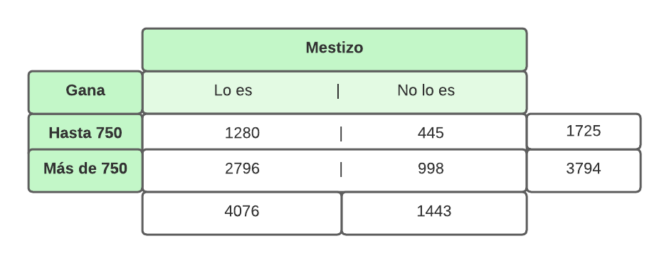
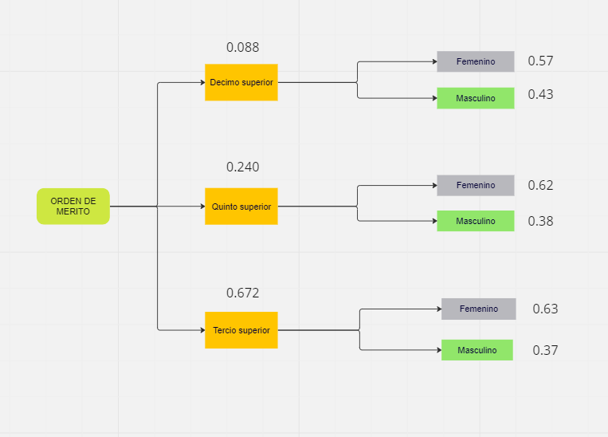

# **PROYECTO DE ESTADÍSTICA Y PROBABILIDADES**

# **TEMA**

## **ANÁLISIS DE LA EMPLEABILIDAD DE LOS EGRESADOS UNIVERSITARIOS PERUANOS EN EL 2014**

<center>

{height="height," width="width"}

<center>

<center>

{height="height," width="width"}

<center>

# **1. INTRODUCCIÓN**  

## 1.1 RELEVANCIA  

Esta información ayudará a dar una visión más clara del estado de los egresados, se dará una variación según las diferentes características de cada uno (tipo, ubicación de universidad y sexo) por lo que personas que estén en la etapa de elección de su futuro puede servirle de guía o tener una idea como también lo puede ser la apreciación que tengan los exalumnos sobre el nivel de las herramientas (librería, actividades culturales o recreacionales, Internet, etc) además que esto puede servir de indicativo a las mismas entidades educativas de sus virtudes y falencias y así saber en que pueden mejorar.

## 1.2. OBJETIVOS

### Objetivo general:

-   Analizar la empleabilidad de los egresados universitarios en el Perú, 2014.

### Objetivos específicos:

-   Describir las características de los estudiantes egresados que no cuentan con trabajo en el Perú, 2014.

-   Describir los aspectos sociales y económicos de los egresados universitarios en el Perú, 2014.

-   Conocer la situación laboral de los egresados en el Perú en el año 2014 de acuerdo con la demanda de su carrera profesional.

-   Conocer el tiempo que los egresados universitarios se demoran en conseguir trabajo luego de culminar su carrera profesional, Perú 2014.  

## 1.3 CONTEXTO:  
Para la realización de este proyecto, ha sido necesario el conocimiento y dominio de temas y conceptos específicos tanto estadísticos como del program R studio, dentro de los primero los más importantes son la estadística descriptiva.

# **2. DATOS**

### 2.1 PROCESO DE RECOLECCIÓN DE DATOS  
**En caso de este proyecto se trabajo con BASE DE DATOS DE LA INEI para ello se siguió los siguientes pasos en la búsqueda de información.**    
**1.** Búsqueda de información para el tema.  
**2.** Se ingresó a la página web INEI (Factor de expansión) [INEI_BASE DE DATOS](https://proyectos.inei.gob.pe/microdatos/), la cual se ingresó en la parte **Consulta de Encuesta y documentación**.  
**3.** En ambas partes se busco Encuesta Nacional a Egresados y Universidades.  
**4.** Después se paso a extraer la información.  
**5.** Se paso a guardar cada base extraido y cada información de la documentacion en un DRIVE.**Link del drive de los datos:**
[DRIVE DE LAS INFORMACIONES UTILIZADAS](https://drive.google.com/drive/folders/1icFhtXpPJM1ZalC0FHWyewpodnO82ZON)  

### 2.2 POBLACIÓN, MUESTRA Y MUESTREO  

-   **Población de estudio:** En la información obtenida, la población estudiada es los egresados y universidades del Perú. 

-   **Unidad muestral:** La unidad muestral de este proyecto es de 25 departamentos del Perú donde se realizaron la encuesta por INEI.

-   **Tamaño de la muestra:** Se iene como tamaño de muestra a 10 564 egresados y 131 universidades del Perú.

-   **Tipo de muestreo.** Según el INEI la información que se tiene es que el tipo de muestra  es probabilística, estratificada, de lista, de una etapa (unietapica) e independiente en cada carrera universitaria y universidad investigada.

### 2.3 Variables

|                               **DESCRIPCIÓN**                               |       **VARIABLE**        |  **Tipo de Variable**  |
|:----------------------------:|:----------------:|:----------------------:|
|      Ingreso en la ocupación secundaria por trabajo independiente       |   INGRESO_SECU_IND    | Numérica Continua  |
|       Ingreso en la ocupación secundaria por trabajo dependiente        |   INGRESO_SECU_DEP    | Numérica Continua  |
|       Ingreso en la ocupación principal por trabajo independiente       | INGRESO_OCUPACIÓN_IND | Numérica Continua  |
|        Ingreso en la ocupación principal por trabajo dependiente        | INGRESO_OCUPACIÓN_DEP | Numérica Continua  |
|     Tiempo que demoró en conseguir trabajo de primer empleo (años)      |       T_TRABAJO       | Numérica Discreta  |
| Personas que le acompañaron en realizar sus prácticas pre profesionales |  NÚMERO_DE_PERSONAS   | Numérica Discreta  |
|                     Número de prácticas que realizó                     |       PRACTICAS       | Numérica Discreta  |
|       Cuadro de mérito estudiantes (tercio, quinto superior, etc)       |        MÉRITO         | Categórica Ordinal |
|                   Ingreso de pago del primer trabajo                    |       P_SUELDO        | Categórica Ordinal |
|      Si las egresados encuestados son mayores o menores de 30 años      |         EDAD          | Categórica Nominal |
|                    Sexo, si es Masculino o Femenino                     |        GÉNERO         | Categórica Nominal |
|                    Ser o no usuario de beca Pronabec                    |        BECADO         | Categórica Nominal |
|      Tuvo o no financiamiento familiar para terminar sus estudios       |   FINANCIAMIENTO_F    | Categórica Nominal |
|         Tuvo o no préstamo bancario para terminar sus estudios          |    PRESTAMO_BANCO     | Categórica Nominal |
|                         Etnia que se considera                          |         ETNIA         | Categórica Nominal |
|                     Tipo de vivienda en la que vive                     |       VIVIENDA        | Categórica Nominal |
|                           Carrera que estudio                           |        CARRERA        | Categórica Nominal |
|                 Tipo de universidad (privada o pública)                 |      UNIVERSIDAD      | Categórica Nominal |
|           Ubicación de universidad (provincias y Lima/Callao)           |      UBICACION_U      | Categórica Nominal |
|                        Nombre de la universidad                         |       NOMBRE_U        | Categórica Nominal |  
|      Si su trabajo depende de su carrera profesional | CAR_TRA       |Categórica Nominal | 
|      Si está trabajando o no | EMPLEO      |Categórica Nominal |

### 2.4 Limpieza de datos  

Para la limpieza de datos se tomó las siguientes consideraciones.

+ **1.**Se instalo los paquetes y las librerías a usar.   
+ **2.**Se cargó el archivo SAV con las 4 base de datos y la cual a cada uno se colocó un nombre.    
+ **3.** Después se pasó a extraer cada variable de cada una de las bases(1,2,3,4) a utilizar.    
+ **4.** Se reconstruyo una base nueva en formato SAV.  
+ **5.** Para facilitar el trabajo se paso la base de datos del formato **SAV** al formato **CSV**.    
+ **6.** Por último, se cargo la BASE_DATOS.csv y se trabajo con ello.
+ **7.** Todo la limpieza de datos se presento en la primera entrega PG1, pero se presenta todo lo utilizado en el zip.


# ```{r echo=FALSE}   
# #Instalación de paquetes  
# 
# install.packages("haven")
# 
# install.packages("readr")
# 
# install.packages("plyr")
# 
# install.packages("ggplot2")
# ```


```{r echo=FALSE}   
#librerías

library(haven)

library(readr)

library(dplyr)

library(plyr)
 
library(ggplot2)
```

Carga Base Datos

```{r echo=FALSE}

#BASE DE DATOS EGRESADOS Y UNIVERSITARIOS CONVERTIDO EN CSV

BE1<- read_csv("BASE_PRO.csv")
```
# **3. ANÁLISIS DESCRIPTIVO** 


**Análisis de las variables** 

-Analizar cada variables con conceptos vistos en clase, la cual se analiza los descriptores numéricos y los descriptores gráficos de las variables.  

-Esta encuesta fue realizada a los egresados mayores de 30 años de edad.    

#### **OBJETIVO 1**  
**Describir las características de los estudiantes egresados que no cuentan con trabajo en el Perú, 2014.**  

**1.MÉRITO**

```{r echo=FALSE}
summary(BE1$MERITO)
```
```{r echo=FALSE}
table(BE1$MERITO, useNA = "always")
```
Con respecto a la base de datos extraídos, se infiere que los NAs, son los egresados que no han obtenido un mérito en la universidad.

Hacemos un cambio para poder trabajar la gráfica: 

```{r echo=FALSE}
ME<-select(BE1,MERITO)
ME
```
Tabla de información
```{r echo=FALSE}
table(BE1$MERITO, useNA = "always")
```

```{r echo=FALSE}
  Tabla1 <- c(5236, 3535, 1320, 473)
Tabla2 <- c("NO", "Tercio Superior", "Quinto Superior", "Decimo superior")
porcentajes <- Tabla1 / sum(Tabla1) * 100
porcentajes <- round(porcentajes, 2)

df <- data.frame(Tabla2, porcentajes)
df$Tabla2 <- factor(df$Tabla2, levels = df$Tabla2[order(porcentajes, decreasing = TRUE)])

ggplot(df, aes(x = Tabla2, y = porcentajes, fill = Tabla2)) +
  geom_bar(stat = "identity") +
  geom_text(aes(label = paste0(porcentajes, "%")), color = "black", size = 4) +
  labs(title = "Mérito alcanzado por los egresados", x = "MÉRITO", y = "Porcentaje") +
  theme_minimal() +
  theme(legend.position = "none")
```


Según los datos recolectados el 49, 56% no ha obtenido orden de mérito alguno en la universidad (representa aproximadamente la mitad de los encuestados). Mientras que el porcentaje faltante se divide entre los que obtuvieron tercio, décimo y quinto superior.  

**Conclusión del objetivo 1: ** 
El 49.56% del total de egresados de este año en Perú no han alcanzado un mérito universitario mientras que cada uno tiene una cantidad de egresados de decreciente a cómo se vaya avanzando el mérito (tercio(33,46%), quinto(12,5%), décimo(4.48%) superior), algo esperable por la cantidad de personas que pueden entrar en cada uno.
  

#### **OBJETIVO 2** 

**Describir los aspectos sociales y económicos de los egresados universitarios en el Perú, 2014.**


**1.Primer sueldo**

```{r echo=FALSE}
summary(BE1$P_SUELDO)

```
Tabla de información  
```{r echo=FALSE}

table(BE1$P_SUELDO, useNA = "always")
```

```{r echo=FALSE}
datos <- c("1001 a 1500", "1501 a 2500", "2501 a 3500", "3501 a 4500", "4501 a 5500", "5501 a 6500", "751 a 1000", "Hasta 750", "Más de 6500")
conteos <- c(1393, 623, 172, 59, 12, 6, 1524, 1725, 5)

# Crear un data 
df <- data.frame(datos, conteos)
# Calcular el porcentaje 
df$porcentaje <- df$conteos / sum(df$conteos) * 100

# Ordenar 
df <- df[order(df$porcentaje, decreasing = TRUE), ]

# Gráfico 
text(x = barplot(df$porcentaje, ylim = c(0, max(df$porcentaje) * 1.1),
         names.arg = df$datos, ylab = "Porcentaje", main = "Gráfico del primer sueldo de los egresados",
         las = 3.8, col = "#EEE685", border = "black", cex.names = 0.8),
     y = df$porcentaje, labels = paste0(round(df$porcentaje, 1), "%"), pos = 3, cex = 0.8, col = "black")
```

En la gráfica se observa que el 31.3% de los egresados han llegado a ganar hasta 750 soles; además, poco más de la mitad (52.8%) gana entre 751 y 1500 soles. Por el otro lado, menos del 0.5% tuvo un sueldo igual o mayor a 4501 soles. Se aprecia una clara caída de la cantidad de egresados con respecto a aumentar el sueldo, esto se debe a que el primer trabajo por falta de experiencia no tiene muchas ganancias económicas por lo que los egresados ganan lo mínimo e incluso menos. 

**2.INGRESO OCUPACIÓN DEPENDIENTE**


```{r echo=FALSE}
summary(BE1$INGRESO_OCUPACIÓN_DEP)
```
Se tiene como ingreso mínimo la cantidad de 0 soles, por lo que hay egresados que aún no trabajan; por otro lado, la mayor cantidad recibida mensualmente fue de 10500 soles. En promedio un egresado podría ganar un total de 1462 soles, y la mitad de todos estos gana entre 300 y 2010 soles.  

```{r echo=FALSE}
range(BE1$INGRESO_OCUPACIÓN_DEP ,na.rm = TRUE) 
```
```{r echo=FALSE}
max(BE1$INGRESO_OCUPACIÓN_DEP, na.rm = TRUE)-min(BE1$INGRESO_OCUPACIÓN_DEP, na.rm = TRUE) 
```

```{r echo=FALSE}
round(sd(BE1$INGRESO_OCUPACIÓN_DEP, na.rm = TRUE),digits=2)
```
```{r echo=FALSE}
cv <-(sd(BE1$INGRESO_OCUPACIÓN_DEP, na.rm = TRUE)/mean(BE1$INGRESO_OCUPACIÓN_DEP, na.rm = TRUE))# Coeficiente de variación
round(cv,digits = 2)
```
```{r echo=FALSE}
hist(BE1$INGRESO_OCUPACIÓN_DEP, col = "#76EEC6", main = "Histograma Ingreso ocupación Dependiente", xlab = "Ingreso",ylim=c(-200,3800))

# Calcular la media y la mediana
media <- mean(BE1$INGRESO_OCUPACIÓN_DEP, na.rm = TRUE)
mediana <- median(BE1$INGRESO_OCUPACIÓN_DEP, na.rm = TRUE)

# Agregar líneas para la media y la mediana
abline(v = media, col = "red", lwd = 2, lty = 2)
abline(v = mediana, col = "blue", lwd = 2, lty = 2)

# Agregar leyenda
legend("topright", legend = c("Media", "Mediana"), col = c("red", "blue"), lwd = 2, lty = 2)
grid(nx = NA, ny = NULL, lwd = 1, lty = 1, col = "grey")
```


**3.Ingreso ocupación Dependiente V.S Etnia**
```{r echo=FALSE}

boxplot(BE1$INGRESO_OCUPACIÓN_DEP ~ BE1$ETNIA, main = "Boxplot Ingreso ocupación dependiente por Etnia", 
        xlab = "", ylab = "Ingreso", col = "lightblue",horizontal=F,las=2,varwidth=T,ylim=c(0,6000))

```

  
**Conclusión del objetivo 2: ** 
En el ingreso económico general en el primer empleo podemos hablar que hay una clara caída de la cantidad de egresados con respecto a aumentar el sueldo donde el rango más bajo es el que más personas tiene (31.3%) y hay una clara caída de la cantidad de egresados con respecto a cada vez que se aumenta de sueldo, probablemente debido a la falta de experiencia, llegando a que más de la mitad (58.9%) gane aproximadamente igual o menos a los sueldos mínimos que habían en la época. Ya hablando en el ingreso ocupación dependiente se concluye, primero que hay egresados sin trabajar en el momento de la encuesta (hecho que influye en la ganancia promedio de los que sí trabajan) así como también que el promedio es de S/. 1462 y la ganancia de la mitad se encuentra entre 300 y 2100 soles. Para entender estos datos económicos en la parte social se ha podido hallar que no ha habido mucha diferencia en comparación de cada etnia, aunque cabe destacar de personas mestizas que salen del rango, casi todos en mayor cantidad de ingreso de ocupación dependiente.  


#### **OBJETIVO 3**   

**Conocer la situación laboral de los egresados en el Perú en el año 2014 de acuerdo con la demanda de su carrera profesional.**

**1 carreras más escogida por los egresados**

Creación de los vectores y la grafica
```{r echo=FALSE}
TA1<-c(618,560,548,467,433,355,351,335,308,200)
TA2<-c("CONTABILIDAD ","DERECHO ","ENFERMERÍA","ADMINISTRACIÓN DE EMPRESAS","INGENIERÍA DE SISTEMAS","ADMINISTRACIÓN","ING.IND","ING.CIVIL","DERECHO","OTROS" )
Porc <-( TA1 / sum(TA1)) * 100
round(Porc,2)
df <- data.frame(Carrera = TA2, Porcentaje = round(Porc, 2))

df <- df[order(df$Porcentaje, decreasing = TRUE), ]

colores <- c( "pink", "pink", "purple", "pink","pink", "pink", "pink","pink", "pink", "pink")

#gráfica 
ggplot(df, aes(x = reorder(Carrera, -Porcentaje), y = Porcentaje, fill = Carrera)) +
  geom_bar(stat = "identity", color = "black") +
  geom_text(aes(label = paste0(Porcentaje, "%")), vjust = -0.4, color = "black", size = 2.5) +
  labs(title = "Porcentaje por Carreras", x = "Carrera", y = "Porcentaje") +
  scale_fill_manual(values = colores) +
  theme_minimal() +
  theme(axis.text.x = element_text(angle = 45, hjust = 1)) +
  scale_x_discrete(labels = TA2)+ theme(legend.position = "none")
```


**2. Ingreso V.S Carrera**
```{r echo=FALSE}
modalidades <- unique(BE1$CARRERA)
frecuencias <- sort(table(BE1$CARRERA), decreasing = TRUE)

primeras_carreras <- names(head(frecuencias, 5))

BE1_filtrado <- BE1[BE1$CARRERA %in% primeras_carreras, ]

BE1_filtrado$CARRERA <- factor(BE1_filtrado$CARRERA, levels = primeras_carreras)

ggplot(BE1_filtrado, aes(x = INGRESO_OCUPACIÓN_DEP, y = CARRERA)) +
  geom_point() +
  labs(title = "Ingreso vs. Carrera",
       x = "Ingreso Ocupación Dependiente",
       y = "Carrera") +
  theme_minimal()

```


**3.Mérito V.S tiempo que demoro en conseguir trabajo**


```{r echo=FALSE}
# Cargar VCD para mosaicplot
library(vcd)

# Generar el gráfico de mosaico
mosaicplot(BE1$MERITO ~ BE1$T_TRABAJO,
           col = colorRampPalette(c("#BFEFFF","#97FFFF","#8DEEEE","lightblue3","#79CDCD","#528B8B"))(4),
           main = "Mérito vs Tiempo que demoro en conseguir trabajo",
           xlab = "Mérito",
           ylab = "Tiempo",
           las = 1)  # Ajustar Y
```

**Conclusiones del objetivo 3: ** 
La mayoría de los encuestados que se encuentran trabajando están en una ocupación relacionada a la carrera la cual estudiaron (más 8 de cada 10 egresados) por lo que es fácil intuir una marcada tendencia de que el estudio universitario y lo aprendido ahí es relevante en su ámbito laboral. De estas carreras, contabilidad es la que más egresados ejerce (14.8%), seguido de derecho (13.41%), enfermería (13.13%), administración de empresas(11,19%) e ingeniería de sistemas (10.47%), donde podemos concluir que enfermería es el que menor ingreso de ocupación dependiente ha llegado a tener un egresado. En caso contrario, derecho e ingeniería de sistemas tienen el caso más alto de ingreso con una concentración de personas que abarca hasta un ingreso mayor, hecho imitado por administración y empresas. 

#### **OBJETIVO 4**   

**9.Tiempo que demoran los egresados en conseguir trabajo**
```{r echo=FALSE}
summary(BE1$T_TRABAJO)
```
Tabla de información
```{r echo=FALSE}

table(BE1$T_TRABAJO, useNA = "always")
```

Construcción de una tabla de frecuencia y la gráfica

```{r echo=FALSE}
T1 <- c(5033, 573, 86, 210, 609, 1710, 2343)
T2 <- c("No especifica", "No busco", "1 a 3 años", "menos de 1 año", "3 a 6 meses", "1 a 3 meses", "Menos de un mes")
porcs <- T1 / sum(T1) * 100
porcs <- round(porcs, 2)

df <- data.frame(T2, porcs)
df$T2 <- factor(df$T2, levels = df$T2[order(porcs, decreasing = TRUE)])

ggplot(df, aes(x = T2, y = porcs, fill = T2)) +
  geom_bar(stat = "identity") +
  geom_text(aes(label = paste0(porcs, "%")), color = "black", size = 4) +
  labs(title = "Porcentaje de cada categoría", x = "Categoría", y = "Porcentaje") +
  theme_minimal() +
  theme(legend.position = "bottom")
```

**Conclusiones del objetivo 4:**  
El tiempo demoran los egresados en conseguir su primer trabajo hay que tener en cuenta la existencia de un sesgo de muestreo por no especificar el tiempo o por no buscar trabajo. Estos datos suponen una gran cantidad pues de los que no se sabe respuesta es más de la mitad de observaciones (53.06%). Con los datos que posibles de utilizar que es un 46.94%, ahora lo analizaremos como un 100%, se puede calcular que los egresados que buscan trabajo después de terminar la carrera tienden a conseguir trabajo en el menor tiempo posible, pues los de menos de un mes conforman casi la mitad (47.25%), los de 1 a 3 meses son el otro grupo más numeroso representando el 34.49%. 

# **4. ANÁLISIS PROBABILÍSTICO**    

En el análisis probabilístico, se examinan las diferentes posibles ocurrencias de un evento y se asignan probabilidades a cada una de ellas. 

## **4.1 Probabilidades Empíricas**     

### **1.Variable Empleabilidad (Tiene trabajo o no) **  

Según nos informa la INEI muchos de los egresados no tienen un trabajo fijo, la cual se puede ver la información en la siguiente tabla.  

```{r,echo=FALSE}

VA <- data.frame(table(BE1$EMPLEO))
colnames(VA)[1] <- "Trabaja"
VA
```

**EXPERIMENTO ALEATORIO:**Seleccionar un egresado del total de encuestados por la INEI en el año 2014 y observar la empleabilidad de los egresados. 

**ESPACIO MUESTRAL(Ω)**
$$ Ω=({Sí, No})$$   
Sí=A1  
No=A2

**DEFINIR evento atómico **  
+ A1:Seleccionar a un egresado encuestado por la INEI que cuenta con trabajo       
+ A2:Seleccionar a un egresado encuestado por la INEI que cuenta con trabajo   

**Formula asociada a cada evento**  

$$P(A)=\frac{n(A)}{n}$$ 
**Donde:**  
n:total de la población  
A:Evento asociado  

Probabilidad de que un egresado cuente con empleo.
$$P(A1)=\frac{8385}{10564}=0.79$$
probabilidad de que un egresados no este empleado

$$P(A2)=\frac{2179}{10564}=0.21$$


### **2. Variable Tiempo que demoro conseguir trabajo**  

Experimento aleatorio: Se encuesta a egresados universitarios del Perú según su tiempo que demoro conseguir trabajo y se registra los resultados.

Se establece el espacio muestral de Tiempo que demoro conseguir trabajo de acuerdo a la INEI 
$$Ω={(No especifica,No busco trabajo,Menos de un mes, Entre 1 a 3 meses, Entre 3 a 6 meses, Meses a menos de un año,Entre uno a dos años)}$$

```{r echo = FALSE}
tabla_T_TRABAJO <- table(BE1$T_TRABAJO, useNA = 'always')
BE1$T_TRABAJO <- ifelse(is.na(BE1$T_TRABAJO), "No especifica", BE1$T_TRABAJO)
tabla_T_TRABAJO
T_no_espec  <- as.numeric(tabla_T_TRABAJO['No especifica'])
T_no_busca <- as.numeric(tabla_T_TRABAJO['No busco trabajo'])
T_0a1 <- as.numeric(tabla_T_TRABAJO['Menos de un mes'])
T_1a3 <- as.numeric(tabla_T_TRABAJO['Entre 1 a 3 meses'])
T_3a6  <- as.numeric(tabla_T_TRABAJO['Entre 3 a 6 meses'])
T_6a12 <- as.numeric(tabla_T_TRABAJO['Meses a menos de un año'])
T_12a36 <- as.numeric(tabla_T_TRABAJO['Entre uno a dos años'])

# Probabilidades de Tiempo de Encontrar de Trabajo
# Probabilidades empíricas
# P(A) = Casos_favorables/Casos_totales

casos_totales <- length(BE1$T_TRABAJO)
prob_T_no_espec <- round(T_no_espec /casos_totales,2)
prob_T_no_busca <- round(T_no_busca /casos_totales,2)
pron_T_0a1 <- round(T_0a1/casos_totales,2)
prob_T_1a3 <- round(T_1a3 /casos_totales,2)
prob_T_3a6  <- round(T_3a6 /casos_totales,2)
prob_T_6a12  <- round(T_6a12 /casos_totales,2)
prob_T_12a36 <- round(T_12a36 /casos_totales,2)
```

PROBABILIDAD DE QUE UN EGRESADO NO BUSCA TRABAJO
```{r echo = FALSE}
prob_T_no_busca
```

PROBABILIDAD DE QUE UN EGRESADO CONSIGUE TRABAJO EN MENOS DE UN MES
```{r echo = FALSE}
pron_T_0a1
```

PROBABILIDAD DE QUE UN EGRESADO CONSIGUE TRABAJO ENTRE 1 A 3 MESES
```{r echo = FALSE}
prob_T_1a3
```

PROBABILIDAD DE QUE UN EGRESADO CONSIGUE TRABAJO ENTRE 3 A 6 MESES
```{r echo = FALSE}
prob_T_3a6
```

PROBABILIDAD DE QUE UN EGRESADO CONSIGUE TRABAJO ENTRE 6 A 12 MESES
```{r echo = FALSE}
prob_T_6a12
```

PROBABILIDAD DE QUE UN EGRESADO CONSIGUE TRABAJO ENTRE UNO A DOS AÑOS
```{r echo = FALSE}
prob_T_12a36
```

   
### **3.Trabajo depende de su carrera profesional**  

**Experimento aleatorio:** Se encuesta a egresados universitarios del Perú según su trabajo depende de su carrera profesional y se registra los resultados.

Se establece el espacio muestral de Tiempo que demoro conseguir trabajo de acuerdo por INEI.
$$Ω=(No, No espeficifica, Sí)$$

```{r echo = FALSE}
tabla_CAR_TRA <- table(BE1$CAR_TRA, useNA = 'always')
BE1$CAR_TRA  <- ifelse(is.na(BE1$CAR_TRA ), "No especifica", BE1$CAR_TRA )
T_no_espec  <- as.numeric(tabla_CAR_TRA['No especifica'])
T_no  <- as.numeric(tabla_CAR_TRA ['No'])
T_si <- as.numeric(tabla_CAR_TRA ['Sí'])

# Probabilidades_trabajo depende_de_su_carrera_profesional
# Probabilidades_empíricas
# P(A) = Casos favorables/Casos totales
casos_totales <- length(BE1$CAR_TRA)
prob_T_no_espec <- round(T_no_espec /casos_totales,2)
prob_T_no <- round(T_no /casos_totales,2)
pron_T_si <- round(T_si /casos_totales,2)
```


PROBABILIDAD DE QUE UN EGRESADO SU TRABAJO NO DEPENDA DE SU CARRERA PROFESIONAL
```{r echo = FALSE}
prob_T_no
```

PROBABILIDAD DE QUE UN EGRESADO SU TRABAJO SI DEPENDA DE SU CARRERA PROFESIONAL
```{r echo = FALSE}
pron_T_si
```


## **4.2 Probabilidades Condicionales**  

### 1 Carrera/ Primer Sueldo=====Dependiente  

¿Cuál es la probabilidad de que un egresado tenga un primer sueldo mayor a los S/. 1000 si eligió la carrera de contabilidad?

Experimento de probabilidad condicional por tener dos eventos donde nos piden hallar la probabilidad del evento A (que el primer sueldo sea mayor a 1000 soles) dado el evento B (que la carrera elegida haya sido).   
**fórmula de probabilidad:**
$$P(A|B)=P(A∩B)/P(B)$$
Primero sacar probabilidad empírica de los 2 eventos, con el total de cada evento y dividir con el espacio muestral

Espacios muestrales: 

Primer sueldo (todos los datos)
```{r echo = FALSE}
table(BE1$P_SUELDO, useNA = "always")
```

Probabilidades:
```{r echo = FALSE}
espacio <- nrow(BE1)
espacio
Cont <- filter(BE1,BE1$CARRERA=="CONTABILIDAD")
nrow(Cont)
ProbCont<-nrow(Cont)/espacio
ProbCont
```
Se puede ver que la probabilidad que los egresados hayan eligido estudiar la carrera de contabilidad (B) es del 5.85%

```{r echo = FALSE}
BS2<-filter(BE1,BE1$P_SUELDO=="1001 a 1500")
BS3<-filter(BE1,BE1$P_SUELDO=="1501 a 2500")
BS4<-filter(BE1,BE1$P_SUELDO=="2501 a 3500")
BS5<-filter(BE1,BE1$P_SUELDO=="3501 a 4500")
BS6<-filter(BE1,BE1$P_SUELDO=="4501 a 5500")
BS7<-filter(BE1,BE1$P_SUELDO=="5501 a 6500")
BS8<-filter(BE1,BE1$P_SUELDO=="Más de 6500")

BS<-(BE1$P_SUELDO)
BSna<-BS[!is.na(BS)]
eBSna<-length(BSna)

e10_15<-(BS2$P_SUELDO)
e15_25<-(BS3$P_SUELDO)
e25_35<-(BS4$P_SUELDO)
e35_45<-(BS5$P_SUELDO)
e45_55<-(BS6$P_SUELDO)
e55_65<-(BS7$P_SUELDO)
e65_<-(BS8$P_SUELDO)
espSP<-length(e25_35)+length(e15_25)+length(e10_15)+length(e35_45)+length(e45_55)+length(e55_65)+length(e65_)

prSna<-espSP/eBSna
prSna
```
En el caso de que el primer sueldo sea mayor a mil soles (A) hay un 41.13%. Cabe aclarar que se hará el conteo de los eventos que sí han respondido los egresados.


Ya sabiendo cada probabilidad empírica hay que encontrar intercepción de ambos eventos (A∩B)
```{r echo = FALSE}
BC<-filter(BE1,BE1$CARRERA=="CONTABILIDAD")
BC2<-filter(BC,BC$P_SUELDO=="1001 a 1500")
BC3<-filter(BC,BC$P_SUELDO=="1501 a 2500")
BC4<-filter(BC,BC$P_SUELDO=="2501 a 3500")
BC5<-filter(BC,BC$P_SUELDO=="3501 a 4500")
BC6<-filter(BC,BC$P_SUELDO=="4501 a 5500")
BC7<-filter(BC,BC$P_SUELDO=="5501 a 6500")
BC8<-filter(BC,BC$P_SUELDO=="Más de 6500")

ec10_15<-(BC2$P_SUELDO)
ec15_25<-(BC3$P_SUELDO)
ec25_35<-(BC4$P_SUELDO)
ec35_45<-(BC5$P_SUELDO)
ec45_55<-(BC6$P_SUELDO)
ec55_65<-(BC7$P_SUELDO)
ec65_<-(BC8$P_SUELDO)
esint<-length(ec25_35)+length(ec15_25)+length(ec10_15)+length(ec35_45)+length(ec45_55)+length(ec55_65)+length(ec65_)
esint

presint<-esint/eBSna
presint
```
Se puede observar un 2.07% de probabilidad de que se den los dos eventos en el mismo caso (un egresado que gane mas de mil y estudie contabilidad)


Ya sabiendo lo anterior se puede usar la fórmula mostrada
```{r echo = FALSE}
PrbSdC<-presint/ProbCont
presint
ProbCont
PrbSdC
```
Respondiendo a la pregunta, la probabilidad de que un egresado gane en su primer sueldo sea mayor a S/.1000 si estudio contabilidad es del 35.31%


Para saber si estos dos eventos son independiente o dependiente entre si se emplea la fórmula:
P(A∩B)=P(A)*P(B)
Si esta se cumple entonces serán independiente y caso contrario serán dependiente
```{r echo = FALSE}
presint
prI<-ProbCont*prSna
prI
difpr<-((prI-presint)/prI)*100
difpr
```
Se puede ver que hay una diferencia entre los dos resultados del 14.15%, por lo que se puede encontrar una ligera dependencia del evento dicho del primer sueldo con el de la carrera elegida.

### 2. Etnia / Primer sueldo====Independiente

Con la información obtenida podemos graficar nuestro árbol de probabilidad:
{height="height," width="width"}
¿Cuál es la probabilidad de que un egresado tenga un primer sueldo menor o igual a los S/. 750 si es mestizo?

Al igual que el anterior, este caso es un experimento de probabilidad condicional donde el evento A es si el primer sueldo es menos de los 750 soles y nos piden saber la probabilidad de este dado el evento B (el egresado sea mestizo).     

**Formula**

$$P(A|B)=P(A∩B)/P(B)$$   


Espacios muestrales:   
Primer sueldo (todos los datos)     
```{r}
table(BE1$P_SUELDO, useNA = "always")
```
Etnia (todos los datos)   
```{r echo = FALSE}
table(BE1$ETNIA, useNA = "always")
```


Probabilidades:   
```{r echo = FALSE}
espacio <- nrow(BE1)
espacio
Mest <- filter(BE1,BE1$ETNIA=="Mestizo")
nrow(Mest)
ProbMest<-nrow(Mest)/espacio
ProbMest
```
En el caso la probabilidad de que el primer sueldo sea menor a 750 soles (A) es de un 73.3%.

```{r echo = FALSE}
BS1<-filter(BE1,BE1$P_SUELDO=="Hasta 750")
e750_<-(BS1$P_SUELDO)
espSP<-length(e750_)
probe750<-espSP/eBSna
probe750
```
En el caso de que el egresado sea mestizo (B) hay un 31.26% de probabilidades.   

```{r echo = FALSE}
BS1M<-filter(Mest,Mest$P_SUELDO=="Hasta 750")
e750_C<-(BS1M$P_SUELDO)
esint750C<-length(e750_C)
probintM<-esint750C/eBSna
probintM
```
Se puede obserbar un 23.19% de probabilidad de que se den los dos eventos en el mismo caso (un egresado que gane menos de 750 y sea mestizo)

```{r echo = FALSE}
PrbSdM<-probintM/ProbMest
probintM
ProbMest
PrbSdM
```
Respondiendo la pregunta, la probabilidad de que un egresado gane en su primer sueldo sea menor a S/750 si es mestizo es del 31.64%


Ahora toca saber si estos dos eventos son independiente o dependiente entre si.  
**fórmula**
$$P(A∩B)=P(A)*P(B)$$
Si cumple entonces serán independiente y caso contrario serán dependiente
```{r}
round(probintM,2)
prIM<-ProbMest*probe750
round(prIM,2)
```
Se puede observar que son independientes entre si.


**Ejemplo variable Mérito aplicando Bayes**  

```{r echo = FALSE}
#Filtramos los datos y creamos una tabla de frecuencia relativa de la variable tipo_de_apunte
B1FILTRO_2 <- BE1_filtrado[BE1_filtrado$MERITO %in% c("Decimo superior", "Quinto Superior","Tercio Superior"), ]
tabla_orden_merito <- table(B1FILTRO_2$MERITO)
tabla_orden_merito_rel<- prop.table(tabla_orden_merito)
round(tabla_orden_merito_rel,3)
```
Solo queremos analizar las personas que han tenido orden de merito, por ello filtramos una nueva base de datos donde se eliminen a las personas sin orden de merito .

Tenemos que el 8,8% perteneció al décimo superior,el 24% perteneció al quinto superior y el 67.2% perteneció al tercio superior  

```{r echo = FALSE}
#Filtramos los datos_creamos una tabla_frecuencia_relativa
B1FILTRO_2 <- BE1_filtrado[BE1_filtrado$MERITO %in% c("Decimo superior", "Quinto Superior","Tercio Superior"), ]
tabla_orden_merito <- table(B1FILTRO_2$MERITO)
tabla_orden_merito_rel<- prop.table(tabla_orden_merito)
round(tabla_orden_merito_rel,3)
```
-
```{r echo = FALSE}
#tabla cruzada 
tabla_cruzada <- xtabs(~ MERITO + GENERO, data = B1FILTRO_2)
tabla_cruzada_rel <- prop.table(tabla_cruzada, margin = 1)
round(tabla_cruzada_rel,2)

```  
Con la información obtenida podemos traficar nuestro árbol de probabilidad:

{height=300, width=600}  


**Calculando la probabilidad**   

Si elegimos a un egresado al azar, ¿Cual es la probabilidad de que este sea del genero masculino ?   

$$P(E)=0.088*0.43+0.240*0.38+0.672*0.37 = 0.37768$$  

Si elegimos a un egresado al azar, ¿Cual es la probabilidad de que este sea del genero femenino ?   

$$P(E1)=0.088*0.57+0.240*0.62+0.672*0.63 = 0.62232$$  
Probabilidades es 1 
$$P(E) + P(E1) =0.37768 + 0.62232 ====> 1$$   


## 4.3 Probabilidades Variables Discretas    

**1. Distribución Binomial** 
Experimento aleatorio que posee solo dos posibilidades resultados: **éxito** y **fracaso**,que se repite n veces.  

**2.Variable aleatoria**    
X: Número de egresados que cuentan con empleo encuestados por INEI

**3.Parámetros**    

$$X~binom(p,n)$$
**Donde:**  
p==>P(éxito):Seleccionar a un egresado que cuente con empleo.  
n==>Total de egresados 
n=10564 egresados  
```{r echo = FALSE}
table(BE1$EMPLEO)
```
```{r echo = FALSE}
frecuencia <- table(BE1$EMPLEO)
n_exito<- frecuencia["Sí"]
n_fracaso <- frecuencia["No"]
n<-n_exito+n_fracaso
```

```{r echo = FALSE}
pro_exito <- round((n_exito / n), 3)
pro_exito_num <- as.numeric(pro_exito)
pro_exito_num
```

$$P(éxito)=\frac{8385}{10564}=0.794$$
```{r echo = FALSE}

pro_fracaso <- round((n_fracaso / n), 3)
pro_fracaso_num <- as.numeric(pro_fracaso)
pro_fracaso_num
```
$$P(fracaso) = 1 - P(éxito)$$
$$P(fracaso) = 1 - 0.794=0.206$$

**4. Ejemplo:** 

En 2014, el INEI recolectó información sobre la empleabilidad de 100 egresados en Perú. ¿Cuál es la probabilidad de que entre 60 y 80 egresados tengan trabajo?”


**formula**

$$P(X)= sum(dbinom(k,n,p))$$
k: k éxitos
p: P(éxito) 
n: tamaño muestra  

Se esperara ver una dispersión alrededor de la media de: 
```{r echo = FALSE}
n <- 100
p <- 0.79
varianza <- n * p * (1 - p)
varianza
```

```{r echo = FALSE}
round(sum(dbinom(59:80,100,0.794)),3)
```

```{r echo = FALSE}
# Calcular la probabilidad acumulada
probabilidad <- pbinom(80, 100, 0.794) - pbinom(59, 100, 0.794)
round(probabilidad,3)
```

```{r echo = FALSE}
# Definir los parámetros de la distribución binomial
n <- 100
p <- 0.794

# Calcular la probabilidad de que entre 60 y 80 egresados tengan trabajo
probabilidad <- pbinom(80, n, p) - pbinom(59, n, p)
round(probabilidad,4)
```
Indica que hay una probabilidad del 59.83% de que entre 60 y 80 egresados tengan trabajo. En otras palabras, es más probable que entre 60 y 80 egresados tengan trabajo que no lo tengan


```{r echo = FALSE}
# Definir el rango de valores para la variable aleatoria
RANGO <- c(60:80)

probabilidades <- dbinom(RANGO, 100, 0.79)

# Generar el gráfico de dispersión
plot(RANGO, probabilidades, col = "red", xlab = "N° Egresados encuestados", ylab = "Probabilidad", main = "MODELO BINOMIAL DE EMPLEABILIDAD")
```

El gráfico muestra que la probabilidad de que un número determinado de egresados tengan trabajo varía en función del número de egresados.Por ejemplo, la probabilidad de que exactamente 60 egresados tengan trabajo es menor que la probabilidad de que exactamente 70 egresados tengan trabajo.  

### 2 Modelo de Distribución Binomial

Se define la variable aleatoria discreta X:

$\mathbb{X}$: número de éxitos de encuestados que trabajan dependiendo de su carrera en 100 encuestados.

$r$ = 0.75

$\mathbb{X}$ ~ Bin($n$ , $r$)

$\mathbb{X}$ ~ Bin(100, 0.75)

```{r echo = FALSE}
r <- 0.75
n <- 100
x <- (0:100)
modelo <- pbinom(x, n, r)
plot(x, modelo, main="Distribución de Probabilidad Acumulada", ylab = "P(X=x)", xlab= "X",col = "blue")
```


1. ¿Cual es la probabilidad de que menos 80 encuestados trabajen dependiendo de su carrera?

```{r echo = FALSE}
r <- 0.75
n <- 100
x <- (0:80)
modelo <- pbinom(x, n, r)
plot(x, modelo, main="Distribución de Probabilidad Acumulada", ylab = "P(X=x)", xlab= "X",col = "blue")
```

2. La probabilidad de que 50 o más encuestados trabajen dependiendo de su carrera.

```{r echo = FALSE}
r <- 0.75
n <- 100
x <- (50:100)
modelo1 <- pbinom(x, n, r)
plot(x, modelo1, main="Distribución de Probabilidad Acumulada", ylab = "P(X=x)", xlab= "X",col = "green")
```

Según nuestros parámetros $n = 100$ y $p = 0.75$ podemos hallar la esperanza, la desviación estándar y la varianza:

$$E(\mathbb{X}) = np = 100*(0.75) = 75$$     


## 4.4 Probabilidades Variables Continuas   

#### **Ingreso de ocupación Independiente**

Primero, se hace el histograma de la variable junto al gráfico de densidad

```{r echo = FALSE}
hist(BE1$INGRESO_OCUPACIÓN_IND, prob=T,main="INGRESO OCUPACIÓN INDEPENDIENTE", ylab = "Densidad", xlab= "Ingreso Ocupación Dependiente")
lines(density(BE1$INGRESO_OCUPACIÓN_IND), col="blue", lwd=2)
```

Se puede observar claramente que lo que mas lo puede representar es una forma exponencial por lo que se trabajará y tomará con este modelo.

Propiedades de exponencial:
-E(x)=μ(media)=1/λ
-Var(x)=σ^2=1/λ^2

Con esto se puede hallar el valor de lambda (λ)
```{r echo = FALSE}
lambda<-1/mean(BE1$INGRESO_OCUPACIÓN_IND)
lambda
```
Con lambda se sacara una proyección de densidad teórica si fuera exponencial con lo que podemos comparar con el real para ver si es así.

```{r echo = FALSE}
Xs<-seq(0, 20000, by=1.5)
Ys<-dexp(Xs,lambda)
```
Comparación de densidades (Tener en cuenta que se esta tomando una parte de todos los datos para tener mayor exactitud en la proyección teórica):
```{r echo = FALSE}
hOdep<-hist(BE1$INGRESO_OCUPACIÓN_IND, breaks=30, prob=T, xlim=c(0, 8000),main="INGRESO OCUPACIÓN INDEPENDIENTE", ylab = "Densidad", xlab= "Ingreso Ocupación Dependiente")
lines(density(BE1$INGRESO_OCUPACIÓN_IND), col="blue", lwd=2)
lines(Xs, Ys, col="red",lwd=2)
```
Se puede observa una gran similitud en el comportamiento de las dos densidades por lo que podemos validar su comportamiento exponencial con lo que podemos saber su distribución exponencial azul=experimental, rojo=teórica.
$$X~Exp(λ)$$
$$P[X=x]=λ*e^-λx$$


Nos pide saber la probabilidad de que uno de los egresados tenga un ingreso de este tipo nulo, osea igual a S/ 0 (evento A).

Primero habrá que sacar el conteo del espacio muestral del evento A con el total.

```{r echo = FALSE}
InOIND <-(BE1$INGRESO_OCUPACIÓN_IND)

#Personas_con_ingreso_0

ingr_spf <- 0  #calcular la PROB_empirica
frecuencia_ingreso <- sum(InOIND == ingr_spf)
total_observaciones <- length(InOIND)
# Frecuencia_ocurre el evento/total
probabilidad_empirica <- frecuencia_ingreso / total_observaciones
frecuencia_ingreso
total_observaciones
probabilidad_empirica
```
Se hallo que la probabilidad de que un egresado no presente ingresos generados por una ocupación suya de manera independiente es del 88.64%.  
**Experimento**  
Seleccionar a los egresado del estudio de la la situación laboral de los egresados en el Perú en el año 2014 y observar su ingreso de ocupación dependiente.   


hacer el histograma y el gráfico de densidad

```{r echo = FALSE}
hist(BE1$INGRESO_OCUPACIÓN_DEP, prob=T,main="INGRESO OCUPACIÓN DEPENDIENTE", ylab = "Densidad", xlab= "Ingreso Ocupación Dependiente")
lines(density(BE1$INGRESO_OCUPACIÓN_DEP), col="blue", lwd=2)
```

Se puede observar claramente que lo que mas lo puede representar es una forma exponencial por lo que se trabajará y tomoará con este modelo.


Hallar el valor de lambda (λ)
```{r echo = FALSE}
lambda<-1/mean(BE1$INGRESO_OCUPACIÓN_DEP)
lambda
```
Proyección de densidad teórica si fuera exponencial y comparar con el real.

```{r echo = FALSE}
Xs<-seq(1300, 10000, by=1.5)
Ys<-dexp(Xs,lambda)
```
Comparación de densidades:
```{r echo = FALSE}
hOdep<-hist(BE1$INGRESO_OCUPACIÓN_DEP, breaks=30, prob=T, xlim=c(1500, 10000),main="INGRESO OCUPACIÓN DEPENDIENTE", ylab = "Densidad", xlab= "Ingreso Ocupación Dependiente")
lines(density(BE1$INGRESO_OCUPACIÓN_DEP), col="blue", lwd=2)
lines(Xs, Ys, col="red",lwd=2)
```
Se puede observa una gran similitud en el comportamiento de las dos densidades por lo que podemos validar su comportamiento exponencial con lo que podemos saber su distribución exponencial:
X~Exp(λ)
P[X=x]=λ*e^-λx

**Espacio_Resultados**     
- sueldos que varían del 0 al 10000
```{r echo = FALSE}
min(BE1_filtrado$INGRESO_OCUPACIÓN_DEP)
max(BE1_filtrado$INGRESO_OCUPACIÓN_DEP)
table((BE1_filtrado$INGRESO_OCUPACIÓN_DEP))
```

**Identificar_eventos**   

Elegimos ingresos aleatorios para comparar   
Nuestros eventos serán:  
Personas que tienen_ingreso 0  
Personas que tienen_ingreso 2500  
Personas que tienen_ingreso 3000  
Personas que tienen_ingreso 5000  
Personas que tienen_ingreso 7500  
Personas que tienen_ingreso 10000    

**Calculando_la_probabilidad**
```{r echo = FALSE}
Ingresos <-(BE1_filtrado$INGRESO_OCUPACIÓN_DEP)

#ingreso_0

ingreso_especifico <- 0  # Ingreso específico para calcular su probabilidad empírica
frecuencia_ingreso <- sum(Ingresos == ingreso_especifico)
total_observaciones <- length(Ingresos)
# Frecuencia_ocurre_el_evento/total
probabilidad_empirica <- frecuencia_ingreso / total_observaciones
probabilidad_empirica

#ingreso_2500
ingreso_especifico <- 2500  # Ingreso 
frecuencia_ingreso <- sum(Ingresos == ingreso_especifico)
total_observaciones <- length(Ingresos)
# Frecuencia_ocurre_el_evento/total
probabilidad_empirica <- frecuencia_ingreso / total_observaciones
probabilidad_empirica

#ingreso_3000
ingreso_especifico <- 3000  # Ingreso 
frecuencia_ingreso <- sum(Ingresos == ingreso_especifico)
total_observaciones <- length(Ingresos)
# Frecuencia_ocurre_el_evento_respecto_al_total
probabilidad_empirica <- frecuencia_ingreso / total_observaciones
probabilidad_empirica

#ingreso_5000
ingreso_especifico <- 5000  # Ingreso 
frecuencia_ingreso <- sum(Ingresos == ingreso_especifico)
total_observaciones <- length(Ingresos)
# Frecuencia_ocurre_el_evento/total
probabilidad_empirica <- frecuencia_ingreso / total_observaciones
probabilidad_empirica

# ingreso_7500
ingreso_especifico <- 7500  # Ingreso 
frecuencia_ingreso <- sum(Ingresos == ingreso_especifico)
total_observaciones <- length(Ingresos)
# Frecuencia_ocurre_el_evento/total
probabilidad_empirica <- frecuencia_ingreso / total_observaciones
probabilidad_empirica

# ingreso_10000
ingreso_especifico <- 10000  # Ingreso 
frecuencia_ingreso <- sum(Ingresos == ingreso_especifico)
total_observaciones <- length(Ingresos)
# Frecuencia_ocurre_el_evento/total
probabilidad_empirica <- frecuencia_ingreso / total_observaciones
probabilidad_empirica
```  


**Conclusión 1**

De la comparación de probabilidades de los ingresos de ocupación dependiente, podemos decir que hay aproximadamente un 23% de personas que tiene un ingreso 0, es decir no trabajan, mientras que las probabilidades de los egresados que tienen ingresos de ocupación dependiente son muy bajas. Podemos observar que la diferencia de probabilidad empírica de el mínimo ingreso es con el máximo ingreso de un egreso es notable, esto puede deberse a varios factores como la experiencia laboral de un egresado, la demanda de su carrera, habilidades del egresado.

**Conclusión 2**   

Relación entre la carrera estudiada y la empleabilidad: Según los datos analizados, se puede concluir que existe una marcada tendencia entre los egresados del 2014 en Perú a encontrar empleo relacionado con la carrera que estudiaron. Más del 80% de los encuestados que están trabajando se encuentran en ocupaciones vinculadas a su formación universitaria. Esto indica que el estudio universitario y lo aprendido durante la carrera tienen relevancia en el ámbito laboral, lo que aumenta las posibilidades de empleabilidad para los egresados.

**Conclusión 3**   

Tiempo para conseguir el primer trabajo: Aunque se reconoce la presencia de un sesgo de muestreo debido a la falta de especificidad en los datos, se puede observar que los egresados que buscan trabajo después de finalizar sus estudios universitarios tienden a encontrar empleo en un tiempo relativamente corto. Casi la mitad de los egresados (47.25%) logra conseguir un trabajo en menos de un mes, y otro grupo significativo (34.49%) lo consigue en un periodo de 1 a 3 meses. Estos resultados indican que, en general, los egresados universitarios del 2014 en Perú tienen buenas oportunidades de inserción laboral en el mercado.

