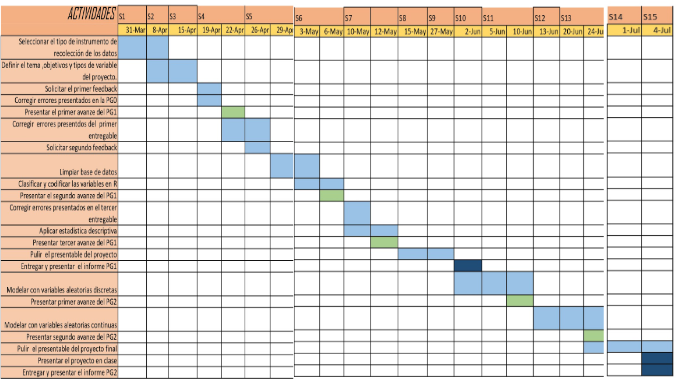

# **Tema:**

"Estudio del desempeño de los jugadores de la NBA y su relación con en el éxito del equipo durante las temporada 2018-2019 y 2019-2020"

# **Relevancia:**

Con esta información, los entrenadores y los equipos tomarán decisiones informadas sobre qué jugadores usar en diferentes situaciones de juego, cómo planificar estrategias de equipo y cómo mejorar el desempeño individual de los jugadores. Además, los analistas y aficionados también utilizan las estadísticas para comparar a los jugadores de diferentes épocas y para hacer predicciones sobre los resultados de los partidos y de la temporada en general.

En conclusión, el análisis del desempeño de los jugadores de la NBA es una herramienta valiosa para evaluar el rendimiento de los jugadores, identificar áreas de mejora y tomar decisiones informadas para mejorar el rendimiento individual y del equipo.

# **Objetivo General:**

Analizar el desempeño de los jugadores de la NBA en las temporadas 2018-2019 y 2019-2020

## **Objetivos especificos:**

-   Identificar qué jugadores de la NBA tuvieron mayor rendimiento durante las temporadas 2018-2019 y 2019-2020.

-   Evaluar su valor relativo de estos en función de su desempeño en diferentes aspectos del juego en la liga NBA en las campañas 2018-2019 y 2019-2020.

-   Identificar tendencias del equipo ganador para revelar aspectos importantes en el desempeño de este, tales como su eficacia ofensiva y defensiva en la liga NBA en las temporadas 2018-2019 y 2019-2020.

# **Planificación:**

{}
  
# **Instrumento de Recolección:**

El instrumento se realizará por medio de una fuente secundaria. La data obtenida posee variables numéricas: continuas y discretas; cualitativas, nominales y ordinales. Esta variedad de datos ayudará a tener un mejor estudio del tema. (Presentación de la tabla excel)

# **Librerias:**

```{r}
library(stringr)
library(ggplot2)
library(stringr)
library(readr)
library(dplyr)
library(modeest)

```

# **Leemos la base de Datos:**

```{r}
data <- read_csv("players_stats_by_season_full_details.csv")

```

# **Realizamos el filtrado:**

```{r}
data_nueva <- filter(data,League == "NBA", Season == '2018 - 2019' |Season == '2019 - 2020', Stage == "Regular_Season" |Stage == "Playoffs")
```

# **Eliminación de los NA **

```{r}
data_nueva$Edad<-2020-data_nueva$birth_year
data_nueva<-select(data_nueva,-draft_team,-League,-birth_month,-birth_date,-draft_round,-draft_pick,-height,-weight,-birth_year)
```

# **Variables**

| Variable             | Tipo                                       | Descripción                                                            |
|---------------|---------------|-------------------------------------------|
| Altura (cm)          | [Numérica]{style="color:red"} Continua     | Altura en centímetros del jugador                                      |
| Peso (Kg)            | [Numérica]{style="color:red"} Continua     | Peso en kilogramos del jugador                                         |
| MIN                  | [Numérica]{style="color:red"} Continua     | Cantidad de minutos del jugador en la temporada                        |
| GP                   | [Numérica]{style="color:red"} Discreta     | Número de partidos jugados por el jugador en la temporada              |
| FGM                  | [Numérica]{style="color:red"} Discreta     | Número de tiros de campo acertados por el jugador en la temporada      |
| FGA                  | [Numérica]{style="color:red"} Discreta     | Número de tiros de campo intentados por el jugador en la temporada     |
| 3PM                  | [Numérica]{style="color:red"} Discreta     | Número de tiros de 3 puntos encestados por el jugador en la temporada  |
| 3PA                  | [Numérica]{style="color:red"} Discreta     | Número de tiros de 3 puntos intentados por el jugador en la temporada  |
| FTM                  | [Numérica]{style="color:red"} Discreta     | Número de tiros libres encestados por el jugador en la temporada       |
| FTA                  | [Numérica]{style="color:red"} Discreta     | Número de tiros libres intentados por el jugador en la temporada       |
| TOV                  | [Numérica]{style="color:red"} Discreta     | Número de pérdidas de balón cometidas por el jugador en la temporada   |
| PF                   | [Numérica]{style="color:red"} Discreta     | Número de faltas personales cometidas por el jugador en la temporada   |
| ORB                  | [Numérica]{style="color:red"} Discreta     | Número de rebotes ofensivos capturados por el jugador en la temporada  |
| DRB                  | [Numérica]{style="color:red"} Discreta     | Número de rebotes defensivos capturados por el jugador en la temporada |
| REB                  | [Numérica]{style="color:red"} Discreta     | Número total de rebotes capturados por el jugador en la temporada      |
| AST                  | [Numérica]{style="color:red"} Discreta     | Número de asistencias realizadas por el jugador en la temporada        |
| BLK                  | [Numérica]{style="color:red"} Discreta     | Número de tapones realizados por el jugador en la temporada            |
| PTS                  | [Numérica]{style="color:red"} Discreta     | Número de puntos anotados por el jugador en la temporada               |
| Equipo del jugador   | [Cualitativa]{style="color:blue"} Nominal  | Nombre del equipo en el que juega o ha jugado el jugador               |
| Nacionalidad         | [Cualitativa]{style="color:blue"} Nominal  | País de origen del jugador                                             |
| Instituto donde jugó | [Cualitativa]{style="color:blue"} Nominal  | Nombre del instituto donde el jugador estudió y jugó al baloncesto     |
| Edad                 | [Cualitativa]{style="color:blue"} Numérica | Edad del jugador en años                                               |
| Nivel de jugador     | [Cualitativa]{style="color:blue"} Ordinal  | Categoría de nivel de habilidad del jugador (bajo, medio, alto, elite) |

# **Descriptores**

Realizamos las separaciones de las temporadas y sus respectivos escenario para el analisis debido a que en cada temporada se realizan un proceso de escoger los 16 mejores equipos de dos grupos(conferencias) y se define el ganador de la temporada en los playoff entre esos 16 equipos 
```{r}
temporada_2018_2019 <- filter(data_nueva,Season =='2018 - 2019')
temporada_2018_2019_sesion_regular <- filter(data_nueva, Season == '2018 - 2019',Stage == 'Regular_Season')
temporada_2018_2019_playoff <- filter(data_nueva, Season == '2018 - 2019',Stage == 'Playoffs')
temporada_2019_2020 <- filter(data_nueva,Season =='2019 - 2020')
temporada_2019_2020_sesion_regular <- filter(data_nueva, Season == '2019 - 2020',Stage == 'Regular_Season')
temporada_2019_2020_playoff <- filter(data_nueva, Season == '2019 - 2020',Stage == 'Playoffs')
temporada_2018_2019_sesion_regular
temporada_2019_2020_sesion_regular
temporada_2018_2019_playoff
temporada_2019_2020_playoff
```

A continuacion se utilizaran los descriptores para poder escoger el mejor promedio de cada variable.

## *Histograma de la cantidad de minutos jugados en la temporada*

```{r}
# regular sesion 2018-2019 --------------------
sd(temporada_2018_2019_sesion_regular$MIN)
mediana_cant_min_RS_18_19 <- median(temporada_2018_2019_sesion_regular$MIN)
media_cant_min_RS_18_19 <- mean(temporada_2018_2019_sesion_regular$MIN)
coef_cant_min_RS_18_19 <- sd(temporada_2018_2019_sesion_regular$MIN)/media_cant_min_RS_18_19
coef_cant_min_RS_18_19
boxplot(temporada_2018_2019_sesion_regular$MIN,main="Driagrama de cajas de la variable cantidad de minutos
  en la temporada 2018-2019 en la sesion regular",ylab="cantidad de minutos")
hist(temporada_2018_2019_sesion_regular$MIN,main="  Histograma de la cantidad de minutos jugados 
  en la temporada 2018-2019 en la sesion regular",
     xlab="cantidad de minutos", ylab="Frecuencias",col="khaki",border="lightsteelblue")
abline(v=mediana_cant_min_RS_18_19,col="purple")
abline(v=media_cant_min_RS_18_19,col="red")

# playoffs 2018-2019 --------------------
sd(temporada_2018_2019_playoff$MIN)
mediana_cant_min_PO_18_19 <- median(temporada_2018_2019_playoff$MIN)
media_cant_min_PO_18_19 <- mean(temporada_2018_2019_playoff$MIN)
coef_cant_min_PO_18_19 <- sd(temporada_2018_2019_playoff$MIN)/media_cant_min_PO_18_19
coef_cant_min_PO_18_19
boxplot(temporada_2018_2019_playoff$MIN,main="Driagrama de cajas de la variable cantidad de minutos
  en la temporada 2018-2019 en los Playoffs",ylab="cantidad de minutos")
hist(temporada_2018_2019_playoff$MIN,main="  Histograma de la cantidad de minutos jugados 
  en la temporada 2018-2019 en los Playoffs",
     xlab="cantidad de minutos", ylab="Frecuencias",col="khaki",border="lightsteelblue")
abline(v=mediana_cant_min_PO_18_19,col="purple")
abline(v=media_cant_min_PO_18_19,col="red")

# regular sesion 2019-2020 --------------------
sd(temporada_2019_2020_sesion_regular$MIN)
mediana_cant_min_RS_19_20 <- median(temporada_2019_2020_sesion_regular$MIN)
media_cant_min_RS_19_20 <- mean(temporada_2019_2020_sesion_regular$MIN)
coef_cant_min_RS_19_20 <- sd(temporada_2019_2020_sesion_regular$MIN)/media_cant_min_RS_19_20
coef_cant_min_RS_19_20
boxplot(temporada_2019_2020_sesion_regular$MIN,main="Driagrama de cajas de la variable cantidad de minutos
  en la temporada 2019-2020 en la sesion regular",ylab="cantidad de minutos")
hist(temporada_2018_2019_sesion_regular$MIN,main="  Histograma de la cantidad de minutos jugados 
  en la temporada 2019-2020 en la sesion regular",
     xlab="cantidad de minutos", ylab="Frecuencias",col="khaki",border="lightsteelblue")
abline(v=mediana_cant_min_RS_19_20,col="purple")
abline(v=media_cant_min_RS_19_20,col="red")

# Playoffs 2019-2020 --------------------
sd(temporada_2019_2020_playoff$MIN)
mediana_cant_min_PO_19_20 <- median(temporada_2019_2020_playoff$MIN)
media_cant_min_PO_19_20 <- mean(temporada_2019_2020_playoff$MIN)
coef_cant_min_PO_19_20 <- sd(temporada_2019_2020_playoff$MIN)/media_cant_min_PO_19_20
coef_cant_min_PO_19_20
boxplot(temporada_2019_2020_playoff$MIN,main="Driagrama de cajas de la variable cantidad de minutos
  en la temporada 2019-2020 en los Playoffs",ylab="cantidad de minutos")
hist(temporada_2019_2020_playoff$MIN,main="  Histograma de la cantidad de minutos jugados 
  en la temporada 2019-2020 en los Playoffs",
     xlab="cantidad de minutos", ylab="Frecuencias",col="khaki",border="lightsteelblue")
abline(v=mediana_cant_min_PO_19_20,col="purple")
abline(v=media_cant_min_PO_19_20,col="red")

```

## *Histograma del Número de faltas personales cometidas por el jugador en la temporada*


```{r}
# regular sesion 2018-2019 --------------------
sd(temporada_2018_2019_sesion_regular$PF)
mediana_faltas_RS_18_19 <- median(temporada_2018_2019_sesion_regular$PF)
media_faltas_RS_18_19 <- mean(temporada_2018_2019_sesion_regular$PF)
boxplot(temporada_2018_2019_sesion_regular$PF,main="Driagrama de cajas de la variable cantidad de faltas
  en la temporada 2018-2019 en la sesion regular",ylab="cantidad de faltas")
hist(temporada_2018_2019_sesion_regular$PF,main="  Histograma de la cantidad de faltas jugados 
  en la temporada 2018-2019 en la sesion regular",
     xlab="cantidad de faltas", ylab="Frecuencias",col="khaki",border="lightsteelblue")
abline(v=mediana_faltas_RS_18_19,col="purple")
abline(v=media_faltas_RS_18_19,col="red")

# playoffs 2018-2019 --------------------
sd(temporada_2018_2019_playoff$PF)
mediana_faltas_PO_18_19 <- median(temporada_2018_2019_playoff$PF)
media_faltas_PO_18_19 <- mean(temporada_2018_2019_playoff$PF)
boxplot(temporada_2018_2019_playoff$PF,main="Driagrama de cajas de la variable cantidad de faltas
  en la temporada 2018-2019 en los Playoffs",ylab="cantidad de faltas")
hist(temporada_2018_2019_playoff$PF,main="  Histograma de la cantidad de faltas jugados 
  en la temporada 2018-2019 en los Playoffs",
     xlab="cantidad de faltas", ylab="Frecuencias",col="khaki",border="lightsteelblue")
abline(v=mediana_faltas_PO_18_19,col="purple")
abline(v=media_faltas_PO_18_19,col="red")

# regular sesion 2019-2020 --------------------
sd(temporada_2019_2020_sesion_regular$PF)
mediana_faltas_RS_19_20 <- median(temporada_2019_2020_sesion_regular$PF)
media_faltas_RS_19_20 <- mean(temporada_2019_2020_sesion_regular$PF)
boxplot(temporada_2019_2020_sesion_regular$PF,main="Driagrama de cajas de la variable cantidad de faltas
  en la temporada 2019-2020 en la sesion regular",ylab="cantidad de faltas")
hist(temporada_2018_2019_sesion_regular$PF,main="  Histograma de la cantidad de faltas jugados 
  en la temporada 2019-2020 en la sesion regular",
     xlab="cantidad de faltas", ylab="Frecuencias",col="khaki",border="lightsteelblue")
abline(v=mediana_faltas_RS_19_20,col="purple")
abline(v=media_faltas_RS_19_20,col="red")

# Playoffs 2019-2020 --------------------
sd(temporada_2019_2020_playoff$PF)
mediana_faltas_PO_19_20 <- median(temporada_2019_2020_playoff$PF)
media_faltas_PO_19_20 <- mean(temporada_2019_2020_playoff$PF)
boxplot(temporada_2019_2020_playoff$PF,main="Driagrama de cajas de la variable cantidad de faltas
  en la temporada 2019-2020 en los Playoffs",ylab="cantidad de faltas")
hist(temporada_2019_2020_playoff$PF,main="  Histograma de la cantidad de faltas jugados 
  en la temporada 2019-2020 en los Playoffs",
     xlab="cantidad de faltas", ylab="Frecuencias",col="khaki",border="lightsteelblue")
abline(v=mediana_faltas_PO_19_20,col="purple")
abline(v=media_faltas_PO_19_20,col="red")

```


## *Histograma de Número de rebotes defensivos capturados por el jugador en la temporada*

```{r}
# regular sesion 2018-2019 --------------------
sd(temporada_2018_2019_sesion_regular$DRB)
mediana_RebDef_RS_18_19 <- median(temporada_2018_2019_sesion_regular$DRB)
media_RebDef_RS_18_19 <- mean(temporada_2018_2019_sesion_regular$DRB)
boxplot(temporada_2018_2019_sesion_regular$DRB,main="Driagrama de cajas de la variable cantidad de Rebotes defensivos
  en la temporada 2018-2019 en la sesion regular",ylab="cantidad de faltas")
hist(temporada_2018_2019_sesion_regular$DRB,main="  Histograma de la cantidad de Rebotes defensivos 
  en la temporada 2018-2019 en la sesion regular",
     xlab="cantidad de faltas", ylab="Frecuencias",col="khaki",border="lightsteelblue")
abline(v=mediana_RebDef_RS_18_19,col="purple")
abline(v=media_RebDef_RS_18_19,col="red")

# playoffs 2018-2019 --------------------
sd(temporada_2018_2019_playoff$DRB)
mediana_RebDef_PO_18_19 <- median(temporada_2018_2019_playoff$DRB)
media_RebDef_PO_18_19 <- mean(temporada_2018_2019_playoff$DRB)
boxplot(temporada_2018_2019_playoff$DRB,main="Driagrama de cajas de la variable cantidad de Rebotes defensivos
  en la temporada 2018-2019 en los Playoffs",ylab="cantidad de faltas")
hist(temporada_2018_2019_playoff$DRB,main="  Histograma de la cantidad de Rebotes defensivos 
  en la temporada 2018-2019 en los Playoffs",
     xlab="cantidad de faltas", ylab="Frecuencias",col="khaki",border="lightsteelblue")
abline(v=mediana_RebDef_PO_18_19,col="purple")
abline(v=media_RebDef_PO_18_19,col="red")

# regular sesion 2019-2020 --------------------
sd(temporada_2019_2020_sesion_regular$DRB)
mediana_RebDef_RS_19_20 <- median(temporada_2019_2020_sesion_regular$DRB)
media_RebDef_RS_19_20 <- mean(temporada_2019_2020_sesion_regular$DRB)
boxplot(temporada_2019_2020_sesion_regular$DRB,main="Driagrama de cajas de la variable cantidad de Rebotes defensivos
  en la temporada 2019-2020 en la sesion regular",ylab="cantidad de faltas")
hist(temporada_2018_2019_sesion_regular$DRB,main="  Histograma de la cantidad de Rebotes defensivos 
  en la temporada 2019-2020 en la sesion regular",
     xlab="cantidad de faltas", ylab="Frecuencias",col="khaki",border="lightsteelblue")
abline(v=mediana_RebDef_RS_19_20,col="purple")
abline(v=media_RebDef_RS_19_20,col="red")

# Playoffs 2019-2020 --------------------
sd(temporada_2019_2020_playoff$DRB)
mediana_RebDef_PO_19_20 <- median(temporada_2019_2020_playoff$DRB)
media_RebDef_PO_19_20 <- mean(temporada_2019_2020_playoff$DRB)
boxplot(temporada_2019_2020_playoff$DRB,main="Driagrama de cajas de la variable cantidad de Rebotes defensivos
  en la temporada 2019-2020 en los Playoffs",ylab="cantidad de faltas")
hist(temporada_2019_2020_playoff$DRB,main="  Histograma de la cantidad de Rebotes defensivos 
  en la temporada 2019-2020 en los Playoffs",
     xlab="cantidad de faltas", ylab="Frecuencias",col="khaki",border="lightsteelblue")
abline(v=mediana_RebDef_PO_19_20,col="purple")
abline(v=media_RebDef_PO_19_20,col="red")
```

## *Histograma de Número de rebotes ofensivos capturados por el jugador en la temporada*


```{r}
# regular sesion 2018-2019 --------------------
sd(temporada_2018_2019_sesion_regular$ORB)
mediana_RebOf_RS_18_19 <- median(temporada_2018_2019_sesion_regular$ORB)
media_RebOf_RS_18_19 <- mean(temporada_2018_2019_sesion_regular$ORB)
boxplot(temporada_2018_2019_sesion_regular$ORB,main="Driagrama de cajas de la variable cantidad de Rebotes ofensivos
  en la temporada 2018-2019 en la sesion regular",ylab="cantidad de faltas")
hist(temporada_2018_2019_sesion_regular$ORB,main="  Histograma de la cantidad de Rebotes ofensivos 
  en la temporada 2018-2019 en la sesion regular",
     xlab="cantidad de Rebotes ofensivos", ylab="Frecuencias",col="khaki",border="lightsteelblue")
abline(v=mediana_RebOf_RS_18_19,col="purple")
abline(v=media_RebOf_RS_18_19,col="red")

# playoffs 2018-2019 --------------------
sd(temporada_2018_2019_playoff$ORB)
mediana_RebOf_PO_18_19 <- median(temporada_2018_2019_playoff$ORB)
media_RebOf_PO_18_19 <- mean(temporada_2018_2019_playoff$ORB)
boxplot(temporada_2018_2019_playoff$ORB,main="Driagrama de cajas de la variable cantidad de Rebotes ofensivos
  en la temporada 2018-2019 en los Playoffs",ylab="cantidad de faltas")
hist(temporada_2018_2019_playoff$ORB,main="  Histograma de la cantidad de Rebotes ofensivos 
  en la temporada 2018-2019 en los Playoffs",
     xlab="cantidad de Rebotes ofensivos", ylab="Frecuencias",col="khaki",border="lightsteelblue")
abline(v=mediana_RebOf_PO_18_19,col="purple")
abline(v=media_RebOf_PO_18_19,col="red")

# regular sesion 2019-2020 --------------------
sd(temporada_2019_2020_sesion_regular$ORB)
mediana_RebOf_RS_19_20 <- median(temporada_2019_2020_sesion_regular$ORB)
media_RebOf_RS_19_20 <- mean(temporada_2019_2020_sesion_regular$ORB)
boxplot(temporada_2019_2020_sesion_regular$ORB,main="Driagrama de cajas de la variable cantidad de Rebotes ofensivos
  en la temporada 2019-2020 en la sesion regular",ylab="cantidad de faltas")
hist(temporada_2018_2019_sesion_regular$ORB,main="  Histograma de la cantidad de Rebotes ofensivos 
  en la temporada 2019-2020 en la sesion regular",
     xlab="cantidad de Rebotes ofensivos", ylab="Frecuencias",col="khaki",border="lightsteelblue")
abline(v=mediana_RebOf_RS_19_20,col="purple")
abline(v=media_RebOf_RS_19_20,col="red")

# Playoffs 2019-2020 --------------------
sd(temporada_2019_2020_playoff$ORB)
mediana_RebOf_PO_19_20 <- median(temporada_2019_2020_playoff$ORB)
media_RebOf_PO_19_20 <- mean(temporada_2019_2020_playoff$ORB)
boxplot(temporada_2019_2020_playoff$ORB,main="Driagrama de cajas de la variable cantidad de Rebotes ofensivos
  en la temporada 2019-2020 en los Playoffs",ylab="cantidad de faltas")
hist(temporada_2019_2020_playoff$ORB,main="  Histograma de la cantidad de Rebotes ofensivos 
  en la temporada 2019-2020 en los Playoffs",
     xlab="cantidad de Rebotes ofensivos", ylab="Frecuencias",col="khaki",border="lightsteelblue")
abline(v=mediana_RebOf_PO_19_20,col="purple")
abline(v=media_RebOf_PO_19_20,col="red")
```

## *Histograma de Número de tapones realizados por el jugador en la temporad*

```{r}
# regular sesion 2018-2019 --------------------
sd(temporada_2018_2019_sesion_regular$BLK)
mediana_tapones_RS_18_19 <- median(temporada_2018_2019_sesion_regular$BLK)
media_tapones_RS_18_19 <- mean(temporada_2018_2019_sesion_regular$BLK)
boxplot(temporada_2018_2019_sesion_regular$BLK,main="Driagrama de cajas de la variable cantidad de tapones
  en la temporada 2018-2019 en la sesion regular",ylab="cantidad de tapones")
hist(temporada_2018_2019_sesion_regular$BLK,main="  Histograma de la cantidad de tapones
  en la temporada 2018-2019 en la sesion regular",
     xlab="cantidad de tapones", ylab="Frecuencias",col="khaki",border="lightsteelblue")
abline(v=mediana_tapones_RS_18_19,col="purple")
abline(v=media_tapones_RS_18_19,col="red")

# playoffs 2018-2019 --------------------
sd(temporada_2018_2019_playoff$BLK)
mediana_tapones_PO_18_19 <- median(temporada_2018_2019_playoff$BLK)
media_tapones_PO_18_19 <- mean(temporada_2018_2019_playoff$BLK)
boxplot(temporada_2018_2019_playoff$BLK,main="Driagrama de cajas de la variable cantidad de tapones
  en la temporada 2018-2019 en los Playoffs",ylab="cantidad de tapones")
hist(temporada_2018_2019_playoff$BLK,main="  Histograma de la cantidad de tapones 
  en la temporada 2018-2019 en los Playoffs",
     xlab="cantidad de tapones", ylab="Frecuencias",col="khaki",border="lightsteelblue")
abline(v=mediana_tapones_PO_18_19,col="purple")
abline(v=media_tapones_PO_18_19,col="red")

# regular sesion 2019-2020 --------------------
sd(temporada_2019_2020_sesion_regular$BLK)
mediana_tapones_RS_19_20 <- median(temporada_2019_2020_sesion_regular$BLK)
media_tapones_RS_19_20 <- mean(temporada_2019_2020_sesion_regular$BLK)
boxplot(temporada_2019_2020_sesion_regular$BLK,main="Driagrama de cajas de la variable cantidad de tapones
  en la temporada 2019-2020 en la sesion regular",ylab="cantidad de tapones")
hist(temporada_2018_2019_sesion_regular$BLK,main="  Histograma de la cantidad de tapones
  en la temporada 2019-2020 en la sesion regular",
     xlab="cantidad de tapones", ylab="Frecuencias",col="khaki",border="lightsteelblue")
abline(v=mediana_tapones_RS_19_20,col="purple")
abline(v=media_tapones_RS_19_20,col="red")

# Playoffs 2019-2020 --------------------
sd(temporada_2019_2020_playoff$BLK)
mediana_tapones_PO_19_20 <- median(temporada_2019_2020_playoff$BLK)
media_tapones_PO_19_20 <- mean(temporada_2019_2020_playoff$BLK)
boxplot(temporada_2019_2020_playoff$BLK,main="Driagrama de cajas de la variable cantidad de tapones
  en la temporada 2019-2020 en los Playoffs",ylab="cantidad de tapones")
hist(temporada_2019_2020_playoff$BLK,main="  Histograma de la cantidad de tapones
  en la temporada 2019-2020 en los Playoffs",
     xlab="cantidad de tapones", ylab="Frecuencias",col="khaki",border="lightsteelblue")
abline(v=mediana_tapones_PO_19_20,col="purple")
abline(v=media_tapones_PO_19_20,col="red")
```

## *Histograma de Número de puntos anotados por el jugador en la temporada*

```{r}
# regular sesion 2018-2019 --------------------
sd(temporada_2018_2019_sesion_regular$PTS)
mediana_PTS_RS_18_19 <- median(temporada_2018_2019_sesion_regular$PTS)
media_PTS_RS_18_19 <- mean(temporada_2018_2019_sesion_regular$PTS)
boxplot(temporada_2018_2019_sesion_regular$PTS,main="Driagrama de cajas de la variable cantidad de puntos
en la temporada 2018-2019 en la sesion regular",ylab="cantidad de puntos")
hist(temporada_2018_2019_sesion_regular$PTS,main="  Histograma de la cantidad de puntos
en la temporada 2018-2019 en la sesion regular",
     xlab="cantidad de puntos", ylab="Frecuencias",col="khaki",border="lightsteelblue")
abline(v=mediana_PTS_RS_18_19,col="purple")
abline(v=media_PTS_RS_18_19,col="red")

# playoffs 2018-2019 --------------------
sd(temporada_2018_2019_playoff$PTS)
mediana_PTS_PO_18_19 <- median(temporada_2018_2019_playoff$PTS)
media_PTS_PO_18_19 <- mean(temporada_2018_2019_playoff$PTS)
boxplot(temporada_2018_2019_playoff$PTS,main="Driagrama de cajas de la variable cantidad de puntos
en la temporada 2018-2019 en los Playoffs",ylab="cantidad de puntos")
hist(temporada_2018_2019_playoff$PTS,main="  Histograma de la cantidad de puntos 
en la temporada 2018-2019 en los Playoffs",
     xlab="cantidad de puntos", ylab="Frecuencias",col="khaki",border="lightsteelblue")
abline(v=mediana_PTS_PO_18_19,col="purple")
abline(v=media_PTS_PO_18_19,col="red")

# regular sesion 2019-2020 --------------------
sd(temporada_2019_2020_sesion_regular$PTS)
mediana_PTS_RS_19_20 <- median(temporada_2019_2020_sesion_regular$PTS)
media_PTS_RS_19_20 <- mean(temporada_2019_2020_sesion_regular$PTS)
boxplot(temporada_2019_2020_sesion_regular$PTS,main="Driagrama de cajas de la variable cantidad de puntos
en la temporada 2019-2020 en la sesion regular",ylab="cantidad de puntos")
hist(temporada_2018_2019_sesion_regular$PTS,main="  Histograma de la cantidad de puntos
en la temporada 2019-2020 en la sesion regular",
     xlab="cantidad de puntos", ylab="Frecuencias",col="khaki",border="lightsteelblue")
abline(v=mediana_PTS_RS_19_20,col="purple")
abline(v=media_PTS_RS_19_20,col="red")

# Playoffs 2019-2020 --------------------
sd(temporada_2019_2020_playoff$PTS)
mediana_PTS_PO_19_20 <- median(temporada_2019_2020_playoff$PTS)
media_PTS_PO_19_20 <- mean(temporada_2019_2020_playoff$PTS)
boxplot(temporada_2019_2020_playoff$PTS,main="Driagrama de cajas de la variable cantidad de puntos
en la temporada 2019-2020 en los Playoffs",ylab="cantidad de puntos")
hist(temporada_2019_2020_playoff$PTS,main="  Histograma de la cantidad de puntos
en la temporada 2019-2020 en los Playoffs",
     xlab="cantidad de puntos", ylab="Frecuencias",col="khaki",border="lightsteelblue")
abline(v=mediana_PTS_PO_19_20,col="purple")
abline(v=media_PTS_PO_19_20,col="red")
```


# **Analisis**
## *Primer objetivo*
En el siguiente gráfico de dispersión  esta relacionado con la primera temporada 2018-2019 para la sesión regular en el cual se hizo la comparación correspondiente entre cinco variables:rebotes ofensivos, faltas,tapones,rebotes defensivos y minutos jugados con la variable minutos.Tras ello se realizó una correlación y se determino que tan relacionados estas variables para determinar qué jugadores de la NBA tuvieron mayor rendimiento durante
en esta temporada.
Interpretación del gráfico con mayor correlación es minutos con puntos con 0.8454981 un valor que se aproxima a 1.Concluyendo que entre más minutos jugados en el campo los jugadores obtendrá mayor puntaje.

```{r}
cor(temporada_2018_2019_sesion_regular$PTS,temporada_2018_2019_sesion_regular$DRB) # cantidad de rebotes defensivos.
cor(temporada_2018_2019_sesion_regular$PTS,temporada_2018_2019_sesion_regular$ORB) # rebotes ofensivos.
cor(temporada_2018_2019_sesion_regular$PTS,temporada_2018_2019_sesion_regular$PF)  # faltas personales.
cor(temporada_2018_2019_sesion_regular$PTS,temporada_2018_2019_sesion_regular$BLK) # numero de tapones
cor(temporada_2018_2019_sesion_regular$PTS,temporada_2018_2019_sesion_regular$MIN) # minutos jugados.

plot(temporada_2018_2019_sesion_regular$PTS,temporada_2018_2019_sesion_regular$ORB,main="Grafico de dispercion entre las variables Puntos y rebotes ofensivos ")
abline(lm(temporada_2018_2019_sesion_regular$ORB ~ temporada_2018_2019_sesion_regular$PTS), col = "green", lwd = 2)#tendencia

plot(temporada_2018_2019_sesion_regular$PTS,temporada_2018_2019_sesion_regular$PF,main="Grafico de dispercion entre las variables Puntos y faltas ")
abline(lm(temporada_2018_2019_sesion_regular$PF ~ temporada_2018_2019_sesion_regular$PTS), col = "green", lwd = 2)#tendencia

plot(temporada_2018_2019_sesion_regular$PTS,temporada_2018_2019_sesion_regular$BLK,main="Grafico de dispercion entre las variables Puntos y tapones ")
abline(lm(temporada_2018_2019_sesion_regular$BLK ~ temporada_2018_2019_sesion_regular$PTS), col = "green", lwd = 2)#tendencia

plot(temporada_2018_2019_sesion_regular$PTS,temporada_2018_2019_sesion_regular$DRB,main="Grafico de dispercion entre las variables Puntos y rebotes defensivos ")
abline(lm(temporada_2018_2019_sesion_regular$DRB ~ temporada_2018_2019_sesion_regular$PTS), col = "green", lwd = 2)#tendencia

plot(temporada_2018_2019_sesion_regular$PTS,temporada_2018_2019_sesion_regular$MIN,main="Grafico de dispercion entre las variables Puntos y Minutos jugados ")
abline(lm(temporada_2018_2019_sesion_regular$MIN ~ temporada_2018_2019_sesion_regular$PTS), col = "green", lwd = 2)#tendencia
```
El gráfico de dispersión que se muestra a continuacion esta relacionado con la primera temporada 2018-2019 para la sesión playoff(sesión mundial) en el cual se hizo la comparación correspondiente entre cinco variables:rebotes ofensivos, faltas,tapones,rebotes defensivos y minutos jugados con la variable minutos.Tras ello se realizó una correlación y se determino que tan relacionados estas variables para determinar qué jugadores de la NBA tuvieron mayor rendimiento durante
en esta temporada.
Interpretación del gráfico con mayor correlación es minutos con puntos con 0.892172 un valor que se aproxima a 1.Concluyendo que entre más minutos jugados en el campo los jugadores obtendrá mayor puntaje.

```{r}
cor(temporada_2018_2019_playoff$PTS,temporada_2018_2019_playoff$DRB) # cantidad de rebotes defensivos.
cor(temporada_2018_2019_playoff$PTS,temporada_2018_2019_playoff$ORB) # rebotes ofensivos.
cor(temporada_2018_2019_playoff$PTS,temporada_2018_2019_playoff$PF)  # faltas personales.
cor(temporada_2018_2019_playoff$PTS,temporada_2018_2019_playoff$BLK) # numero de tapones
cor(temporada_2018_2019_playoff$PTS,temporada_2018_2019_playoff$MIN) # minutos jugados.

plot(temporada_2018_2019_playoff$PTS,temporada_2018_2019_playoff$ORB,main="Grafico de dispercion entre las variables Puntos y rebotes ofensivos ")
abline(lm(temporada_2018_2019_playoff$ORB ~ temporada_2018_2019_playoff$PTS), col = "green", lwd = 2)#tendencia

plot(temporada_2018_2019_playoff$PTS,temporada_2018_2019_playoff$PF,main="Grafico de dispercion entre las variables Puntos y faltas ")
abline(lm(temporada_2018_2019_playoff$PF ~ temporada_2018_2019_playoff$PTS), col = "green", lwd = 2)#tendencia

plot(temporada_2018_2019_playoff$PTS,temporada_2018_2019_playoff$BLK,main="Grafico de dispercion entre las variables Puntos y tapones ")
abline(lm(temporada_2018_2019_playoff$BLK ~ temporada_2018_2019_playoff$PTS), col = "green", lwd = 2)#tendencia

plot(temporada_2018_2019_playoff$PTS,temporada_2018_2019_playoff$DRB,main="Grafico de dispercion entre las variables Puntos y rebotes defensivos ")
abline(lm(temporada_2018_2019_playoff$DRB ~ temporada_2018_2019_playoff$PTS), col = "green", lwd = 2)#tendencia

plot(temporada_2018_2019_playoff$PTS,temporada_2018_2019_playoff$MIN,main="Grafico de dispercion entre las variables Puntos y Minutos jugados ")
abline(lm(temporada_2018_2019_playoff$MIN ~ temporada_2018_2019_playoff$PTS), col = "green", lwd = 2)#tendencia
```
Este gráfico de dispersión  esta relacionado con la segunda temporada 2019-2020 para la sesión regular(sesión eliminatorias) en el cual se hizo la comparación correspondiente entre cinco variables:rebotes ofensivos, faltas,tapones,rebotes defensivos y minutos jugados con la variable minutos.Tras ello se realizó una correlación y se determino que tan relacionados estas variables para determinar qué jugadores de la NBA tuvieron mayor rendimiento durante
en esta temporada.
Interpretación del gráfico con mayor correlación es minutos con puntos con  0.8309697 un valor que se aproxima a 1.Concluyendo que entre más minutos jugados en el campo los jugadores obtendrá mayor puntaje.

```{r}
cor(temporada_2019_2020_sesion_regular$PTS,temporada_2019_2020_sesion_regular$DRB) # cantidad de rebotes defensivos.
cor(temporada_2019_2020_sesion_regular$PTS,temporada_2019_2020_sesion_regular$ORB) # rebotes ofensivos.
cor(temporada_2019_2020_sesion_regular$PTS,temporada_2019_2020_sesion_regular$PF)  # faltas personales.
cor(temporada_2019_2020_sesion_regular$PTS,temporada_2019_2020_sesion_regular$BLK) # numero de tapones
cor(temporada_2019_2020_sesion_regular$PTS,temporada_2019_2020_sesion_regular$MIN) # minutos jugados.

plot(temporada_2019_2020_sesion_regular$PTS,temporada_2019_2020_sesion_regular$ORB,main="Grafico de dispercion entre las variables Puntos y rebotes ofensivos ")
abline(lm(temporada_2019_2020_sesion_regular$ORB ~ temporada_2019_2020_sesion_regular$PTS), col = "green", lwd = 2)#tendencia

plot(temporada_2019_2020_sesion_regular$PTS,temporada_2019_2020_sesion_regular$PF,main="Grafico de dispercion entre las variables Puntos y faltas ")
abline(lm(temporada_2019_2020_sesion_regular$PF ~ temporada_2019_2020_sesion_regular$PTS), col = "green", lwd = 2)#tendencia

plot(temporada_2019_2020_sesion_regular$PTS,temporada_2019_2020_sesion_regular$BLK,main="Grafico de dispercion entre las variables Puntos y tapones ")
abline(lm(temporada_2019_2020_sesion_regular$BLK ~ temporada_2019_2020_sesion_regular$PTS), col = "green", lwd = 2)#tendencia

plot(temporada_2019_2020_sesion_regular$PTS,temporada_2019_2020_sesion_regular$DRB,main="Grafico de dispercion entre las variables Puntos y rebotes defensivos ")
abline(lm(temporada_2019_2020_sesion_regular$DRB ~ temporada_2019_2020_sesion_regular$PTS), col = "green", lwd = 2)#tendencia

plot(temporada_2019_2020_sesion_regular$PTS,temporada_2019_2020_sesion_regular$MIN,main="Grafico de dispercion entre las variables Puntos y Minutos jugados ")
abline(lm(temporada_2019_2020_sesion_regular$MIN ~ temporada_2019_2020_sesion_regular$PTS), col = "green", lwd = 2)#tendencia
```
Por ultimo, en el siguiente gráfico de dispersión esta relacionado con la segunda temporada 2019-2020 para la sesión playoff(sesión mundial) en el cual se hizo la comparación correspondiente entre cinco variables:rebotes ofensivos, faltas,tapones,rebotes defensivos y minutos jugados con la variable minutos.Tras ello se realizó una correlación y se determino que tan relacionados estas variables para determinar qué jugadores de la NBA tuvieron mayor rendimiento durante
en esta temporada.
Interpretación del gráfico con mayor correlación es minutos con puntos con  0.8933219 un valor que se aproxima a 1.Concluyendo que entre más minutos jugados en el campo los jugadores obtendrá mayor puntaje.


Las otras variables también llegan a presentar una correlación con la variable puntaje en el cual la mayoría pasa 0.5 como valor de correlación.


```{r}
cor(temporada_2019_2020_playoff$PTS,temporada_2019_2020_playoff$DRB) # cantidad de rebotes defensivos.
cor(temporada_2019_2020_playoff$PTS,temporada_2019_2020_playoff$ORB) # rebotes ofensivos.
cor(temporada_2019_2020_playoff$PTS,temporada_2019_2020_playoff$PF)  # faltas personales.
cor(temporada_2019_2020_playoff$PTS,temporada_2019_2020_playoff$BLK) # numero de tapones
cor(temporada_2019_2020_playoff$PTS,temporada_2019_2020_playoff$MIN) # minutos jugados.

plot(temporada_2019_2020_playoff$PTS,temporada_2019_2020_playoff$ORB,main="Grafico de dispercion entre las variables Puntos y rebotes ofensivos ")
abline(lm(temporada_2019_2020_playoff$ORB ~ temporada_2019_2020_playoff$PTS), col = "green", lwd = 2)#tendencia

plot(temporada_2019_2020_playoff$PTS,temporada_2019_2020_playoff$PF,main="Grafico de dispercion entre las variables Puntos y faltas ")
abline(lm(temporada_2019_2020_playoff$PF ~ temporada_2019_2020_playoff$PTS), col = "green", lwd = 2)#tendencia

plot(temporada_2019_2020_playoff$PTS,temporada_2019_2020_playoff$BLK,main="Grafico de dispercion entre las variables Puntos y tapones ")
abline(lm(temporada_2019_2020_playoff$BLK ~ temporada_2019_2020_playoff$PTS), col = "green", lwd = 2)#tendencia

plot(temporada_2019_2020_playoff$PTS,temporada_2019_2020_playoff$DRB,main="Grafico de dispercion entre las variables Puntos y rebotes defensivos ")
abline(lm(temporada_2019_2020_playoff$DRB ~ temporada_2019_2020_playoff$PTS), col = "green", lwd = 2)#tendencia

plot(temporada_2019_2020_playoff$PTS,temporada_2019_2020_playoff$MIN,main="Grafico de dispercion entre las variables Puntos y Minutos jugados ")
abline(lm(temporada_2019_2020_playoff$MIN ~ temporada_2019_2020_playoff$PTS), col = "green", lwd = 2)#tendencia
```
En el diagrama de caja se realizo con el fin de poder visualizar aquellos jugadores que sobresalen de los demás (datos atipicos).
Para la primera temporada 2018-2019 que se divide en :
-Playoffs(sesión mundial) que contó con siete jugadores Kawhi Leonard,Stephen Curry,Pascal Siakam,Klay Thompson,Damian Lillard,C.J. McCollum y Kevin Durant.Resaltando entre todos ellos Kawhi Leonard con un puntaje de 732	puntos.
-Regular (sesión eliminatorias) que contó con once jugadores James Harden,Paul George,Kemba Walker,Bradley Beal,Damian Lillard,Kevin Durant,Giannis Antetokounmpo,Stephen Curry,Karl-Anthony Towns y Blake Griffin.Resaltando entre todos ellos James Harden con un puntaje de 2818	puntos.

Para la segunda temporada 2019-2020 que se divide en :
-Playoffs(sesión mundial) que contó con seis jugadores Davis,LeBron James,Jamal Murray,Butler,Jokic y Tatum.Resaltando entre todos ellos Anthony Davis con un puntaje de 582	puntos.
-Regular (sesión eliminatorias) que contó con trece jugadores entre ellos James Harden,Lillard,Booker,Antetokounmpo,Young,Doncic,Beal,LeBron James,Mitchell,Davis etc.Resaltando entre todos ellos James Harden con un puntaje de 2335 puntos.

```{r}

# ------------ Los puntos mas altos en la temporada 2018 - 2019 ------------
ggplot(temporada_2018_2019,aes(x=factor(0),y=PTS)) + geom_boxplot(outlier.colour = "red",outlier.shape = 1,outlier.size=1,fill="yellow") + labs(title = "                                       BoxPlot de la variable puntos",x="",y="puntos de los jugadores") + facet_wrap("Stage")

boxplot.stats(temporada_2018_2019_sesion_regular$PTS)$out 
boxplot.stats(temporada_2018_2019_playoff$PTS)$out 
temporada_2018_2019_sesion_regular %>% arrange(-PTS)
temporada_2018_2019_playoff %>% arrange(-PTS)

# ------------ Los puntos mas altos en la temporada 2019 - 2020 ------------
ggplot(temporada_2019_2020,aes(x=factor(0),y=PTS)) + geom_boxplot(outlier.colour = "red",outlier.shape = 1,outlier.size=1,fill="yellow") + labs(title = "                                       BoxPlot de la variable puntos",x="",y="puntos de los jugadores") + facet_wrap("Stage")

boxplot.stats(temporada_2019_2020_sesion_regular$PTS)$out 
boxplot.stats(temporada_2019_2020_playoff$PTS)$out 
temporada_2019_2020_sesion_regular %>% arrange(-PTS)
temporada_2019_2020_playoff %>% arrange(-PTS)

```

## **Segundo objetivo**

Para el segundo objetivo se utilizo las variables antes vistas de tal manera que por cada aspecto que representa esa variable se le agregaran puntos al jugador con respecto a su promedio. Dandoles asi un nivel a cada jugador que va acorde a los puntos obtenidos, los cuales son: 0 = Decepción, 1 = Novato, 2 = Competente, 3 = Destacado, 4 = Maestro, 5 = Leyenda, 6 = Champion.
La forma en como se distribuyo la cantidad de puntos es la siguiente, se crearan 3 columnas de las cuales una de estas represente los puntos obtenidos en total y las otras dos serian para identificar a que aspecto (defensivo o ofensivo) va dicho punto.

Según el primer histograma, presenta "Valor relativo del jugador en la sesión regular de la temporada 2018-2019" el cual se considero el numero de puntos alcanzados que se considero a partir de las  variables(cantidad de minutos,cantidad de faltas,cantidad de rebotes defensivos,cantidad de rebotes ofensivos,cantidad tapones,cantidad de puntos) y consigo  determinar el nivel que le corresponde acorde a su desempeño con un rol de malo hasta champions, 
segun su desempaño en diferentes ambitos del juego de la liga NBA.

Evaluando a los mejores jugadores que fueron determinados anteriormente por medio del diagrama de caja se deduce que:

El jugador que mayor sobresalió que fue James ocupa el nivel 5 tomando el termino de Leyenda.

```{r}
# En base a los descriptores, realizaremos una medicion en cada aspecto del jugador
# 0 = Decepción, 1 = Novato, 2 = Competente, 3 = Destacado, 4 = Maestro, 5 = Leyenda, 6 = Champion
temporada_2018_2019_sesion_regular$Nivel <- 0
temporada_2018_2019_sesion_regular$Nivel_of <- 0
temporada_2018_2019_sesion_regular$Nivel_de <- 0

for(a in 1:292) {
  if(temporada_2018_2019_sesion_regular$MIN[a] >= mediana_cant_min_RS_18_19) { # cantidad de minutos
    temporada_2018_2019_sesion_regular$Nivel[a] <- temporada_2018_2019_sesion_regular$Nivel[a] + 1
    temporada_2018_2019_sesion_regular$Nivel_of[a] <- temporada_2018_2019_sesion_regular$Nivel_of[a] + 1
  }
  if((temporada_2018_2019_sesion_regular$PF[a] <= mediana_faltas_RS_18_19)& (temporada_2018_2019_sesion_regular$PF[a] | 0)) {  # cantidad de faltas
    temporada_2018_2019_sesion_regular$Nivel[a] <- temporada_2018_2019_sesion_regular$Nivel[a] + 1
    temporada_2018_2019_sesion_regular$Nivel_de[a] <- temporada_2018_2019_sesion_regular$Nivel_de[a] + 1
  }
  if(temporada_2018_2019_sesion_regular$DRB[a] >= mediana_RebDef_RS_18_19) { # cantidad de rebotes defensivos
    temporada_2018_2019_sesion_regular$Nivel[a] <- temporada_2018_2019_sesion_regular$Nivel[a] + 1
    temporada_2018_2019_sesion_regular$Nivel_de[a] <- temporada_2018_2019_sesion_regular$Nivel_de[a] + 1
  }
  if(temporada_2018_2019_sesion_regular$ORB[a] >= mediana_RebOf_RS_18_19) { # cantidad de rebotes ofensivos
    temporada_2018_2019_sesion_regular$Nivel[a] <- temporada_2018_2019_sesion_regular$Nivel[a] + 1
    temporada_2018_2019_sesion_regular$Nivel_of[a] <- temporada_2018_2019_sesion_regular$Nivel_of[a] + 1
  }
  if(temporada_2018_2019_sesion_regular$BLK[a] >= mediana_tapones_RS_18_19) {           # cantidad tapones
    temporada_2018_2019_sesion_regular$Nivel[a] <- temporada_2018_2019_sesion_regular$Nivel[a] + 1
    temporada_2018_2019_sesion_regular$Nivel_de[a] <- temporada_2018_2019_sesion_regular$Nivel_de[a] + 1
  }
  if(temporada_2018_2019_sesion_regular$PTS[a] >= mediana_PTS_RS_18_19) {   # cantidad de puntos
    temporada_2018_2019_sesion_regular$Nivel[a] <- temporada_2018_2019_sesion_regular$Nivel[a] + 1
    temporada_2018_2019_sesion_regular$Nivel_of[a] <- temporada_2018_2019_sesion_regular$Nivel_of[a] + 1
  }
}

barplot(table(temporada_2018_2019_sesion_regular$Nivel), col=c("red", "blue", "green3", "orange", "purple2", "lightblue", "brown"),
        xlab="Nivel", main="Valor relativo del jugador en la sesion regular 
de la temporada 2018-2019")
#niveles <- c("Decepción", "Bajo rendimiento", "Competente", "Destacado", "Maestro", "Leyenda", "Champion")

temporada_2018_2019_sesion_regular

```
Según el segundo histograma, presenta "Valor relativo del jugador en el Playoff de la temporada 2018-2019" el cual se considero el numero de puntos alcanzados que se considero a partir de las  variables(cantidad de minutos,cantidad de faltas,cantidad de rebotes defensivos,cantidad de rebotes ofensivos,cantidad tapones,cantidad de puntos) y consigo  determinar el nivel que le corresponde acorde a su desempeño con un rol de malo hasta champions, 
segun su desempaño en diferentes ambitos del juego de la liga NBA.

Evaluando a los mejores jugadores que fueron determinados anteriormente por medio del diagrama de caja se dedujo que:

El jugador que mayor sobresalió que fue Kawhi Leonard ocupa el nivel 5 tomando el termino de Leyenda.

```{r}
# En base a los descriptores, realizaremos una medicion en cada aspecto del jugador
# 0 = Decepción, 1 = Novato, 2 = Competente, 3 = Destacado, 4 = Maestro, 5 = Leyenda, 6 = Champion
temporada_2018_2019_playoff$Nivel <- 0
temporada_2018_2019_playoff$Nivel_of <- 0
temporada_2018_2019_playoff$Nivel_de <- 0

for(a in 1:143) {
  if(temporada_2018_2019_playoff$MIN[a] >= mediana_cant_min_PO_18_19) { # cantidad de minutos
    temporada_2018_2019_playoff$Nivel[a] <- temporada_2018_2019_playoff$Nivel[a] + 1
    temporada_2018_2019_playoff$Nivel_of[a] <- temporada_2018_2019_playoff$Nivel_of[a] + 1
  }
  if((temporada_2018_2019_playoff$PF[a] <= mediana_faltas_PO_18_19)& (temporada_2018_2019_playoff$PF[a] | 0)) {  # cantidad de faltas
    temporada_2018_2019_playoff$Nivel[a] <- temporada_2018_2019_playoff$Nivel[a] + 1
    temporada_2018_2019_playoff$Nivel_de[a] <- temporada_2018_2019_playoff$Nivel_de[a] + 1
  }
  if(temporada_2018_2019_playoff$DRB[a] >= mediana_RebDef_PO_18_19) { # cantidad de rebotes defensivos
    temporada_2018_2019_playoff$Nivel[a] <- temporada_2018_2019_playoff$Nivel[a] + 1
    temporada_2018_2019_playoff$Nivel_de[a] <- temporada_2018_2019_playoff$Nivel_de[a] + 1
  }
  if(temporada_2018_2019_playoff$ORB[a] >= mediana_RebOf_PO_18_19) { # cantidad de rebotes ofensivos
    temporada_2018_2019_playoff$Nivel[a] <- temporada_2018_2019_playoff$Nivel[a] + 1
    temporada_2018_2019_playoff$Nivel_of[a] <- temporada_2018_2019_playoff$Nivel_of[a] + 1
  }
  if(temporada_2018_2019_playoff$BLK[a] >= mediana_tapones_PO_18_19) {           # cantidad tapones
    temporada_2018_2019_playoff$Nivel[a] <- temporada_2018_2019_playoff$Nivel[a] + 1
    temporada_2018_2019_playoff$Nivel_de[a] <- temporada_2018_2019_playoff$Nivel_de[a] + 1
  }
  if(temporada_2018_2019_playoff$PTS[a] >= mediana_PTS_PO_18_19) {   # cantidad de puntos
    temporada_2018_2019_playoff$Nivel[a] <- temporada_2018_2019_playoff$Nivel[a] + 1
    temporada_2018_2019_playoff$Nivel_of[a] <- temporada_2018_2019_playoff$Nivel_of[a] + 1
  }
}

barplot(table(temporada_2018_2019_playoff$Nivel), col=c("red", "blue", "green3", "orange", "purple2", "lightblue", "brown"),
        xlab="Nivel", main="Valor relativo del jugador en el Playoff 
de la temporada 2018-2019")
#niveles <- c("Decepción", "Bajo rendimiento", "Competente", "Destacado", "Maestro", "Leyenda", "Champion")

temporada_2018_2019_playoff

```
Según el tercer histograma, presenta "Valor relativo del jugador en la sesión regular de la temporada 2019-2020" el cual se considero el numero de puntos alcanzados que se considero a partir de las  variables(cantidad de minutos,cantidad de faltas,cantidad de rebotes defensivos,cantidad de rebotes ofensivos,cantidad tapones,cantidad de puntos) y consigo  determinar el nivel que le corresponde acorde a su desempeño con un rol de malo hasta champions, 
segun su desempaño en diferentes ambitos del juego de la liga NBA.

Evaluando a los mejores jugadores que fueron determinados anteriormente por medio del diagrama de caja se dedujo que:

El jugador que mayor sobresalio que fue James Harden ocupa el nivel 5 tomando el termino de Leyenda

```{r}
# En base a los descriptores, realizaremos una medicion en cada aspecto del jugador
# 0 = Decepción, 1 = Novato, 2 = Competente, 3 = Destacado, 4 = Maestro, 5 = Leyenda, 6 = Champion
temporada_2019_2020_sesion_regular$Nivel <- 0
temporada_2019_2020_sesion_regular$Nivel_of <- 0
temporada_2019_2020_sesion_regular$Nivel_de <- 0

for(a in 1:280) {
  if(temporada_2019_2020_sesion_regular$MIN[a] >= mediana_cant_min_RS_19_20) { # cantidad de minutos
    temporada_2019_2020_sesion_regular$Nivel[a] <- temporada_2019_2020_sesion_regular$Nivel[a] + 1
    temporada_2019_2020_sesion_regular$Nivel_of[a] <- temporada_2019_2020_sesion_regular$Nivel_of[a] + 1
  }
  if((temporada_2019_2020_sesion_regular$PF[a] <= mediana_faltas_RS_19_20)& (temporada_2018_2019_sesion_regular$PF[a] | 0)) {  # cantidad de faltas
    temporada_2019_2020_sesion_regular$Nivel[a] <- temporada_2019_2020_sesion_regular$Nivel[a] + 1
    temporada_2019_2020_sesion_regular$Nivel_de[a] <- temporada_2019_2020_sesion_regular$Nivel_de[a] + 1
  }
  if(temporada_2019_2020_sesion_regular$DRB[a] >= mediana_RebDef_RS_19_20) { # cantidad de rebotes defensivos
    temporada_2019_2020_sesion_regular$Nivel[a] <- temporada_2019_2020_sesion_regular$Nivel[a] + 1
    temporada_2019_2020_sesion_regular$Nivel_de[a] <- temporada_2019_2020_sesion_regular$Nivel_de[a] + 1
  }
  if(temporada_2019_2020_sesion_regular$ORB[a] >= mediana_RebOf_RS_19_20) { # cantidad de rebotes ofensivos
    temporada_2019_2020_sesion_regular$Nivel[a] <- temporada_2019_2020_sesion_regular$Nivel[a] + 1
    temporada_2019_2020_sesion_regular$Nivel_of[a] <- temporada_2019_2020_sesion_regular$Nivel_of[a] + 1
  }
  if(temporada_2019_2020_sesion_regular$BLK[a] >= mediana_tapones_RS_19_20) {           # cantidad tapones
    temporada_2019_2020_sesion_regular$Nivel[a] <- temporada_2019_2020_sesion_regular$Nivel[a] + 1
    temporada_2019_2020_sesion_regular$Nivel_de[a] <- temporada_2019_2020_sesion_regular$Nivel_de[a] + 1
  }
  if(temporada_2019_2020_sesion_regular$PTS[a] >= mediana_PTS_RS_19_20) {   # cantidad de puntos
    temporada_2019_2020_sesion_regular$Nivel[a] <- temporada_2019_2020_sesion_regular$Nivel[a] + 1
    temporada_2019_2020_sesion_regular$Nivel_of[a] <- temporada_2019_2020_sesion_regular$Nivel_of[a] + 1
  }
}

barplot(table(temporada_2019_2020_sesion_regular$Nivel), col=c("red", "blue", "green3", "orange", "purple2", "lightblue", "brown"),
        xlab="Nivel", main="Valor relativo del jugador en la sesion regular 
de la temporada 2019-2020")
#niveles <- c("Decepción", "Bajo rendimiento", "Competente", "Destacado", "Maestro", "Leyenda", "Champion")

temporada_2019_2020_sesion_regular

```
Según el cuarto histograma, presenta "Valor relativo del jugador en el Playoff de la temporada 2019-2020" el cual se considero el numero de puntos alcanzados que se considero a partir de las  variables(cantidad de minutos,cantidad de faltas,cantidad de rebotes defensivos,cantidad de rebotes ofensivos,cantidad tapones,cantidad de puntos) y consigo  determinar el nivel que le corresponde acorde a su desempeño con un rol de malo hasta champions, 
segun su desempaño en diferentes ambitos del juego de la liga NBA.

Evaluando a los mejores jugadores que fueron determinados anteriormente por medio del diagrama de caja se dedujo que:

El jugador que mayor sobresalio que fue Anthony Davis ocupa el nivel 5 tomando el termino de Leyenda.

```{r}
# En base a los descriptores, realizaremos una medicion en cada aspecto del jugador
# 0 = Decepción, 1 = Novato, 2 = Competente, 3 = Destacado, 4 = Maestro, 5 = Leyenda, 6 = Champion
temporada_2019_2020_playoff$Nivel <- 0
temporada_2019_2020_playoff$Nivel_of <- 0
temporada_2019_2020_playoff$Nivel_de <- 0

for(a in 1:140) {
  if(temporada_2019_2020_playoff$MIN[a] >= mediana_cant_min_PO_19_20) { # cantidad de minutos
    temporada_2019_2020_playoff$Nivel[a] <- temporada_2019_2020_playoff$Nivel[a] + 1
    temporada_2019_2020_playoff$Nivel_of[a] <- temporada_2019_2020_playoff$Nivel_of[a] + 1
  }
  if((temporada_2019_2020_playoff$PF[a] <= mediana_faltas_PO_19_20)& (temporada_2019_2020_playoff$PF[a] | 0)) {  # cantidad de faltas
    temporada_2019_2020_playoff$Nivel[a] <- temporada_2019_2020_playoff$Nivel[a] + 1
    temporada_2019_2020_playoff$Nivel_de[a] <- temporada_2019_2020_playoff$Nivel_de[a] + 1
  }
  if(temporada_2019_2020_playoff$DRB[a] >= mediana_RebDef_PO_19_20) { # cantidad de rebotes defensivos
    temporada_2019_2020_playoff$Nivel[a] <- temporada_2019_2020_playoff$Nivel[a] + 1
    temporada_2019_2020_playoff$Nivel_de[a] <- temporada_2019_2020_playoff$Nivel_de[a] + 1
  }
  if(temporada_2019_2020_playoff$ORB[a] >= mediana_RebOf_PO_19_20) { # cantidad de rebotes ofensivos
    temporada_2019_2020_playoff$Nivel[a] <- temporada_2019_2020_playoff$Nivel[a] + 1
    temporada_2019_2020_playoff$Nivel_of[a] <- temporada_2019_2020_playoff$Nivel_of[a] + 1
  }
  if(temporada_2019_2020_playoff$BLK[a] >= mediana_tapones_PO_19_20) {           # cantidad tapones
    temporada_2019_2020_playoff$Nivel[a] <- temporada_2019_2020_playoff$Nivel[a] + 1
    temporada_2019_2020_playoff$Nivel_de[a] <- temporada_2019_2020_playoff$Nivel_de[a] + 1
  }
  if(temporada_2019_2020_playoff$PTS[a] >= mediana_PTS_PO_19_20) {   # cantidad de puntos
    temporada_2019_2020_playoff$Nivel[a] <- temporada_2019_2020_playoff$Nivel[a] + 1
    temporada_2019_2020_playoff$Nivel_of[a] <- temporada_2019_2020_playoff$Nivel_of[a] + 1
  }
}

barplot(table(temporada_2019_2020_playoff$Nivel), col=c("red", "blue", "green3", "orange", "purple2", "lightblue", "brown"),
        xlab="Nivel", main="Valor relativo del jugador en el Playoff 
de la temporada 2018-2019")
#niveles <- c("Decepción", "Bajo rendimiento", "Competente", "Destacado", "Maestro", "Leyenda", "Champion")
temporada_2019_2020_playoff

```


## Tercer objetivo
Para el tercer objetivo solamente se utilizo la informacion del Playoff debido a que en este escenario se define el ganador de la temporada.

Según el gráfico de barras se aprecia que existe una endencia a tener la menor diferencia de porcentaje entre el promedio de lo defensivo y ofensivo del equipo para poder ganar dicha temporada. 
Para la primera temporada 2018-2019 el equipo ganador fueron Los Golden State Warrior que obtuvo mayor ofensiva con 54.17% a comparación de su defensiva que fue 45.83%, esto nos muestra un ligera diferencia que da a entender que para que un equipo  tienda a ser ganador necesita de una ofensiva y defensiva lo mas equilibradas posible. Podemos llegar a la misma conclusion si analisamos de la misma manera a los Toronto Raptops que ganaron la siguiente temporada con una menor diferencia de porcentaje que la de los Golden State Warrior. 

```{r}
Tabla_GSW <- filter(temporada_2018_2019_playoff,Team == 'GSW') # ganador de la temporada 2018-2019
Tabla_TOR <- filter(temporada_2019_2020_playoff,Team == 'TOR') # ganador de la temporada 2019-2020
Tabla_GSW
Tabla_TOR

#ggplot(df_GSW,aes(TIPO,PORCENTAJE)) + geom_col() 

Porcentaje_GSW <- matrix(c(round(mean(Tabla_GSW$Nivel_de)/mean(Tabla_GSW$Nivel)*100,2),round(mean(Tabla_GSW$Nivel_of)/mean(Tabla_GSW$Nivel)*100,2)), ncol=2, byrow=TRUE)
colnames(Porcentaje_GSW) <- c('Defensiva (45.83)','Ofensiva (54.17)')
barplot(Porcentaje_GSW,main="Porcentaje de importancia dada en ofensiva y defensiva
del equipo Golden State Warrior, ganador de la temporada 2018-2019",ylab = "Porcentaje")


Porcentaje_TOR <- matrix(c(round(mean(Tabla_TOR$Nivel_de)/mean(Tabla_TOR$Nivel)*100,2),round(mean(Tabla_TOR$Nivel_of)/mean(Tabla_TOR$Nivel)*100,2)), ncol=2, byrow=TRUE)
colnames(Porcentaje_TOR) <- c('Defensiva (46.88)','Ofensiva (53.12)')
barplot(Porcentaje_TOR,main="Porcentaje de importancia dada en ofensiva y defensiva
del equipo Toronto Raptors, ganador de la temporada 2019-2020",ylab = "Porcentaje")
```


# **Referencias:**

**1** Official NBA Stats \| Stats \| NBA.com. (s. f.). <https://www.nba.com/stats>

**2** Líderes en estadísticas de NBA 2022-23 \| ESPN. (s. f.). ESPN. <https://www.espn.com.pe/basquetbol/nba/estadisticas/_/temporada/2023/tipodetemporada/2>
