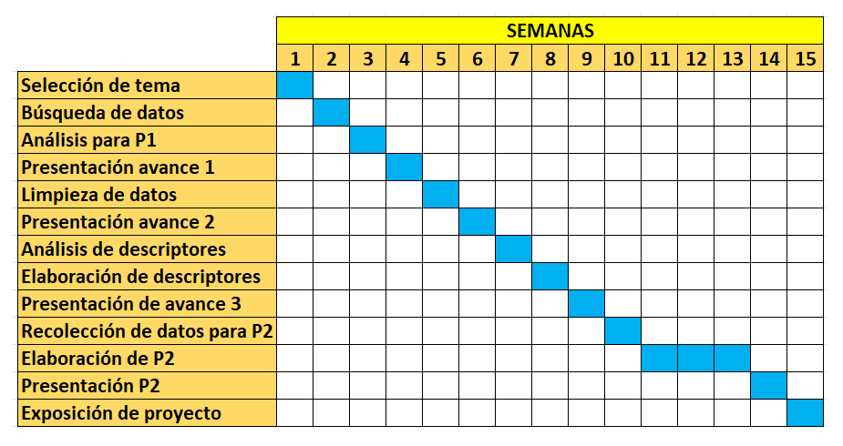

# **Introducción**

## **Relevancia**

Estudiar el estado nutricional de los niños y niñas de 12 a 36 meses en la provincia de Huamanga en el año 2022 es importante porque genera información relevante para entender y abordar los problemas relacionados con la nutrición infantil. Asimismo, identificar posibles deficiencias nutricionales en esta población es motivo de preocupación, ya que la precariedad del estado nutricional se evidencia en la presencia de diferentes tipos de condiciones de peso, como el bajo peso, el sobrepeso, obesidad o la desnutrición. Estas condiciones pueden tener consecuencias negativas a largo plazo en la salud y el bienestar de los niños y niñas, por lo que es vital identificar y abordar cualquier problema de desnutrición.

## **Objetivos**

### **Objetivo general**

Describir el estado nutricional de niños y niñas de 12 a 36 meses de edad en la provincia de Huamanga en el año 2022.

### **Objetivos específicos**

**-** Determinar la relación de la hemoglobina con la edad de niños y niñas de 12 a 36 meses de edad, en la provincia de Huamanga en el año 2022.

**-** Determinar el índice de masa corporal de niños y niñas de 12 a 36 meses de edad, en la provincia de Huamanga en el año 2022.

**-** Determinar la cantidad de niños y niñas de 12 a 36 meses de edad, que pertenecen a los programas sociales (SIS, Qali Warma y Juntos), en la provincia de Huamanga en el año 2022.

**-** Determinar los centros de salud en los cuales fueron atendidos la mayor cantidad de niños y niñas de 12 a 36 meses edad, según su sexo en la provincia de Huamanga en el año 2022.

**-** Comparar y analizar el estado nutricional de niños y niñas de 12 a 36 meses de edad, con los tres distritos más destacados en la provincia de Huamanga en el año 2022.

**-** Identificar y calcular las probabilidades empíricas y condicionales, determinando eventos atómicos.

**-** Analizar y definir dos variables aleatorias discretas y desarrollar casos de probabilidad con la distribución elegida.

**-** Analizar y definir dos variables continuas para determinar la distribución que presenta y realizar casos aplicativos en cada modelo.


## **Planificación**

El proyecto se planificó en base a el silabo y a las indicaciones en clase.

{witd="80%"}

## **Contexto**

La provincia de Huamanga, ubicada en la región de Ayacucho en Perú, alberga una población significativa de niños y niñas en el rango de edad de 12 a 36 meses. Esta etapa temprana de la vida es crítica para el desarrollo físico y cognitivo óptimo de los niños y establece las bases para su salud y bienestar en el futuro. Sin embargo, diversos factores económicos y sociales influyen en el estado nutricional de los niños. Desde el punto de vista económico, Huamanga se caracteriza por tener una tasa de pobreza alta, lo que limita el acceso a alimentos nutritivos y servicios de salud adecuados. Además, es importante considerar los programas sociales existentes en la provincia de Huamanga, como SIS ,Qali Warma y Juntos, que tienen como objetivo brindar apoyo y asistencia a las familias en situación de vulnerabilidad. Estos programas pueden desempeñar un papel importante en el estado nutricional de los niños y niñas, ya sea a través de la provisión de alimentos o el acceso a servicios de salud y educación. Comprender este contexto es fundamental para diseñar intervenciones efectivas y estrategias de mejora del estado nutricional en esta población.

# **Datos**

## **Proceso de recolección de datos**

Para la recolección de datos, se consultó al docente las fuentes de las cuales podríamos extraer una base de datos necesario para nuestro tema, debido a que se decidió trabajar con una base de datos. El motivo por el cuál elegimos una base de datos fue para obtener más datos confiables y además requiere menos tiempo en comparación a una encuesta.

## **Población, muestra y muestreo**

**Población:** Los niños del departamento de Ayacucho.

**Unidad muestral:** Niños de 12 a 36 meses de edad en la provincia de Huamanga.

**Tipo de muestreo:** El tipo de muestreo es no probabilístico, debido a que la elección de los datos es por conveniencia al tener una data el cual faltan datos en algunas observaciones.

## **Variables**

```{r, echo=FALSE}
V= c("Distrito", "Sexo", "Edad", "CentroDeSalud", "Juntos", "SIS", "Qaliwarma", "Peso", "Estatura", "PTZ", "ZTE", "ZPE", "Dx_PT", "Dx_TE", "Dx_PE", "Hemoglobina", "IMC")

TV = c("Categórica nominal", "Categórica nominal", "Numérica discreta", "Categórica nominal", "Categórica nominal", "Categórica nominal", "Categórica nominal", "Numérica continua", "Numérica continua", "Numérica Continua", "Numérica continua", "Numérica continua", "Categórica ordinal", "Categórica ordinal", "Categórica ordinal", "Numérica continua", "Numérica continua")

R = c("Distritos de la provincia estudiada", "Sexo biológico", "Número entero mayor igual a 12 y menor igual a 36", "Centros de Salud de la provincia estudiada", "Programa social", "Programa de salud", "Programa social", "Valor decimal positivo medido en kilogramos", "Valor decimal positivo medido en centímetros", "Número decimal negativo o positivo", "Número decimal negativo o positivo", "Número decimal negativo o positivo", "","","", "Valor decimal positivo", "Valor decimal positivo")

Tabla_de_variable = data.frame(V,TV,R)
Tabla_de_variable
```

## **Limpieza de base de datos**

```{r, echo=FALSE}
# Instalar paquetes 
#install.packages(c("readr", "dplyr", "modeest", "DescTools", "ggplot2", "stringi", "car", "plotrix", "knitr", "kableExtra", "boot", "remotes","MASS","moments"))
```


```{r, echo=FALSE}
library(readr)
library(dplyr)
library(modeest)
library(DescTools)
library(ggplot2)
library(stringi)
library(car)
library(plotrix)
library(knitr)
library(kableExtra)
library(boot)
library(remotes)
library(MASS)
library(moments)
```


En este caso el archivo **csv** que se descargó con el nombre de **baseD**, ya se encuentra limpio y se asignó un nombre más fácil de utilizar, que será **"D"**.

```{r}
D1 <- read_csv("baseD.csv")
D<-D1
B <- D[, c(6,7,9)]
```


# **Análisis Descriptivo**

```{r,echo=FALSE}
media <- round(mean(D$Peso), 2)
mediana <- median(D$Peso)

titulo <- "Gráfica 1. Histograma de Peso"
subtitulo <- paste("Media =", media, "Mediana =", mediana)

ggplot(data = D, aes(x = Peso)) +
  geom_histogram(binwidth = 0.5, fill = "steelblue", color = "white") +
  ggtitle(titulo, subtitle = subtitulo) +
  xlab('Peso (Kg)') + ylab('Frecuencia') +
  geom_vline(aes(xintercept = media, color = "Media"),
             linetype = "dashed", size = 1) +
  geom_vline(aes(xintercept = mediana, color = "Mediana"),
             linetype = "dashed", size = 1) +
  scale_color_manual(values = c("yellow", "red"),
                     labels = c("Media", "Mediana")) +
  guides(color = guide_legend(title = "Líneas"))
```
El histograma de Peso tiende a formar un campana. Además, se observa que la media y mediana de Peso es similar; es decir es aproximadamente simétrico. Por lo tanto, es necesario analizar esta variable si presenta una distribución Normal.


```{r}
summary(D$Peso)
```

```{r, echo=FALSE}
media <- round(mean(D$IMC), 2)
mediana <- median(D$IMC)

titulo <- "Gráfica 2. Histograma del Indice de Masa Corporal(IMC)"
subtitulo <- paste("Media =", media, "Mediana =", mediana)

ggplot(data = D, aes(x = IMC)) +
  geom_histogram(binwidth = 0.5, fill = "skyblue", color = "white") +
  ggtitle(titulo, subtitle = subtitulo) +
  xlab('IMC') + ylab('Frecuencia') +
  geom_vline(aes(xintercept = media, color = "Media"),
             linetype = "dashed", size = 1) +
  geom_vline(aes(xintercept = mediana, color = "Mediana"),
             linetype = "dashed", size = 1) +
  scale_color_manual(values = c("orange", "black"),
                     labels = c("Media", "Mediana"))# +geom_density(color = "red", size = 1)
```

El histograma de IMC tiende a formar un cola hacia la derecha; es decir sesgada a la derecha aproximadamente. Además, se observa que la media y mediana de IMC es similar.Por lo tanto, es necesario analizar esta variable si presenta o se acerca a alguna distribución continua.


```{r}
summary(D$IMC)
```


El histograma de Índice de masa corporal de los niños presentó una distribución simétrica, con una **media** de 16.43 y una **mediana** de 16.338. Lo cual indica que la distribución de los valores del IMC se equilibra a ambos lados de la media y que no hay un sesgo evidente. Es decir, que no hay una inclinación hacia uno de los extremos.

**PTZ: Índice que compara el peso del menor con el peso esperado para su talla y permite establecer si ha ocurrido una pérdida/ganancia de peso corporal.**

Rango para Bajo Peso en PTZ = [-4.780, -2.010]

Rango para Normal en PTZ = [-1.980, 2.000]

Rango para Sobrepeso en PTZ = [2.010, 2.960]

Rango para Obesidad en PTZ =[3.020,4.540]

```{r, echo=FALSE}
data <- data.frame(
  Categorias = c("Bajo Peso", "Normal", "Sobrepeso", "Obesidad"),
  Variable = c("PTZ", "PTZ", "PTZ", "PTZ", "ZTE", "ZTE", "ZPE", "ZPE"),
  Rango_Inferior = c(-4.780, -1.980, 2.010, 3.020),
  Rango_Superior = c(-2.010, 2.000, 2.960, 4.540)
)

orden_PTZ <- c("Bajo Peso", "Normal", "Sobrepeso", "Obesidad")

data$Categorias <- factor(data$Categorias, levels = unique(c(orden_PTZ)))
```


```{r, echo=FALSE}
grafico_PTZ <- ggplot(data[data$Variable == "PTZ", ], aes(x = Categorias, y = Rango_Superior)) +
  geom_point(aes(color = Variable), size = 3) +
  geom_line(aes(group = Variable, color = Variable), size = 1) +
  geom_errorbar(aes(ymin = Rango_Inferior, ymax = Rango_Superior, color = Variable), width = 0.2) +
  labs(x = "Categorías", y = "Valor", title = "Gráfica 3. Rangos y Categorías - PTZ") +
  scale_color_manual(values = c("blue")) +
  theme_minimal()
print(grafico_PTZ)
```
Este gráfico de puntas representa el intervalo del índice de Peso y Talla de cada categoría de Peso en un niño.


```{r, echo=FALSE}
par(mar = c(1.7, 8, 0.45, 3) + 0.1)
mosaicplot(D$Dx_PT ~ D$Sexo,
           col = 2:5,
           main = "Gráfica 4. Niveles de peso para la talla esperada según sexo",
           xlab = "Nivel",
           ylab = "Sexo",
           cex.axis = 1,
           as = 1,
           las = 2)
```
Al observar la gráfica de mosaico que representa la condición del peso de acuerdo a la talla esperada de los niños, se puede notar que la gran mayoría se encuentra en la categoría de peso normal. En contraste, las barras correspondientes a las categorías de sobrepeso, obesidad y bajo peso son mucho más bajas, lo que sugiere que estas condiciones son menos comunes en la población estudiada.


```{r, echo=FALSE}

# Crear los intervalos de edad
intervalos <- seq(12, 36, by = 6)

# Asignar los intervalos a las edades
D1$Edad_intervalo <- cut(D1$Edad, intervalos, include.lowest = TRUE)

# Crear el gráfico
ggplot(D1, aes(x = Edad_intervalo, fill = Sexo)) +
  geom_bar(position = "dodge", stat = "count") +
  labs(x = "Edad", y = "Cantidad de Niños", fill = "Sexo") +
  ggtitle("                             Gráfica 5.Cantidad de Niños por Edad y Sexo")
```
Se observa que la cantidad de niños y niñas es similar en los rangos de edades establecidos.


```{r, echo=FALSE}
conteo_programas <- colSums(B == "1")  # "A" representa la categoría del programa
colores <- c("blue", "red", "orange")
bp1<- barplot(conteo_programas,col=colores, xlab = "Programas Sociales", ylab = "Cantidad de Niños",main = "Gráfica 6. Cantidad de niños que pertenecen a un programa social",ylim= c(0,7000))
text(bp1, conteo_programas, labels = conteo_programas, pos = 3, cex = 1)
```
El programa social con más participación es **SIS**. En segundo lugar, el programa **Juntos** y finalmente el **Qaliwarma**. 

# **Análisis Probabilístico**

## **Probabilidad empirica**

Variables ===> PTZ(DX_PT)

**PTZ: Índice que compara el peso del menor con el peso esperado para su talla y permite establecer si ha ocurrido una pérdida/ganancia de peso corporal.** **DX_PT : Diagnóstico del PTZ ( Bajo Peso, Normal, Obesidad, Sobrepeso)**

1.  **Criterios de Evaluación basado en el PTZ de los niños**.

Rango para Bajo Peso en PTZ = [-4.780, -2.010]

Rango para Normal en PTZ = [-1.980, 2.000]

Rango para Sobrepeso en PTZ = [2.010, 2.960]

Rango para Obesidad en PTZ =[3.020,4.540]

```{r}
table(D1$Dx_PT)
```

| Bajo Peso | Normal | Obesidad | Sobrepeso | Total |
|-----------|--------|----------|-----------|-------|
| 50        | 6167   | 29       | 145       | 6391  |

**Experimento A:** Se selecciona aleatoriamente a un niño del estudio y se observa su índice que compara el peso del menor con el peso esperado para su talla.

Espacio Muestral:
$$\Omega = \{ Bajo Peso, Normal ,Obesidad, Sobrepeso\}$$

**Eventos Atómicos**
A1 = Seleccionar a un niño que tenga un diagnóstico de Bajo Peso.
A2 = Seleccionar a un niño que tenga un diagnóstico Normal.
A3 = Seleccionar a un niño que tenga un diagnóstico de Sobrepeso.
A4 = Seleccionar a un niño que tenga un diagnóstico de Obesidad.


**Probabilidades de cada Evento**
Se utiliza la siguiente forma 
*Enfoque clásico* 
$$P(A) = \frac{N(A)}{N(\Omega)}$$
donde:
**N(A):** Número de Sucesos del evento A 
**N(**$\Omega$):Número de sucesos del espacio muestral

*Enfoque de Frecuencia Relativa* 
$$P(A) = \frac{f(A)}{n}$$ 
donde:
**f(A)**: Frecuencia Absoluta de A 
**n**: Número de Observaciones

Probabilidad del evento A1: 
$$ P(A_1) = \frac{50}{6391} = 0.0078 $$

Probabilidad del evento A2: 
$$ P(A_2) = \frac{6167}{6391} = 0.9649 $$

Probabilidad del evento A3: 
$$ P(A_3) = \frac{29}{6391} = 0.0045 $$

Probabilidad del evento A4: 
$$ P(A_4) = \frac{145}{6391} = 0.0227 $$

Variable 2 ===> Programa Sociales

**Criterio** : Niños que pertenecen a algún tipo de Programa Social

```{r}
cbind(SIS = table(D$SIS), JUNTOS = table(D$Juntos), Qaliwarma = table(D$Qaliwarma))
```

| Programa Social | SIS  | JUNTOS | QALIWARMA |
|-----------------|------|--------|-----------|
| NO              | 246  | 5292   | 6383      |
| SI              | 6145 | 1099   | 8         |

**Experimento E :** Se selecciona aleatoriamente un niño del estudio y se observa en que tipo de programa social participa.

Espacio Muestral: 
$$\Omega_{\text{Resultados}} = \{SIS, Juntos, Qaliwarma\}$$ 
**Evento Atómicos** 
E1 = Seleccionar a un niño que participe en el programa social **SIS**. 
E2 = Seleccionar a un niño que participe en el programa social **Juntos**.
E3 = Seleccionar a un niño que participe en el programa social **Qaliwarma**.


**Probabilidades - Enfoque de Frecuencia Relativa** 
$$P(A) = \frac{f(E)}{n}$$ 
donde:
**f(A)**: Frecuencia Absoluta de E: Cantidad de niños que participan en programas sociales. 
**n**: Número de Observaciones


Probabilidad del evento E1: 
$$ P(E_1) = \frac{6145}{6391} = 0.9615$$

Probabilidad del evento E2: 
$$ P(E_2) = \frac{1099}{6391} = 0.1719 $$

Probabilidad del evento E3: 
$$ P(E_3) = \frac{8}{6391} = 0.0012 $$

## **Probabilidad condicional**

**Eventos Independientes**

Tabla de contingencia:

| EDAD        | Normal | Complemento | TOTAL |
|-------------|--------|-------------|-------|
| [18-24[     | 1433   | 58          | 1491  |
| Complemento | 4734   | 166         | 4900  |
| **TOTAL**   | 6167   | 224         | 6391  |


**EVENTOS** 
A <- Seleccionar a un niño que tenga un diagnostico Normal. 
B <- Seleccionar a un niño que tenga entre 18 y 24 meses de edad.

Verificar si los eventos A y B son independientes
$$P(A \cap B)=P(A)*P(B)$$

Probabilidad de **A**
$$ P(A) = \frac{6167}{6391} = 0.96$$

Probabilidad de **B**
$$ P(B) = \frac{1491}{6391} = 0.23$$

Probabilidad de **A intersección B**
$$P(A \cap B)=\frac{1433}{6391} = 0.22$$

Probabilidad de **A** por Probabilidad de **B**
$$P(A)*P(B)=0.96*0.23=0.22$$

Entonces se puede decir que los eventos A y B son Independientes 
$$P(A \cap B)\approx{}P(A)*P(B)$$


a) ¿Cuál es la probabilidad de que el niño seleccionado aleatoriamente tenga diagnóstico normal dado que se encuentre entre 18 y 24 meses de edad?
$$P(A/B) = P(A)$$
```{r}
P_A <- (6167/6391)
round(P_A,2)
```
$$P(A/B) = 0.96$$
La probabilidad de que un niño seleccionado aleatoriamente tenga diagnostico normal dado que se encuentre entre 18 y 24 meses de edad es de 96%.


b) ¿Cuál es la probabilidad de que un niño seleccionado aleatoriamente se encuentre entre 18 y 24 meses de edad dado que tenga un diagnostico Normal?
$$P(B/A) = P(B)$$
```{r}
P_B <- (1491/6391)
round(P_B,2)
```
$$P(B/A) = 0.23$$
La probabilidad de que un niño seleccionado aleatoriamente se encuentre entre 18 y 24 meses de edad dado que tenga un diagnostico Normal es de 23%.


c) ¿Cuál es la probabilidad de que un niño seleccionado aleatoriamente se encuentre entre 18 y 24 meses de edad **o** tenga un diagnóstico Normal? 
$$P(A \cup B ) = P(A) + P(B) - P(A)*P(B)$$

```{r}
P_C<- (0.96+0.23)-(0.96*0.23)
round(P_C,2)
```
$$P(A \cup B ) = (0.96+0.23)-(0.96*0.23)=0.97$$
La probabilidad de que un niño seleccionado aleatoriamente se encuentre entre 18 y 24 meses de edad **o** tenga un diagnóstico Normal es de 97%.


**Eventos Dependientes** 

Tabla de contingencia

|                        | IMC menor al promedio | IMC mayor al promedio | TOTAL |
|------------------------|-----------------------|-----------------------|-------|
| Peso menor al promedio | 2025                  | 1335                  | 3360  |
| Peso mayor al promedio | 1390                  | 1641                  | 3031  |
| **TOTAL**              | 3415                  | 2976                  | 6391  |

**EVENTOS**

A <- Seleccionar un niño que tenga un Peso mayor al valor promedio. 
B <- Seleccionar un niño que tenga un IMC mayor al valor promedio.

Verificar si los eventos A y B son dependientes.

Probabilidad de **A**
$$ P(A) = \frac{3031}{6391} = 0.47$$

Probabilidad de **B**
$$ P(B) = \frac{2976}{6391} = 0.47$$

Probabilidad de **A intersección B**
$$P(A \cap B) = \frac{1641}{6391} = 0.26$$

Probabilidad de **A** por Probabilidad de **B**
$$P(A)*P(B)=0.47*0.47=0.22$$ 

$$P(A \cap B) != P(A)*P(B) => 0.26!=0.22$$
Como los valores no son iguales, entonces los eventos son dependientes.


a)  ¿Cuál es la probabilidad de que el menor seleccionado presente un Peso mayor al valor promedio del peso dado que presenta un IMC mayor al valor promedio del IMC  ?

Planteamos lo siguiente:
$$P(A/B) = \frac{P(A \cap B)}{P(B)}$$
Se tiene los datos hallados anteriormente:

$$P(A \cap B) = 0.26$$
$$ P(B) = \frac{2976}{6391} = 0.47$$

$$P(A/B) = \frac{0.26}{0.47} = 0.55$$

La probabilidad de seleccionar un niño que presenta un IMC mayor al valor promedio del IMC dado que tiene un peso mayor a su valor promedio es del 55%.


b) ¿Cuál es la probabilidad de que el menor seleccionado presenta un IMC mayor al valor promedio del IMC dado que tiene un peso mayor al valor promedio del peso?

Teorema de bayes
$$P(B/A) = \frac{P(A/B)*P(B)}{P(A)}$$

Datos obtenidos anteriormente:

$$P(A/B) = 0.55$$
$$ P(A) = \frac{2976}{6391} = 0.47$$
```{r}
Ptb <- round(2976/6391,2)
Ptb
```
$$ P(B) = \frac{2976}{6391} = 0.47$$

$$P(B/A) = \frac{0.55*0.47}{0.47} = 0.55$$
La probabilidad de seleccionar un niño que presenta un IMC mayor al valor promedio del IMC dado que tiene un peso mayor al valor promedio del peso, es del 55%.


## **Variables aleatorias discretas**

**1.Analizar una Distribución Binomial**

Criterios :

Los eventos son independientes. Cada niño de la muestra tiene una probabilidad constante de presentar sobrepeso, y el diagnóstico de un niño no afecta el diagnóstico de otros niños.

La probabilidad de éxito es constante. La probabilidad de que un niño presente sobrepeso es la misma para todos los niños de la muestra.

El tamaño de la muestra es fijo. La muestra de 6391 niños es fija.

$$X \sim B(n,p)$$
*Donde :*

p = Probabilidad de éxito
n = Tamaño de la muestra


**2. Variable aleatoria **

 $X$ : Número de niños de la Provincia Huamanga que presentan un diagnóstisco de Sobrepeso en el año 2022 de una muestra de 6391 niños.
 

**3. Identificar Parámetros **

E : Seleccionar un niño de la Provincia Huamanga que se ha diagnosticado con Sobrepeso.
n : Tamaño de la población

```{r}
a<-nrow(filter(D,Dx_PT=="Sobrepeso"))
n<-nrow(D)
round(a/n,5)
```
$$P(E) : \frac{f(a)}{n} = \frac{145}{6391} = 0.02269 $$
Por lo tanto la probabilidad de éxito es : $p= 0.02269$

**4. Construir la función de masa de probabilidad**
$$dbinom(0:n,p,n)$$
```{r, echo=FALSE}
x <- 100:200
prob <- dbinom(x, size = 6391, prob = 0.02269)
plot(x, prob, type = "h", lwd = 2, col = "blue",
     xlab = "Número de niños con sobrepeso",
     ylab = "Probabilidad",
     main = "Gráfica 7. Función de Masa de Probabilidad Binomial")
```
Cada bastón representa la probabilidad en una cantidad exacta de niños. La probabilidad acumulada es la unidad - **1**.

**Gráfica de los 145 niños que fueron diagnosticado con Sobrepeso**

```{r, echo=FALSE}
x <- 0:145
prob <- dbinom(x, size = 145, prob = 0.02269)
plot(x, prob, type = "h", lwd = 2, col = "blue",
     xlab = "Número de niños con sobrepeso",
     ylab = "Probabilidad",
     main = "Gráfica 8. Función de Masa de Probabilidad Binomial")
```

**5.Validar las Probabilidades**

Calculando el Valor esperado $E(X)$
$$E(X)=np$$
Por lo tanto 
$E(X)=6391*0.02269 = 145.01$

Calculando la Varianza $Var(X)$
$$Var(X)=np(1-p)$$
Por lo tanto $Var(X)=6391*0.02269*(1-0.02269)= 141.72$

Calculando la desviación estándar $sd$
$$\text{sd} = \sqrt{\text{Var}(X)}$$
La desviación estándar $sd$ es 11.9

Calculando el coeficiente de Variabilidad
$$CV= \frac{sd(X)}{E(X)}=\frac{11.9}{145.01}=0.082$$
El coeficiente de variabilidad $(CV)$ es 0.082 lo que indica que tiene una baja variabilidad.

**6. Casos aplicativos**

$Ejemplo 1$
Una compañía de Salud sabe que la probabilidad de identificar un niño de la Provincia Huamanga que se ha diagnosticado con Sobrepeso es igual a 2.269%. Si la compañía de Salud selecciona una muestra con reemplazo o con reposición de 6391 niños de la provincia de Huamanga.

a) ¿Cuál es la probabilidad de que exactamente 150 niños presenten Sobrepeso?

$Solución$

$P(X=50)$
```{r}
round(dbinom(150,6391,0.02269),2)
```
$$dbinom(150,6391,0.02269)= 0.03$$
La probabilidad de que exactamente 150 niños presenten sobrepeso es de 3%

$Ejemplo 2$
Supongamos que el Ministerio de Salud está realizando un experimento en un laboratorio para probar un nuevo medicamento. Se ha demostrado que los niños que presentan Sobrepeso tienen una tasa de éxito del 2.269% en el tratamiento de una enfermedad específica. Decides seleccionar al azar a 6391 niños que sufren de esta enfermedad y administrarles el medicamento.

b) ¿Cuál es la probabilidad de que más de 145 niños tratados con el medicamento experimenten mejoría?

$Solución$
$P(X>100)$
```{r}
round(1-pbinom(145,6391,0.02269),2)
```
$$1-pbinom(145,6391,0.02269)= 0.48$$
La probabilidad de que más de 145 niños tratados con el medicamento experimenten mejoría es de 48%


**1.Analizar una Distribución Poisson**

Criterios :

Eventos discretos y aleatorios: La distribución de Poisson se utiliza para modelar eventos discretos que ocurren de forma aleatoria en un intervalo de tiempo o espacio. En este caso,el número de niños con sobrepeso en la muestra se ajuste a esta descripción.

Tasa promedio constante: La distribución de Poisson asume que la tasa promedio de eventos es constante en el intervalo de tiempo o espacio considerado. En este caso, la tasa promedio sería el número promedio de niños con sobrepeso por niño en la muestra.

$$X \sim P(\lambda)$$

**2. Variable aleatoria** : 
 $X$ : Número de niños de la Provincia Huamanga que presentan un diagnóstisco de Sobrepeso en el año 2022 de una muestra de 6391 niños.
 

**3. Identificar Parámetros **
$\lambda$ = Cantidad promedio de niños con sobrepeso por niño en la muestra.


```{r}
a<-nrow(filter(D,Dx_PT=="Sobrepeso"))
n<-nrow(D)
round(a/n,5)
```

$$\lambda : \frac{f(a)}{n} = \frac{145}{6391} = 0.02269 $$
Por lo tanto la tasa promedio de niños con sobrepeso por niño en la muestra : $p= 0.02269$

**4. Construir la función de masa de probabilidad**
$$dpois(0:n,\lambda)$$


```{r, echo=FALSE}
# Datos proporcionados
tasa <- 0.0227
muestra <- 500
ninos_sobrepeso <- 145

# Cálculo de la distribución de Poisson
x <- 0:muestra
poisson <- dpois(x, tasa * muestra)

barplot(poisson, names.arg = x, xlab = "Número de niños con sobrepeso", ylab = "Probabilidad",
        main = " Gráfico 9. Distribución de Poisson vs. Datos observados")
abline(v = ninos_sobrepeso + 0.5, col = "red", lwd = 2)
legend("topright", legend = c("Distribución de Poisson", "Datos observados"),
       col = c("black", "red"), lwd = c(1, 2), bty = "n")
```


Cada bastón representa la probabilidad en una cantidad exacta de niños. La probabilidad acumulada es la unidad - **1**.

**5.Validar las Probabilidadess**

Valor esperado $E(X)$
$$E(X)=\lambda$$
Por lo tanto $E(X)=0.02269$

Varianza $Var(X)$
$$Var(X)=\lambda$$
Por lo tanto $Var(X)=0.02269$

Desviación estándar $sd$
$$\text{sd} = \sqrt{\text{Var}(X)} = \sqrt{0.02269}$$
La desviación estándar $sd$ es 0.150632

Calculando el coeficiente de Variabilidad
$$CV= \frac{E(X)}{sd(X)} = \frac{0.02269}{0.150632}$$
El coeficiente de variabilidad $(CV)$ es 0.1506

**6. Casos Aplicativos**

$Ejemplo 1$
Luego de una Charla de Nutrición por parte de ESSALUD en la Provincia de Huamanga. Se propone calcular la probabilidad de que haya 3 niños con Sobrepeso (k=3) sabiendo que la la tasa promedio de niños con sobrepeso en la Provincia Huamanga en el año 2022, basada en la muestra de 6391 niños, es de 2.2269% niños con sobrepeso por niño.

$Solución$
$P(X=20)$
```{r}
dpois(3,0.02269)
```

a) La probabilidad de que la cantidad de niños con Sobrepeso sean mayor a 3, pero no mayor a 12 niños.
$Solución$
$P(3<X<12)$
$ppois(11,0.02269)-ppois(3,0.00269)$

```{r}
ppois(11,0.02269) -ppois(3,0.02269)
```

## **Variables aleatorias continuas**

**Distribución Normal**

**1.Identificar Gráficamente**

```{r, echo=FALSE}
plot(density(D$Peso), main = " Gráfico 10. de Densidad - Peso", xlab = "Valor", ylab = "Densidad")
```

De acuerdo al gráfico 1, la variable peso tiende a formar un campana en su histograma.

```{r, echo=FALSE}
# Crear el gráfico QQ-plot para la variable "Peso" en la base de datos "D"
qqnorm(D$Peso, main = "Gráfico 11.  QQ-plot - Variable Peso")

# Agregar la línea de referencia de la distribución normal
qqline(D$Peso, datax = FALSE, col = "red")

# Mostrar el gráfico
```
Los puntos se acercan a linealizarse a la recta - Por lo tanto, se acerca a una distribución Normal.

**2.Validar**

$$\bar{X}\approx{Me}$$

```{r}
mean(D$Peso)
median(D$Peso)
```


```{r}
asimetría <- skewness(D$Peso)
# Imprimir resultados
cat("Asimetría: ", asimetría, "\n")
```

$$Var(X)= sd^2$$

```{r}
Var(D$Peso)
sd(D$Peso)^2
```

$$E(X) = \bar{X}$$

```{r}
mean(D$Peso)
```

Se considera a la variable continua Peso como una posible distribución normal.

**3.Parámetros** 
$$X \sim N(\mu,\sigma)$$ 
Donde:

$$E(X)=\mu$$
$$Var(X)=\sigma^2$$

$\mu$ 
$\bar X$ 
$\sigma= sd$

**4. Casos Aplicativos**

$Ejemplo 1$

Un grupo de estudiantes de UTEC han realizado un estudio sobre el peso de niños y niñas de 12 a 36 meses en la provincia de Huamanga, Perú, durante el año 2022. Los datos recopilados de 6391 niños y niñas indican que la media de los pesos es de 11.24681 y la varianza es de 3.433598. 

a) Si se selecciona un niño al azar ¿Cuál es la probabilidad de que pese menos de 10 kg?

$$(P(X<10)=P(X≤10))$$

```{r}
round(pnorm(10, mean(D$Peso), var(D$Peso)),4)
```

b) ¿Cuál es la probabilidad de que pese por lo menos 8 kg?

```{r}
round(1-pnorm(8, mean(D$Peso), var(D$Peso)),2)
```
$Ejemplo 2$

Un equipo de investigación está realizando un estudio sobre el peso de niños y niñas de 12 a 36 meses en la provincia de Huamanga en el año 2020, Perú. El objetivo del estudio es evaluar el estado nutricional de los niños y niñas en relación a la media del peso esperado para esa edad.
Después de recopilar los datos de peso de una muestra representativa de la población infantil, los investigadores encuentran que la media del peso de los niños y niñas es de 11.24681 kg y la desviación típica de 1.852997. 

a) ¿Cuál es la probabilidad  de que los niños pesen más de 10 y menos de 19 kg? 
$$P(X≤19)-P(X≤10)=P(X<19)-P(X<10)$$
```{r}
mu <- 11.24681
sigma <- 1.852997
pnorm(19, mu, sigma) - pnorm(10, mu, sigma)
```


**Distribución Gamma**

**1. Verificar si está sesgada hacia la derecha**

Criterios

**Variables positivas:** La distribución gamma se utiliza para modelar variables que toman valores positivos. Por lo tanto, es importante que la variable en estudio no tenga valores negativos.
**Asimetría positiva:** La distribución gamma es asimétrica y sesgada hacia la derecha. Esto significa que la cola de la distribución se extiende hacia los valores más altos. Por lo tanto, si tus datos muestran una asimetría positiva, es posible que una distribución gamma sea apropiada.
**Cola larga:** La distribución gamma tiene una cola larga hacia los valores más altos. Esto significa que la probabilidad de observar valores extremos o inusualmente altos es relativamente alta en comparación con otras distribuciones, como la distribución normal.


**Identificar Gráficamente**

```{r, echo=FALSE}
library(ggplot2)
shape <- 2
rate <- 1
x <- seq(9.993, 25.306, length.out = 100)
y <- dgamma(x, shape = shape, rate = rate)
ggplot(data = NULL, aes(x = x, y = y)) +
  geom_line(color = "blue", size = 1) +
  labs(x = "IMC", y = "Densidad de Probabilidad", title = " Gráfica 12. Distribución Gamma para IMC")
```

De acuerdo a la gráfica 2.El histograma del IMC presenta un desplazamiento hacia la cola derecha del gráfico.

**2.Validar**

```{r}
round(mean(D$IMC),3)
round(median(D$IMC),3)
```


```{r}
asimetría <- skewness(D$Peso)
cat("Asimetría: ", asimetría, "\n")
```

Ligeramente asimétrico hacia la derecha, pero se **asume** una posible distribución gamma para el análisis de este estudio.

**3.Parámetros**

$$X\sim Gamma(\alpha,\beta)$$

**4.Parámetro de forma**

```{r}
fit <- fitdistr(D$IMC, "gamma")
shape <- fit$estimate["shape"]
print(shape)
```

**5.Parámetro de Escala**
```{r}
fit <- fitdistr(D$IMC, "gamma")
scale <- 1 / fit$estimate["rate"]
print(scale)
```
Por lo tanto
$$\alpha=147.72 ... \beta=0.11$$
Donde
$\alpha=Parámetro de Forma$
$\beta=Parámetro de Escala$

Valor esperado : 
$$E(X)=\alpha\beta$$
Por lo tanto $E(X)=147.72*0.11 = 16.24924$
```{r}
mean(D$IMC)
```


Varianza :
$$Var(X)=\alpha\beta^2$$
Por lo tanto $Var(X)=147.72*0.11^2=1.7874$

```{r}
var(D$IMC)
```

**6.Casos Aplicativos**

$Ejemplo 1$

Se realiza un estudio de salud en una población de niños y está interesado en analizar la probabilidad de que un niños tenga un IMC (Índice de Masa Corporal) en un cierto rango. Calcular la probabilidad de que un niño seleccionado al azar de esta población tenga un IMC en el rango de 20 a 25.Basándote en tus datos y análisis, haz estimado que los parámetros de forma y escala de la distribución gamma son aproximadamente 147.72 y 0.111, respectivamente.

$Solución$
$$X \sim Gamma(\alpha=147.72,\beta=0.111)$$
pide $P(20<=X<25)$
$$pgamma(25,\alpha,\beta^-1) -pgamma(20,\alpha,\beta^-1)$$
```{r}
round(pgamma(25,147.72,1/0.111)-pgamma(20,147.72,1/0.111),4)
```
Luego, calcular la Probabilidad de que un niño seleccionado al azar de esta población tenga un IMC no mayor a 20, Si se mantiene constante los parámetros del ítem anterior.

$Solución$
Piden $P(X<=20)$
$$Pgamma(24,\alpha,\beta)$$
```{r}
round(pgamma(20,147.72,1/0.111),4)
```


# **Conclusiones**

El promedio del indice de masa corporal de los niños es 16.43. Además, las niñas presentan un IMC mayor en comparación de los niños.

La cantidad total de niños que participan en los programas sociales Juntos, SIS Y Qaliwarma son 1099, 6145 y 8 respectivamente. Donde el programa SIS resalta por la mayor cantidad de participación tanto de niñas y niños.

El estado nutricional de niños se encuentran en la categoría de peso normal. En contraste, las categorías de sobrepeso, obesidad y bajo peso son mucho más bajas.

Se realizó las probabilidades empíricas y condicionales de diferentes eventos atómicos contextualizados en el estudio del Estado nutricional de la Provincia de Huamanga 2022.

Se identificó dos variables aleatorias discretas, así como la distribución de probabilidad que les representa y el cálculo de diversos casos aplicativos. Además, se clasificó a dos variables continuas en una posible y cercana distribución probabilística de acuerdo a los parámetros identificados, así como ejemplos aplicativos para el cálculo de sus probabilidades.
