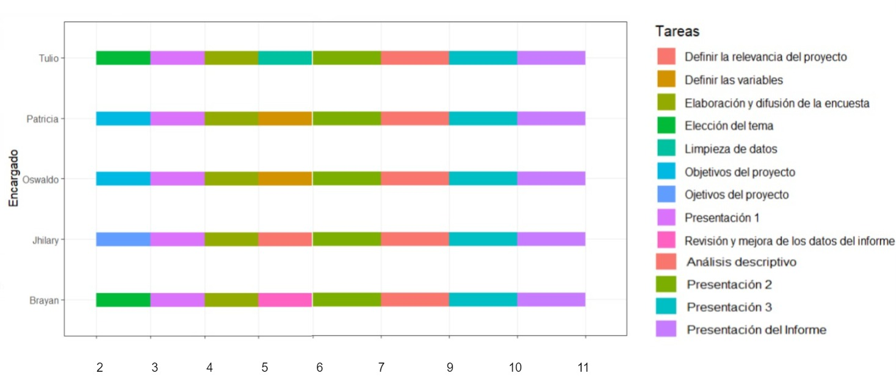

# Introducción

## Relevancia
La relevancia del tema busca facilitar información a diversos grupos que se interesen en describir la relación entre las horas que los estudiantes de UTEC invirtieron en las actividades extracurriculares en el ciclo 2022-2 y sus rendimientos académicos o, si el caso, hacer comparaciones con otros temas similares.

## Objetivos

**Objetivo General**

Analizar la relación entre las actividades que realizan los estudiantes de la UTEC en el ciclo 2022-2 y el rendimiento académico, con la finalidad de identificar si las actividades influyen en el rendimiento académico de forma positiva o negativa.

**Objetivos Específicos**

* Identificar las actividades extracurriculares más populares que los estudiantes de UTEC del ciclo 2022-2 realizaban y cuánto tiempo dedicaron a cada una.

* Identificar las herramientas que los estudiantes de UTEC del ciclo 2022-2 utilizaban para manejar su tiempo y equilibrar sus actividades.

* Determinar el desempeño en clase que mostraron los estudiantes de UTEC del ciclo 2022-2 en base a su tiempo de estudio, descanso y ocio.

* Comparar el rendimiento académico de los estudiantes de UTEC del ciclo 2022-2 que participan en actividades extracurriculares con el de aquellos que no participan en ellas.


## Contexto

Durante el ciclo 2022-2, notamos que los alumnos de UTEC invierten su tiempo en diferentes actividades,y hubieron alumnos que mostraron un buen rendimiento académico y otro que no, por tal curiosidad decidimos tratar acerca del tiempo invertido en las actividades extracurriculares y su relación con el rendimiento académico de los estudiantes de UTEC en el ciclo 2022-2.

## Planificación
Se presentará una tabla para la planificación del proyecto:



# Datos

## Proceso de recolección de datos

* Se obtuvieron los datos mediante una encuesta elaborada en Google forms por ser un método práctico para la difusión.

* Las 2 condiciones tomadas en la encuesta son: ser estudiantes de UTEC y estar cursando el segundo ciclo en adelante.

* Se llegó a la población mediante las redes sociales y amistades.


Se utilizarán las siguientes librerías y funciones para facilitar las operaciones de manipulación de datos.
```{r}
library(readr)
library(tidyr)
library(ggplot2)
library(dplyr)
library(funModeling)

# Función para redondear
r <- function(n){
  round(n,2)
}

# Función para hallar el coeficiente de variación
cv <- function(n){
  return(sd(n,na.rm = T)/mean(n,na.rm = T))
}
```

Se carga la base de datos con la función `read_csv`
```{r}
DF <- read_csv("Base_Datos.csv",show_col_types = FALSE)
```

## Población, muestra y muestreo
  - Población: Comunidad estudiantil de la universidad de ingeniería y tecnología (UTEC).
  - Muestra:  La unidad muestral es cada uno de los estudiantes encuestados cuyo tamaño muestral es de `r nrow(DF)` estudiantes.
  - Muestreo: No probabilístico de tipo "bola de nieve" y "por conveniencia".

## Variables
A continuación se presentará las variables recolectadas en una tabla junto a sus tipos, descripciones y restricciones:
```{r}
Tabla_variables <-data.frame(Variables=c("Nombre y Apellido","Género", "Carrera", "Orden Mérito", "Participaste actividad extracurricular", "Actividades Extracurriculares participadas","Correo","Desempeño clases","Criterio desempeño clases", "Cursos extraacadémicos", "Herramientas organización",
                                
"Edad", "Cursos", "Promedio ponderado", "Cantidad de cursos", "Tiempo deporte", "Tiempo voluntariado", "Tiempo talleres", "Tiempo otras actividades", "Tiempo descanso", "Tiempo cursos extraacadémico", "Tiempo trabajo", "Tiempo organización estudiantil","Tiempo actividades ocio", "Tiempo actividad Religiosa", " Tiempo de estudio"),

Tipo=c("Categórica Nominal", "Categórica Nominal", "Categórica Nominal", "Categórica Ordinal", "Categórica Nominal", "Categórica Nominal", "Categórica Nominal", "Categórica Ordinal", "Categórica Nominal", "Categórica Nominal", "Categórica Nominal",
"Numérica Discreta", "Numérica Discreta", "Numérica Continua", "Numérica Discreta", 
"Numérica Continua", "Numérica Continua", "Numérica Continua", "Numérica Continua", "Numérica Continua", "Numérica Continua", "Numérica Continua", "Numérica Continua", "Numérica Continua", "Numérica Continua" ,"Numérica Continua"),

Restricción=c(
  "Que sea cadena de texto",
  "Escoger entre: femenino o masculino",
  "Escoger entre: las carreras disponibles en la universidad",
  "Escoger entre: opciones de orden de mérito",
  "Escoger entre: si o no",
  "Marcar solo las opciones disponibles",
  "Que sea correo utec",
  "Escoger entre: opciones de desempeño de clases",
  "Escoger entre: si o no",
  "Escoger entre: si o no",
  "Marcar solo las opciones disponibles",
  "Número entero no negativo",
  "Número entero no negativo",
  "Número decimal no negativo, menor o igual a 20",
  "Número entero no negativo, menor o igual que 9",
  "Número no negativo y menor o igual a 4",
  "Número no negativo y menor o igual a 5",
  "Número no negativo y menor a 5",
  "Número no negativo y menor o igual a 6",
  "Número no negativo y menor o igual a 10",
  "Número no negativo y menor o igual a 10",
  "Número no negativo y menor o igual a 5",
  "Número no negativo y menor o igual a 5",
  "Número no negativo y menor o igual a 5",
  "Número no negativo y menor o igual a 4",
  "Número no negativo y menor o igual a 10")
)

Tabla_variables

```

## Limpieza de base de datos
Una vez recolectados los datos, se procederá a limpiar todas las variables para quedarnos con aquellas que sean verídicas y hacer la debida manipulación de datos.

### Cambio de nombre de las variables
Se empezará cambiando de nombre a las variables para facilitar el manejo de las mismas, ya que éstas se muestran como las colocan la base de datos (cvs).
```{r}
# Nombres de las variables
names(DF)

# Cambio de los nombres de las variables
DF = rename(DF, Tiempo = "Marca temporal",
             Correo = 'Dirección de correo electrónico',
             Nombre_Apellido = "Nombres y Apellidos",
             Edad = "Edad (años cumplidos)",
             Género = "Genero",
             Carrera = "Carrera",
             Cantidad_cursos = "¿Cuántos cursos llevaste en el ciclo 2022-2?",
             Promedio_ponderado = "¿ Cuál fue tu promedio ponderado en el ciclo 2022-2?",
             Orden_mérito = "¿En cuál estado académico finalizaste el ciclo?",
             Desempeño_clases = "¿Cómo considerás que fue tu desempeño en hora de clases en el ciclo 2022-2?\n\nToma en cuenta:\n- Malo (duermes en clases/tienes muchas inasistencias)\n- Regular (vas a las clases pero no opinas)\n- Bueno (Obtienes buenas notas pero no eres participativo)\n- Excelente (eres participativo/activo en clases y sacas buenas notas) [Desempeño en clases]",
             Participaste_actividad_extracurricular = "¿Practicaste alguna actividad extracurricular en el ciclo 2022-2?",
             Criterio_act_desempeño = "¿Crees que las actividades que realizabas afectaban tu desempeño académico?",
             Actividades_extracurriculares = "¿En qué actividades extracurriculares participaste?",
             Tiempo_trabajo = "¿Cuántas horas dedicaste diariamente en promedio a Trabajar? \n(Da tu respuesta en horas)  Ejem: 2.5 = 2horas y media",
             Tiempo_deporte = "¿Cuántas horas dedicaste diariamente en promedio a los deportes? \n(Da tu respuesta en horas)  Ejem: 2.5 = 2horas y media",
             Tiempo_organización_estudiantil = "¿Cuántas horas dedicaste diariamente en promedio a las Organizaciones Estudiantiles? \n(Da tu respuesta en horas)   Ejem: 2.5 = 2horas y media",
             Tiempo_voluntariado = "¿Cuántas horas dedicaste diariamente en promedio a los Voluntariados? \n(Da tu respuesta en horas)   Ejem: 2.5 = 2horas y media",
             Tiempo_actividades_ocio = "¿Cuántas horas dedicaste diariamente en promedio a las Actividades de ocio? \n(Da tu respuesta en horas)  Ejem: 2.5 = 2horas y media",
             Tiempo_talleres = "¿Cuántas horas dedicaste diariamente en promedio a los Talleres? \n(Da tu respuesta en horas)  Ejem: 2.5 = 2horas y media",
             Tiempo_actividad_religiosa = "¿Cuántas horas dedicaste diariamente en promedio a las Actividades Religiosas? \n(Da tu respuesta en horas)   Ejem: 2.5 = 2horas y media",
             Tiempo_otras_actividades = "Si practicaste otra actividad no descrita ¿Cuántas horas le dedicaste diariamente en promedio? \n(Da tu respuesta en horas)   Ejem: 2.5 = 2horas y media", 
             Tiempo_estudio = "¿Cuántas horas en promedio te dedicaste a estudiar fuera de tu horario de clase diariamente? (Puede incluir decimales)",
             Tiempo_descanso = "¿Cuántas horas en promedio destinabas a descansar y dormir diariamente? (Puede incluir decimales)",
             Cursos_extraacadémico ="¿Llevaste cursos extra-académico fuera de la universidad en el ciclo 2022-2?",
             Tiempo_curso_extraacadémico = "Si respondiste SÍ ¿Cuántas horas dedicaste a los cursos extra-académico a la semana en el ciclo 2022-2?",
             Herramientas_organización = "¿Qué herramientas te facilitaron la organización de tu tiempo a la semana en el ciclo 2022-2?")
```

### Eliminar variables innecesarias
Se eliminarán las variables que no son útiles para el análisis como; Marca temporal, correo, nombre y apellidos.
```{r}
DL <- DF[,4:26] 
```

### Verificación de variables
En la limpieza de datos, se eliminaron entradas inconsistentes o que no cumplían con las variables. Se establecieron restricciones y rangos adecuados para cada variable, utilizando la función `subset` para eliminar las filas que no cumplían con esas condiciones.

Por otro lado, función `sum` y `is.na` verificará si existe **NAs** en cada variable o datos faltantes, si existe dichos **NAs** se analizará si afecta a otros datos y si lo es se eliminará la fila. 

#### Edad
```{r}
DL %>% group_by(Edad) %>% summarise(n=n())
sum(is.na(DL$Edad))
```

#### Género
```{r}
DL %>% group_by(Género) %>% summarise(n=n())
sum(is.na(DL$Género))
```

#### Carrera
```{r}
DL$Carrera[DL$Carrera=="Ingenería Civil"] <- "Ingeniería Civil"
DL$Carrera[DL$Carrera=="Bioingenería"] <- "Bioingeniería"
DL %>% group_by(Carrera) %>% summarise(n=n())
sum(is.na(DL$Carrera))
```

#### Cantidad de cursos
```{r}
DL %>% group_by(Cantidad_cursos) %>% summarise(n=n())
sum(is.na(DL$Cantidad_cursos))
```

#### Promedio ponderado
```{r}
DL %>% group_by(Promedio_ponderado) %>% summarise(n=n())

DL <- subset(data.frame(DL), (Promedio_ponderado >= 11))
sum(is.na(DL$Promedio_ponderado))
```

#### Orden de mérito
```{r}
DL %>% group_by(Orden_mérito) %>% summarise(n=n())
sum(is.na(DL$Orden_mérito))
```

#### Desempeño en clases
```{r}
DL$Desempeño_clases[DL$Desempeño_clases=="Exelente"] <- "Excelente"
DL %>% group_by(Desempeño_clases) %>% summarise(n=n())
sum(is.na(DL$Desempeño_clases))
```

#### Criterio de desempeño en clases
```{r}
DL %>% group_by(Criterio_act_desempeño) %>% summarise(n=n())
sum(is.na(DL$Criterio_act_desempeño))
```

#### Actividades extracurriculares participadas
```{r}
DL %>% group_by(Actividades_extracurriculares) %>% summarise(n=n())
sum(is.na(DL$Actividades_extracurriculares))
```

#### Tiempo en actividades de ocio
```{r}
DL %>% group_by(Tiempo_actividades_ocio) %>% summarise(n=n())

DL <- subset(data.frame(DL), (Tiempo_actividades_ocio <= 6))
sum(is.na(DL$Tiempo_actividades_ocio))

DL$Tiempo_actividades_ocio <- DL$Tiempo_actividades_ocio*6
```

#### Tiempo de estudio
```{r}
DL %>% group_by(Tiempo_estudio) %>% summarise(n=n())

DL <- subset(data.frame(DL), (is.na(DL$Tiempo_estudio) |  (Tiempo_estudio <= 12)))
sum(is.na(DL$Tiempo_estudio))

DL$Tiempo_estudio <- DL$Tiempo_estudio*6
```

#### Tiempo de descanso
```{r}
DL %>% group_by(Tiempo_descanso) %>% summarise(n=n())

DL <- subset(data.frame(DL), (is.na(DL$Tiempo_descanso) | (Tiempo_descanso <= 10)))
sum(is.na(DL$Tiempo_descanso))

DL$Tiempo_descanso <- DL$Tiempo_descanso*6
```

#### Cursos extraacadémicos
```{r}
DL %>% group_by(Cursos_extraacadémico) %>% summarise(n=n())
sum(is.na(DL$Cursos_extraacadémico))
```

#### Tiempo en cursos extraacadémicos
```{r}
DL %>% group_by(Tiempo_curso_extraacadémico) %>% summarise(n=n())

DL <- subset(data.frame(DL), (is.na(DL$Tiempo_curso_extraacadémico) | (Tiempo_curso_extraacadémico <= 10)))
sum(is.na(DL$Tiempo_curso_extraacadémico))
```

#### Herramientas de organización
```{r}
DL %>% group_by(Herramientas_organización) %>% summarise(n=n())
sum(is.na(DL$Herramientas_organización))
```

#### Tiempo de trabajo
```{r}
DL %>% group_by(Tiempo_trabajo) %>% summarise(n=n())

DL <- subset(data.frame(DL), (is.na(DL$Tiempo_trabajo) | (Tiempo_trabajo <= 5)))
sum(is.na(DL$Tiempo_trabajo))

DL$Tiempo_trabajo <- DL$Tiempo_trabajo*6
```

#### Tiempo de deporte
```{r}
DL %>% group_by(Tiempo_deporte) %>% summarise(n=n())

DL <- subset(data.frame(DL), (is.na(DL$Tiempo_deporte) | (Tiempo_deporte <= 4)))
sum(is.na(DL$Tiempo_deporte))

DL$Tiempo_deporte <- DL$Tiempo_deporte*6

```

#### Tiempo en organizaciones estudiantiles
```{r}
DL %>% group_by(Tiempo_organización_estudiantil) %>% summarise(n=n())

DL <- subset(data.frame(DL), (is.na(DL$Tiempo_organización_estudiantil) | (Tiempo_organización_estudiantil <= 5)))
sum(is.na(DL$Tiempo_organización_estudiantil))
```

##### Tiempo de voluntariado
```{r}
DL %>% group_by(Tiempo_voluntariado) %>% summarise(n=n())

DL <- subset(data.frame(DL), (is.na(DL$Tiempo_voluntariado) | (Tiempo_voluntariado <= 5)))
sum(is.na(DL$Tiempo_voluntariado))
```

#### Tiempo en talleres
```{r}
DL %>% group_by(Tiempo_talleres) %>% summarise(n=n())

DL <- subset(data.frame(DL), (is.na(DL$Tiempo_talleres) | (Tiempo_talleres <= 4)))
sum(is.na(DL$Tiempo_talleres))
```

#### Tiempo en actividades religiosas
```{r}
DL %>% group_by(Tiempo_actividad_religiosa) %>% summarise(n=n())

DL <- subset(data.frame(DL), (is.na(DL$Tiempo_actividad_religiosa) | (Tiempo_actividad_religiosa <= 4)))
sum(is.na(DL$Tiempo_actividad_religiosa))
```

#### Tiempo de otras actividades
```{r}
DL %>% group_by(Tiempo_otras_actividades) %>% summarise(n=n())

DL <- subset(data.frame(DL), (is.na(DL$Tiempo_otras_actividades) | (Tiempo_otras_actividades <= 6)))
sum(is.na(DL$Tiempo_otras_actividades))
```

#### ¿Participaste en actividades extracurriculares?
En esta pregunta del cuestionario ¿Participaste en actividades extracurriculares?, se tenía como respuesta **SI** y **NO**. Si la respuesta es **SI**, se abre una nueva sección en la encuesta para agregar el tiempo dedicado a cada actividad. Si la respuesta es **NO**, no se abre dicha sección en la encuesta, el tiempo de las actividades se rellenan con valores **NA**.

```{r}
DL %>% group_by(Participaste_actividad_extracurricular) %>% summarise(n=n())
sum(is.na(DL$Participaste_actividad_extracurricular))
```

Con la función `table`, se identificará cuantas muestras son de cada tipo SI y NO.
```{r}
Cantidad_No_Si <- unique(table(DL$Participaste_actividad_extracurricular))

Na <- Cantidad_No_Si[1]
Si <- Cantidad_No_Si[2]

```
Se verifica el total de la muestra, `r Si` personas participan en actividades extracurriculares y `r Na` no participan.

Desde este punto va a partir la verificación de **NAs** de las variable de **Tiempo_trabajo, Tiempo_deporte, Tiempo_organización_estudiantil, Tiempo_voluntariado, Tiempo_talleres, Tiempo_actividad_religiosa y Tiempo_otras_actividades**. En cada una de estas variables habrán `r Na`  datos con valores NA.

Los datos de cada variable mencionada con respuesta **SI** (sin valores NA), más(+) NA de cada variable identificados anteriormente deben dar el total de observaciones limpias `r Na+Si`. 

```{r}
sum(!is.na(DL$Tiempo_trabajo)) + Na
sum(!is.na(DL$Tiempo_deporte)) + Na
sum(!is.na(DL$Tiempo_organización_estudiantil)) + Na
sum(!is.na(DL$Tiempo_voluntariado)) + Na
sum(!is.na(DL$Tiempo_talleres)) + Na
sum(!is.na(DL$Tiempo_actividad_religiosa)) + Na
sum(!is.na(DL$Tiempo_otras_actividades)) + Na
```
Se observa que todas las variable mencionadas cumplen con dicha condición. Además, se convirtieron las horas diarias y semanales de todos los tiempos invertidos en una misma unidad de medida (horas semanales).

Para tener más ordenado nuestra data cambiamos de posición una variable
```{r}
DL <- data.frame(DL[,1:14], DL[,16:20], Tiempo_actividades_ocio =DL[,15],DL[,21:ncol(DL)])
```

### Cambiar de una sola variable a varias variables
En la encuesta realizada se obtuvieron dos variables con múltiples opciones, Actividades_extracurriculares y Herramientas_organización. Se hará separación de dichas variables en variables con valores de **Si** y **No**.

Es así que se creará un `data.frame` para las Actividades_extracurriculares en varias variables
```{r}
Actividades <- data.frame(Trabajo = c(),
                          Deportes = c(),
                          Org_estudiantil = c(),
                          Voluntariados = c(),
                          Talleres = c(),
                          Act_religiosas = c()
                          )
```

Luego, se agrega **Si** y **No** a las variables creadas anteriormente mediante la siguiente codificación.
```{r}
for (i in 1:length(DL$Actividades_extracurriculares)){
  if(is.na(DL$Actividades_extracurriculares[i])){
    Actividades<- rbind(Actividades, data.frame(Trabajo = NA,
                                                Deportes = NA,
                                                Org_estudiantil = NA,
                                                Voluntariados = NA,
                                                Talleres = NA,
                                                Act_religiosas = NA))
  }
  
  else{
      v <- unlist(strsplit(DL$Actividades_extracurriculares[i], ",")[1])
      if(("Trabajo" %in% v) | (" Trabajo" %in% v)){ a <- "Si"}
      else{a <- "No"}
      
      if(("Deportes" %in% v) | (" Deportes" %in% v)){ b <- "Si"}
      else{b <- "No"}
      
      if(( "Organizaciones estudiantiles" %in% v ) | (" Organizaciones estudiantiles" %in% v)){c <- "Si"}
      else{c <- "No"}
      
      if(("Voluntariados" %in% v) | (" Voluntariados" %in% v)){d <- "Si"}
      else{d <- "No"}
    
      if(("Talleres" %in% v) | (" Talleres" %in% v)){ e <- "Si"}
      else{e <- "No"}
      
      if(("Actividades religiosas" %in% v) | (" Actividades religiosas" %in% v)){ f <- "Si"}
      else{f <- "No"}
      
      Actividades<- rbind(Actividades, data.frame(Trabajo = a,
                                                Deportes = b,
                                                Org_estudiantil = c,
                                                Voluntariados = d,
                                                Talleres = e,
                                                Act_religiosas = f))
     }
}
```

Ahora repetiremos el procedimiento anterior con la variable Herramientas_organización y se creará una `data.frame` para su división en varias variables
```{r}
Herramientas <- data.frame(Block_notas = c(),
                          Google_Calendar = c(),
                          Apps_mates = c(),
                          Notion = c(),
                          Horarios_agendas = c(),
                          Ninguna_herramienta = c()
)
```

Agregamos **Si** y **No** a las variables creadas mediante la siguiente codificación.
```{r}
for (i in 1:length(DL$Herramientas_organización)){
      ve <- unlist(strsplit(DL$Herramientas_organización[i], ",")[1])
      if(("Block de notas" %in% ve) | (" Block de notas" %in% ve)){ aa <- "Si"}
      else{aa <- "No"}
      
      if(("Google Calendar" %in% ve) | (" Google Calendar" %in% ve)){ bb <- "Si"}
      else{bb <- "No"}
      
      if(( "Apps de mates" %in% ve) | (" Apps de mates" %in% ve)){cc <- "Si"}
      else{cc <-"No"}
      
      if(("Notion" %in% ve) | (" Notion" %in% ve)){dd <- "Si"}
      else{dd <- "No"}
    
      if(("Horarios/agendas" %in% ve) | (" Horarios/agendas" %in% ve)){ ee <- "Si"}
      else{ee <- "No"}
      
      if(("No utilicé ninguna herramienta" %in% ve) | (" No utilicé ninguna herramienta" %in% ve)){ ff <- "Si"}
      else{ff <- "No"}
      
      Herramientas<- rbind(Herramientas, data.frame(Block_notas = aa,
                                                  Google_Calendar = bb,
                                                  Apps_mates = cc,
                                                  Notion = dd,
                                                  Horarios_agendas = ee,
                                                  Ninguna_herramienta = ff)
      )
}
```

Se reemplazará las variables 'Actividades_extracurriculares' y 'Herramientas_organización'por las datas `Actividades` y `Herramientas`en la base de datos **DL**:
```{r}
DL <- data.frame(DL[,1:9], Actividades, DL[,11:(ncol(DL)-1)], Herramientas)
```

### Tipo de variable de la base de datos
Ahora se verificará con la función `str` si todas las variables corresponden a su respectivo tipo de variable.
```{r}
str(DL)
```

Solo se observa que la variable **Tiempo_voluntariado** está en character, por ello con el comando `as.numeric` se la cambiará a tipo numérica: 
```{r}
DL$Tiempo_voluntariado <- as.numeric(DL$Tiempo_voluntariado)
```
Se verifica el tipo de variable:
```{r}
mode(DL$Tiempo_voluntariado)
```

Y es de esta manera como quedaría los tipos de variable del estudio.
```{r}
df_status(DL)
```
### Cantidad de variables y observaciones
Se contabiliza la cantidad de variables y observaciones que se tiene. Ellos son `r ncol(DL)` y `r nrow(DL)` respectivamente.

# Análisis descriptivo
Ya que tenemos los datos limpios se procederá ha realizar las relaciones y describir cada variable en base a los objetivos específicos.

## Cantidad de encuestados por carrera
Se mostrará una tabla de la carreras que siguen los entrevistados:
```{r}
r((max(table(DL$Carrera)) / (nrow(DL)))*100)

barplot(sort(table(DL$Carrera), decreasing=TRUE), cex.names = 0.4, las = 2,
        main = "Estudiantes por carrera", 
        ylab = "Frecuencia", 
        col = c("skyblue", "lightblue", "azure3", "azure3", "azure3", "azure3", "azure3", "azure3", "azure3", "azure3", "azure3", "azure3"))


```

Se evidencia que la mayor parte de los encuestados son de la carrera de Ingeniería Civil con un porcentaje de `r r((max(table(DL$Carrera)) / (nrow(DL)))*100)`% de la muestra total (`r nrow(DL)`), seguido de Ingeniería Industrial.

## Cantidad de cursos llevados
Se presentan los parámetros estadísticos y la gráfica de los cursos llevados.
```{r}
summary(DL$Cantidad_cursos)

hist(DL$Cantidad_cursos,
     xlab = "Cantidad de curso", ylab = "Frecuencia",
     main = "Cantidad de cursos que llevaron los estudiantes",
     col = "lightblue", breaks=(min(DL$Cantidad_cursos):(max(DL$Cantidad_cursos) + 1)) - 0.5)

abline(v = median(DL$Cantidad_cursos), col = "blue", lwd=c(2))
legend("topright", legend=c("Mediana"), col=c( "blue"), lwd=2)


```

Del histograma, se puede observar que la mínima y la máxima cantidad de cursos que llevaron los estudiantes fue de 3 cursos y 9 cursos respectivamente, además existe una distribución simétrica y el valor de la mediana es 6.

## Relación de los estudiantes que participaron en la actividades extracurriculares con el género
Se mostrará si existe relación entre el género y si el estudiante participó o no actividades extracurriculares:
```{r}
table(DL$Participaste_actividad_extracurricular, DL$Género)
ggplot(DL, aes(x=Género, fill=Participaste_actividad_extracurricular )) + geom_bar() + ylab('Cantidad de encuestados') 
```


Con los datos y la gráfica se evidencia que la cantidad de mujeres que practican y no practican actividades extracurriculares es la misma, y en los hombre varia en un rango mínimo, entonces no existe una relación significativa.


## Distribución de edades 
Se presentará las medidas de tendencia central de la variable `Edad`:
```{r}
moda_edad <- unique(DL$Edad)[which.max(table(DL$Edad))]
hist(DL$Edad,
     xlab = "Edad", ylab = "Frecuencia",
     main = "Edades de los estudiantes de UTEC",
     col = "lightblue", breaks=(min(DL$Edad):(max(DL$Edad) + 1)) - 0.5 )

abline(v = median(DL$Edad), col = "blue",lty = 2,lwd=c(2))
abline(v = mean(DL$Edad), col = "red", lty = 2, lwd = c(2))
abline(v = moda_edad, col = "green", lty = 2, lwd = c(1))
legend("topright", c("Mediana", "Media", "Moda"),  lty = 1, col = c("blue", "red", "green"))

```

Se calculó el coeficiente de variación (`r r(cv(DL$Edad)*100)`%) y por ser menor al 30% , indica una baja dispersión en la distribución de edades, por ello la medida de tendencia central que mejor caracteriza a la variable `Edad` es la media con un valor de `r r(mean(DL$Edad))`. Además se observan datos atípicos.

## Tendencia de edades en base a la participación en actividades extracurriculares
Se mostrará la relación entre las edades con la participación en actividades extracurriculares, esperando que los estudiantes más jóvenes sean quienes más participan.


```{r}
plot(factor(DL$Participaste_actividad_extracurricular), DL$Edad, main = "Edades y participación en actividades extracurriculares", xlab = "¿Practicaron actividades extracurriculares?", ylab = "Edad", col = c("azure3", "olivedrab1"))
```

Existe simetría de las edades que sí participaron en las actividades extracurriculares, por lo que los resultados no son los esperados, ya que no existe una relación significativa entre las variables.

## Relación de los estudiantes que participaron en las actividades extracurriculares con el desempeño académico
Se mostrará la relación entre las actividades extracurriculares con el desempeño académico, esperando que aquellos que no participaron en actividades extracurriculares muestren un mejor desempeño académico de aquellos que sí participaron.

```{r}
table(DL$Participaste_actividad_extracurricular,factor(DL$Desempeño_clases, levels = c("Excelente","Bueno","Regular","Malo")))

ggplot(DL, aes(x=factor(Desempeño_clases, levels = c("Excelente","Bueno","Regular","Malo")), fill=Participaste_actividad_extracurricular )) + geom_bar() + xlab("Desempeño") + ylab("Cantidad de encuestados")

```

Los encuestados de desempeño de excelente, bueno y regular presentan una distribución equitativa entre quienes no participaron de actividades extracurriculares de aquellos que si. Se destaca que en su totalidad quienes no participan en actividades extracurriculares tiene un desempeño malo. En síntesis, los resultados no son los correctos, ya que se muestra una pequeña parte de la población que no participaron en actividades extracurriculares y su desempeño fue malo.

##  Relación de los estudiantes que participarón en la actividades extracurriculares con los que llevaron cursos extra-académicos
Se mostrará la relación entre los estudiantes que participaron en la actividades extracurriculares con los que llevaron cursos extra-académicos, esperando que los encuestados que llevaron cursos extra-académicos no hayan participado en actividades extracurriculares.
```{r}
table(DL$Participaste_actividad_extracurricular, DL$Cursos_extraacadémico)

ggplot(DL, aes(x=Cursos_extraacadémico, fill=Participaste_actividad_extracurricular )) + geom_bar() + xlab("Cursos extra_académicos") + ylab("Cantidad de encuestados")
```

Se destaca que los estudiantes que no llevaron cursos extraacadémicos `r sum(DL$Cursos_extraacadémico=="NO")`, muestran una distribución equitativa de la participación de actividades extracurriculares, lo que indica que los resultados esperados no se cumplieron, por el contrario se demuestra en la gráfica una leve mayoría en los que si llevaron cursos extraacadémicos `r sum(DL$Cursos_extraacadémico=="SI")` y a su vez participaron en actividades extracurriculares.                                      

## Actividades extracurriculares más populares
Se mostrará las actividades extracurriculares más populares:
```{r}
Acti <- gather(data.frame(lapply(Actividades, factor, levels = c("Si", "No"))))

text(cex=0.7, x=barplot(sort(table(Acti)[,2], decreasing = TRUE), names.arg = F,
        main = "Las actividades en los que participarón", 
        xlab = "Actividades Extracurriculares", ylab = "Frecuencia",
        col=c("#00BFFF","#FFD700", "#FF69B4","#C0FF3E","#FF8000","#4B0082"),), y=-1, names(sort(table(Acti)[,2], decreasing = TRUE)), xpd=TRUE, srt=45, pos=2)

legend("topright", "Moda", fill = "#00BFFF")
```

Se destaca que la mayoría de estudiantes encuestados, realizan más deportes en comparación con las otras actividades, seguido de voluntarios y organizaciones estudiantiles. 


Se mostrará las horas invertidas en las actividades más populares
```{r}
nombre_actividad <- c("Deportes", "Voluntariados", "Org_estudiantil")
prom_act_mas_practicadas <- sort(c(mean(DL$Tiempo_deporte[which(DL$Tiempo_deporte!=0)], na.rm = TRUE),
mean(DL$Tiempo_organización_estudiantil[which(DL$Tiempo_organización_estudiantil!=0)], na.rm = TRUE),
mean(DL$Tiempo_voluntariado[which(DL$Tiempo_voluntariado!=0)], na.rm = TRUE)), decreasing = TRUE)
barplot(prom_act_mas_practicadas, names.arg = nombre_actividad, col = c("#00BFFF","#FFD700", "#FF69B4"), main = "Horas invertidas en las actividades más populares", xlab = "Actividades", ylab = "Promedio de horas semanales")
```

Se observa la gran brecha que hay entre las horas que invierten los encuestados en los deportes (`r r(prom_act_mas_practicadas[1])`) a comparación de las horas invertidas en voluntariados (`r r(prom_act_mas_practicadas[2])` y organizaciones estudiantiles (`r r(prom_act_mas_practicadas[3])`).

A continuación se muestra las actividades más populares con sus respectivos promedios:
```{r}
De <- DL %>%
  filter(Deportes == "Si") %>%
  group_by(Participaste_actividad_extracurricular) %>%
   summarise(Prom_deporte =mean(Promedio_ponderado))

Do <- DL %>%
   filter(Org_estudiantil == "Si") %>%
  group_by(Participaste_actividad_extracurricular) %>%
   summarise(Prom_org_est =mean(Promedio_ponderado))

Dv <- DL %>%
   filter( Voluntariados == "Si") %>%
  group_by(Participaste_actividad_extracurricular) %>%
   summarise(Prom_voluntariado =mean(Promedio_ponderado))

text(x = barplot(colSums( data.frame(Deporte = De$Prom_deporte, Org_estudiantil = Do$Prom_org_est, Voluntariado = Dv$Prom_voluntariado)),  ylim = c(0, 20), , main= "Actividad extracurriculares más populares y promedio ponderado", xlab= "Actividades", ylab = "Promedio ponderado", col= c("lightblue","lightblue", "lightblue")), 
     y = c(round(De$Prom_deporte,2), round(Do$Prom_org_est,2), round(Dv$Prom_voluntariado,2)) + 1, labels = c(round(De$Prom_deporte,2), round(Do$Prom_org_est,2), round(Dv$Prom_voluntariado,2)))

```

Se observa que la media aritmética de los promedios ponderados son similares de a las actividades más populares.


## Herramientas más usadas
Se presentará el gráfico sobre las herramientas más usadas por los estudiantes:
```{r}
Herra <- gather(data.frame(lapply(Herramientas, factor, levels = c("Si", "No"))))

text(cex=0.7, x=barplot(sort(table(Herra)[,2], decreasing = TRUE), names.arg = FALSE,
        main = "Herramientas de organización más usadas por los estudiantes", 
        xlab = "Herramientas", ylab = "Frecuencia",
        col=c("firebrick1","cyan1", "yellow","hotpink","orange","olivedrab1"),), y=-1, names(sort(table(Herra)[,2], decreasing = TRUE)), xpd=TRUE, srt=45, pos=2)

legend("topright", "Moda", fill = "firebrick1")

```


La mayoría de encuestados optan por Google Calendar, herramienta bastante práctica para vincular con la cuenta de la universidad, seguido de block de notas y horarios/agendas que es una herramienta más tangible.

## Relación entre el promedio ponderado y la utilización de herramientas de estudio
Se mostrará la factibilidad de estas herramientas de estudio mediante el promedio ponderado de los estudiantes, esperando que los estudiantes que conllevaron a utilizar herramientas de estudio durante el ciclo tengan mayor promedio ponderado. 

```{r}
boxplot(DL$Promedio_ponderado~ DL$Ninguna_herramienta , main = "Herramientas de estudio vs promedio ponderado", xlab = "¿Utilizaron herramientas?", ylab = "Promedio ponderado", col = c("orange", "olivedrab1"))
```

Se observa que hay estudiantes con promedios más bajos, pese a utilizar herramientas para estudiar, cuya distribución tiende a ser simétrica comparando con los que no utilizaron, presentando una distribución asimétrica negativa. No hay relación significativa. 

## Relación entre el promedio ponderado y desempeño en clases
Se mostrará la relación entre el promedio ponderado y el desempeño en clases, esperando que mientras mejor sea el desempeño en clase mayor serán los promedios obtenidos.

```{r}
boxplot(DL$Promedio_ponderado ~ factor(DL$Desempeño_clases, levels = c("Excelente","Bueno","Regular","Malo")), main = "Relación del promedio ponderado y desempeño", xlab = "Desempeño", ylab = "Promedio ponderado", col = c("#FFD700","#00BFFF", "#FF69B4","#C0FF3E"))
```

Se demuestra que el desempeño de excelente y bueno son casi simétricos, en cambio el desempeño regular es asimétrico positivo y el desempeño malo es asimétrico negativo. Se obtuvieron los resultados esperados, pues mientras mejor desempeño mayor es el promedio.

## Relación entre el promedio ponderado y la participación en actividades extracurriculares
Se mostrará la relación entre el promedio ponderado y la participación en actividades extracurriculares, esperando que los estudiantes que participaron en actividades extracurriculares tengan un menor promedio de aquellos que no participaron.
```{r}
boxplot(DL$Promedio_ponderado ~ DL$Participaste_actividad_extracurricular, main= "Estudiantes que practicaron las actividades vs promedio ponderado", xlab= "¿Practicaste actividad extracurricular?", ylab = "Promedio ponderado", col= c("orange","#C0FF3E"))

```

Se observa que los estudiantes que participaron en las actividades extracurriculares obtuvieron un promedio entre 14 y 16 aproximadamente, se muestra asimetría positiva (sesgada a la derecha). Y los que no participaron obtuvieron un promedio entre un poco más de 13 y 15 aproximándose a una distribución simétrica, por ello los resultados esperados no fueron correctos pues se evidencia mayor promedio obtenidos por los estudiantes que si participaron de las actividades extracurriculares.

## Relación entre el promedio ponderado y tiempo total de actividades extracurriculares 

Se añadió una columna de variable 'Tiempo_total_act_extra', con la suma de las horas de todas las actividades.
```{r}
DL$Tiempo_total_act_extra <- DL$Tiempo_trabajo + DL$Tiempo_deporte + DL$Tiempo_organización_estudiantil +DL$Tiempo_voluntariado + DL$Tiempo_talleres +DL$Tiempo_actividad_religiosa
```

Se mostrará mediante la correlación y diagrama de dispersión si existe relación entre las variables. Se espera demostrar que el tiempo total invertido en actividades extracurriculares afecta negativamente al promedio ponderado.
```{r}
DL$Desempeño_clases <-  factor(DL$Desempeño_clases, levels = c("Excelente","Bueno","Regular","Malo"))
colores <- c("Excelente" = "green",
             "Bueno" = "#FFD700",
             "Regular" = "orange",
             "Malo" = "red")


r(cor(DL$Promedio_ponderado, DL$Tiempo_descanso,))

ggplot(DL, aes(Tiempo_total_act_extra, Promedio_ponderado)) +
  geom_point(aes(color = factor(Desempeño_clases, levels = names(colores)))) +
  labs(title = "Diagrama de dispersión del promedio ponderado y tiempo de act_extracurriculares",
       x = "Tiempo total de actividades extracurriculares",
       y = "Promedio ponderado") +
  scale_color_manual("Desempeño_clases", values = colores) +
  facet_wrap(~ Desempeño_clases, nrow = 2)
```

Se observa por el diagrama de dispersión y la correlación (`r r(cor(DL$Promedio_ponderado, DL$Tiempo_descanso))`) que no existe relación entre las variables, lo que indica que los resultados no fueron los esperados. Como se observo en el gráfico anterior los estudiantes que participaron en actividades extracurriculares no tuvieron un desempeño malo, por ello no existe una relación con el promedio ponderado.

## Relación entre el tiempo de estudio y desempeño en clases
Se mostrará la relación entre el tiempo de estudio y el desempeño en clases, esperando que los estudiantes que dedican más tiempo al estudio tengan un mejor desempeño.
```{r}
boxplot(DL$Tiempo_estudio~ factor(DL$Desempeño_clases, levels = c("Excelente","Bueno","Regular","Malo")), main = "Relación del tiempo de estudio y desempeño", xlab = "Desempeño", ylab = "Tiempo de estudio", col = c("#FFD700","#00BFFF", "#FF69B4","#C0FF3E"))
```

Se observa que las medianas de cada nivel de desempeño varían ligeramente, pero su desempeño fue distinto. Además, los niveles de desempeños excelente, bueno y malo presentan un asimetría negativa (sesgada negativamente) y el nivel de desempeño regular presenta simetría, indicando que las horas de estudio no acreditan el desempeño en las clases de los estudiantes.

## Relación entre el promedio ponderado y tiempo de estudio
Se mostrará mediante la correlación y diagrama de dispersión si existe relación entre las variables, esperando que los encuestados que dedican más tiempo al estudio tengan un mejor promedio ponderado. 
```{r}
r(cor(DL$Promedio_ponderado, DL$Tiempo_estudio))

ggplot(DL, aes(Tiempo_estudio, Promedio_ponderado)) +
  geom_point(aes(color = factor(Desempeño_clases, levels = names(colores)))) +
  labs(title = "Diagrama de dispersión del promedio ponderado y tiempo de estudio",
       x = "Tiempo de estudio",
       y = "Promedio ponderado") +
  scale_color_manual("Desempeño_clases", values = colores) +
  facet_wrap(~ Desempeño_clases, nrow = 2) 
```


Se observa la correlación (`r r(cor(DL$Promedio_ponderado, DL$Tiempo_estudio))`) y el diagrama de dispersión, donde los datos son muy dispersos y no hay relación entre las variables ya sea que el desempeño en clase del estudiante sea excelente, bueno, regular o malo, indicando que los resultados no fueron los esperados.

## Relación entre el tiempo de actividades de ocio y desempeño en clases
Se mostrará la relación entre el tiempo de ocio y el desempeño en clases, esperando que los estudiantes que dedican menos tiempo a las actividades de ocio tengan un mejor desempeño.
```{r}
boxplot(DL$Tiempo_actividades_ocio~ factor(DL$Desempeño_clases, levels = c("Excelente","Bueno","Regular","Malo")), main = "Relación del tiempo de actividades de ocio y desempeño", xlab = "Desempeño", ylab = "Tiempo de actividades de ocio", col = c("#FFD700","#00BFFF", "#FF69B4","#C0FF3E"))
```

Se observa que los estudiantes que invierten mayor tiempo en actividades de ocio presenta un desempeño malo y los que invierten menos tiempo presentan un desempeño bueno. Además, los niveles de desempeño malo y regular  presentan una distribución asimétrica positiva (sesgada positivamente) y los niveles de desempeño excelente y bueno presentan una distribución simétrica. Por ello, no se llego completamente a los resultados esperados, pues si bien el desempeño se ve perjudicado mientas más horas invierten en las actividades de ocio, esta relación no se cumple para aquellos que presentan un desempeño excelente.

## Relación entre el promedio ponderado y tiempo de ocio
Se mostrará mediante la correlación y diagrama de dispersión si existe relación entre las variables, esperando que los estudiantes que dedicaron más al tiempo de ocio tengan un promedio ponderado bajo.

```{r}
r(cor(DL$Promedio_ponderado, DL$Tiempo_actividades_ocio))

ggplot(DL, aes(Tiempo_actividades_ocio, Promedio_ponderado)) +
  geom_point(aes(color = factor(Desempeño_clases, levels = names(colores)))) +
  labs(title = "Diagrama de dispersión del promedio ponderado y tiempo de ocio",
       x = "Tiempo de ocio",
       y = "Promedio ponderado") +
  scale_color_manual("Desempeño_clases", values = colores) +
  facet_wrap(~ Desempeño_clases, nrow = 2)
```

Al observar la correlación `r r(cor(DL$Promedio_ponderado, DL$Tiempo_actividades_ocio))` y diagrama de dispersión, prácticamente no existe relación entre las variables ya sea que su desempeño en clase sea excelente, bueno y regular, indicando que los resultados no fueron los esperados, pues si los estudiantes pierden más horas en ocio o menos horas no afecta su promedio en general, excepto el desempeño malo si hay una relación.

## Relación entre el tiempo de descanso y desempeño en clases
Se mostrará la relación entre el tiempo de descanso y el desempeño en clases, esperando que los estudiantes que descansan bien tengan un mejor desempeño. 
```{r}
boxplot(DL$Tiempo_descanso~ factor(DL$Desempeño_clases, levels = c("Excelente","Bueno","Regular","Malo")), main = "Relación del tiempo de descanso y desempeño", xlab = "Desempeño", ylab = "Tiempo de descanso", col = c("#FFD700","#00BFFF", "#FF69B4","#C0FF3E"))
```

Se observa que el nivel de desempeño excelente, bueno y regular presentan una distribución simétrica a comparación del nivel de desempeño malo que presenta una distribución asimétrica negativa (sesgada negativamente), entonces no hay relación significativa. Asimismo, el tiempo de descanso en promedio es 6 horas.

## Relación entre el promedio ponderado y tiempo de descanso
Se mostrará mediante la correlación y diagrama de dispersión si existe relación entre las variables, esperando demostrar que el tiempo de descanso afecta positivamente al promedio ponderado.
```{r}
r(cor(DL$Promedio_ponderado, DL$Tiempo_descanso))

ggplot(DL, aes(Tiempo_descanso, Promedio_ponderado)) +
  geom_point(aes(color = factor(Desempeño_clases, levels = names(colores)))) +
  labs(title = "Diagrama de dispersión entre el promedio ponderado y tiempo de descanso",
       x = "Tiempo de descanso",
       y = "Promedio ponderado") +
  scale_color_manual("Desempeño_clases", values = colores) +
  facet_wrap(~ Desempeño_clases, nrow = 2)
```

Al observar la correlación `r r(cor(DL$Promedio_ponderado, DL$Tiempo_descanso))` y el diagrama de dispersión, prácticamente no existe relación entre las variables pues si los estudiantes descansan más horas o menos horas no afecta su promedio ponderado, lo que indica que los resultados no fueron los esperados.


# Conclusiones

* La actividad extracurricular más populares fue hacer deporte seguido de participar en organizaciones estudiantiles y los voluntariados, donde se observó que los estudiantes que lo practicaron obtuvieron promedios similares.

* La mayoría de estudiantes encuestados usaron herramientas para gestionar su tiempo en el ciclo académico 2022-2 destacando como las más usadas Google Calendar, y los blocks de notas, horarios/agendas. En tanto sus promedios ponderados evidenciaron que la utilización de las mismas no asegura mayores calificaciones.

* La mayoría de los estudiantes mostraron un desempeño académico bueno y regular. El tiempo de estudio y de descanso, no determinó en el desempeño y promedios de los estudiantes. Sin embargo, el tiempo dedicado a actividades de ocio sí determino en el desempeño académico, tanto bueno, regular y malo, pero no en el excelente. Solo se observó una ligera relación entre los promedios y un desempeño malo.

* La mayoría de los estudiantes participaron en actividades extracurriculares. Tanto los que participaron como los que no, tuvieron resultados similares en términos de desempeño académico, excepto aquellos que no participaron, que tuvieron un rendimiento malo. Los estudiantes que participaron obtuvieron promedios levemente más altos en comparación con los que no participaron. Entonces, los estudiantes que se participaron en actividades extracurriculares tuvieron un rendimiento académico ligeramente mejor.


