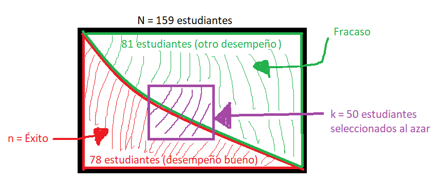

# Introducción

## Relevancia
La relevancia del tema busca facilitar información a diversos grupos que se interesen en describir la relación entre las horas que los estudiantes de UTEC invirtieron en las actividades extracurriculares en el ciclo 2022-2 y sus rendimientos académicos o, si el caso, hacer comparaciones con otros temas similares.

## Objetivos

**Objetivo General**

Analizar la relación entre las actividades que realizan los estudiantes de la UTEC en el ciclo 2022-2 y el rendimiento académico, con la finalidad de identificar si las actividades influyen en el rendimiento académico de forma positiva o negativa.

**Objetivos Específicos**

* Identificar las actividades extracurriculares más populares que los estudiantes de UTEC del ciclo 2022-2 realizaban y cuánto tiempo dedicaron a cada una.

* Identificar las herramientas que los estudiantes de UTEC del ciclo 2022-2 utilizaban para manejar su tiempo y equilibrar sus actividades.

* Determinar el desempeño en clase que mostraron los estudiantes de UTEC del ciclo 2022-2 en base a su tiempo de estudio, descanso y ocio.

* Comparar el rendimiento académico de los estudiantes de UTEC del ciclo 2022-2 que participan en actividades extracurriculares con el de aquellos que no participan en ellas.

## Contexto

Durante el ciclo 2022-2, notamos que los alumnos de UTEC invierten su tiempo en diferentes actividades,y hubieron alumnos que mostraron un buen rendimiento académico y otro que no, por tal curiosidad decidimos tratar acerca del tiempo invertido en las actividades extracurriculares y su relación con el rendimiento académico de los estudiantes de UTEC en el ciclo 2022-2.

## Planificación
Se presentará una tabla para la planificación del proyecto:


# Datos

## Proceso de recolección de datos

* Se obtuvieron los datos mediante una encuesta elaborada en Google forms por ser un método práctico para la difusión.

* Las 2 condiciones tomadas en la encuesta son: ser estudiantes de UTEC y estar cursando el segundo ciclo en adelante.

* Se llegó a la población mediante las redes sociales y amistades.


Se utilizarán las siguientes librerías y funciones para facilitar las operaciones de manipulación de datos.
```{r, include=FALSE}

if(!require(ggplot2)){install.packages('ggplot2')}
if(!require(readr)){install.packages('readr')}
if(!require(tidyr)){install.packages('tidyr')}
if(!require(dplyr)){install.packages('dplyr')}

library(readr)
library(tidyr)
library(ggplot2)
library(dplyr)

# Función para redondear
r <- function(n){
  round(n,2)
}

# Función para hallar el coeficiente de variación
cv <- function(n){
  return(sd(n,na.rm = T)/mean(n,na.rm = T))
}
```

Se carga la base de datos
```{r}
DL <- read_csv("Datos.csv")
```

## Población, muestra y muestreo
  - Población: Comunidad estudiantil de la universidad de ingeniería y tecnología (UTEC).
  - Muestra:  La unidad muestral es cada uno de los estudiantes encuestados cuyo tamaño muestral es de `r nrow(DL)` estudiantes.
  - Muestreo: No probabilístico de tipo "bola de nieve" y "por conveniencia".

## Variables
A continuación se presentará las variables recolectadas en una tabla junto a sus tipos, descripciones:
```{r}
Tabla_variables <-data.frame(Variables=c("Nombre y Apellido","Género", "Carrera", "Orden Mérito", "Participaste actividad extracurricular", "Actividades Extracurriculares participadas","Correo","Desempeño clases","Criterio desempeño clases", "Cursos extraacadémicos", "Herramientas organización",
                                
"Edad", "Cursos", "Promedio ponderado", "Cantidad de cursos", "Tiempo deporte", "Tiempo voluntariado", "Tiempo talleres", "Tiempo otras actividades", "Tiempo descanso", "Tiempo cursos extraacadémico", "Tiempo trabajo", "Tiempo organización estudiantil","Tiempo actividades ocio", "Tiempo actividad Religiosa", " Tiempo de estudio"),

Tipo=c("Categórica Nominal", "Categórica Nominal", "Categórica Nominal", "Categórica Ordinal", "Categórica Nominal", "Categórica Nominal", "Categórica Nominal", "Categórica Ordinal", "Categórica Nominal", "Categórica Nominal", "Categórica Nominal",
"Numérica Discreta", "Numérica Discreta", "Numérica Continua", "Numérica Discreta", 
"Numérica Continua", "Numérica Continua", "Numérica Continua", "Numérica Continua", "Numérica Continua", "Numérica Continua", "Numérica Continua", "Numérica Continua", "Numérica Continua", "Numérica Continua" ,"Numérica Continua"))

Tabla_variables

```

## Limpieza de datos
- Se creó una nueva base de datos, eliminando las variables innecesarias y convirtiendo las variables faltantes?

# Análisis descriptivo
Con los datos limpios se procederá ha realizar las relaciones y describir cada variable en base a los objetivos específicos.

## Relación de los estudiantes que participaron en las actividades extracurriculares con el desempeño académico
Se grafica la relación actividades extracurriculares vs desempeño académico, esperando que aquellos que no participaron en actividades extracurriculares muestren un mejor desempeño académico de aquellos que sí participaron.

```{r}
table(DL$Participaste_actividad_extracurricular,factor(DL$Desempeño_clases, levels = c("Excelente","Bueno","Regular","Malo")))

ggplot(DL, aes(x=factor(Desempeño_clases, levels = c("Excelente","Bueno","Regular","Malo")), fill=Participaste_actividad_extracurricular )) + geom_bar() + xlab("Desempeño") + ylab("Cantidad de encuestados")

```

Los desempeño de excelente, bueno y regular presentan una distribución equitativa entre los estudiantes que no participaron en actividades extracurriculares y aquellos que si. Se destaca que quienes presentan un desempeño malo en su totalidad no participaron en actividades extracurriculares. Se observa que los resultados no son los esperados, pues no hay mayor diferencia en el desempeño académico entre cada grupo de estudiantes.

##  Relación de los estudiantes que participaron en la actividades extracurriculares con la perspectiva
Se grafica la relación estudiantes que participaron en actividades extracurriculares vs perspectiva del estudiante sobre influencia de la participación en actividades extracurriculares en el rendimiento académico.
```{r}
table(DL$Participaste_actividad_extracurricular, DL$Criterio_act_desempeño)

ggplot(DL, aes(x=Criterio_act_desempeño, fill=Participaste_actividad_extracurricular )) + geom_bar() + xlab("Perspectiva") + ylab("Cantidad de encuestados")

```

Se muestra una distribución equitativa de la participación de actividades extracurriculares y la perspectiva del estudiante.

## Actividades extracurriculares más populares
Se mostrará las actividades extracurriculares más populares:
```{r}
Actividades <- cbind(Trabajo = table(DL$Trabajo)[2], Deportes = table(DL$Deportes)[2], Org_estudiantil = table(DL$Org_estudiantil)[2], Voluntariados = table(DL$Voluntariados)[2], Act_religiosas = table(DL$Act_religiosas)[2], Otras_actividades = sum(is.na(DL$Tiempo_otras_actividades) | (DL$Tiempo_otras_actividades > 0) ) - sum(is.na(DL$Tiempo_otras_actividades)))

text(barplot(sort(Actividades, decreasing = TRUE), 
        main = "Las actividades en las que participaron", 
        xlab = "Actividades Extracurriculares", ylab = "Frecuencia",
        col = c("#00BFFF","#FFD700", "#FF69B4","#C0FF3E","#FF8000","#4B0082")), par("usr")[3], srt = 30, adj = c(1, 1), xpd = TRUE,
     labels = c("Deportes", "Voluntariados", "Otras actividades", "Org. estudiantil", "Trabajo", "Act. religiosas"))
legend("topright", "Moda", fill = "#00BFFF")

```
Se destaca que la mayoría de estudiantes encuestados, realizan más deportes en comparación con las otras actividades, seguido de voluntarios y otras actividades realizadas por los estudiantiles. 

## Herramientas más usadas
Se presentará el gráfico sobre las herramientas más usadas por los estudiantes:
```{r}
Herramientas <- cbind(Block_notas = table(DL$Block_notas)[2], Google_Calendar = table(DL$Google_Calendar)[2], Apps_mates = table(DL$Apps_mates)[2], Notion = table(DL$Notion)[2],  Horarios_agendas = table(DL$Horarios_agendas)[2], Ninguna_herramienta = table(DL$Ninguna_herramienta)[1] )


text(barplot(sort(Herramientas, decreasing = TRUE), 
       main = "Herramientas de organización más usadas por los estudiantes", 
        xlab = "Herramientas", ylab = "Frecuencia",
        col=c("firebrick1","cyan1", "yellow","hotpink","orange","olivedrab1")), par("usr")[3], srt = 30, adj = c(1, 1), xpd = TRUE,
     labels = c("Google_Calendar", "Block_notas", "Horarios_agendas", "Notion", "Apps_mates ", "Ninguna_herramienta"))
legend("topright", "Moda", fill = "firebrick1")

```

La mayoría de encuestados optan por Google Calendar, herramienta bastante práctica para vincular con la cuenta de la universidad, seguido de block de notas y horarios/agendas que es una herramienta más tangible.

## Relación entre el promedio ponderado y la participación en actividades extracurriculares
Se mostrará la relación entre el promedio ponderado y la participación en actividades extracurriculares, esperando que los estudiantes que participaron en actividades extracurriculares tengan un menor promedio de aquellos que no participaron.
```{r}
boxplot(DL$Promedio_ponderado ~ factor(DL$Participaste_actividad_extracurricular, levels = c("SI", "NO")), main= "Estudiantes que practicaron las actividades vs promedio ponderado", xlab= "¿Practicaste actividad extracurricular?", ylab = "Promedio ponderado", col= c("olivedrab1","hotpink"))
```
Los estudiantes que participaron en actividades extracurriculares obtuvieron un promedio aproximado de 14 a 16. Y los que no participaron obtuvieron un promedio entre un poco más de 13 y 15. Estos resultados revelan que los estudiantes que participaron en actividades extracurriculares lograron promedios más altos en comparación con aquellos que no participaron.

## Relación entre el tiempo de estudio y desempeño en clases
Se mostrará la relación entre el tiempo de estudio y el desempeño en clases, esperando que los estudiantes que dedican más tiempo al estudio tengan un mejor desempeño.
```{r}
boxplot(DL$Tiempo_estudio~ factor(DL$Desempeño_clases, levels = c("Excelente","Bueno","Regular","Malo")), main = "Relación del tiempo de estudio y desempeño", xlab = "Desempeño", ylab = "Tiempo de estudio", col = c("#FFD700","#00BFFF", "#FF69B4","#C0FF3E"))
```

Se observa que las medianas de cada nivel de desempeño varían ligeramente, pero su desempeño fue distinto. Además, los niveles de desempeños excelente, bueno y malo presentan un asimetría negativa (sesgada negativamente) y el nivel de desempeño regular presenta simetría, indicando que las horas de estudio no acreditan el desempeño en las clases de los estudiantes.

## Relación entre el promedio ponderado y tiempo de estudio
Se mostrará mediante la correlación y diagrama de dispersión si existe relación entre las variables, esperando que los encuestados que dedican más tiempo al estudio tengan un mejor promedio ponderado. 
```{r}
colores <- c("Excelente" = "green",
             "Bueno" = "#FFD700",
             "Regular" = "orange",
             "Malo" = "red")

r(cor(DL$Promedio_ponderado, DL$Tiempo_estudio))

ggplot(DL, aes(Tiempo_estudio, Promedio_ponderado)) +
  geom_point(aes(color = factor(Desempeño_clases, levels = names(colores)))) +
  labs(title = "Diagrama de dispersión del promedio ponderado y tiempo de estudio",
       x = "Tiempo de estudio",
       y = "Promedio ponderado") +
  scale_color_manual("Desempeño_clases", values = colores) +
  facet_wrap(~ Desempeño_clases, nrow = 2) 
```


Se observa la correlación (`r r(cor(DL$Promedio_ponderado, DL$Tiempo_estudio))`) y el diagrama de dispersión, donde los datos son muy dispersos y no hay relación entre las variables ya sea que el desempeño en clase del estudiante sea excelente, bueno, regular o malo, indicando que los resultados no fueron los esperados.

## Relación entre el tiempo de actividades de ocio y desempeño en clases
Se mostrará la relación entre el tiempo de ocio y el desempeño en clases, esperando que los estudiantes que dedican menos tiempo a las actividades de ocio tengan un mejor desempeño.
```{r}
boxplot(DL$Tiempo_actividades_ocio~ factor(DL$Desempeño_clases, levels = c("Excelente","Bueno","Regular","Malo")), main = "Relación del tiempo de actividades de ocio y desempeño", xlab = "Desempeño", ylab = "Tiempo de actividades de ocio", col = c("#FFD700","#00BFFF", "#FF69B4","#C0FF3E"))
```

Se observa que los estudiantes que invierten más tiempo en actividades de ocio tienen un desempeño malo, mientras que aquellos que dedican menos tiempo obtienen un desempeño bueno. Además, los niveles de desempeño malo y regular muestran una distribución asimétrica positiva, mientras que los niveles de desempeño excelente y bueno presentan una distribución simétrica. Sin embargo, esta relación no se cumple completamente para aquellos estudiantes que tienen un desempeño excelente.

## Relación entre el promedio ponderado y tiempo de ocio
Se mostrará mediante la correlación y diagrama de dispersión si existe relación entre las variables, esperando que los estudiantes que dedicaron más al tiempo de ocio tengan un promedio ponderado bajo.

```{r}
r(cor(DL$Promedio_ponderado, DL$Tiempo_actividades_ocio))

ggplot(DL, aes(Tiempo_actividades_ocio, Promedio_ponderado)) +
  geom_point(aes(color = factor(Desempeño_clases, levels = names(colores)))) +
  labs(title = "Diagrama de dispersión del promedio ponderado y tiempo de ocio",
       x = "Tiempo de ocio",
       y = "Promedio ponderado") +
  scale_color_manual("Desempeño_clases", values = colores) +
  facet_wrap(~ Desempeño_clases, nrow = 2)
```

Al observar la correlación `r r(cor(DL$Promedio_ponderado, DL$Tiempo_actividades_ocio))` y diagrama de dispersión, prácticamente no existe relación entre las variables, esto indica que los resultados no fueron los esperados, pues si los estudiantes pierden más horas en ocio no afecta su promedio en general, excepto el desempeño malo donde si hay una relación.

## Relación entre el tiempo de descanso y desempeño en clases
Se grafica tiempo de descanso vs desempeño en clases, esperando que los estudiantes que descansan bien tengan un mejor desempeño. 
```{r}
boxplot(DL$Tiempo_descanso~ factor(DL$Desempeño_clases, levels = c("Excelente","Bueno","Regular","Malo")), main = "Relación del tiempo de descanso y desempeño", xlab = "Desempeño", ylab = "Tiempo de descanso", col = c("#FFD700","#00BFFF", "#FF69B4","#C0FF3E"))
```

Se observa que el nivel de desempeño excelente, bueno y regular presentan una distribución simétrica a comparación del nivel de desempeño malo que presenta una distribución asimétrica negativa, entonces no hay relación significativa.

## Relación entre el promedio ponderado y tiempo de descanso
Se mostrará mediante la correlación y diagrama de dispersión si existe relación entre las variables, esperando demostrar que el tiempo de descanso afecta positivamente al promedio ponderado.
```{r}
r(cor(DL$Promedio_ponderado, DL$Tiempo_descanso))

ggplot(DL, aes(Tiempo_descanso, Promedio_ponderado)) +
  geom_point(aes(color = factor(Desempeño_clases, levels = names(colores)))) +
  labs(title = "Diagrama de dispersión entre el promedio ponderado y tiempo de descanso",
       x = "Tiempo de descanso",
       y = "Promedio ponderado") +
  scale_color_manual("Desempeño_clases", values = colores) +
  facet_wrap(~ Desempeño_clases, nrow = 2)
```

Al observar la correlación `r r(cor(DL$Promedio_ponderado, DL$Tiempo_descanso))` y el diagrama de dispersión, prácticamente no existe relación entre las variables pues si los estudiantes descansan más horas o menos horas no afecta su promedio ponderado, entonces los resultados no fueron los esperados.

# Análisis probabilístico

## Probabilidad Empírica

VARIABLE -> **PROMEDIO PONDERADO**

Se establecieron los siguientes criterios de evaluación basados en el Promedio Ponderado del estudiante del ciclo 2022-2.

Donde:

+ Promedio excelente (17-20): Estudiantes cuyos promedios ponderado se encuentre en el rango de 17 a 20 serán considerandos como excelentes.

+ Promedio bueno (14-16): Estudiantes  cuyos promedios ponderados se encuentre en el rango de 14 a 16 serán considerados como bueno.

+ Promedio bajo (11-13): Estudiantes cuyos promedios ponderados se  encuentre en el rango de  11 a 13 serán considerados como bajo. 

A continuación se muestra una tabla de los datos obtenidos:
```{r}
Rango_Promedio <- table(cut(DL$Promedio_ponderado, breaks = c(11, 13, 16, 20), labels = c("11-13", "14-16", "17-20")))
Rango_Promedio
```

**Experimento A**: Se selecciona al azar un estudiante del ciclo 2022-2 y se registra su promedio ponderado dentro de los rangos establecidos.

A continuación se mostrara todos los posibles resultados.

+ A1 = Promedio Excelente 
+ A2 = Promedio Bueno 
+ A3 = Promedio Bajo 

Espacio muestral:

$$\Omega = \{ A_1, A_2, A_3 \} $$
A continuación se mostrara los eventos atómicos:

+ A1  --> Seleccionar a un estudiante del ciclo 2022-2 que tenga un promedio ponderado excelente.
+ A2  --> Seleccionar a un estudiante del ciclo 2022-2 que tenga un promedio ponderado bueno.
+ A3  --> Seleccionar a un estudiante del ciclo 2022-2 que tenga un promedio ponderado bajo.

A continuación se saca las probabilidades directas de los eventos atómicos.

$$ P(A) = \frac{Frecuencia(A)}{n} $$

Donde:

+ **Frecuencia de A** --> La cantidad total de estudiantes con promedio  X. -> (*X = excelente, bueno ó bajo.*)

+ **n**--> Cantidad total de estudiantes

Probabilidad de A1:
$$ P(A_1) = \frac{32}{159} = 0.201258 $$
Probabilidad de A2:
$$ P(A_1) = \frac{105}{159} = 0.660377 $$
Probabilidad de A3:
$$ P(A_1) = \frac{20}{159} = 0.125786 $$
Se muestra la función de probabilidad:
```{r}
data.frame( Frecuencia = c(Rango_Promedio[1],Rango_Promedio[2],Rango_Promedio[3]), Probabilidad = c(r(Rango_Promedio[1]/ nrow(DL)), r(Rango_Promedio[2] / nrow(DL)), r(Rango_Promedio[3] / nrow(DL))))
```


VARIABLE -> **ACTIVIDADES EXTRACURRICULARES**

En nuestro estudio sobre la participación de los estudiantes de UTEC en actividades extracurriculares, se encuestaron a 159 estudiantes. Descubrimos que 83 de ellos participaron en diferentes actividades.

A continuación se mostrará la cantidad acumulada de la o las actividades seleccionadas por los estudiantes.
```{r}
Actividades <- cbind(Trabajo = table(DL$Trabajo)[2], Deportes = table(DL$Deportes)[2], Org_estudiantil = table(DL$Org_estudiantil)[2], Voluntariados = table(DL$Voluntariados)[2], Act_religiosas = table(DL$Act_religiosas)[2], Otras_actividades = sum(is.na(DL$Tiempo_otras_actividades) | (DL$Tiempo_otras_actividades > 0) ) - sum(is.na(DL$Tiempo_otras_actividades)))

Actividades
```


**Experimento B**: Se registra todas las respuestas de las actividades que marcaron los 83 estudiantes y se selecciona al azar una de ellas

A continuación se mostrara todos los posibles resultado a la hora de selecciona al azar una de estas actividades.

+ B1 = Trabajo  
+ B2 = Deportes  
+ B3 = Org_estudiantil 
+ B4 = Voluntariados
+ B5 = Act_religiosas 
+ B6 = Otras_actividades


Espacio muestral:

$$\Omega = \{ B_1, B_2, B_3, B_4,B_5,B_6 \} $$
A continuación se mostrara los eventos atómicos:

+ B1  --> Seleccionar una respuesta que sea la actividad extracurricular Trabajo
+ B2  --> Seleccionar una respuesta que sea la actividad extracurricular Deportes
+ B3  --> Seleccionar una respuesta que sea la actividad extracurricular Org_estudiantil
+ B4  --> Seleccionar una respuesta que sea la actividad extracurricular Voluntariados
+ B5  --> Seleccionar una respuesta que sea la actividad extracurricular Act_religiosas
+ B6  --> Seleccionar una respuesta que sea la actividad extracurricular Otras_actividades

A continuación se saca las probabilidades directas de los eventos atómicos.

$$ P(B) = \frac{Frecuencia(B)}{n} $$

Donde:

+ **Frecuencia de B** --> La cantidad total de respuestas para la actividad extracurricular X. -> (*X = Trabajo, Deportes, Org_estudiantil, Voluntariados, Act_religiosas u Otras_actividades*)

+ **n**--> Cantidad total de respuestas (142)

Probabilidad de B1:
$$ P(B_1) = \frac{6}{142} = 0.042254 $$
Probabilidad de B2:
$$ P(B_2) = \frac{44}{142} = 0.309859 $$
Probabilidad de B3:
$$ P(B_3) = \frac{24}{142} = 0.169014 $$
Probabilidad de B4:
$$ P(B_4) = \frac{37}{142} = 0.260563 $$
Probabilidad de B5:
$$ P(B_5) = \frac{3}{142} = 0.021127 $$
Probabilidad de B6:
$$ P(B_6) = \frac{28}{142} = 0.197183 $$
A continuación se muestra la función de probabilidad:

```{r}
data.frame(Actividades = c("Trabajo", "Deportes", "Org_estudiantil", "Voluntariados", "Act_religiosas", "Otras_actividades"),  Frecuencia = c(Actividades[1],Actividades[2],Actividades[3], Actividades[4], Actividades[5],Actividades[6]), Probabilidad = c(r(Actividades[1]/ sum(Actividades)), r(Actividades[2] / sum(Actividades)), r(Actividades[3] / sum(Actividades)),r(Actividades[4] / sum(Actividades)), r(Actividades[5] / sum(Actividades)), r(Actividades[6] / sum(Actividades))))
```

## Probabilidad condicional

+ **Eventos Dependientes**:

VARIABLES -> Desempeño_clases y Participaste_actividad_extracurricular

Identificamos dos eventos en nuestras variables.

A -> Seleccionar a un estudiantes con un desempeño bueno
B -> Seleccionar a un estudiante que SI participo en actividades extracurriculares

A continuación se presenta una tabla de contingencia que muestra la relación entre las variables mencionadas.

```{r}
table(factor(DL$Participaste_actividad_extracurricular, levels = c("SI", "NO")),factor(DL$Desempeño_clases, levels = c("Excelente","Bueno","Regular","Malo")))
```


**Verificamos independencia:**

$$P(A \cap B) = P(A)*P(B)$$
Donde: 
$$P(A) = 0.49$$

```{r}
PA =  r(78 / 159)
PA
```

$$P(B) = 0.52 $$
```{r}
PB = r(83 / 159)
PB
```
$$P(A \cap B) = 0.29 $$

```{r}
PA_B =r(46 / 159)
PA_B
```
Verificamos la independencia
```{r}
PA_B

r(PA*PB)
```
Entonces: 
$$P(A \cap B) != P(A)*P(B)$$
Esto demuestra que los eventos A y B son dependientes. 

**Ejemplos**

+ 1. ¿Cuál es la probabilidad de que el estudiante seleccionado haya obtenido un desempeño bueno dado que SI participó en actividades extracurriculares?

$$P(A/B) = \frac{P(A \cap B)}{P(B)}$$

Teniendo las probabilidades halladas anteriormente, reemplazamos en la ecuación.

```{r}
PA_d_B <- PA_B / PB
r(PA_d_B)
```
Se obtuvo como resultado que la probabilidad que el estudiante seleccionado presente un desempeño bueno ya que si participó en alguna actividad extracurricular es del 55%.

+ 2. ¿Cuál es la probabilidad de que el estudiante participó en actividades extracurriculares dado que presento un desempeño bueno?

$$P(B/A) = \frac{P(A/B)*P(B)}{P(A)}$$

Para la resolución de este ejemplo se usara el teorema de Bayes.

Probabilidad total: 
$$P(A) = P(A/B)*P(B)+P(A/B^c)*P(B^c) $$
Teniendo la probabilidades halladas anteriormente, remplazamos en la ecuación.
```{r}
PB_d_A = PA_d_B*PB / PA

r(PB_d_A)
```
La probabilidad que el estudiante seleccionado si haya participado en alguna actividad extracurricular dado que presento un desempeño bueno es del 59%.

+ **Eventos Independientes**

VARIABLES -> Orden de merito y Criterio_act_desempeño

Identificamos dos eventos en nuestras variables seleccionadas

A -> Seleccionar a un estudiantes que pertenece al Décimo superior en la universidad de UTEC
B -> Seleccionar a un estudiante que su perspectiva fue SI sobre influencia de la participación en actividades extracurriculares en el rendimiento académico 

A continuación se presenta una tabla de contingencia que muestra la relación entre las variables mencionadas.
```{r}
table(factor(DL$Orden_mérito, levels = c("Décimo superior", "Quinto superior", "Tercio superior", "Medio superior")), factor(DL$Criterio_act_desempeño, levels = c("SI", "NO")))

```


**Verificamos independencia:**

$$P(A \cap B) = P(A)*P(B)$$
Donde: 
$$P(A) = 0.23 $$

```{r}
PA =  r(36 / 159)
PA
```

$$P(B) = 0.36 $$
```{r}
PB = r(58 / 159)
PB
```
$$P(A \cap B) = 0.09$$

```{r}
PA_B = 14 / 159
PA_B
```
Verificamos la independencia
```{r}
PA_B
PA*PB
```
Entonces: 
$$P(A \cap B) \approx{} P(A)*P(B)$$
Esto demuestra que los eventos A y B son independientes. Además, la perspectiva es una respuesta criterial y no se debería ver afectado por el orden de merito del estudiante.

**Ejemplo**

+ 1. ¿Cuál es la probabilidad de que el estudiante seleccionado este en Décimo superior de universidad UTEC dado que su perspectiva fue SI a la influencia de las actividades extracurriculares sobre el rendimiento académico?

```{r}
r(PA)
```
La probabilidad que el estudiante seleccionado esté en el décimo superior dado su respuesta fue SI es del 23%.

+ 2. ¿Cuál es la probabilidad de que el estudiante seleccionado su perspectiva fue SI a la influencia de las actividades extracurriculares sobre el rendimiento académico dado que este en Décimo superior de universidad UTEC?
```{r}
r(PB)
```
La probabilidad que el estudiante seleccionado haya respondido que SI dado que está en décimo superior es del 36%.

+ 3.  ¿Cuál es la probabilidad de que el estudiante seleccionado este en Décimo superior de universidad UTEC ó  que su perspectiva fue SI?
$$P(A \cup B ) = P(A) + P(B) - P(A)*P(B)$$

```{r}
r(PA+ PB - PA_B)
```
La probabilidad de que el estudiante seleccionado este en décimo superior y haya respondido SI a la influencia de las actividades extracurriculares sobre el rendimiento académico es del 50%.

                 
## Variables discretas

### Desempeño en clases

En el auditorio de UTEC, se llevó a cabo una actividad a la que asistieron 159 estudiantes. Durante el ingreso, se les preguntó a todos los estudiantes cómo fue su desempeño en clase durante el ciclo 2022-2. A continuación se presentan los resultados obtenidos:

```{r}
table(factor(DL$Desempeño_clases, levels = c("Excelente","Bueno","Regular","Malo")))
```
Durante el evento, se llevó a cabo un concurso de resolución de ejercicios de cálculo en el cual participaron 50 estudiantes seleccionados al azar. Este estudio puede plantearse como una distribución Hipergeometrica.

+ Éxito: Aquellos estudiantes que tengan un desempeño bueno en el ciclo 2022-2

X: Número de estudiantes con un desempeño bueno en el ciclo 2022-2 dentro de los 50 estudiantes seleccionados al azar para el concurso.

Donde:
$$ X \sim Hiper(N,k,n) $$


A continuación se presenta la descripción de los parámetros del modelo:

$$ N = 159, k = 50, n=78 $$

+ **N**  -> Cantidad de estudiantes que asistieron al auditorio de UTEC.
+ **k**  -> Cantidad de estudiantes seleccionados para el concurso.
+ **n**  -> Cantidad de estudiantes que tengan un desempeño bueno en el ciclo 2022-2.

Se presenta un resumen del contenido presentado en el siguiente gráfico.



A continuación se presentara la grafica de la probabilidad de estudiantes con desempeño bueno de los 50 estudiantes seleccionados al azar:
```{r}
ggplot() +
  geom_bar(stat = "identity", aes(x = 0:50, y = dhyper(0:50, 78, 159,50)), width = 0.15, fill = "black") +
  labs(x = "Cantidad de estudiantes", y = "Probabilidad",
       title = "Probabilidad de estudiantes con desempeño bueno de los 50 seleccionados") +
  theme_minimal()
```

Se observa que la probabilidad alcanza su valor máximo cuando 16 de los 50 estudiantes seleccionados tienen un desempeño bueno. A medida que la cantidad de estudiantes con dicho desempeño aumenta o disminuye, la probabilidad disminuye.

Se presenta el valor esperado y la dispersión:

Valor esperado:
$$E(X) = 50* \frac{78}{159} =  24.53$$
Varianza:
$$Var(X) = 50*\frac{78}{159}*(1-\frac{78}{159})*(\frac{159-50}{159-1}) = 8.62 $$
Desviación estándar
$$Sd(X) = \sqrt(8.62) = 2.94$$
Coeficiente de variabilidad
$$ CV(X) = \frac{2.94}{24.53} = 11.97\% $$
En promedio, se espera que 24 o 25 de los 50 estudiantes seleccionados para el concurso presenten un desempeño bueno. Además, podemos deducir que los valores de la distribución están relativamente dispersos alrededor de la media, lo cual indica una baja variabilidad en la distribución con 11.97%.

**Ejemplos:**

+ 1. ¿Cuál es la probabilidad de que en el concurso haya menos 15 estudiantes con un desempeño bueno?
$$P(X<15)$$

```{r}
r(phyper(14, 78, 159, 50))
```
Existe una probabilidad del 26% de que haya menos de 15 estudiantes con desempeño bueno.

+ 2. ¿Cuál es la probabilidad de que en el concurso haya por lo menos 20 estudiantes con desempeño bueno?
$$P(X\geq20)$$
```{r}
r(1 - phyper(19, 78, 159, 50))
```
Existe una probabilidad del 15% de que haya por lo menos de 20 estudiantes con desempeño bueno.


### Herramientas utilizadas
En nuestro estudio sobre la organización del tiempo de los estudiantes de la Universidad de UTEC, se les pidió a los encuestados que indicaran si utilizaban herramientas para organizar su tiempo y cuáles eran. De los 159 encuestados, 140 seleccionaron una o más herramientas, lo que implica que aproximadamente 19 estudiantes no utilizaron ninguna herramienta. A continuación se presenta un resumen de la cantidad acumulada de las herramientas seleccionadas por los estudiantes.

```{r}
# Utilizo herramientas
DL$Ninguna_herramienta[DL$Ninguna_herramienta=="Si"] <- "NO"
DL$Ninguna_herramienta[DL$Ninguna_herramienta=="No"] <- "SI"
table(factor(DL$Ninguna_herramienta, levels = c("SI","NO")))

# Herramientas utilizadas
cbind(Block_notas = table(DL$Block_notas)[2], Google_Calendar = table(DL$Google_Calendar)[2], Apps_mates = table(DL$Apps_mates)[2], Notion = table(DL$Notion)[2],  Horarios_agendas = table(DL$Horarios_agendas)[2])

```
Habiendo ordenado los datos, se obtuvo un total de 278 selecciones para las herramientas, ahora lo analizaremos como una distribución Binomial.

Éxito -> Herramienta más utilizadas (Google_Calendar) por los estudiantes de UTEC en el ciclo 2022-2

A continuación se presenta la probabilidad de éxito:
$$P(E) = \frac{f(GoogleCalendar)}{n} = \frac{110}{278} = 0.39568$$

X: Número de selecciones de Google_Calendar por los estudiantes de UTEC en el ciclo 2022-2 dentro de los 278 respuestas seleccionados

Donde:
$$X \sim B(n,\pi)$$
A continuación se presenta la descripción de los parámetros del modelo:
$$n = 278; \pi = 0.39568 $$

+ $n$: Tamaño de la muestra de selecciones de herramientas
+ $\pi$: La probabilidad de que la respuesta seleccionada sea Google_Calendar

A continuación se presentara la grafica de probabilidad de seleccionar respuestas que sean Google_Calendar de los 150 respuestas seleccionadas 

```{r}
ggplot() +
  geom_bar(stat = "identity", aes(x = 75:150, y = dbinom((75:150), 278, 0.395683)), width = 0.15, fill = "black") +
  labs(x = "Cantidad de respuestas de Google_Calendar", y = "Probabilidad",
       title = "Probabilidad de respuestas de Google_Calendar de la muestra") +
  theme_minimal()
```

De la gráfica podemos observar que la probabilidad alcanza su punto máximo cuando la cantidad de respuestas son 110, a medida que aumenta y disminuye la cantidad de respuestas la probabilidad se hace menor.


Se presenta el valor esperado y la dispersión:

Valor esperado:
$$E(X) = 278*0.395683 =  110$$
Varianza:
$$Var(X) =278*0.395683*(1-0.395683) = 66.47 $$
Desviación estándar
$$Sd(X) = \sqrt(66.47) = 8.15$$
Coeficiente de variabilidad
$$ CV(X) = \frac{8.15}{110} = 7.41\% $$

En promedio 110 respuestas serán de herramienta más utilizada (Google_Calendar) de las 278 selecciones. Además, podemos interpretar que los valores están relativamente cercanos a la media, lo que indica que hay una baja variabilidad en la distribución con un 7.41%.

**Ejemplos:**

+ 1. ¿Cuál es la probabilidad  seleccionar al menos 60 selecciones que sean de herramienta más popular (Google_Calendar) ?
$$P(X\geq60) $$

```{r}
r(1 - pbinom(59, 150, 0.395683))
```
La probabilidad de que al menos 60 respuestas sean de Google_Calendar (herramienta más populares) es 49% de la muestra de 150 herramientas seleccionadas.

+ 2. Cuál es la probabilidad  seleccionar menos de 70 selecciones de la herramienta más popular (Google_Calendar) ?
$$P(X < 70) $$

```{r}
r(pbinom(69,150, 0.395683))
```
La probabilidad de que menos de 70 respuestas sean de herramienta más popular (Google_Calendar) es 49% de la muestra de 150 herramientas seleccionadas.


## Variables continuas

### Variable Promedio ponderado

A continuación se muestra la grafica de densidad de la variable Promedio ponderado

```{r}
mediaPp <-( mean(DL$Promedio_ponderado))
desviacionPp<- sd(DL$Promedio_ponderado)

distribucionPp <- rnorm(length(DL$Promedio_ponderado), mean = mediaPp, sd = desviacionPp)

hist(distribucionPp, freq = FALSE,col = "skyblue", main = "Histograma de curva de densidad", xlab = "Promedio ponderado", ylab = "Densidad")

densidad <- density(distribucionPp)

lines(densidad, col = "blue", lwd = 2)

curve(dnorm(x, mean = mean(distribucionPp), sd = sd(distribucionPp)), add = TRUE, col = "red", lwd = 3)
```

Se distribuye con una supuesta normalidad (linea azul).

**Validar la distribución normal**

+ La media debería ser igual a la mediana aproximadamente es decir, la media parte en 50% los datos.

Se calcula las medidas de tendencia central
```{r}
r(mean(DL$Promedio_ponderado))
median(DL$Promedio_ponderado)
```
entonces:
$$\bar{X} \approx M_e --> 14.83 \approx 15$$


Varianza:
$$Var(X) \approx sd^2 = 2.44 $$

```{r}
r(sd(DL$Promedio_ponderado)^2)
```
Esperanza:
$$E(X) \approx \bar{X} = 14.83 $$

```{r}
r(mean(DL$Promedio_ponderado))
```
Coeficiente de variabilidad
$$CV(X) = \frac{sd}{E(X)} = 10.53 $$


Se valido mediante la media, mediana y la grafica que los datos están distribuidos de manera normal. Es decir, que mas de la mitad de los datos se encuentran a cada lado de la media.


Definimos nuestra variable aleatoria
$X$: Es una distribución normal con media 14.83 y varianza de 2.44

Donde: 
$$X \sim N(\mu,\sigma^2)$$
A continuación se presenta la descripción de los parámetros del modelo:

+ $\mu$ -> $\bar{X}$ : Media del promedio ponderado obtenido por los estudiantes de UTEC en el ciclo 2022-2.

+ $\sigma^2$ -> $sd^2$ : Varianza del promedio ponderado de los estudiantes de UTEC en el ciclo 2022-2.


**Ejemplos**

+ 1. Si un estudiante es seleccionado al azar. ¿Cuál es la probabilidad de que su promedio ponderado en el ciclo 2022-2 sea menos de 15?

```{r}
r(pnorm(15, mean(DL$Promedio_ponderado), sd(DL$Promedio_ponderado)))
```
La probabilidad de seleccionar un estudiante con promedio ponderado mayor a 15 es 54%


+ 2. Se esta buscando a estudiantes que pertenecen al décimo superior (17-20) para concursar para una beca en el extranjero. ¿Cuál es la probabilidad  de seleccionar a un estudiante que cumple con esos requisitos?

```{r}
r(pnorm(20, mean(DL$Promedio_ponderado), sd(DL$Promedio_ponderado))) - r(pnorm(17, mean(DL$Promedio_ponderado), sd(DL$Promedio_ponderado)))
```
La probabilidad de seleccionar un estudiante con promedio ponderado entre 17 y 20 es 8%


### Variable tiempo de estudio

En esta variable hace referencia a las horas que el encuestado se dedica a estudiar fuera de sus clases. Esta variable es de relevancia para nuestro estudio ya que ello tiene relación con su promedio ponderado.

Veremos en un histograma esta distribuida la variable de acuerdo a sus descriptores.
```{r}
media <-( mean(DL$Tiempo_estudio))
desviacion <- sd(DL$Tiempo_estudio)

n <-length(DL$Tiempo_estudio)
distribucion <- rnorm(n, mean = media, sd = desviacion)


hist(distribucion, freq = FALSE,col = "skyblue", main = "Histograma con curva de densidad", xlab = "Horas de estudio", ylab = "Dnesidad")

densidad <- density(distribucion)


lines(densidad, col = "blue", lwd = 2)

curve(dnorm(x, mean = mean(distribucion), sd = sd(distribucion)), add = TRUE, col = "red", lwd = 3)

```
Se distribuye con una supuesta normalidad.

**Validar la distribución normal**

+ La media debería ser igual a la mediana aproximadamente es decir, la media parte en 50% los datos.

$$\bar{X} \approx M_e$$

```{r}
r(media)
mediana_TE<- median(DL$Tiempo_estudio)
mediana_TE
```
$$ 27.03 \approx 30$$

Varianza:
$$Var(X) \approx sd^2 = 140.17 $$

```{r}
r(sd(DL$Tiempo_estudio)^2)
```
Esperanza:
$$E(X) \approx \bar{X} = 27.03 $$

```{r}
r(mean(DL$Tiempo_estudio))
```
Coeficiente de variabilidad
$$CV(X) = \frac{sd}{E(X)} = 0.44 $$
Se valido mediante la media, mediana y la grafica que los datos están distribuidos de manera normal. Es decir, que mas de la mitad de los datos se encuentran a cada lado de la media.


Definimos nuestra variable aleatoria
$X$: Es una distribución normal con media 27.03 y varianza de 140.17

Donde: 
$$X \sim N(\mu,\sigma^2)$$
A continuación se presenta la descripción de los parámetros del modelo:

+ $\mu$ -> $\bar{X}$ : El promedio del tiempo dedicado al estudio por los estudiantes de UTEC en el ciclo 2022-2.

+ $\sigma^2$ -> $sd^2$ : Varianza del tiempo de estudio de los estudiantes de UTEC en el ciclo 2022-2.


**Ejemplo**

+ 1. ¿Cuál es la probabilidad de que un estudiante seleccionado al azar dedique más de 36 horas de estudios semanales?
$$ P(X>6) $$ 


```{r}
r(pnorm(36 , mean(DL$Tiempo_estudio), sd(DL$Tiempo_estudio)))
```
Hay una probabilidad del 78% que un estudiante seleccionado al azar le dedique más de 36 horas de estudios semanales.

# Conclusiones

* La mayoría de los estudiantes participaron en actividades extracurriculares. Tanto los que participaron como los que no, tuvieron resultados similares, excepto que todos los que tuvieron un desempeño malo no participaron en actividades extracurriculares. Al analizar el promedio ponderado se evidencia un mayor promedio obtenidos por los estudiantes que si participaron. Además se demostró en base a las probabilidades que de un grupo al alzar la mayoría de estudiantes habría tenido un desempeño bueno en clases y su promedio ponderado sería un valor cercano a 15. Por ello, podemos afirmar que esos estudiantes que si participaron en actividades extracurriculares tuvieron un rendimiento académico ligeramente mejor a los que no participaron.

* Se identificó gracias a las gráficas y las probabilidades realizadas que la mayoría de estudiantes de nuestro estudio le dedica más de 6 horas diarias a estudiar fuera de las clases. Sin embargo esto no acredita su desempeño en clase ni que tenga un promedio ponderado alto. 

* Se identificó gracias a las gráficas y las probabilidades realizadas que la actividad de deportes es la actividad extracurricular más popular, seguido de voluntariados.Además la mayoría de estudiantes optan por manejar su tiempo y equilibrar sus actividades  mediante alguna herramienta siendo la más seleccionada Google calendar, seguido de block de notas.

