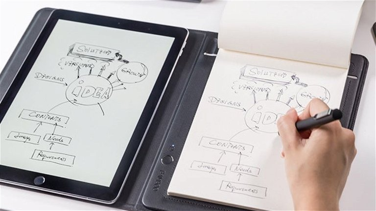

---
output:
  html_document:
    df_print: paged
    toc: yes
    toc_float: yes
    number_sections: no
    code_folding: hide
  pdf_document:
    toc: yes
---

# [**Análisis de comparación en la toma de apuntes y resolución de problemas con herramientas digitales y tradicionales en los estudiantes de UTEC de 3er y 4to ciclo.**]{style="color:black"}

::: {style="text-align:center"}
{height="500," width="500"}
:::

\

## [**1 Introducción**]{style="color:darkred"}

\

### [**1.1. Importancia y Justificación**]{style="color:darkblue"}

Tomar apuntes, ya sea en alguna herramienta digital o tradicional, puede afectar positivamente en el aprendizaje universitario, fomentando la retención de información, el pensamiento crítico e incluso el desarrollo de habilidades tecnológicas. Además, si bien estamos rodeados de tecnología que nos puedan facilitar mejor en el aspecto educativo, es importante saber con qué tipo de herramienta para tomar apuntes se adaptan mejor los estudiantes. 


\

### [**1.2. Objetivos**]{style="color:darkblue"}

\

#### [**1.2.1. Objetivo General**]{style="color:blue"}

Analizar las preferencias de los estudiantes de UTEC de 3er y 4to ciclo en relación al uso de herramientas digitales y tradicionales en la toma de apuntes y resolución de problemas, para así determinar su impacto en la calidad del aprendizaje.

\

#### [**1.2.2. Objetivos Específicos**]{style="color:blue"}

1.  Comparar si la preferencia por herramientas digitales versus tradicionales varía acorde al ciclo.
2.  Determinar cuál es el tiempo promedio diario y gasto ideal promedio en el uso tanto de las herramientas digitales como tradicionales y su influencia en el aprendizaje académico.
3.  Conocer el nivel de aprendizaje del público objetivo seleccionado con respecto a la toma de apuntes y resolución de problemas en herramientas digitales contra las de uso tradicional.

\

### [**1.3. Contexto**]{style="color:darkblue"}

En UTEC, el uso de estas herramientas no es la excepción. En ese sentido, como parte de nuestra investigación, se realizó una encuesta sobre la importancia de las herramientas digitales y tradicionales en la toma de apuntes y resolución de problemas como estudiantes de UTEC de 3er y 4to ciclo, con la finalidad de compararlas y obtener conclusiones al respecto.

\

### [**1.4. Paquetes y Librerías**]{style="color:darkblue"}

-   Comprobamos si los **paquetes** utilizados a lo largo del proyecto **han sido instalados**. En caso no suceda, el programa los instala automáticamente.

```{r}
if (!require("readr")) { install.packages("readr")}
if (!require("dplyr")) { install.packages("dplyr") }
if (!require("ggplot2")) { install.packages("ggplot2") }
if (!require("reshape2")) { install.packages("reshape2") }
if (!require("gt")) { install.packages("gt") }
if (!require("patchwork")) { install.packages("patchwork") }
```

-   **Llamamos a las librerías** que usaremos tras instalar los paquetes correspondientes.

```{r}
library(readr)
library(dplyr)
library(ggplot2)
library(reshape2)
library(gt)
library(patchwork)
```

\

## [**2. Datos**]{style="color:darkred"}

\

### [**2.1 Proceso de recolección de datos:**]{style="color:darkblue"}

\

#### [**2.1.1. Descripción General:**]{style="color:blue"}

Para la recolección de datos se hará una encuesta cuya finalidad es obtener información que represente a nuestra población estudiantil. Para recolectar los datos se seguirá el siguiente proceso. En primer lugar, realizaremos un formulario con preguntas exactas para obtener el resultado deseado. Después, la estrategia a seguir para recolectar información de los encuestados y hacerlo en el menor tiempo posible será la compra de *Olé Olé* y ofrecer a la persona que nos ayudará llenando nuestro formulario para así posteriormente trabajar con estos.

\

### [**2.2. Población, muestra y muestreo:**]{style="color:darkblue"}

-   **Población:** Estudiantes cursando un pregrado en UTEC dentro del semestre 2023-1.

-   **Muestra:** Realizadas a 251 estudiantes de UTEC.

-   **Muestreo:** De tipo aleatorio simple.

\

### [**2.3 Variables**]{style="color:darkblue"}

| Pregunta Formulada                                                                                                                                                                                  | Variable      | Tipo de Variable   | Restricciones                     |
|-----------------------------------------------------------------------------------------------------------------------------------------------------------------------------------------------------|---------------|--------------------|-----------------------------------|
| Sexo                                                                                                                                                                                                | Sexo          | Categórica nominal | Elegir entre las opciones         |
| Edad                                                                                                                                                                                                | Edad          | Numérica discreta  | Solo número enteros entre 15 y 30 |
| Carrera                                                                                                                                                                                             | Carrera       | Categórica nominal | Elegir entre las opciones         |
| Ciclo                                                                                                                                                                                               | Ciclo         | Categórica nominal | Solo número enteros entre 1 y 10  |
| ¿Es más cómodo para usted realizar apuntes o resolver ejercicios de manera: \*Tradicional (cuaderno, papel, libreta); \*Digital (tablet, laptop, celular)?                                          | Comodidad     | Categórica nominal | Elegir entre las opciones         |
| ¿Qué herramienta utilizas con mayor frecuencia para la toma de apuntes y resolución de ejercicios? ¿Elija la opción más recurrente entre las observadas?                                             | Herramienta   | Categórica nominal | Elegir entre las opciones         |
| ¿Cuánto es lo máximo que ha gastado en soles en una herramienta digital (Laptop, tablet, etc)?                                                                                                      | GastoMaxD     | Numérica continua  | Número                            |
| ¿Cuánto es lo máximo que ha gastado en soles en una herramienta tradicional (Cuaderno, libretas, etc)?                                                                                              | GastoMaxT     | Numérica continua  | Número                            |
| ¿Cuánto tiempo utiliza herramientas digitales al día para el estudio?                                                                                                                               | TiempoD       | Numérica continua  | Número                            |
| ¿Cuánto tiempo utiliza herramientas tradicionales al día para el estudio?                                                                                                                           | TiempoT       | Numérica continua  | Número                            |
| Respecto a las herramientas digitales, ¿Cuántos dispositivos electrónicos dispone para tomar apuntes y resolver ejercicios?                                                                         | HerramientasD | Numérica discreta  | Número entero                     |
| Respecto a las herramientas tradicionales, ¿Usted utiliza cuaderno, bloc de notas, etc.. para tomar apuntes y resolver ejercicios? Si es así, ¿cuántos usa por ciclo?                               | HerramientasT | Numérica discreta  | Número entero                     |
| Del 1 al 5, ¿Qué tanto aprende usted usando herramientas digitales para la toma de apuntes o resolución de problemas?                                                                               | AprendizajeD  | Categórica ordinal | Elegir entre las opciones         |
| Del 1 al 5, ¿Qué tanto aprende usted usando herramientas tradicionales para la toma de apuntes o resolución de problemas?                                                                           | AprendizajeT  | Categórica ordinal | Elegir entre las opciones         |
| ¿Qué tan de acuerdo está con la siguiente frase: 'El uso de herramientas tradicionales es más importante en la toma de apuntes y resolución de problemas comparado a los dispositivos electrónicos? | Importancia   | Categórica ordinal | Elegir entre las opciones         |

\

### [**2.4. Limpieza de Datos**]{style="color:darkblue"}

\

#### [**2.4.1. Consideraciones**]{style="color:blue"}

Para la **limpieza de datos**, se tomó en cuenta lo siguiente:

[**Para las observaciones:**]{style="color:blue"}

-   Información contradictoria
-   Observaciones poco coherentes respecto a las variables a medir.
-   Observaciones mal escritas.

[**Para las variables:**]{style="color:blue"}

-   Las variables irrelevantes respecto a los objetivos del proyecto
-   Lectura en R (si son de tipo char, int, etc.)

\

#### [**2.4.2. Iniciación**]{style="color:blue"}

-   **Declaramos ciertas funciones** para la posteridad de nuestra investigación.

```{r}
r <- function(n){
  round(n, 2)
}
```

```{r}
rango <- function(X){
  return(max(X, na.rm = T) - min(X, na.rm = T))
}
```

```{r}
cv <- function(X){
  return(sd(X, na.rm = T) / mean(X, na.rm = T))
}
```

-   **Declaramos al dataframe** que usaremos durante todo el proyecto.

```{r}
DF <- read_csv("BaseDeDatos.csv", col_types = "cnc")
```

-   **Sintetizamos el nombre de las variables**, tras observar su variable original, tal que en los cuadros no ocupen espacio excesivo.

```{r}
names(DF)
DF <- rename(DF, Temporal = "Marca temporal", Correo = "Dirección de correo electrónico" , Sexo = "Sexo", Edad = "Edad" , Carrera = "Carrera" , Ciclo = "Ciclo", Comodidad = "¿Es más cómodo para usted realizar apuntes o resolver ejercicios de manera: *Tradicional (cuaderno, papel, libreta); *Digital (tablet, laptop, celular)?" ,Herramienta ="¿Qué herramienta utilizas con mayor frecuencia para la toma de apuntes y resolución de ejercicios? Elija la opción mas recurrente entre las observadas" , GastoMaxD =  "¿Cuánto es lo máximo que ha gastado en soles en una herramienta digital (Laptop, tablet, etc)?" ,GastoMaxT = "¿Cuánto es lo máximo que ha gastado en soles en una herramienta tradicional (Cuaderno, libretas, etc)?" , TiempoD = "¿Cuánto tiempo utiliza herramientas digitales al día para el estudio?"   , TiempoT = "¿Cuánto tiempo utiliza herramientas tradicionales al día para el estudio?" , HerramientasD =  "Respecto a las herramientas digitales, ¿Cuántos dispositivos electrónicos dispone para tomar apuntes y resolver ejercicios?" , HerramientasT = "Respecto a las herramientas tradicionales, ¿Usted utiliza cuaderno, bloc de notas, etc.. para tomar apuntes y resolver ejercicios? Si es así, ¿cuántos usa por ciclo?" , AprendizajeD = "Del 1 al 5, ¿Qué tanto aprende usted usando herramientas digitales para la toma de apuntes o resolución de problemas?" , AprendizajeT = "Del 1 al 5, ¿Qué tanto aprende usted usando herramientas tradicionales para la toma de apuntes o resolución de problemas?" , Importancia =  "¿Qué tan de acuerdo está con la siguiente frase: 'El uso de herramientas tradicionales es más importante en la toma de apuntes y resolución de problemas comparado a los dispositivos electrónicos'?" )
```

-   **Eliminamos las columnas 1 y 2**, puesto que estas no entran dentro de la data que utilizaremos.

```{r}
str(DF)
DF$Temporal<- NULL
DF$Correo<- NULL
```

-   Al enfocarnos en los ciclos pregrado 3 y 4, primero **modificamos los datos mal escritos** correspondientes al ciclo 3, para luego **filtrar el dataframe eliminando las filas que tengan ciclos diferentes de 3 y 4**.

```{r}
DF$Ciclo[DF$Ciclo %in% c("3", "3.0","03")] <- "3"
DF <- filter(DF, Ciclo == "3" | Ciclo == "4")
table(DF$Ciclo)
```

\

#### [**2.4.3. Limpieza de Edad**]{style="color:blue"}

-   **Retiramos a los menores de 17**, tras saber que no es coherente para quienes cursan los ciclos 3 y 4. Para ello se crea un dataframe organizado en función de la edad y tras eliminarlos se insertan a la base original.

```{r}
DFE <- DF %>% arrange(Edad)
DFE <- DFE[-1,]
DF <- DFE
table(DF$Edad)
```

\

#### [**2.4.4. Limpieza de Gasto Máximo**]{style="color:blue"}

-   **Cambiamos de char a numeric** ambos gastos máximos y observamos sus valores.

```{r}
DF$GastoMaxT <- as.numeric(DF$GastoMaxT)
DF$GastoMaxD <- as.numeric(DF$GastoMaxD)
table(DF$GastoMaxT)
table(DF$GastoMaxD)
```

-   **Filtramos tanto Gasto Máximo Tradicional como Gasto Máximo Digital**. Por coherencia en Gasto Máximo Tradicional, la compra de útiles, salvo en casos extremos, no asciende a los 300 soles. Al igual que en Gasto Máximo Digital no desciende de ello.

```{r}
DF <- filter(DF, GastoMaxT < 300 ) 
table(DF$GastoMaxT)
DF <- filter(DF, GastoMaxD >= 300| GastoMaxD == 0 ) 
table(DF$GastoMaxD)
```

\

#### [**2.4.5. Limpieza de Tiempo**]{style="color:blue"}

-   **Eliminamos los datos que sobrepasen las 12 horas en Tiempo Digital y Tradicional**, puesto que esto implica no dedicarle tiempo a otras actividades vitales tal que dormir o comer. Así mismo, **obviamos a las observaciones con tiempo menor a 20 minutos**, puesto que no supone el tiempo mínimo necesario para quizes o actividades de estudio en clase.

```{r}
DFM <- DF %>% arrange(TiempoD)
DFM <- DFM[-3,]
DFM <- DFM[-160,]
DFM <- DFM[-160,]
DFM <- DFM[-160,]
DFM <- DFM[-160,]
DFM <- DFM[-160,]
DFM <- DFM[-160,]
DFM <- DFM[-160,]
DFM <- DFM[-160,]
DF <- DFM
DFN <- DF %>% arrange(TiempoT)
DFN <- DFN[-8,]
DFN <- DFN[-158,]
DF <- DFN

table(DF$TiempoD)
table(DF$TiempoT)
```

\

-   **Convertimos Tiempo Digital y Tradicional de char hhmmss a numeric**. Así mismo, pasamos la variable de segundos a minutos.

```{r}
# Convertir a formato POSIXct
tiempoD_posix <- as.POSIXct(DF$TiempoD, format="%H:%M:%S")
tiempoT_posix <- as.POSIXct(DF$TiempoT, format="%H:%M:%S")
# Convertir a segundos
tiempoD_segundos <- as.numeric(tiempoD_posix, units="secs")
tiempoT_segundos <- as.numeric(tiempoT_posix, units="secs")
# Imprimir el resultado
tiempoD_Horas <- (tiempoD_segundos / 3600)
tiempoT_Horas <- (tiempoT_segundos / 3600)
# Imprimir horas 
M <-round(tiempoD_Horas,2)
DF$TiempoD <- M
N <-round(tiempoT_Horas,2)
DF$TiempoT <- N

table(DF$TiempoD)
table(DF$TiempoT)
```

\

#### [**2.4.6. Limpieza de Herramientas Tradicionales**]{style="color:blue"}

-   **Filtramos las observaciones con más de 6 herramientas**, puesto que además de alejarse de los demás datos observados, es poco coherente el uso de más de 6 cuadernos, bloc de notas, entre otros para tomar apuntes.

```{r}
DFHT <- DF %>% arrange(HerramientasT)
DFHT <- DFHT[-156,]
DFHT <- DFHT[-156,]
DF<-DFHT
table(DF$HerramientasT)
```

\

## [**3. Análisis descriptivo y justificación**]{style="color:darkred"}

\

### [**3.1. Descriptores numéricos**]{style="color:darkblue"}

```{r}
library(gt)

TDescritptores <- data.frame()

for (col in colnames(DF)) {
  if (is.numeric(DF[[col]])) {
    media <- round(mean(DF[[col]]),2)
    mediana <- round(median(DF[[col]]),2)
    minimo <- round(min(DF[[col]]),2)
    maximo <- round(max(DF[[col]]),2)
    cuartil1 <- round(quantile(DF[[col]], probs = 0.25),2)
    cuartil3 <- round(quantile(DF[[col]], probs = 0.75),2)
    desviacion_estandar <-round(sd(DF[[col]]),2)
    coeficiente_de_variacion <- round(desviacion_estandar/media,2)
    
    fila <- data.frame(
      Variable = col,
      Media = media,
      Mediana = mediana,
      Minimo = minimo,
      Maximo = maximo,
      Cuartil1 = cuartil1,
      Cuartil3 = cuartil3,
      Desviación_Estandar = desviacion_estandar,
      CoeficienteVariacion = coeficiente_de_variacion
    )
    
    TDescritptores <- rbind(TDescritptores, fila)
  }
}

tabla_final <- gt(TDescritptores) %>%
  tab_header(
    title = "Tabla de Descriptores Numéricos",
  ) %>%
  cols_label(
    Variable = "Variable",
    Media = "Media",
    Mediana = "Mediana",
    Minimo = "Mínimo",
    Maximo = "Máximo",
    Cuartil1 = "Cuartil 1",
    Cuartil3 = "Cuartil 3",
    Desviación_Estandar = "Desviación Estándar",
    CoeficienteVariacion = "Coeficiente de Variación"
  ) %>%
  tab_style(
    locations = cells_body(),
    style = list(
      table.alignment = "center",
      cell_text(weight = "lighter"),
      cell_align = "center",
      cell_valign = "center"
    )
  )

tabla_final
```

-   [**JUSTIFICACIÓN:**]{style="color:darkblue"}

    -   Los descriptores numéricos son valores numéricos que se utilizan para resumir o describir un conjunto de datos o una variable en particular. Estos descriptores proporcionan información sobre las características y propiedades de los datos, lo que nos permite comprender mejor su distribución, tendencia central, dispersión, forma y otros aspectos importantes.

-   [**ANÁLISIS:**]{style="color:darkblue"}

    -   La aproximación entre la media y mediana en la mayoría de nuestras variables es minoritario, exceptuando la variable "Gasto Máximo Digital", en esta variable la diferencia dada entre la media y mediana trasciende a 112.84.

    -   Dentro de todas nuestras variables la que tiene mayor variabilidad es "El Gasto Mínimo Tradicional" el cual se encuentra con un coeficiente de variación de 0.89. Así mismo la variable que cuenta con menor variabilidad es "Edad" la cual se le designa un valor de 0.08.

    -   Tanto las Herramientas Digitales y Tradicionales tienen el mismo máximo y mínimo, estos son 0 y 6 respectivamente. Este mismo fenómeno pasa también con las variables de Aprendizaje tanto Digital y Tradicional, pero en este caso tienen un máximo de 5 y un mínimo de 1.

\

### [**3.2. Descriptores Gráficos**]{style="color:darkblue"}

\

#### [**3.2.1. Ciclo y herramientas predilectas**]{style="color:blue"}

```{r}
par(mfrow = c(1, 2), mar = c(4, 4, 2, 2))
frecuenciaCiclo <- table(DF$Ciclo)
barp <- barplot(frecuenciaCiclo, beside = TRUE, xlab = "Ciclo cursado", ylab = "Frecuencia relativa",
                col = c("red", "green", "gray"), ylim = c(0, 120))
legend("topright", legend = c("3ro", "4to"),
       fill = c("red", "green", "gray"), cex = 0.8)
text(barp, frecuenciaCiclo + 5.5, labels = frecuenciaCiclo)
title(main = "Gráfico de barras\npor ciclo cursado", cex.main = 0.9, font.main = 1)

conteo <- table(DF$Herramienta)
max_conteo <- max(conteo)
bp <- barplot(conteo, xlab = "Opciones de herramienta", ylab = "Cantidad de encuestados", ylim = c(0, 75))
text(x = bp, y = conteo, labels = conteo, pos = 3)
par(mar = c(5, 4, 4, 2) + 0.1)
title(main = "Gráfico de barras\nherramientas predilectas", cex.main = 0.9, font.main = 1)
par(mfrow = c(1, 1))
```

-   [**ANÁLISIS:**]{style="color:darkblue"}

    -   Se infiere que la gráfica de preferencia de herramientas muestra una forma de campana, lo que indica que las opciones en el centro son las más solicitadas. Esta conclusión se realiza al obviar las opciones de celular y otro, que claramente no son tendencia en la variable de herramienta.

    -   Al analizar las opciones de herramientas digitales (Laptop, Celular y Tablet) y herramientas tradicionales (Cuaderno y Bloc de Notas), se observa que representan el 49.7% de los votos cada una. Esto indica que la suma de los votos en ambas categorías es equivalente y que cada una se distribuye entre sí a 77 encuestados.

\

#### [**3.2.2. Comodidad según el ciclo**]{style="color:blue"}

```{r}

DF3 <- DF %>% group_by(Ciclo) %>% filter(Ciclo == "3")
frecCiclo3 <- table(DF3$Comodidad)
DF4 <- DF %>% group_by(Ciclo) %>% filter(Ciclo == "4")
frecCiclo4 <- table(DF4$Comodidad)
barp <- barplot(rbind(frecCiclo3, frecCiclo4), beside = TRUE, col = c("orange", "gray"), main = "Gráfica de barras dobles de comodidad según el ciclo",
 names.arg = c("Digital", "Tradicional"),
       ylab = "Frecuencia", xlab = "Ciclo")
legend("topleft", legend = c("CICLO 3", "CICLO 4" ),fill =  c("orange","gray"))

```

-   [**ANÁLISIS**]{style="color:darkblue"}

    -   Tanto en el ciclo 3 como en el ciclo 4, el margen de la diferencia entre encuestados que sintieron mayor comodidad usando herramientas digitales es de 2 encuestados, lo que gráficamente la muestra casi pareja y estadísticamente los mantiene separados por un 1.3%.

    -   Se demuestra que a los encuestados les resulta mucho más cómodo el uso de herramientas tradicionales con un 61.8% respecto al 38.2% de los votantes de herramientas digitales. Porcentualmente, esto supone un 23.6% de diferencia.

\

#### [**3.2.3. Tiempo VS Herramientas**]{style="color:blue"}

```{r}
par(mfrow = c(1, 2))
par(cex.main = 0.6, cex.lab = 0.6)
DFht <- filter(DF, HerramientasT > 0)
boxplot(formula = DFht$TiempoT ~ DFht$HerramientasT, data = data.frame(DFht$TiempoT, DFht$HerramientasT),
        col = "chocolate", border = "black", xlab = "Cantidad de dispositivos herramientas", ylab = "Tiempo de Uso (h)",
        main = "Boxplot Tradicional (Herramientas vs Tiempo en horas)")

DFhd <- filter(DF, HerramientasD > 0)
boxplot(formula = DFhd$TiempoD ~ DFhd$HerramientasD, data = data.frame(DFhd$TiempoD, DFhd$HerramientasD),
        col = "blue", border = "black", xlab = "Cantidad de dispositivos digitales", ylab = "Tiempo de Uso (h)",
        main = "Boxplot Digital (Herramientas vs Tiempo en horas)")

par(mfrow = c(1, 1))
```

-   [**ANÁLISIS:**]{style="color:darkblue"}

    -   Mientras que el tiempo de uso de herramientas tradicionales varía significativamente, especialmente cuando se utilizan entre 1 y 4 herramientas, el tiempo de uso de herramientas digitales muestra una mayor consistencia, especialmente cuando se utilizan 2 herramientas.

    -   En el caso de las herramientas digitales, el rango de tiempo de uso para aquellos que utilizan 4 herramientas se sitúa entre las 5 y 8 horas al día. Por otro lado, en el caso de las herramientas tradicionales, aquellos que utilizan 4 y 3 dispositivos tienden a alcanzar un tiempo de uso máximo aproximado mayor a 10 horas. Para el caso de 3 dispositivos, es el máximo total. En cambio, para el de 4 dispositivos es un punto disperso.

    -   Mientras que la mayoría de las personas que utilizan herramientas digitales utilizan una sola herramienta durante aproximadamente 5 horas y media al día, solo una persona utiliza 6 herramientas digitales dedicando 2 horas al día a su uso. Del mismo modo, el uso de múltiples herramientas tradicionales se observa principalmente en aquellos que utilizan 4, 3, 2 y 1 dispositivos.

\

#### [**3.2.4. Aprendizaje VS Ciclo**]{style="color:blue"}

Realizamos una gráfica de mosaico para las variables Aprendizaje tradicional, digital, y ciclo, donde juntaremos el tipo de aprendizaje con ciclo para comparar ambas gráficas.\

```{r}
par(mfrow = c(1, 2))

par(cex.main = 0.5)
tabaprendizajeTyciclo<-table(DF$AprendizajeT ,DF$Ciclo)
mosaicplot(tabaprendizajeTyciclo,main="Gráfico de mozaico del Aprendizaje Tradicional contra el Ciclo" ,col=c("orange", "yellow"))

tabaprendizajeDyciclo<-table(DF$AprendizajeD ,DF$Ciclo)
mosaicplot(tabaprendizajeDyciclo,main="Gráfico de mozaico del Aprendizaje Digital contra el Ciclo" ,col=c("blue", "lightblue"))

par(mfrow = c(1, 1))
```

-   [**ANÁLISIS:**]{style="color:darkblue"}

    -   Tanto en el tercer como en el cuarto ciclo, hay una baja proporción de encuestados que consideran que no aprenden o dominan los temas utilizando dispositivos digitales para sus apuntes o solución de ejercicios. Esto sugiere que la mayoría de los estudiantes utilizan dispositivos digitales en su proceso de aprendizaje.

    -   En el cuarto ciclo, hay una mayor proporción de estudiantes que creen que no aprenden casi nada utilizando dispositivos electrónicos en comparación con el tercer ciclo. Además, la mayoría de los estudiantes que consideran que utilizar herramientas digitales no les ha funcionado para nada pertenecen al cuarto ciclo.

    -   La mayoría de los estudiantes encuestados sienten que el uso de bloc de notas, cuadernos u otras herramientas tradicionales está por encima del nivel medio de aprendizaje. Esto sugiere que más del 50% de los estudiantes consideran que aprenden mejor utilizando herramientas tradicionales en comparación con las herramientas digitales.

\

#### [**3.2.5. Gasto Máximo Tradicional**]{style="color:blue"}

```{r}
par(mfrow = c(1, 2))
par(cex.main = 0.6, cex.lab = 0.6)
boxplot(DF$GastoMaxT, horizontal = TRUE,col = "chocolate", border = "black", 
        xlab = "Gasto máximo en soles", main = "Boxplot del Gasto Máximo Tradicional")
meanGasMaxT <- mean(DF$GastoMaxT)
abline(v = meanGasMaxT, col = "green", lwd  = 3 )

hist(DF$GastoMaxT, breaks = "Sturges", col = "chocolate", border = "black", 
     xlab = "Gasto máximo en soles", ylab = "Frecuencia de encuestados", main = "Histograma del Gasto Máximo Tradicional")
```

-   [**ANÁLISIS:**]{style="color:darkblue"}

    -   El rango económico designado por los estudiantes para el gasto en material tradicional se encuentra principalmente entre 0 a 200 soles. Sin embargo, el gasto más común se sitúa en el rango de 0 a 90 soles, siendo menos común el gasto entre 100 a 200 soles.

    -   Se observa una pequeña asimetría en las cajas de los datos de gasto en material tradicional. La caja más grande corresponde al cuartil 3, lo que indica que las personas que gastan entre la media y el cuartil 3 suelen variar mucho en sus gastos dentro del rango de 32 a 50 soles. Por otro lado, las personas que se encuentran en el cuartil 2 suelen gastar generalmente alrededor de 20 soles aproximadamente. Esto sugiere que a medida que los estudiantes gastan más dinero, hay una mayor variabilidad en los datos, especialmente después de los 90 soles, donde se encuentran los datos atípicos.

    -   Gráficamente, se observa una curva de una función lineal decreciente en la gráfica del gasto en material tradicional, después de pasar el rango de 150 soles, vuelve a crecer. Esto sugiere que la mayor parte de los encuestados ha gastado como máximo en el intervalo de 0 a 20 soles por una herramienta tradicional, seguido por el rango de 20 a 40 soles, con una diferencia considerable de más de 10 encuestados respecto al intervalo mayor.

    -   La línea la cual atraviesa la gráfica de color verde representa la media de la variable analizada.

\

#### [**3.2.6. Gasto Máximo Digital**]{style="color:blue"}

```{r}
par(mfrow = c(1, 2))
par(cex.main = 0.6, cex.lab = 0.6)
boxplot(DF$GastoMaxD, horizontal = TRUE,col = "blue", border = "black", 
        xlab = "Gasto en soles", main = "Boxplot del Gasto Máximo Digital")
meanGasMaxD <- mean(DF$GastoMaxD)
abline(v = meanGasMaxD, col = "green", lwd  = 3 )

hist(DF$GastoMaxD, breaks = "Sturges", col = "blue", border = "black", 
     xlab = "GastMaxD", ylab = "Frecuencia", main = "Histograma del Gasto Máximo Digital")
```

-   [**ANÁLISIS:**]{style="color:darkblue"}

    -   El rango económico designado por los estudiantes para el gasto en material digital se encuentra principalmente entre 0 y 1000 soles. Sin embargo, se observan datos atípicos en el rango de 8000 a 1000 soles, por lo que el rango general se sitúa entre 0 y 7900 soles.

    -   En promedio, los alumnos gastan alrededor de 3050 soles en su material digital. Se observa que la caja con mayor tamaño corresponde al cuartil 2, lo que indica que la mayoría de los estudiantes gastan generalmente entre 1625 y 3500 soles en estos materiales. A medida que aumenta la cantidad de dinero gastada, se observa una mayor variabilidad en los datos, lo que sugiere una mayor dispersión a medida que se invierte más dinero en herramientas digitales.

    -   Tanto en el ciclo 3 como en el ciclo 4, la diferencia en la cantidad de encuestados que se sintieron más cómodos usando herramientas digitales es de 1 encuestado, lo que indica una distribución casi pareja entre ambos ciclos. Sin embargo, se demuestra que a los encuestados les resulta mucho más cómodo el uso de herramientas tradicionales en comparación con las digitales. En términos porcentuales, esta diferencia supone un 37%.

    -   La línea la cual atraviesa la gráfica de color verde representa la media de la variable analizada.

\

#### [**3.2.7. Comparación entre Tiempo Tradicional y Digital**]{style="color:blue"}

```{r}
par(mfrow = c(1, 2))
par(cex.main = 0.6, cex.lab = 0.6)
tiempo_horas <- (as.numeric(DF$TiempoD))
boxplot(tiempo_horas, horizontal = TRUE, col = "blue", border = "black",
        xlab = "Tiempo en horas", main = "Boxplot del Tiempo Digital (Horas)")

meanTiempoD<- mean(DF$TiempoD)
abline(v = meanTiempoD, col = "green", lwd  = 3 )

tiempo_horas <- ((as.numeric(DF$TiempoT)))
boxplot(tiempo_horas, horizontal = TRUE, col = "chocolate", border = "black",
        xlab = "Tiempo en horas", main = "Boxplot del Tiempo Tradicional (Horas)")
par(mfrow = c(1, 2))

meanTiempoT<- mean(DF$TiempoT)
abline(v = meanTiempoT, col = "green", lwd  = 3 )
```

-   [**ANÁLISIS:**]{style="color:darkblue"}

    -   Los alumnos utilizan sus herramientas tradicionales para tomar apuntes o estudiar en un rango de 0 a casi 9 horas, con una media de casi 4 horas. Los cuartiles muestran una asimetría, lo que indica que existe dispersión en los datos. El 50% de los alumnos que utilizan herramientas tradicionales las utilizan entre 2 a 5 horas.

    -   En cuanto al uso de herramientas digitales, los alumnos utilizan de 4 a 8 dispositivos digitales, siendo 6 horas lo más común. Se observa una simetría en los cuartiles, con el 25% de los alumnos utilizando necesariamente hasta 4 horas de estudio con herramientas digitales y un 75% que necesitan hasta casi 8 horas de dispositivos digitales.

    -   La línea la cual atraviesa la gráfica de color verde representa la media de la variable analizada.

\

#### [**3.2.8. Gráfica de dispersión Herramientas digitales vs Edad**]{style="color:blue"}

```{r}

par(mfrow = c(1, 2))
par(cex.main = 0.6, cex.lab = 0.6)

colores <- c("chocolate")

plot(DF$Edad, DF$HerramientasT, main = "Gráfica de dispersión 1", xlab ="Edad (años)" , ylab = "HerramientasT", col = colores, pch = 16)

colores <- c("blue")

plot(DF$Edad, DF$HerramientasD, main = "Gráfica de dispersión 2", xlab ="Edad (años)" , ylab = "HerramientasD", col = colores, pch = 16)


#hacer un filter para quitar todos los ceros en herramientas D y T
#eliminar la edad de 16 
#hallar los colores indicados
#Juntar 2 gráficas, histograma y boxplot
#Hacer análisis de las gráficas combinadas (basarse en lo que hicieron los grupos que sacaron 20)
#eliminar los descriptores que están por demás
#explicar paso a paso todo el proyecto

```

-   [**ANÁLISIS:**]{style="color:darkblue"}

    -   Entre el rango de 17 a 22 años y la cantidad de herramientas empleadas para estudios tanto para tradicionales y digitales, son prácticamente iguales, la única diferencia que se da en los gráficos es que hay un punto más en la coordenada (22,4) en las Herramientas Tradicionales.

    -   En ambos casos los alumnos pertenecientes a UTEC los cuales tienen 18 años son los que ocupan mayor rango de cantidad herramientas de estudio tanto para las digitales y tradicionales, en el caso de las tradicionales usan de 1 a 6 herramientas, este mismo caso sucede para las digitales teniendo una variedad en el uso de 5 herramientas digitales.

\

#### [**3.2.9. Comparación de la gráfica de Herramientas tradicionales vs Edad con Herramientas digitales vs Edad**]{style="color:blue"}

```{r}
par(mfrow = c(1, 2))
par(cex.main = 0.6, cex.lab = 0.6)

colores <- c("chocolate")

plot(DF$Edad, DF$GastoMaxT, main = "Gráfica de dispersión 3", xlab = "Edad (años)", ylab = "GastoMaxT", col = colores, pch = 16)


colores <- c("blue")

plot(DF$Edad, DF$GastoMaxD, main = "Gráfica de dispersión 4", xlab = "Edad (años)", ylab = "GastoMaxD", col = colores, pch = 16)
```

-   [**ANÁLISIS:**]{style="color:darkblue"}

    -   Podemos notar que la mayoría de alumnos de UTEC durante la edad de 18 y 20 años suelen adquirir más herramientas, esto se da tanto para los gastos de herramientas tradicionales y también para los gastos de herramientas digitales. En ambos casos los alumnos de UTEC que más compran herramientas de estudios son los que tienen 18 años.

    -   Para ambos casos la población minoritaria se encuentra entre las edades de 22 y 24 años, siendo mayor la cantidad de gente de 22 años y 23 años que gasta en herramientas digitales, solo hay 2 personas que tienen 24 años que usan ambas herramientas de estudio.
