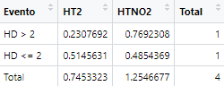

```{r include=FALSE}

#Ingresamos las librerías necesarias para correr la ppt
if(!require(readr)){install.packages('readr')}
library(readr)
if(!require(dplyr)){install.packages('dplyr')}
library(dplyr)
if(!require(ggplot2)){install.packages('ggplot2')}
library(ggplot2)
if (!require("reshape2")) { install.packages("reshape2") }
library(reshape2)
if (!require("gt")) { install.packages("gt") }
library(gt)
if (!require("patchwork")) { install.packages("patchwork") }
library(patchwork)
if (!require("DT")) { install.packages("DT") }
library(DT)

r <- function(x){return(round(x,digits = 2))}

#Ingresamos el data.frame usado en el código
DF <- read_csv("BaseDeDatos2.csv", col_types = "cnc")

```

## **INTRODUCCIÓN**

::: blue
**Importancia y justificación**
:::

Tomar apuntes, ya sea en alguna herramienta digital o tradicional, puede afectar positivamente en el aprendizaje universitario, fomentando la retención de información, el pensamiento crítico e incluso el desarrollo de habilidades tecnológicas. Además, si bien estamos rodeados de tecnología que nos puedan facilitar mejor en el aspecto educativo, es importante saber con qué tipo de herramienta para tomar apuntes se adaptan mejor los estudiantes.

::: blue
**Objetivo general**
:::

Analizar las preferencias de los estudiantes de UTEC de 3er y 4to ciclo en relación al uso de herramientas digitales y tradicionales en la toma de apuntes y resolución de problemas, para así determinar su impacto en la calidad del aprendizaje.

::: blue
**Objetivos especificos**
:::

1.  Comparar si la preferencia por herramientas digitales versus tradicionales varía acorde al ciclo.
2.  Determinar cuál es el tiempo promedio diario y gasto ideal promedio en el uso tanto de las herramientas digitales como tradicionales y su influencia en el aprendizaje académico.
3.  Conocer el nivel de aprendizaje del público objetivo seleccionado con respecto a la toma de apuntes y resolución de problemas en herramientas digitales contra las de uso tradicional.

## **DATOS** {data-background="Formsofficial.png" data-background-size="cover"}

::: blue
**Recolección de datos**
:::

Cuestionario en la plataforma de Google Forms

::: blue
**Población**
:::

Alumnos pre-grado del 3er y 4to ciclo de UTEC

::: blue
**Muestra**
:::

Realizadas a 155 estudiantes pre-grado de tercer <br>
a cuarto ciclo en UTEC.

::: blue
**Tipo de Muestreo**
:::

De tipo aleatorio estratificado.

## **VARIABLES**

```{r include=FALSE}
library(DT)

# Crear el DataFrame con las variables y descripciones
df <- data.frame(
  VARIABLE = c("Sexo", "Edad", "Carrera", "Ciclo", "Comodidad", "Herramienta", "Costo", "TiempoD", "TiempoT", "HerramientasD", "HerramientasT", "AprendizajeD", "AprendizajeT", "Importancia"),
  CLASE = c("Categórica", "Numérica", "Categórica", "Categórica", "Categórica", "Cuantitativa", "Numérica", "Numérica", "Numérica", "Numérica", "Numérica", "Categórica", "Categórica", "Categórica"),
  TIPO = c("Nominal", "Discreta", "Nominal", "Ordinal", "Nominal", "Nominal", "Continua", "Continua", "Continua", "Discreta", "Discreta", "Ordinal", "Ordinal", "Ordinal"),
  RESTRICCIÓN = c("Elegir entre las opciones", "Solo números entre 15 y 30", "Elegir entre las opciones", "Números enteros", "Elegir entre las opciones", "Respuesta corta", "Número", "Número", "Número", "Número entero", "Número entero", "Elegir entre las opciones", "Elegir entre las opciones", "Elegir entre las opciones"),
  DESCRIPCIÓN = c("Sexo de los estudiantes de UTEC", "Edad de los estudiantes de UTEC", "Carrera de los estudiantes de UTEC", "Ciclo de estudio de los estudiantes de UTEC", "Preferencia de comodidad en la toma de apuntes", "Herramientas utilizadas para tomar apuntes", "Costo dispuesto a gastar en herramientas", "Tiempo de uso de herramientas digitales", "Tiempo de uso de herramientas tradicionales", "Dispositivos electrónicos para tomar apuntes", "Utilización de materiales como cuadernos y bloc de notas", "Nivel de aprendizaje usando herramientas digitales", "Nivel de aprendizaje usando herramientas tradicionales", "Acuerdo con el uso de herramientas tradicionales en la toma de apuntes")
)

# Crear la tabla dinámica utilizando el paquete DT
variables <- datatable(df, rownames = FALSE)
```

```{r}
variables
```

## **DESCRIPTORES NUMÉRICOS**

```{r include=FALSE}
TDescritptores <- data.frame()
for (col in colnames(DF)) {
  if (is.numeric(DF[[col]])) {
    media <- round(mean(DF[[col]]),2)
    mediana <- round(median(DF[[col]]),2)
    minimo <- round(min(DF[[col]]),2)
    maximo <- round(max(DF[[col]]),2)
    cuartil1 <- round(quantile(DF[[col]], probs = 0.25),2)
    cuartil3 <- round(quantile(DF[[col]], probs = 0.75),2)
    desviacion_estandar <-round(sd(DF[[col]]),2)
    coeficiente_de_variacion <- round(desviacion_estandar/media,2)
    
    fila <- data.frame(
      Variable = col,
      Media = media,
      Mediana = mediana,
      Minimo = minimo,
      Maximo = maximo,
      Cuartil1 = cuartil1,
      Cuartil3 = cuartil3,
      Desviación_Estandar = desviacion_estandar,
      CoeficienteVariacion = coeficiente_de_variacion
    )
    
    TDescritptores <- rbind(TDescritptores, fila)
  }
}

tabla_descriptores <- gt(TDescritptores) %>%
  tab_header(
    title = "Tabla de Descriptores Numéricos",
  ) %>%
  cols_label(
    Variable = "Variable",
    Media = "Media",
    Mediana = "Mediana",
    Minimo = "Mínimo",
    Maximo = "Máximo",
    Cuartil1 = "Cuartil 1",
    Cuartil3 = "Cuartil 3",
    Desviación_Estandar = "Desviación Estándar",
    CoeficienteVariacion = "Coeficiente de Variación"
  ) %>%
  tab_style(
    locations = cells_body(),
    style = list(
      table.alignment = "center",
      cell_text(weight = "lighter"),
      cell_align = "center",
      cell_valign = "center"
    )
  )
```
```{r}
tabla_descriptores
```

## **GRÁFICOS DESCRIPTIVOS** {.flexbox .vcenter data-background="graficos.jpeg" data-background-size="cover"}

```{r include=FALSE}
# Comodidad según el ciclo
DF3 <- DF %>% group_by(Ciclo) %>% filter(Ciclo == "3")
frecCiclo3 <- table(DF3$Comodidad)
DF4 <- DF %>% group_by(Ciclo) %>% filter(Ciclo == "4")
frecCiclo4 <- table(DF4$Comodidad)
barp <- barplot(rbind(frecCiclo3, frecCiclo4), beside = TRUE, col = c("orange", "gray"), main = "Gráfica de barras dobles de comodidad según el ciclo",
 names.arg = c("Digital", "Tradicional"),
       ylab = "Frecuencia", xlab = "Ciclo")
legend("topleft", legend = c("CICLO 3", "CICLO 4" ),fill =  c("orange","gray"))
```

```{r include=FALSE}
# Tiempo vs Herramientas
par(mfrow = c(1, 2))
par(cex.main = 0.6, cex.lab = 0.6)
DFht <- filter(DF, HerramientasT > 0)
boxplot(formula = DFht$TiempoT ~ DFht$HerramientasT, data = data.frame(DFht$TiempoT, DFht$HerramientasT),
        col = "chocolate", border = "black", xlab = "Cantidad de dispositivos herramientas", ylab = "Tiempo de Uso (h)",
        main = "Boxplot Tradicional (Herramientas vs Tiempo en horas)")
media_TiempoT <- mean(DFht$TiempoT)
media_HerramientasT <- mean(DFht$HerramientasT)


DFhd <- filter(DF, HerramientasD > 0)
boxplot(formula = DFhd$TiempoD ~ DFhd$HerramientasD, data = data.frame(DFhd$TiempoD, DFhd$HerramientasD),
        col = "blue", border = "black", xlab = "Cantidad de dispositivos digitales", ylab = "Tiempo de Uso (h)",
        main = "Boxplot Digital (Herramientas vs Tiempo en horas)")
media_TiempoD <- mean(DFhd$TiempoD)
media_HerramientasD <- mean(DFhd$HerramientasD)

par(mfrow = c(1, 1))
```

## **PROBABILIDAD EMPÍRICA: Tiempo Tradicional**

<div class="blue">

*Espacio Muestral: 155*

```{r include=FALSE}
M <- nrow(DF)
M
```

```{r include=FALSE}
table(DF$TiempoT)
```

-   [**EVENTO:**]{style="color:darkblue"} *Seleccionar la probabilidad de que el estudiante le dedique tiempo a estudiar mediante herramientas tradicionales en un rango de:*

```{r include=FALSE}
tt02 <- filter(DF, TiempoT < 2) #hacemos el filter en el rango
fitt02 <- nrow(tt02) #hallamos la frecuencia del filter final
fitt02
Px02 <- fitt02/M #hallamos la probabilidad con la formula
cat("La probabilidad es:", Px02, " \n ") #imprimimos
```

```{r include=FALSE}
tt24 <- filter(DF, TiempoT >= 2) #hacemos el filter en el rango
tt24 <- filter(tt24, TiempoT < 4)
fitt24 <- nrow(tt24) #hallamos la frecuencia del filter final
fitt24
Px24 <- fitt24/M #hallamos la probabilidad con la formula
cat("La probabilidad es:", Px24, " \n ") #imprimimos
```

```{r include=FALSE}
tt46 <- filter(DF, TiempoT >= 4) #hacemos el filter en el rango
tt46 <- filter(tt46, TiempoT < 6)
fitt46 <- nrow(tt46) #hallamos la frecuencia del filter final
fitt46
Px46 <- fitt46/M #hallamos la probabilidad con la formula
cat("La probabilidad es:", Px46, " \n ") #imprimimos
```

```{r include=FALSE}
tt68 <- filter(DF, TiempoT >= 6) #hacemos el filter en el rango
tt68 <- filter(tt68, TiempoT < 8)
fitt68 <- nrow(tt68) #hallamos la frecuencia del filter final
fitt68
Px68 <- fitt68/M #hallamos la probabilidad con la formula
cat("La probabilidad es:", Px68, " \n ") #imprimimos
```

```{r include=FALSE}
tt810 <- filter(DF, TiempoT >= 8) #hacemos el filter en el rango
tt810 <- filter(tt810, TiempoT < 10)
fitt810 <- nrow(tt810) #hallamos la frecuencia del filter final
fitt810
Px810 <- fitt810/M #hallamos la probabilidad con la formula
cat("La probabilidad es:", Px810, " \n ") #imprimimos
```

```{r include=FALSE}
tt1012 <- filter(DF, TiempoT >= 10) #hacemos el filter en el rango
tt1012 <- filter(tt1012, TiempoT < 12)
fitt1012 <- nrow(tt1012) #hallamos la frecuencia del filter final
fitt1012
Px1012 <- fitt1012/M #hallamos la probabilidad con la formula
cat("La probabilidad es:", Px1012, " \n ") #imprimimos
```

```{r include=FALSE}
PTtt <- (Px02+Px24+Px46+Px68+Px810+Px1012)
cat("La probabilidad es:", PTtt, " \n ") #imprimimos
```

```{r include = FALSE}
if(!require(DT)){install.packages('DT')}
library(DT)


# Datos para Tiempo Tradicional
rangos <- c("[0,2)", "[2,4)", "[4,6)", "[6,8)", "[8,10)", "[10, 12]")
frecuencias <- c(fitt02,fitt24 ,fitt46 , fitt68, fitt810,fitt1012)
probabilidades <- c(Px02, Px24, Px46, Px68, Px810, Px1012)

# Crear la tabla
tabla <- data.frame(Rango = rangos, Frecuencia = frecuencias, Probabilidad = probabilidades)

# Opciones para reducir los espacios entre columnas
opciones <- list(
  columnDefs = list(
    list(targets = "_all", className = "dt-center", width = "50px")
  )
)
```

```{r}
datatable(tabla, editable = TRUE, rownames = FALSE, options = opciones)
```


## **PROBABILIDAD CONDICIONAL**
::: blue
#### *Evento independiente o dependiente* 
:::

<div class="columns">

::: {style="width:45%; float:left; font-size: 2px;"}
Evento: Probabilidad de que el estudiante disponga de 2 herramientas digitales para estudiar y que su gasto máximo en herramientas tradicionales supere o sea igual 35 soles. Variable: Herramientas Digital (HerramientasD)

::: blue
*TEOREMA DE BAYES*
:::

Declaramos los dos posibles sucesos del evento y su probabilidad, dividiendo su cantidad con el total

```{r}
M <- 155
DFHd2 <- filter(DF, HerramientasD == 2) 
PHd2 <- nrow(DFHd2)/M   
```

Ahora realizamos los dos sucesos que se desprenden del evento:

```{r}
DFHd2gtmax <- filter(DFHd2, GastoMaxT >= 35) 
PHd2gtmax <- nrow(DFHd2gtmax)/nrow(DFHd2) 
```
:::

Al concluir de hacer los cálculos podemos emplear la siguiente formula.

$\frac{a_{11}}{T_b} = \frac{T_a}{T}$

Al implementar está formula, y al desarrollar el problema de manera inversa si los resultados son iguales podemos afirmar que la variable es independiente.

::: blue
*VALIDACION DE DEPENDENCIA*
:::

Consideramos el valor de a11, a12, a21 y a22 según la tabla de proporciones.

```{r include=FALSE}
DFhdmax <- filter(DF, HerramientasD > 2) #50/155
Phdmax <- nrow(DFhdmax)/M
DFhdmin <- filter(DF, HerramientasD <= 2) #105/155
Phdmin <- nrow(DFhdmin)/M
DFhdmaxt <- filter(DFhdmax, HerramientasT == 2) #12/50
Phhdmaxt <- nrow(DFhdmaxt)/nrow(DFhdmax)
DFhddift <- filter(DFhdmax, HerramientasT != 2) #12/50
Phhddift <- nrow(DFhddift)/nrow(DFhdmax)
DFhdmint <- filter(DFhdmin, HerramientasT == 2) #12/50
Phhdmint <- nrow(DFhdmint)/nrow(DFhdmin)
DFhddift2 <- filter(DFhdmin, HerramientasT != 2) #12/50
Phhddift2 <- nrow(DFhddift2)/nrow(DFhdmin)
Pcond1Hdgt <- Phdmax * Phhddift 
Pcond1Hdgt
DFht2 <- filter(DF, HerramientasT == 2) #52/155
Pht2 <- nrow(DFht2)/M
DFhtexc <- filter(DF, HerramientasT != 2) #103/155
Phtexc <- nrow(DFhtexc)/M
DFht2dmax <- filter(DFht2, HerramientasD > 2)  #12/50
Phhdmaxt <- nrow(DFht2dmax)/nrow(DFht2)
DFht2dmin <- filter(DFht2, HerramientasD <= 2) #40/52
Phhddift <- nrow(DFht2dmin)/nrow(DFht2)
DFhtexcdmax <- filter(DFhtexc, HerramientasT > 2) #53/103
Phtexcdmax <- nrow(DFhtexcdmax)/nrow(DFhtexc)
DFhtexcdmin <- filter(DFhtexc, HerramientasT <= 2) #50/103
Phtexcdmin  <- nrow(DFhtexcdmin)/nrow(DFhtexc)
Pcond1Hdgt <- Phtexc *Phtexcdmax
Pcond1Hdgt
Pa11hthd <- nrow(DFht2dmax)/nrow(DFht2)
Pa12hthd <- nrow(DFhtexcdmax)/nrow(DFhtexc)
Pa21hthd <- nrow(DFht2dmin)/nrow(DFht2)
Pa22hthd <- nrow(DFhtexcdmin)/nrow(DFhtexc)
Thtmax <- Pa11hthd+Pa21hthd
Thtmin <- Pa12hthd+Pa22hthd
Thdmax <- Pa11hthd+Pa12hthd
Thdmin <- Pa21hthd+Pa22hthd
TTht <- Thtmax + Thtmin
TThd <- Thdmax + Thdmin
TT <- TThd + TTht   
```

```{r include = FALSE}

# Datos para Tiempo Tradicional
eventos <- c("HD > 2", "HD <= 2", "Total")
HTsi2 <- c(Pa11hthd , Pa12hthd , Thdmax)
HTno2 <- c(Pa21hthd , Pa22hthd , Thdmin)
total <- c(Thtmax, Thtmin, TT)

# Crear la tabla
tabla <- data.frame(Evento = eventos, HT2 = HTsi2, HTNO2 = HTno2,Total = total)

# Opciones para reducir los espacios entre columnas
opciones <- list(
  columnDefs = list(
    list(targets = "_all", className = "dt-center", width = "50px")
  )
)
```
 
```{r include = FALSE}
datatable(tabla, editable = TRUE, rownames = FALSE, options = opciones)
```

{height="96," width="250"}
 
Si los resultados son iguales del teorema de bayes y la validación podemos afirmar que la variable es independiente.

## [*Var. Discretas*]{style="color:darkblue"}

<div class="columns">

<div style="width:50%; float:left; font-size: 2px;">

<span style="color: blue;"> **Variable: Aprendizaje Tradicional (AprendizajeT)** </span>

*Binomial* -> N° de encuestados/éxitos en 155 observaciones. P(E) -> f(5) -> at = 5.

**${X}$ **-> Número de encuestados que definieron su nivel de aprendizaje en herramientas tradicionales tal que 5 P(X = 5).

$X \sim \text{Binomial}(p, M): p \rightarrow P(X = 5)$ <br>
Donde el éxito (X) está definido tal que <br>
AprendizajeT = 5.

```{r echo=FALSE, fig.width=4, fig.height=3}
M = 155
DFat5 <- filter(DF, AprendizajeT == 5)
p <- nrow(DFat5)/M
d <- dbinom(0:M, M, p)
# Crear el gráfico de barras
barplot(d, names.arg = 0:M, xlab = "Número de éxitos", ylab = "Probabilidad", main = "Distribución Binomial")
```
</div>

*Ejemplo:* 

IPSOS Perú quiere conocer a que trascienden las capacidades de aprendizaje disponibles en las herramientas de carácter tradicional por sobre la tecnología de punta. Por ello, está entusiasmado en *conocer la probabilidad de que 20% o mas de los estudiantes encuestados encuentre al aprendizaje en herramientas tradicionales en el escaño más bajo, lo que simbolice que la preocupación ante el incremento del uso de dispositivos electrónicos integralmente en nuestras vidas. Se sabe que **la encuesta consta de 155 respuestas, tal que **el aprendizaje se mide del 1 al 5. ***¿Indicará esto un riesgo preocupante?**

```{r include=FALSE}
# Nos piden la probabilidad tal que los estudiantes consideren que AprendizajeT es igual a 1 sea mayor al 20% de los encuestados. Ello, por regla de tres es igual a 31 de los encuestados.
# En probabilidades, esto se escribe tal que (X>31), donde X es el cantidad de encuestados donde se observa el éxito (donde Aprendizaje T es igual a 1)
# Procedemos a hallar la probabilidad de que AprendizajeT sea igual a 1
DFat1 <- filter(DF, AprendizajeT == 1)
Pat1 <- nrow(DFat1)/M
# La distribución usada es de carácter binomial, por tanto, se usa probabilidad binomial.
PB <- pbinom(31, 155, Pat1, lower.tail = F)
```
```{r echo=FALSE}
# Donde lower tail indica el que la cantidad de éxitos esperada es mayor al numero de encuestados  seleccionados.
cat("La probabilidad de que más del 20% de los encuestados considere 
    su aprendizaje en herramientas tradicionales 
    como un 1 de 5, es del ", PB*100,"%.")
```
A efectos prácticos, esto *no supone un riesgo del que preocuparse en lo absoluto*.

</div>
</div>

---

<div class="columns">

<div style="width:50%; float:left; font-size: 2px;">

<span style="color: blue;"> **Variable: Herramientas Digitales (HerramientasD)** </span>

Distribución: Geometrica

${X}$ -> Número de encuestados que sean 15 alumnos de tercer ciclo que usan menos de 3 herramientas digitales 
tal que 15 es la cantidad de veces que se tiene que repetir el proceso para que se cumpla el suceso pedido P(X = 15) en 67 observaciones.

$X \sim \text{Geométrica}(p, M3ci): p \rightarrow P(X = 15)$ <br>
Donde el éxito (X) está definido tal que HerramientasD < 3 

```{r echo=FALSE, fig.width=4, fig.height=3}
# Cálculo de probabilidades
p <- 38/67  # Probabilidad de éxito en un solo ensayo
k <- 1:15  # Número de ensayos (hasta el quinto ensayo)
probabilidades <- p * (1 - p)^(k-1)  # Función densidad
# Crear el gráfico de barras con colores negros o grises
barplot(probabilidades, names.arg = k,,
        xlab = "Número de ensayos",
        ylab = "Probabilidad acumulada",
      )
```

M3ci -> Espacio muestral, M (Definido por las observaciones de los alumnos de 3er ciclo)

</div>
Ejemplo: 

El ministerio de educación está que realiza una investigación con respecto al uso de herramientas digitales en los alumnos los cuales cursan el tercer ciclo dentro de la universidad de Ingeniería y Tecnología(UTEC), se sabe que la muestra a analizar es de 67 alumnos(elegidos de manera aleatoria), y que se quiere hallar cuan probable es que 38 estudiantes o más tengan 3 o menos herramientas digitales a su disposición para el estudio. Por ello el ministerio de educación le pide usted alumno de UTEC que pueda comentarles cual es la probabilidad de que al elegir a 10 personas de entre la muestra dada tenga 3 o menos herramientas digitales, para así poder apoyar con su estudio de la dependencia de las herramientas de estudio con respecto al rendimiento académico.
```{r echo=FALSE}
# Nos piden la probabilidad tal que los estudiantes de tercer ciclo consideren que HerramientasD sea 3 o menos en una submuestra de nimiamente 38 encuestados de 67.
# En probabilidades, esto se escribe tal que (X>38), donde X es el cantidad de encuestados donde se observa el éxito (donde Aprendizaje T es igual a 1)
# Procedemos a hallar la probabilidad de que Herramientas sea igual o menor a 3 
DFhd1 <- filter(DF, Ciclo == 3)
DFhd1 <- filter(DFhd1, HerramientasD <= 3)
Phd1 <- nrow(DFhd1)/67
# La distribución usada es de carácter binomial, por tanto, se usa probabilidad binomial.
PB2 <- pbinom(38, 67, Phd1)
# Donde lower tail indica el que la cantidad de éxitos esperada es mayor al numero de encuestados  seleccionados.
cat("La probabilidad de que más de 38 encuestados 
    posea 3 o menos herramientas digitales, es 
    del ", PB2*100,"%.")

```

</div>
</div>


## [*Var. Continuas*]{style="color:darkblue"}


<div class="columns">

<div style="width:50%; float:left; font-size: 2px;">

<span style="color: blue;"> **Variable: Tiempo destinado al estudio en herramientas digitales (TiempoD)** </span>

```{r echo=FALSE, fig.width=4, fig.height=3}

hist(DF$TiempoD, breaks = 15, col = "chocolate", border = "black", 
     xlab = "TiempoD", ylab = "Frecuencia de encuestados", main = "Histograma del TiempoD")
```


```{r echo=FALSE}
# Media = Mediana
medtd <- mean(DF$TiempoD)
meditd <- median(DF$TiempoD)
```

 **Media: 5.865613** <br>
 **Mediana: 6 **

```{r echo=FALSE}
desvtd <- sd(DF$TiempoD)
```

**Desviación estándar: 2.58**
```{r include=FALSE}
# Calculamos la varianza
vartd <- (sd(DF$TiempoD))^2
vartd
vartd2 <- sum((DF$TiempoD-5.865613)^2)/155
vartd2
# NOS DAMOS CUENTA QUE SON LO MISMO

# Calculamos la esperanza
espetd <- mean(DF$TiempoD)
espetd

expected_value <- function(.density_function, ...) {
  integral <- integrate(function(x) x * .density_function(x, ...), 
                        lower = -Inf, 
                        upper = Inf)
  integral$value
}

espetd2 <- expected_value(dnorm, mean = medtd, sd = desvtd)
espetd2
```
 </div>
**Varianza: 6.662016** <br>
**Esperanza: 5.865613**

$X \sim \mathcal{N}(5.87, 2.58)$ <br>
Donde $X$ sigue una distribución normal con media 5.87 y desviación estándar 2.58.

EJEMPLO: 
Una empresa de productos electrónicos quiere firmar un convenio con la UTEC para ofrecer sus productos a los alumnos de 3er y 4to ciclo. La empresa hará el convenio si la cantidad de tiempo que invierten los alumnos en el uso de dispositivos digitales para la toma de apuntes de una población muestral de tamaño 155 es mayor a 9 horas. La desviación estándar es de 2.58 y el promedio aritmético de los alumnos de tiempo destinado a dispositivos electrónicos para el estudio es de 5.87. ¿Cuál sería la probabilidad de que esto ocurra?
P(X>9)
```{r include=FALSE}
pnorm(9, medtd, desvtd, lower.tail = F)
```
<span style="color: green;"> Resultado: 0.11 </span>

</div>
</div>

## **CONCLUSIONES**

<ul style="list-style-type: disc;">
  <li>Si se observa la gráfica de barras que compara el ciclo con la herramienta de preferencia, se hace notar que el interés en el uso de herramientas digitales se mantiene en ambos ciclos, mientras que en las herramientas tradicionales hay un aumento considerable.</li>
  <li>En los gráficos de boxplots que comparan la cantidad de herramientas con la cantidad que son usadas por los estudiantes, se puede apreciar que los segundos quartiles son cada vez mayores a mediad que suben la cantidad de herramientas usadas. Es decir, mientras mas cantidad de herramientas usan los alumnos la cantidad de uso con esas herramientas será mayor. </li>
  <li>A partir del teorema de bayes, evidenciamos que la dependencia e
    independencia de las variables se relaciona a la semejanza de la
    aparición de sucesos a causa de diferentes sucesos previos.</li>
  <li>Se observa que las variables probabilísticas continuas y discretas
    cumplen con la distribución observada: la esperanza, la varianza y
    ello se ve reflejado en los distintos eventos y sus gráficas.</li>
  <li>Al analizar las variables discretas, se puede notar, que la
    distribución binomial se asemeja a una función normal, ya que posee
    una ondulación en la parte central de la gráfica mientras que la
    geométrica se asemeja a una función exponencial. Por otro lado,ambas
    variables continuas se asemejan a una distribución normal.</li>
  <li>Los datos obtenidos en el estudio realizado sobre el uso de
    herramientas tanto digitales y tradicionales permite evaluar las
    tendencias de los estudiantes, lo que facilita determinar el impacto
    de las herramientas digitales ante las ya consolidadas tradicionales
    en la educación.</li>
</ul>


