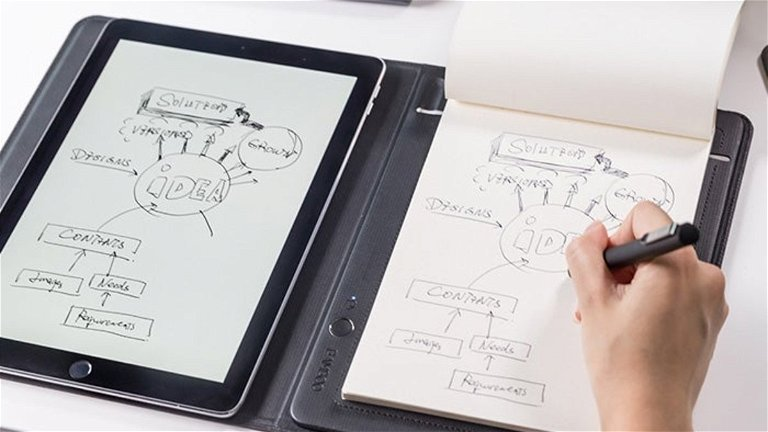

---
output:
  html_document:
    df_print: paged
    toc: yes
    toc_float: yes
    number_sections: no
    code_folding: hide
  pdf_document:
    toc: yes
editor_options: 
  markdown: 
    wrap: 72
---

# [**Análisis de comparación en la toma de apuntes y resolución de problemas con herramientas digitales y tradicionales en los estudiantes de UTEC de 3er y 4to ciclo.**]{style="color:black"}

::: {style="text-align:center"}
{height="500," width="500"}
:::

\

## [**1 Introducción**]{style="color:darkred"}

\

### [**1.1. Importancia y Justificación**]{style="color:darkblue"}

Tomar apuntes, ya sea en alguna herramienta digital o tradicional, puede
afectar positivamente en el aprendizaje universitario, fomentando la
retención de información, el pensamiento crítico e incluso el desarrollo
de habilidades tecnológicas. Además, si bien estamos rodeados de
tecnología que nos puedan facilitar mejor en el aspecto educativo, es
importante saber con qué tipo de herramienta para tomar apuntes se
adaptan mejor los estudiantes.

\

### [**1.2. Objetivos**]{style="color:darkblue"}

\

#### [**1.2.1. Objetivo General**]{style="color:blue"}

Analizar las preferencias de los estudiantes de UTEC de 3er y 4to ciclo
en relación al uso de herramientas digitales y tradicionales en la toma
de apuntes y resolución de problemas, para así determinar su impacto en
la calidad del aprendizaje.

\

#### [**1.2.2. Objetivos Específicos**]{style="color:blue"}

1.  Comparar si la preferencia por herramientas digitales versus
    tradicionales varía acorde al ciclo.
2.  Determinar cuál es el tiempo promedio diario en el uso tanto de las
    herramientas digitales como tradicionales y su influencia en el
    aprendizaje académico.
3.  Determinar las distribuciones de las variables de los diferentes
    eventos probabílisticos propuestos.

### [**1.3. Contexto**]{style="color:darkblue"}

En UTEC, el uso de estas herramientas no es la excepción. En ese
sentido, como parte de nuestra investigación, se realizó una encuesta
sobre la importancia de las herramientas digitales y tradicionales en la
toma de apuntes y resolución de problemas como estudiantes de UTEC de
3er y 4to ciclo, con la finalidad de compararlas y obtener conclusiones
al respecto.

\

### [**1.4. Paquetes y Librerías**]{style="color:darkblue"}

-   Comprobamos si los **paquetes** utilizados a lo largo del proyecto
    **han sido instalados**. En caso no suceda, el programa los instala
    automáticamente.

```{r}
if (!require("readr")) { install.packages("readr")}
if (!require("dplyr")) { install.packages("dplyr") }
if (!require("ggplot2")) { install.packages("ggplot2") }
if (!require("reshape2")) { install.packages("reshape2") }
if (!require("gt")) { install.packages("gt") }
if (!require("patchwork")) { install.packages("patchwork") }
if (!require("MASS")) { install.packages("MASS") }
if (!require("survival")) { install.packages("survival") }
if (!require("rriskDistributions")) { install.packages("rriskDistributions") }
if (!require("data.table")) { install.packages("data.table") }
```

-   **Llamamos a las librerías** que usaremos tras instalar los paquetes
    correspondientes.

```{r}
library(readr)
library(dplyr)
library(ggplot2)
library(reshape2)
library(gt)
library(patchwork)
library(rriskDistributions)
library(data.table)
```

\

## [**2. Datos**]{style="color:darkred"}

\

### [**2.1 Proceso de recolección de datos:**]{style="color:darkblue"}

\

#### [**2.1.1. Descripción General:**]{style="color:blue"}

Para la recolección de datos se hará una encuesta cuya finalidad es
obtener información que represente a nuestra población estudiantil. Para
recolectar los datos se seguirá el siguiente proceso. En primer lugar,
realizaremos un formulario con preguntas exactas para obtener el
resultado deseado. Después, la estrategia a seguir para recolectar
información de los encuestados y hacerlo en el menor tiempo posible será
la compra de *Olé Olé* y ofrecer a la persona que nos ayudará llenando
nuestro formulario para así posteriormente trabajar con estos.

\

### [**2.2. Población, muestra y muestreo:**]{style="color:darkblue"}

-   **Población:** Estudiantes cursando un pregrado en UTEC dentro del
    semestre 2023-1.

-   **Muestra:** Realizadas a 155 estudiantes pre-grado de tercer a
    UTEC.

-   **Muestreo:** De tipo aleatorio simple.

\

### [**2.3 Variables**]{style="color:darkblue"}

| Pregunta Formulada                                                                                                                                                                                  | Variable      | Tipo de Variable   | Restricciones                     |
|-------------------|------------------|------------------|------------------|
| Sexo                                                                                                                                                                                                | Sexo          | Categórica nominal | Elegir entre las opciones         |
| Edad                                                                                                                                                                                                | Edad          | Numérica discreta  | Solo número enteros entre 15 y 30 |
| Carrera                                                                                                                                                                                             | Carrera       | Categórica nominal | Elegir entre las opciones         |
| Ciclo                                                                                                                                                                                               | Ciclo         | Categórica nominal | Solo número enteros entre 1 y 10  |
| ¿Es más cómodo para usted realizar apuntes o resolver ejercicios de manera: \*Tradicional (cuaderno, papel, libreta); \*Digital (tablet, laptop, celular)?                                          | Comodidad     | Categórica nominal | Elegir entre las opciones         |
| ¿Qué herramienta utilizas con mayor frecuencia para la toma de apuntes y resolución de ejercicios? ¿Elija la opción más recurrente entre las observadas?                                            | Herramienta   | Categórica nominal | Elegir entre las opciones         |
| ¿Cuánto es lo máximo que ha gastado en soles en una herramienta digital (Laptop, tablet, etc)?                                                                                                      | GastoMaxD     | Numérica continua  | Número                            |
| ¿Cuánto es lo máximo que ha gastado en soles en una herramienta tradicional (Cuaderno, libretas, etc)?                                                                                              | GastoMaxT     | Numérica continua  | Número                            |
| ¿Cuánto tiempo utiliza herramientas digitales al día para el estudio?                                                                                                                               | TiempoD       | Numérica continua  | Número                            |
| ¿Cuánto tiempo utiliza herramientas tradicionales al día para el estudio?                                                                                                                           | TiempoT       | Numérica continua  | Número                            |
| Respecto a las herramientas digitales, ¿Cuántos dispositivos electrónicos dispone para tomar apuntes y resolver ejercicios?                                                                         | HerramientasD | Numérica discreta  | Número entero                     |
| Respecto a las herramientas tradicionales, ¿Usted utiliza cuaderno, bloc de notas, etc.. para tomar apuntes y resolver ejercicios? Si es así, ¿cuántos usa por ciclo?                               | HerramientasT | Numérica discreta  | Número entero                     |
| Del 1 al 5, ¿Qué tanto aprende usted usando herramientas digitales para la toma de apuntes o resolución de problemas?                                                                               | AprendizajeD  | Categórica ordinal | Elegir entre las opciones         |
| Del 1 al 5, ¿Qué tanto aprende usted usando herramientas tradicionales para la toma de apuntes o resolución de problemas?                                                                           | AprendizajeT  | Categórica ordinal | Elegir entre las opciones         |
| ¿Qué tan de acuerdo está con la siguiente frase: 'El uso de herramientas tradicionales es más importante en la toma de apuntes y resolución de problemas comparado a los dispositivos electrónicos? | Importancia   | Categórica ordinal | Elegir entre las opciones         |

\

-   **Declaramos el dataframe editado** que usaremos a lo largo de la
    última entrega.

```{r}
DF <- read_csv("BaseDeDatos2.csv", col_types = "cnc")
```

\

## [**3. Análisis descriptivo y justificación**]{style="color:darkred"}

\

### [**3.1. Descriptores numéricos**]{style="color:darkblue"}

```{r}

TDescritptores <- data.frame()
for (col in colnames(DF)) {
  if (is.numeric(DF[[col]])) {
    media <- round(mean(DF[[col]]),2)
    mediana <- round(median(DF[[col]]),2)
    minimo <- round(min(DF[[col]]),2)
    maximo <- round(max(DF[[col]]),2)
    cuartil1 <- round(quantile(DF[[col]], probs = 0.25),2)
    cuartil3 <- round(quantile(DF[[col]], probs = 0.75),2)
    desviacion_estandar <-round(sd(DF[[col]]),2)
    coeficiente_de_variacion <- round(desviacion_estandar/media,2)
    
    fila <- data.frame(
      Variable = col,
      Media = media,
      Mediana = mediana,
      Minimo = minimo,
      Maximo = maximo,
      Cuartil1 = cuartil1,
      Cuartil3 = cuartil3,
      Desviación_Estandar = desviacion_estandar,
      CoeficienteVariacion = coeficiente_de_variacion
    )
    
    TDescritptores <- rbind(TDescritptores, fila)
  }
}

tabla_final <- gt(TDescritptores) %>%
  tab_header(
    title = "Tabla de Descriptores Numéricos",
  ) %>%
  cols_label(
    Variable = "Variable",
    Media = "Media",
    Mediana = "Mediana",
    Minimo = "Mínimo",
    Maximo = "Máximo",
    Cuartil1 = "Cuartil 1",
    Cuartil3 = "Cuartil 3",
    Desviación_Estandar = "Desviación Estándar",
    CoeficienteVariacion = "Coeficiente de Variación"
  ) %>%
  tab_style(
    locations = cells_body(),
    style = list(
      table.alignment = "center",
      cell_text(weight = "lighter"),
      cell_align = "center",
      cell_valign = "center"
    )
  )

tabla_final
```

-   [**JUSTIFICACIÓN:**]{style="color:darkblue"}

    -   Los descriptores numéricos son valores numéricos que se utilizan
        para resumir o describir un conjunto de datos o una variable en
        particular. Estos descriptores proporcionan información sobre
        las características y propiedades de los datos, lo que nos
        permite comprender mejor su distribución, tendencia central,
        dispersión, forma y otros aspectos importantes.

-   [**ANÁLISIS:**]{style="color:darkblue"}

    -   La aproximación entre la media y mediana en la mayoría de
        nuestras variables es minoritario, exceptuando la variable
        "Gasto Máximo Digital", en esta variable la diferencia dada
        entre la media y mediana trasciende a 112.84.

    -   Dentro de todas nuestras variables la que tiene mayor
        variabilidad es "El Gasto Mínimo Tradicional" el cual se
        encuentra con un coeficiente de variación de 0.89. Así mismo la
        variable que cuenta con menor variabilidad es "Edad" la cual se
        le designa un valor de 0.08.

    -   Tanto las Herramientas Digitales y Tradicionales tienen el mismo
        máximo y mínimo, estos son 0 y 6 respectivamente. Este mismo
        fenómeno pasa también con las variables de Aprendizaje tanto
        Digital y Tradicional, pero en este caso tienen un máximo de 5 y
        un mínimo de 1.

\

### [**3.2. Descriptores Gráficos**]{style="color:darkblue"}

\

#### [**3.2.1. Ciclo y herramientas predilectas**]{style="color:blue"}

```{r}
par(mfrow = c(1, 2), mar = c(4, 4, 2, 2))
frecuenciaCiclo <- table(DF$Ciclo)
barp <- barplot(frecuenciaCiclo, beside = TRUE, xlab = "Ciclo cursado", ylab = "Frecuencia relativa",
                col = c("red", "green", "gray"), ylim = c(0, 120))
legend("topright", legend = c("3ro", "4to"),
       fill = c("red", "green", "gray"), cex = 0.8)
text(barp, frecuenciaCiclo + 5.5, labels = frecuenciaCiclo)
title(main = "Gráfico de barras\npor ciclo cursado", cex.main = 0.9, font.main = 1)

conteo <- table(DF$Herramienta)
max_conteo <- max(conteo)
bp <- barplot(conteo, xlab = "Opciones de herramienta", ylab = "Cantidad de encuestados", ylim = c(0, 75))
text(x = bp, y = conteo, labels = conteo, pos = 3)
par(mar = c(5, 4, 4, 2) + 0.1)
title(main = "Gráfico de barras\nherramientas predilectas", cex.main = 0.9, font.main = 1)
par(mfrow = c(1, 1))
```

-   [**ANÁLISIS:**]{style="color:darkblue"}

    -   Se infiere que la gráfica de preferencia de herramientas muestra
        una forma de campana, lo que indica que las opciones en el
        centro son las más solicitadas. Esta conclusión se realiza al
        obviar las opciones de celular y otro, que claramente no son
        tendencia en la variable de herramienta.

    -   Al analizar las opciones de herramientas digitales (Laptop,
        Celular y Tablet) y herramientas tradicionales (Cuaderno y Bloc
        de Notas), se observa que representan el 49.7% de los votos cada
        una. Esto indica que la suma de los votos en ambas categorías es
        equivalente y que cada una se distribuye entre sí a 77
        encuestados.

\

#### [**3.2.2. Comodidad según el ciclo**]{style="color:blue"}

```{r}

DF3 <- DF %>% group_by(Ciclo) %>% filter(Ciclo == "3")
frecCiclo3 <- table(DF3$Comodidad)
DF4 <- DF %>% group_by(Ciclo) %>% filter(Ciclo == "4")
frecCiclo4 <- table(DF4$Comodidad)
barp <- barplot(rbind(frecCiclo3, frecCiclo4), beside = TRUE, col = c("orange", "gray"), main = "Gráfica de barras dobles de comodidad según el ciclo",
 names.arg = c("Digital", "Tradicional"),
       ylab = "Frecuencia", xlab = "Ciclo")
legend("topleft", legend = c("CICLO 3", "CICLO 4" ),fill =  c("orange","gray"))

```

-   [**ANÁLISIS**]{style="color:darkblue"}

    -   Tanto en el ciclo 3 como en el ciclo 4, el margen de la
        diferencia entre encuestados que sintieron mayor comodidad
        usando herramientas digitales es de 2 encuestados, lo que
        gráficamente la muestra casi pareja y estadísticamente los
        mantiene separados por un 1.3%.

    -   Se demuestra que a los encuestados les resulta mucho más cómodo
        el uso de herramientas tradicionales con un 61.8% respecto al
        38.2% de los votantes de herramientas digitales.
        Porcentualmente, esto supone un 23.6% de diferencia.

\

#### [**3.2.3. Tiempo VS Herramientas**]{style="color:blue"}

```{r}
par(mfrow = c(1, 2))
par(cex.main = 0.6, cex.lab = 0.6)
DFht <- filter(DF, HerramientasT > 0)
boxplot(formula = DFht$TiempoT ~ DFht$HerramientasT, data = data.frame(DFht$TiempoT, DFht$HerramientasT),
        col = "chocolate", border = "black", xlab = "Cantidad de dispositivos herramientas", ylab = "Tiempo de Uso (h)",
        main = "Boxplot Tradicional (Herramientas vs Tiempo en horas)")
media_TiempoT <- mean(DFht$TiempoT)
media_HerramientasT <- mean(DFht$HerramientasT)


DFhd <- filter(DF, HerramientasD > 0)
boxplot(formula = DFhd$TiempoD ~ DFhd$HerramientasD, data = data.frame(DFhd$TiempoD, DFhd$HerramientasD),
        col = "blue", border = "black", xlab = "Cantidad de dispositivos digitales", ylab = "Tiempo de Uso (h)",
        main = "Boxplot Digital (Herramientas vs Tiempo en horas)")
media_TiempoD <- mean(DFhd$TiempoD)
media_HerramientasD <- mean(DFhd$HerramientasD)

par(mfrow = c(1, 1))
```

-   [**ANÁLISIS:**]{style="color:darkblue"}

    -   Mientras que el tiempo de uso de herramientas tradicionales
        varía significativamente, especialmente cuando se utilizan entre
        1 y 4 herramientas, el tiempo de uso de herramientas digitales
        muestra una mayor consistencia, especialmente cuando se utilizan
        2 herramientas.

    -   En el caso de las herramientas digitales, el rango de tiempo de
        uso para aquellos que utilizan 4 herramientas se sitúa entre las
        5 y 8 horas al día. Por otro lado, en el caso de las
        herramientas tradicionales, aquellos que utilizan 4 y 3
        dispositivos tienden a alcanzar un tiempo de uso máximo
        aproximado mayor a 10 horas. Para el caso de 3 dispositivos, es
        el máximo total. En cambio, para el de 4 dispositivos es un
        punto disperso.

    -   Mientras que la mayoría de las personas que utilizan
        herramientas digitales utilizan una sola herramienta durante
        aproximadamente 5 horas y media al día, solo una persona utiliza
        6 herramientas digitales dedicando 2 horas al día a su uso. Del
        mismo modo, el uso de múltiples herramientas tradicionales se
        observa principalmente en aquellos que utilizan 4, 3, 2 y 1
        dispositivos.

\

#### [**3.2.3. Aprendizaje VS Ciclo**]{style="color:blue"}

Realizamos una gráfica de mosaico para las variables Aprendizaje
tradicional, digital, y ciclo, donde juntaremos el tipo de aprendizaje
con ciclo para comparar ambas gráficas.\

```{r}
par(mfrow = c(1, 2))

par(cex.main = 0.5)
tabaprendizajeTyciclo<-table(DF$AprendizajeT ,DF$Ciclo)
mosaicplot(tabaprendizajeTyciclo,main="Gráfico de mozaico del Aprendizaje Tradicional contra el Ciclo" ,col=c("orange", "yellow"))

tabaprendizajeDyciclo<-table(DF$AprendizajeD ,DF$Ciclo)
mosaicplot(tabaprendizajeDyciclo,main="Gráfico de mozaico del Aprendizaje Digital contra el Ciclo" ,col=c("blue", "lightblue"))

par(mfrow = c(1, 1))
```

-   [**ANÁLISIS:**]{style="color:darkblue"}

    -   Tanto en el tercer como en el cuarto ciclo, hay una baja
        proporción de encuestados que consideran que no aprenden o
        dominan los temas utilizando dispositivos digitales para sus
        apuntes o solución de ejercicios. Esto sugiere que la mayoría de
        los estudiantes utilizan dispositivos digitales en su proceso de
        aprendizaje.

    -   En el cuarto ciclo, hay una mayor proporción de estudiantes que
        creen que no aprenden casi nada utilizando dispositivos
        electrónicos en comparación con el tercer ciclo. Además, la
        mayoría de los estudiantes que consideran que utilizar
        herramientas digitales no les ha funcionado para nada pertenecen
        al cuarto ciclo.

    -   La mayoría de los estudiantes encuestados sienten que el uso de
        bloc de notas, cuadernos u otras herramientas tradicionales está
        por encima del nivel medio de aprendizaje. Esto sugiere que más
        del 50% de los estudiantes consideran que aprenden mejor
        utilizando herramientas tradicionales en comparación con las
        herramientas digitales.

\

#### [**3.2.4. Gasto Máximo Tradicional**]{style="color:blue"}

```{r}
par(mfrow = c(1, 2))
par(cex.main = 0.6, cex.lab = 0.6)
boxplot(DF$GastoMaxT, horizontal = TRUE,col = "chocolate", border = "black", 
        xlab = "Gasto máximo en soles", main = "Boxplot del Gasto Máximo Tradicional")
meanGasMaxT <- mean(DF$GastoMaxT)
abline(v = meanGasMaxT, col = "green", lwd  = 3 )

hist(DF$GastoMaxT, breaks = "Sturges", col = "chocolate", border = "black", 
     xlab = "Gasto máximo en soles", ylab = "Frecuencia de encuestados", main = "Histograma del Gasto Máximo Tradicional")
```

-   [**ANÁLISIS:**]{style="color:darkblue"}

    -   El rango económico designado por los estudiantes para el gasto
        en material tradicional se encuentra principalmente entre 0 a
        200 soles. Sin embargo, el gasto más común se sitúa en el rango
        de 0 a 90 soles, siendo menos común el gasto entre 100 a 200
        soles.

    -   Se observa una pequeña asimetría en las cajas de los datos de
        gasto en material tradicional. La caja más grande corresponde al
        cuartil 3, lo que indica que las personas que gastan entre la
        media y el cuartil 3 suelen variar mucho en sus gastos dentro
        del rango de 32 a 50 soles. Por otro lado, las personas que se
        encuentran en el cuartil 2 suelen gastar generalmente alrededor
        de 20 soles aproximadamente. Esto sugiere que a medida que los
        estudiantes gastan más dinero, hay una mayor variabilidad en los
        datos, especialmente después de los 90 soles, donde se
        encuentran los datos atípicos.

    -   Gráficamente, se observa una curva de una función lineal
        decreciente en la gráfica del gasto en material tradicional,
        después de pasar el rango de 150 soles, vuelve a crecer. Esto
        sugiere que la mayor parte de los encuestados ha gastado como
        máximo en el intervalo de 0 a 20 soles por una herramienta
        tradicional, seguido por el rango de 20 a 40 soles, con una
        diferencia considerable de más de 10 encuestados respecto al
        intervalo mayor.

    -   La línea la cual atraviesa la gráfica de color verde representa
        la media de la variable analizada.

\

#### [**3.2.4. Gasto Máximo Digital**]{style="color:blue"}

```{r}
par(mfrow = c(1, 2))
par(cex.main = 0.6, cex.lab = 0.6)
boxplot(DF$GastoMaxD, horizontal = TRUE,col = "blue", border = "black", 
        xlab = "Gasto en soles", main = "Boxplot del Gasto Máximo Digital")
meanGasMaxD <- mean(DF$GastoMaxD)
abline(v = meanGasMaxD, col = "green", lwd  = 3 )

hist(DF$GastoMaxD, breaks = "Sturges", col = "blue", border = "black", 
     xlab = "GastMaxD", ylab = "Frecuencia", main = "Histograma del Gasto Máximo Digital")
```

-   [**ANÁLISIS:**]{style="color:darkblue"}

    -   El rango económico designado por los estudiantes para el gasto
        en material digital se encuentra principalmente entre 0 y 1000
        soles. Sin embargo, se observan datos atípicos en el rango de
        8000 a 1000 soles, por lo que el rango general se sitúa entre 0
        y 7900 soles.

    -   En promedio, los alumnos gastan alrededor de 3050 soles en su
        material digital. Se observa que la caja con mayor tamaño
        corresponde al cuartil 2, lo que indica que la mayoría de los
        estudiantes gastan generalmente entre 1625 y 3500 soles en estos
        materiales. A medida que aumenta la cantidad de dinero gastada,
        se observa una mayor variabilidad en los datos, lo que sugiere
        una mayor dispersión a medida que se invierte más dinero en
        herramientas digitales.

    -   Tanto en el ciclo 3 como en el ciclo 4, la diferencia en la
        cantidad de encuestados que se sintieron más cómodos usando
        herramientas digitales es de 1 encuestado, lo que indica una
        distribución casi pareja entre ambos ciclos. Sin embargo, se
        demuestra que a los encuestados les resulta mucho más cómodo el
        uso de herramientas tradicionales en comparación con las
        digitales. En términos porcentuales, esta diferencia supone un
        37%.

    -   La línea la cual atraviesa la gráfica de color verde representa
        la media de la variable analizada.

\

#### [**3.2.5. Comparación entre Tiempo Tradicional y Digital**]{style="color:blue"}

```{r}
par(mfrow = c(1, 2))
par(cex.main = 0.6, cex.lab = 0.6)
tiempo_horas <- (as.numeric(DF$TiempoD))
boxplot(tiempo_horas, horizontal = TRUE, col = "blue", border = "black",
        xlab = "Tiempo en horas", main = "Boxplot del Tiempo Digital (Horas)")

meanTiempoD<- mean(DF$TiempoD)
abline(v = meanTiempoD, col = "green", lwd  = 3 )

tiempo_horas <- ((as.numeric(DF$TiempoT)))
boxplot(tiempo_horas, horizontal = TRUE, col = "chocolate", border = "black",
        xlab = "Tiempo en horas", main = "Boxplot del Tiempo Tradicional (Horas)")
par(mfrow = c(1, 2))

meanTiempoT<- mean(DF$TiempoT)
abline(v = meanTiempoT, col = "green", lwd  = 3 )
```

-   [**ANÁLISIS:**]{style="color:darkblue"}

    -   Los alumnos utilizan sus herramientas tradicionales para tomar
        apuntes o estudiar en un rango de 0 a casi 9 horas, con una
        media de casi 4 horas. Los cuartiles muestran una asimetría, lo
        que indica que existe dispersión en los datos. El 50% de los
        alumnos que utilizan herramientas tradicionales las utilizan
        entre 2 a 5 horas.

    -   En cuanto al uso de herramientas digitales, los alumnos utilizan
        de 4 a 8 dispositivos digitales, siendo 6 horas lo más común. Se
        observa una simetría en los cuartiles, con el 25% de los alumnos
        utilizando necesariamente hasta 4 horas de estudio con
        herramientas digitales y un 75% que necesitan hasta casi 8 horas
        de dispositivos digitales.

    -   La línea la cual atraviesa la gráfica de color verde representa
        la media de la variable analizada.

\

#### [**3.2.6. Gráfica de dispersión Herramientas digitales vs Edad**]{style="color:blue"}

```{r}

par(mfrow = c(1, 2))
par(cex.main = 0.6, cex.lab = 0.6)

colores <- c("chocolate")

plot(DF$Edad, DF$HerramientasT, main = "Gráfica de dispersión 1", xlab ="Edad (años)" , ylab = "HerramientasT", col = colores, pch = 16)

colores <- c("blue")

plot(DF$Edad, DF$HerramientasD, main = "Gráfica de dispersión 2", xlab ="Edad (años)" , ylab = "HerramientasD", col = colores, pch = 16)


#hacer un filter para quitar todos los ceros en herramientas D y T
#eliminar la edad de 16 
#hallar los colores indicados
#Juntar 2 gráficas, histograma y boxplot
#Hacer análisis de las gráficas combinadas (basarse en lo que hicieron los grupos que sacaron 20)
#eliminar los descriptores que están por demás
#explicar paso a paso todo el proyecto

```

-   [**ANÁLISIS:**]{style="color:darkblue"}

    -   Entre el rango de 17 a 22 años y la cantidad de herramientas
        empleadas para estudios tanto para tradicionales y digitales,
        son prácticamente iguales, la única diferencia que se da en los
        gráficos es que hay un punto más en la coordenada (22,4) en las
        herramientas tradicionales.

    -   En ambos casos los alumnos pertenecientes a UTEC los cuales
        tienen 18 años son los que ocupan mayor rango de cantidad
        herramientas de estudio tanto para las digitales y
        tradicionales, en el caso de las tradicionales usan de 1 a 6
        herramientas, este mismo caso sucede para las digitales teniendo
        una variedad en el uso de 5 herramientas digitales.

#### [**3.2.6. Comparación de la gráfica de Herramientas tradicionales vs Edad con Herramientas digitales vs Edad**]{style="color:blue"}

```{r}
par(mfrow = c(1, 2))
par(cex.main = 0.6, cex.lab = 0.6)

colores <- c("chocolate")

plot(DF$Edad, DF$GastoMaxT, main = "Gráfica de dispersión 3", xlab = "Edad (años)", ylab = "GastoMaxT", col = colores, pch = 16)


colores <- c("blue")

plot(DF$Edad, DF$GastoMaxD, main = "Gráfica de dispersión 4", xlab = "Edad (años)", ylab = "GastoMaxD", col = colores, pch = 16)
```

-   [**ANÁLISIS:**]{style="color:darkblue"}

    -   Podemos notar que la mayoría de alumnos de UTEC durante la edad
        de 18 y 20 años suelen adquirir más herramientas, esto se da
        tanto para los gastos de herramientas tradicionales y también
        para los gastos de herramientas digitales. En ambos casos los
        alumnos de UTEC que más compran herramientas de estudios son los
        que tienen 18 años.

    -   Para ambos casos la población minoritaria se encuentra entre las
        edades de 22 y 24 años, siendo mayor la cantidad de gente de 22
        años y 23 años que gasta en herramientas digitales, solo hay 2
        personas que tienen 24 años que usan ambas herramientas de
        estudio.

\

## [**4. Análisis Probabilístico**]{style="color:darkred"}

\

### [**4.1. Probabilidad Empírica**]{style="color:darkblue"}

Este paso se dividirá en tres partes. En la primera, **definiremos el
espacio muestral**. En la segunda y tercera, ahondaremos en cada una de
las **dos variables** ideales para este tipo de probabilidad.

#### [**4.1.1. Espacio Muestral**]{style="color:blue"}

Para determinar el espacio muestral, necesitamos conocer el total de
observaciones disponibles en el data.frame usado.

```{r}
M <- nrow(DF)
M
```

Donde la variable total indica la cantidad de datos en el espacio
muestral, tal que este **equivale a 155 datos**. A través de ello, se
colige que la **función de probabilidad** es tal que:
$P(x) = \frac{{fi}}{{M}}$ Donde $M$ representa el espacio muestral de la
función.

#### [**4.1.2. Para TiempoT**]{style="color:blue"}

Observamos las observaciones por dato.

```{r}
table(DF$TiempoT)
```

-   [**EVENTOS:**]{style="color:darkblue"}

    -   *Seleccionar la probabilidad de que el estudiante le dedique
        tiempo a estudiar mediante herramientas tradicionales en un
        rango de:*

-   $[0; 2>$

    ```{r}
    tt02 <- filter(DF, TiempoT < 2) #hacemos el filter en el rango
    fitt02 <- nrow(tt02) #hallamos la frecuencia del filter final
    Px02 <- fitt02/M #hallamos la probabilidad con la fórmula
    cat("La probabilidad es:", Px02, " \n ") #imprimimos
    ```

-   $[2; 4>$**:**

    ```{r}
    tt24 <- filter(DF, TiempoT >= 2) #hacemos el filter en el rango
    tt24 <- filter(tt24, TiempoT < 4)
    fitt24 <- nrow(tt24) #hallamos la frecuencia del filter final
    Px24 <- fitt24/M #hallamos la probabilidad con la fórmula
    cat("La probabilidad es:", Px24, " \n ") #imprimimos
    ```

-   $[4; 6>$**:**

    ```{r}
    tt46 <- filter(DF, TiempoT >= 4) #hacemos el filter en el rango
    tt46 <- filter(tt46, TiempoT < 6)
    fitt46 <- nrow(tt46) #hallamos la frecuencia del filter final
    Px46 <- fitt46/M #hallamos la probabilidad con la fórmula
    cat("La probabilidad es:", Px46, " \n ") #imprimimos
    ```

-   $[6; 8>$**:**

    ```{r}
    tt68 <- filter(DF, TiempoT >= 6) #hacemos el filter en el rango
    tt68 <- filter(tt68, TiempoT < 8)
    fitt68 <- nrow(tt68) #hallamos la frecuencia del filter final
    Px68 <- fitt68/M #hallamos la probabilidad con la fórmula
    cat("La probabilidad es:", Px68, " \n ") #imprimimos
    ```

-   $[8; 10>$**:**

    ```{r}
    tt810 <- filter(DF, TiempoT >= 8) #hacemos el filter en el rango
    tt810 <- filter(tt810, TiempoT < 10)
    fitt810 <- nrow(tt810) #hallamos la frecuencia del filter final
    Px810 <- fitt810/M #hallamos la probabilidad con la fórmula
    cat("La probabilidad es:", Px810, " \n ") #imprimimos
    ```

    \
    $[10; 12]$**:**

    ```{r}
    tt1012 <- filter(DF, TiempoT >= 10) #hacemos el filter en el rango
    tt1012 <- filter(tt1012, TiempoT < 12)
    fitt1012 <- nrow(tt1012) #hallamos la frecuencia del filter final
    Px1012 <- fitt1012/M #hallamos la probabilidad con la fórmula
    cat("La probabilidad es:", Px1012, " \n ") #imprimimos
    ```

-   [**PROBABILIDAD TOTAL**]{style="color:darkblue"}

<div>

```{r}
PTtt <- (Px02+Px24+Px46+Px68+Px810+Px1012)
cat("La probabilidad es:", PTtt, " \n ") #imprimimos
```

\

</div>

#### [**4.1.3. Para AprendizajeT**]{style="color:blue"}

Observamos las observaciones por dato.

```{r}
table(DF$AprendizajeT)
```

-   [**EVENTOS:**]{style="color:darkblue"}
    -   *Seleccionar la probabilidad de que el estudiante tenga un nivel
        de aprendizaje en herramientas tradicionales de:*

```{r}
at01 <- filter(DF, AprendizajeT == 1) #hacemos el filter en el rango
fiat01 <- nrow(at01) #hallamos la frecuencia del filter final
Pxa01 <- fiat01/M #hallamos la probabilidad con la fórmula
cat("Nivel 1 es de:", Pxa01, " \n ") #imprimimos
```

```{r}
at02 <- filter(DF, AprendizajeT == 2) #hacemos el filter en el rango
fiat02 <- nrow(at02) #hallamos la frecuencia del filter final
Pxa02 <- fiat02/M #hallamos la probabilidad con la fórmula
cat("Nivel 2 es de:", Pxa02, " \n ") #imprimimos
```

```{r}
at03 <- filter(DF, AprendizajeT == 3) #hacemos el filter en el rango
fiat03 <- nrow(at03) #hallamos la frecuencia del filter final
Pxa03 <- fiat03/M #hallamos la probabilidad con la fórmula
cat("Nivel 3 es de:", Pxa03, " \n ") #imprimimos
```

```{r}
at04 <- filter(DF, AprendizajeT == 4) #hacemos el filter en el rango
fiat04 <- nrow(at04) #hallamos la frecuencia del filter final
Pxa04 <- fiat04/M #hallamos la probabilidad con la fórmula
cat("Nivel 4 es de:", Pxa04, " \n ") #imprimimos
```

```{r}
at05 <- filter(DF, AprendizajeT == 5) #hacemos el filter en el rango
fiat05 <- nrow(at05) #hallamos la frecuencia del filter final
Pxa05 <- fiat05/M #hallamos la probabilidad con la formula
cat("Nivel 5 es de:", Pxa05, " \n ") #imprimimos
```

\

-   [**PROBABILIDAD TOTAL**]{style="color:darkblue"}

```{r}
PTat <- (Pxa01+Pxa02+Pxa03+Pxa04+Pxa05)
cat("La probabilidad es:", PTat, " \n ") #imprimimos
```

### [**4.2. Probabilidad Condicional**]{style="color:darkblue"}

En este paso, hallaremos la probabilidad de que ciertos sucesos en
variables se den. Según la teoría, la dependencia o independencia de
ciertas variables se deduce de algunas fórmulas.

#### [**4.2.1. Evento independiente**]{style="color:blue"}

-   [**EVENTO:**]{style="color:darkblue"}
    -   Probabilidad de que el estudiante disponga de 2 herramientas
        digitales para estudiar y que su gasto máximo en herramientas
        tradicionales supere o sea igual a 35 soles.
-   [**HIPÓTESIS:**]{style="color:darkblue"}
    -   Si los eventos son independientes entre sí, entonces significa
        que ambos no guardan relación mutua, debido a que no es
        necesario realizar un gasto en herramientas tradicionales para
        disponer de herramientas digitales, ademas el estudiante puede
        haber preferido utilizar solo herramientas digitales por lo que
        no se necesitaría gastar en ninguna herramienta tradicional.

\n

------------------------------------------------------------------------

Tras ello, este es desarrollado por dos métodos:

\

-   [**TEOREMA DE BAYES**]{style="color:darkblue"}

    -   Declaramos los dos posibles sucesos del evento en HerramientasD
        y su probabilidad.

        ```{r}
        DFHd2 <- filter(DF, HerramientasD == 2) 
        PHd2 <- nrow(DFHd2)/M   #80/155

        DFHdexc <- filter(DF, HerramientasD != 2)
        PHdexc <- nrow(DFHdexc)/M  #75/155
        ```

    -   Ahora realizamos los dos sucesos que se desprenden del evento en
        GastoMaxT tal que se da HerramientasD primero. Se deduce su
        probabilidad.

        *Cuando HerramientasD == 2*

        ```{r}
        DFHd2gtmax <- filter(DFHd2, GastoMaxT >= 35) 
        PHd2gtmax <- nrow(DFHd2gtmax)/nrow(DFHd2) #39/80

        DFHd2gtmin <- filter(DFHd2, GastoMaxT < 35)
        PHd2gtmin <- nrow(DFHd2gtmin)/nrow(DFHd2)  #41/80
        ```

        \
        *Cuando Herramientas != 2*

        ```{r}
        DFHdexcgtmax <- filter(DFHdexc, GastoMaxT >= 35) 
        PHdexcgtmax <- nrow(DFHdexcgtmax)/nrow(DFHdexc) #37/75

        DFHdexcgtmin <- filter(DFHdexc, GastoMaxT < 35) 
        PHdexcgtmin <- nrow(DFHdexcgtmin)/nrow(DFHdexc) #38/75
        ```

    -   Realizamos la probabilidad según las probabilidades que hallamos
        tal que (PA\*PB) = Resultado

        ```{r}
        Pcond1Hdgt <- PHd2gtmax * PHd2
        Pcond1Hdgt
        ```

        \

    -   Según el teorema, si la variable es independiente, la condición
        se cumple al revés tal que se asemeja mucho al resultado o es
        igual.

        ```{r}
        DFGtmax <- filter(DF, GastoMaxT >= 35) 
        PGtmax <- nrow(DFGtmax)/M   #76/155
        DFGtmin <- filter(DF, GastoMaxT < 35) 
        PGtmin <- nrow(DFGtmax)/M   #79/155

        DFGtmaxhd2 <- filter(DFGtmax, HerramientasD == 2) 
        PGtmaxhd2 <- nrow(DFGtmaxhd2)/nrow(DFGtmax) #39/76

        DFGtmaxhdexc <- filter(DFGtmax, HerramientasD != 2) 
        PGtmaxhdexc <- nrow(DFGtmaxhdexc)/nrow(DFGtmax) #37/76


        DFGtminhd2 <- filter(DFGtmin, HerramientasD == 2) 
        PGtminhd2 <- nrow(DFGtminhd2)/nrow(DFGtmin) #41/79

        DFGtminhdexc <- filter(DFGtmin, HerramientasD != 2) 
        PGtminhd2 <- nrow(DFGtminhdexc)/nrow(DFGtmin) #38/79
        Pcond2Hdgt <- PGtmax * PGtmaxhd2
        Pcond2Hdgt
        ```

-   [**VALIDACIÓN DE INDEPENDENCIA**]{style="color:darkblue"}

    -   Según la tabla de proporciones:

        |  EVENTOS  | HD = 2 | HD != 2 | Total  |
        |:---------:|:------:|:-------:|:------:|
        | GT \>= 35 |  a11   |   a12   |  Thd2  |
        | GT \< 35  |  a21   |   a22   | Thdexc |
        |   Total   | Tgtmax | Tgtmin  |   TT   |

    -   Realizamos las probabilidades a11, a12, ...

        ```{r}
        Pa11hdgt <- nrow(DFHd2gtmax)/nrow(DFHd2) #39/80
        Pa12hdgt <- nrow(DFHdexcgtmax)/nrow(DFHdexc) #37/75
        Pa21hdgt <- nrow(DFHd2gtmin)/nrow(DFHd2)  #41/80
        Pa22hdgt <- nrow(DFHdexcgtmin)/nrow(DFHdexc) #38/75
        ```

    -   Realizamos los totales:

        ```{r}
        Tgtmax <- Pa11hdgt+Pa21hdgt
        Tgtmin <- Pa12hdgt+Pa22hdgt
        Thd2 <- Pa11hdgt+Pa12hdgt
        Thdexc <- Pa21hdgt+Pa22hdgt
        TTgt <- Tgtmax+Tgtmin
        TThd <- Thd2+Thdexc
        TT <- TTgt
        TT
        ```

    -   Reemplazando los valores en la tabla queda lo siguiente

        |  EVENTOS  | HD = 2 | HD != 2 | Total  |
        |:---------:|:------:|:-------:|:------:|
        | GT \>= 35 | 39/80  |  37/75  | 0.9808 |
        | GT \< 35  | 41/80  |  38/75  | 1.0192 |
        |   Total   |   1    |    1    |   2    |

    -   Tras esto aplicamos regla de independencia:

-   [**REGLA DE INDEPENDENCIA:**]{style="color:darkblue"} \*\*
    $\frac{a_{11}}{T_b} = \frac{T_a}{T}$

```{r}
cond1hdgt <- Pa11hdgt/Thd2
cond2hdgt <- Tgtmax/TT
cond1hdgt
cond2hdgt
```

\

-   [**ANÁLISIS DEL RESULTADO:**]{style="color:darkblue"}

    -   **A partir de la regla de independencia:**

    -   En la tabla se muestra la probabilidad de que ocurra un evento
        específico, dada la condición de HD (HD = 2 o HD != 2) y GT ( GT
        \>= 35 o GT \< 35). También se muestra el total de ocurrencias
        en cada categoría. Para determinar si los eventos son
        independientes, podemos comparar las probabilidades
        condicionales con las probabilidades marginales. En este caso,
        hemos considerado los eventos "HD = 2" y "GT \>= 35" como
        eventos independientes si la P(GT\|HD) es igual a 1/2 .

    -   La tabla proporciona la siguiente información:

        ```         
        • P(GT|HD) = 39/80
        • P(GT >= 35) = 0.9808
        ```

    -   Podemos determinar si los eventos son independientes del
        siguiente modo (39/80) /0.9808 = 0.497 = 0.5 Comparando esto con
        1/2 (que es 0.5), podemos ver que ambos eventos son iguales. Por
        lo tanto, podemos concluir que los eventos "HD = 2" y "GT \>=
        35" son eventos independientes ya que cumple

#### [**4.2.2. Evento dependiente**]{style="color:blue"}

-   [**EVENTO:**]{style="color:darkblue"}

    -   **Probabilidad que el estudiante tenga más de las de dos
        herramientas digitales y no tener dos tradicionales**

-   [**HIPÓTESIS:**]{style="color:darkblue"}

    -   Si los eventos son dependientes entre sí, entonces significa que
        ambos se relacionan, este es el caso debido a que si un
        estudiante ya tiene más de dos herramientas digitales es
        probable que realice todas sus actividades académicas en estos
        por lo que reduce la posibilidad de utilizar herramientas
        tradicionales.

\

-   [**TEOREMA DE BAYES:**]{style="color:darkblue"}

    -   Declaramos los dos posibles sucesos del evento en herramientas
        digitales y su probabilidad

        ```{r}
        DFhdmax <- filter(DF, HerramientasD > 2) #50/155
        Phdmax <- nrow(DFhdmax)/M
        DFhdmin <- filter(DF, HerramientasD <= 2) #105/155
        Phdmin <- nrow(DFhdmin)/M
        ```

    -   Ahora realizamos los 2 posibles sucesos los cuales nos brinda el
        evento HerramientasD tal que se dé en HerramientasT:

    -   Analizaremos cuando los estudiantes tienen más de 2 herramientas
        Digitales, en los casos que tengan 2 herramientas tradicionales
        y en el caso contrario.

        ```{r}
        DFhdmaxt <- filter(DFhdmax, HerramientasT == 2) #12/50
        Phhdmaxt <- nrow(DFhdmaxt)/nrow(DFhdmax)
        DFhddift <- filter(DFhdmax, HerramientasT != 2) #12/50
        Phhddift <- nrow(DFhddift)/nrow(DFhdmax)
        ```

    -   Analizaremos cuando los estudiantes tienen 2 o menos
        herramientas Digitales, en los casos que tengan 2 herramientas
        tradicionales y en el caso contrario.

        ```{r}
        DFhdmint <- filter(DFhdmin, HerramientasT == 2) #12/50
        Phhdmint <- nrow(DFhdmint)/nrow(DFhdmin)
        DFhddift2 <- filter(DFhdmin, HerramientasT != 2) #12/50
        Phhddift2 <- nrow(DFhddift2)/nrow(DFhdmin)
        ```

    -   Realizamos la probabilidad según las probabilidades que hallamos
        tal que (PA\*PB) = Resultado

        ```{r}
        Pcond1Hdgt <- Phdmax * Phhddift 
        Pcond1Hdgt
        ```

    -   Según el teorema, si la variable es independiente, la condición
        se cumple al revés tal que se asemeja mucho al resultado o es
        igual.

        ```{r}
        DFht2 <- filter(DF, HerramientasT == 2) #52/155
        Pht2 <- nrow(DFht2)/M
        DFhtexc <- filter(DF, HerramientasT != 2) #103/155
        Phtexc <- nrow(DFhtexc)/M
        ```

    -   Ahora realizamos los 2 posibles sucesos los cuales nos brinda el
        evento HerramientasT tal que se dé en HerramientasD:

    -   Analizaremos cuando los estudiantes tienen 2 herramientas
        tradicionales, en los casos que tengan más de 2 herramientas
        digitales o menos de 2 u 2 herramientas digitales.

        ```{r}
        DFht2dmax <- filter(DFht2, HerramientasD > 2)  #12/50
        Phhdmaxt <- nrow(DFht2dmax)/nrow(DFht2)
        DFht2dmin <- filter(DFht2, HerramientasD <= 2) #40/52
        Phhddift <- nrow(DFht2dmin)/nrow(DFht2)
        ```

    -   Analizaremos cuando los estudiantes no tienen 2 herramientas
        tradicionales , en los casos que tengan más de 2 herramientas
        digitales o menos de 2 u 2 herramientas digitales.

        ```{r}
        DFhtexcdmax <- filter(DFhtexc, HerramientasT > 2) #53/103
        Phtexcdmax <- nrow(DFhtexcdmax)/nrow(DFhtexc)
        DFhtexcdmin <- filter(DFhtexc, HerramientasT <= 2) #50/103
        Phtexcdmin  <- nrow(DFhtexcdmin)/nrow(DFhtexc)
        ```

    -   Realizamos la probabilidad según las probabilidades que hallamos
        tal que (PA\*PB) = Resultado

        ```{r}
        Pcond1Hdgt <- Phtexc *Phtexcdmax
        Pcond1Hdgt
        ```

-   [**VALIDACIÓN DE DEPENDENCIA**]{style="color:darkblue"}

    -   Consideramos el valor de a11, a12, a21 y a22 según la tabla de
        proporciones.

        | EVENTOS  | HT = 2 | HT != 2 | Total  |
        |:--------:|:------:|:-------:|:------:|
        |  HD \>2  |  a11   |   a21   | Thtmax |
        | HD \<= 2 |  a12   |   a22   | Thtmin |
        |  Total   | Thdmax | Thdmin  |   TT   |

    -   Calculamos las probabilidades para cada uno de los casos:

        ```{r}
        Pa11hthd <- nrow(DFht2dmax)/nrow(DFht2)
        Pa12hthd <- nrow(DFhtexcdmax)/nrow(DFhtexc)
        Pa21hthd <- nrow(DFht2dmin)/nrow(DFht2)
        Pa22hthd <- nrow(DFhtexcdmin)/nrow(DFhtexc)
        ```

    -   Realizamos los totales:

        ```{r}

        Thtmax <- Pa11hthd+Pa21hthd
        Thtmin <- Pa12hthd+Pa22hthd
        Thdmax <- Pa11hthd+Pa12hthd
        Thdmin <- Pa21hthd+Pa22hthd
        TTht <- Thtmax + Thtmin
        TThd <- Thdmax + Thdmin
        TT    
        ```

        | EVENTOS  | HT = 2 | HT != 2 | Total  |
        |:--------:|:------:|:-------:|:------:|
        |  HD \>2  | 12/52  | 53/103  | 0.7453 |
        | HD \<= 2 | 40/52  | 50/103  | 1.2547 |
        |  Total   |   1    |    1    |   2    |

    -   Luego de haber completado la tabla, utilizamos la regla de
        independencia para así saber si nuestro caso es dependiente o
        independiente:

-   [**REGLA DE INDEPENDENCIA**]{style="color:darkblue"}\*
    $\frac{a_{11}}{T_b} = \frac{T_a}{T}$

    ```{r}
    cond1hthd <- Pa11hthd/Thtmax
    cond2hthd <- Thdmax/TT
    cond1hthd
    cond2hthd
    ```

-   [**ANÁLISIS DEL RESULTADO**]{style="color:darkblue"}

    **A partir de la regla de independencia:**

    En la tabla, se muestra la probabilidad de que ocurra un evento
    específico, dada la condición de HT (por ejemplo, HT = 2 o HT!=2) y
    HD (por ejemplo, HD \> 2 o HD \<= 2). También se muestra el total de
    ocurrencias en cada categoría.

    En este caso, podemos considerar los eventos "HT = 2" y "HD \>2"
    como eventos dependientes si el cociente de la probabilidad de
    P(HD\|HT) y P(1/2) no son iguales.

    La tabla proporciona la siguiente información:

    ```         
    -   La probabilidad de que HT = 2 y HD \> 2 es de 12/52 .
    -   La probabilidad de que HD \> 2 es de 0.7453.
    ```

    Podemos determinar si los eventos son dependientes de la siguiente
    forma:

    ```         
        (12/52) / 0.7453 = 0.3096
    ```

    Comparando esto con 1/2 (que es 0.5), podemos ver que 0.3096 es
    menor a 0.5. Por lo tanto, podemos concluir que los eventos "HT = 2"
    y "HD \> 2" son eventos dependientes, ya que la probabilidad de que
    ambos eventos ocurran no son iguales.

## [**5. Variables**]{style="color:darkred"}

### [**5.1. Var. Discretas 1**]{style="color:darkblue"}

-   [**EVENTO:**]{style="color:darkblue"}

    -   **En la Universidad de Ingeniería y Tecnología se entrevistaron
        a 155 estudiantes para conocer si, del 1 al 5, cuál consideran
        que es su nivel de aprendizaje usando herramientas de carácter
        tradicional para la toma de apuntes y resolución de problemas.
        Se hace énfasis en los estudiantes que escojan el mayor nivel de
        excelencia posible.**

-   [**VARIABLE:**]{style="color:darkblue"}

    -   Aprendizaje Tradicional (AprendizajeT)

-   [**MUESTRA:**]{style="color:darkblue"}

    -   155 (Total de observaciones)

-   [**DISTRIBUCIÓN:**]{style="color:darkblue"}

    -   **Binomial** -\> N° de encuestados/éxitos en 155 observaciones.
        P(E) -\> f(5) -\> at = 5.

-   [**VARIABLE ALEATORIA**]{style="color:darkblue"}

    -   ${X}$ **-\> Número de encuestados que definieron su nivel de
        aprendizaje en herramientas tradicionales tal que 5 P(X = 5) en
        155 observaciones.**

-   [**IDENTIFICANDO PARÁMETROS**]{style="color:darkblue"}

    -   $X \sim \text{Binomial}(p, M): p \rightarrow P(X = 5)$ <br> Tal
        que: <br> p -\> P(X = 5); Donde el éxito (X) está definido tal
        que AprendizajeT = 5

        ```{r}
        DFat5 <- filter(DF, AprendizajeT == 5)
        p <- nrow(DFat5)/M
        ```

        M -\> Espacio muestral, M (Definido por las observaciones del
        dataframe)

-   [**FUNCIÓN DENSIDAD**]{style="color:darkblue"}

```{r}

d <- dbinom(0:M, M, p)
# Crear el gráfico de barras
barplot(d, names.arg = 0:M, xlab = "Número de éxitos", ylab = "Probabilidad", main = "Distribución Binomial")

```

-   [**VALIDAR PROPIEDADES**]{style="color:darkblue"}

    -   En la distribución binomial, existen 2 términos a usar, donde: -
        $n$ representa al número de éxitos observados - $p$ es igual a
        la probabilidad de obtener el éxito

-   [**ESPERANZA**]{style="color:darkblue"}

    -   De formulación: $E(X) = n/p$

    ```{r}
    n <- nrow(DFat5)
    p <- nrow(DFat5)/M
    espat5 <- n*p  
    espat5
    ```

-   [**VARIANZA**]{style="color:darkblue"}

    -   Para hallarla, se usa: $V(X) = n * p * (1 - p)$

    ```{r}
    n <- nrow(DFat5)
    p <- nrow(DFat5)/M
    varat5 <- n*p*(1-p)
    varat5
    ```

-   [**COEFICIENTE DE VARIACIÓN:**]{style="color:darkblue"}

    -   Se halla tal que:
        $CV(X) = \sqrt{n * p * (1 - p) /(n * p)} * 100$

    ```{r}
    covat5 <- (sqrt(n * p * (1 - p)) / (n * p)) * 100
    covat5
    ```

**Ejemplo:**

IPSOS Perú quiere conocer a que trascienden las capacidades de
aprendizaje disponibles en las herramientas de carácter tradicional por
sobre la tecnología de punta. Por ello, está entusiasmado en **conocer
la probabilidad de que 20% o mas de los estudiantes encuestados
encuentre al aprendizaje en herramientas tradicionales en el escaño más
bajo**, lo que simboliza la preocupación ante el incremento del uso de
dispositivos electrónicos integralmente en nuestras vidas. Se sabe que
**la encuesta consta de 155 respuestas**, tal que **el aprendizaje se
mide del 1 al 5**. ***¿Indicará esto un riesgo preocupante?***

```{r}
# Nos piden la probabilidad tal que los estudiantes consideren que AprendizajeT es igual a 1 sea mayor al 20% de los encuestados. Ello, por regla de tres es igual a 31 de los encuestados.
# En probabilidades, esto se escribe tal que (X>31), donde X es el cantidad de encuestados donde se observa el éxito (donde Aprendizaje T es igual a 1)
# Procedemos a hallar la probabilidad de que AprendizajeT sea igual a 1
DFat1 <- filter(DF, AprendizajeT == 1)
Pat1 <- nrow(DFat1)/M
# La distribución usada es de carácter binomial, por tanto, se usa probabilidad binomial.
PB <- pbinom(31, 155, Pat1, lower.tail = F)
# Donde lower tail indica que la cantidad de éxitos esperados es mayor al número de encuestados seleccionados.
cat("La probabilidad de que más del 20% de los encuestados considere su aprendizaje en herramientas tradicionales como un 1 de 5, es del ", PB*100,"%.")
```

A efectos prácticos, esto **no supone un riesgo del que preocuparse en
lo absoluto**.

### [**5.2. Var. Discretas 2**]{style="color:darkblue"}

-   [**EVENTO:**]{style="color:darkblue"}

    -   **Tenemos una muestra de 67 alumnos de tercer ciclo, de los
        cuales 38 usan menos de 3 herramientas digitales y 29 usan 3 o
        más herramientas digitales. Queremos calcular la probabilidad de
        encontrar exactamente 5 alumnos que usan menos de 3 herramientas
        digitales.**

-   [**VARIABLE:**]{style="color:darkblue"}

    -   *Herramientas Digitales (HerramientasD)*

-   [**MUESTRA:**]{style="color:darkblue"}:

    -   67 (Total de observaciones de 3er ciclo)

-   [**DISTRIBUCIÓN:**]{style="color:darkblue"}

    -   Geométrica

-   [**VARIABLE ALEATORIA**]{style="color:darkblue"}

    -   ${X}$ *-\> Número de encuestados que sean 15 alumnos de tercer
        ciclo que usan menos de 3 herramientas digitales tal que 15 es
        la cantidad de veces que se tiene que repetir el proceso para
        que se cumpla el suceso pedido P(X = 15) en 67 observaciones.*

-   [**IDENTIFICANDO PARÁMETROS**]{style="color:darkblue"}

    -   $X \sim \text{Geométrica}(p, M3ci): p \rightarrow P(X = 15)$
        <br> Donde: <br> p -\> P(X = 15); Donde el éxito (X) está
        definido tal que HerramientasD \< 3

    ```{r}
    M3ci <- filter(DF, Ciclo == 3)
    DFHd <- filter(M3ci, HerramientasD < 3)
    probabilidad <- nrow(DFHd)/nrow(M3ci)
    probabilidad
    ```

    ```         
    M3ci -\> Espacio muestral, M (Definido por las observaciones de
    los alumnos de 3er ciclo)
    ```

\

-   [**FUNCIÓN DENSIDAD**]{style="color:darkblue"}

    ```{r}
    # Cálculo de probabilidades
    p <- 38/67  # Probabilidad de éxito en un solo ensayo
    k <- 1:15  # Número de ensayos (hasta el quinto ensayo)
    probabilidades <- p * (1 - p)^(k-1)  # Función densidad
    # Crear el gráfico de barras con colores negros o grises
    barplot(probabilidades, names.arg = k,,
            xlab = "Número de ensayos",
            ylab = "Probabilidad acumulada",
            main = "Distribución geométrica: Probabilidad de encontrar 5 alumnos de tercer ciclo\nque usan 3 o menos herramientas digitales")
    ```

-   [**VALIDAR PROPIEDADES**]{style="color:darkblue"}

    -   En la distribución binomial, existen 2 términos a usar, donde:

    -   $n$ representa al número de éxitos observados

    -   $p$ es igual a la probabilidad de obtener el éxito\

-   [**ESPERANZA**]{style="color:darkblue"}

    -   De formulación para la distribución geométrica: $E(X) = 1/p$

    ```{r}
    esperanza <- 1/p
    esperanza
    ```

-   [**VARIANZA**]{style="color:darkblue"}

    -   Para hallarla, se usa: $V(X) = (1 - p)/p^2$

-   <div>

    ```{r}
    varianza <- ((1-p)/p^2)
    varianza
    ```

    </div>

    [**COEFICIENTE DE VARIACIÓN:**]{style="color:darkblue"}

    -   Se halla tal que: $CV = (σ / μ) * 100$ Donde:
        $σ = Desviación Estandar$ $μ = Esperanza$

    ```{r}
    desviacion <- sqrt((1 - p) / (p^2))
    coef_variacion <- (desviacion / esperanza) * 100
    coef_variacion
    ```

**Ejemplo:**

El ministerio de educación está que realiza una investigación con
respecto al uso de herramientas digitales en los alumnos los cuales
cursan el tercer ciclo dentro de la universidad de Ingeniería y
Tecnología (UTEC), se sabe que la muestra a analizar es de 67
alumnos(elegidos de manera aleatoria), y que se quiere hallar cuán
probable es que 38 estudiantes o más tengan 3 o menos herramientas
digitales a su disposición para el estudio. Por ello el ministerio de
educación le pide usted alumno de UTEC que pueda comentarles cuál es la
probabilidad de que al elegir a 10 personas de entre la muestra dada
tenga 3 o menos herramientas digitales, para así poder apoyar con su
estudio de la dependencia de las herramientas de estudio con respecto al
rendimiento académico.

```{r}
# Nos piden la probabilidad tal que los estudiantes de tercer ciclo consideren que HerramientasD sea 3 o menos en una submuestra de mínimamente 38 encuestados de 67.
# En probabilidades, esto se escribe tal que (X>38), donde X es el cantidad de encuestados donde se observa el éxito (donde Aprendizaje T es igual a 1)
# Procedemos a hallar la probabilidad de que Herramientas sea igual o menor a 3 
DFhd1 <- filter(DF, Ciclo == 3)
DFhd1 <- filter(DFhd1, HerramientasD <= 3)
Phd1 <- nrow(DFhd1)/67
# La distribución usada es de carácter binomial, por tanto, se usa probabilidad binomial.
PB2 <- pbinom(38, 67, Phd1)
# Donde lower tail indica el que la cantidad de éxitos esperada es mayor al numero de encuestados  seleccionados.
cat("La probabilidad de que más de 38 encuestados posea 3 o menos herramientas digitales, es del ", PB2*100,"%.")
```

### [**5.3. Var. Continuas**]{style="color:darkblue"}

[**VARIABLE:**]{style="color:red"} **Tiempo destinado al estudio en
herramientas digitales (TiempoD)**

```{r}

hist(DF$TiempoD, breaks = 15, col = "chocolate", border = "black", 
     xlab = "TiempoD", ylab = "Frecuencia de encuestados", main = "Histograma del TiempoD")
```

***Distribución normal***

Realizamos los cálculos correspondientes para una función normal

```{r}
# Media = Mediana
medtd <- mean(DF$TiempoD)
medtd
meditd <- median(DF$TiempoD)
meditd
```

```{r}
utd <- mean(DF$TiempoD)
utd
desvtd <- sd(DF$TiempoD)
desvtd
```

Comprobamos que la mediana y media aproximadamente son muy similares por
no decir iguales Tras ello, calculamos la varianza y esperanza:

```{r}
# Calculamos la varianza
vartd <- (sd(DF$TiempoD))^2
vartd
vartd2 <- sum((DF$TiempoD-medtd)^2)/155
vartd2
# NOS DAMOS CUENTA QUE SON LO MISMO

# Calculamos la esperanza
espetd <- mean(DF$TiempoD)
espetd

expected_value <- function(.density_function, ...) {
  integral <- integrate(function(x) x * .density_function(x, ...), 
                        lower = -Inf, 
                        upper = Inf)
  integral$value
}

espetd2 <- expected_value(dnorm, mean = utd, sd = desvtd)
espetd2
```

$X \sim \mathcal{N}(5.87, 2.58)$ <br>

**Ejemplo:**

Una empresa de productos electrónicos quiere firmar un convenio con la
UTEC para ofrecer sus productos a los alumnos de 3er y 4to ciclo. La
empresa hará el convenio si la cantidad de tiempo que invierten los
alumnos en el uso de dispositivos digitales para la toma de apuntes de
una población muestral de tamaño 155 es mayor a 9 horas. La desviación
estándar es de 2.58 y el promedio aritmético de los alumnos de tiempo
destinado a dispositivos electrónicos para el estudio es de 5.87. ¿Cuál
sería la probabilidad de que esto ocurra? P(X\>9)

```{r}
pnorm(9, utd, desvtd, lower.tail = F)
```

\

[**VARIABLE:**]{style="color:red"} **Gasto máximo en herramientas
digitales (GastoMaxD)**

```{r}
fil <- filter(DF, Edad <= 20)
fil <- filter(fil, HerramientasD >= 1)
fil <- filter(fil, GastoMaxD >= 50)
fil <- filter(fil, GastoMaxD <= 7000)
```

```{r}

hist(fil$GastoMaxD, breaks = 15, col = "chocolate", border = "black", 
     xlab = "TiempoD", ylab = "Frecuencia de encuestados", main = "Histograma del TiempoD")
```

***Distribución normal***

Realizamos los cálculos correspondientes para una función normal

```{r}
#Media = Mediana
meanGD <- mean(fil$GastoMaxD)
meanGD
medianGD <- median(fil$GastoMaxD)
medianGD
```

Se obtienen resultados similares en al igualar la media con la mediana.

```{r}
#var = sd^2
varGD <- var(fil$GastoMaxD)
varGD
sdGD <- sd(fil$GastoMaxD)^2
sdGD
```

```{r}
expected_value <- function(.density_function, ...) {
  integral <- integrate(function(x) x * .density_function(x, ...), 
                        lower = -Inf, 
                        upper = Inf)
  integral$value
}

espegd <- expected_value(dnorm, mean = mean(fil$GastoMaxD), sd = sd(fil$GastoMaxD))
espegd

espegd2 <- mean(fil$GastoMaxD)
espegd2
```

```{r}
mgd <- mean(fil$GastoMaxD)
sdm <- sd(fil$GastoMaxD)
```

$X \sim \mathcal{N}(3299.47, 1360.76)$

EJEMPLO:

Una empresa requiere los datos de los gastos que realizan un grupo de
alumnos en herramientas digitales, debido a que quiere impulsar la
compra de este tipo de dispositivos, para ello quieren realizar un
sorteo de 3000 soles para que el alumno adquiera una herramienta
digital, siempre y cuando el alumno tenga menos de 2000 soles gastados
en herramientas digitales. La desviación estándar es de 1360.76 y el
promedio aritmético del gasto de los alumnos en herramientas digitales
es de 3299.47. ¿Cuál sería la probabilidad de que esto ocurra? P(X \<
2000)

```{r}
pnorm(2000, mgd, sdm, lower.tail=TRUE)
```

## [**5. Conclusiones**]{style="color:darkred"}

-   Si se observa la gráfica de barras que compara el ciclo con la
    herramienta de preferencia, se hace notar que el interés en el uso
    de herramientas digitales se mantiene en ambos ciclos, mientras que
    en las herramientas tradicionales hay un aumento considerable.
-   En los gráficos de boxplots que comparan la cantidad de herramientas
    con la cantidad que son usadas por los estudiantes, se puede
    apreciar que los segundos cuartiles son cada vez mayores a medida
    que suben la cantidad de herramientas usadas. Es decir, mientras más
    cantidad de herramientas usan los alumnos la cantidad de uso con
    esas herramientas será mayor.
-   A partir del teorema de bayes, evidenciamos que la dependencia e
    independencia de las variables se relaciona a la semejanza de la
    aparición de sucesos a causa de diferentes sucesos previos.
-   Se observa que las variables probabilísticas continuas y discretas
    cumplen con la distribución observada: la esperanza, la varianza y
    ello se ve reflejado en los distintos eventos y sus gráficas.
-   Al analizar las variables discretas, se puede notar, que la
    distribución binomial se asemeja a una función normal, ya que posee
    una ondulación en la parte central de la gráfica mientras que la
    geométrica se asemeja a una función exponencial. Por otro lado,ambas
    variables continuas se asemejan a una distribución normal.
-   Los datos obtenidos en el estudio realizado sobre el uso de
    herramientas tanto digitales y tradicionales permite evaluar las
    tendencias de los estudiantes, lo que facilita determinar el impacto
    de las herramientas digitales ante las ya consolidadas tradicionales
    en la educación.
