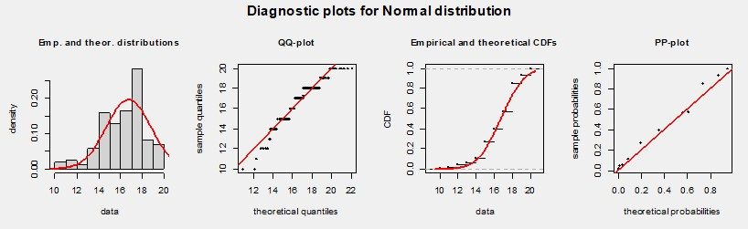
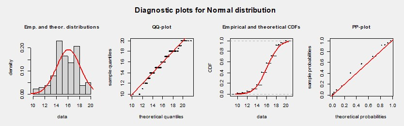

  
# **OBJETIVOS (Actualizados)**

1.  **Objetivo general**

El objetivo general del estudio "Efectos del ChatGpt en el rendimiento académico de los estudiantes en UTEC" es analizar y comprender cómo el uso del ChatGpt afecta el rendimiento académico de los estudiantes en la UTEC, considerando variables importantes y pertinentes a partir de nuestra recolección de datos. 

2.  **Objetivos específicos**

  2.1.Determinar la relación entre el uso del ChatGpt y el rendimiento académico: Investigar y analizar si existe una correlación entre las notas obtenidas con el uso del ChatGpt y las notas sin su uso, identificando si el ChatGpt contribuye al mejoramiento o empeoramiento del rendimiento académico de los estudiantes en la UTEC.

  2.2. Evaluar la influencia del conocimiento en el uso de la IA ChatGpt en el rendimiento académico: Analizar cómo el nivel de conocimiento en el uso de la IA ChatGpt se relaciona con el rendimiento académico de los estudiantes, investigando si aquellos con un mayor conocimiento obtienen mejores notas en comparación con aquellos con un conocimiento limitado.

  2.3. Identificar diferencias en el rendimiento académico según las carreras profesionales y el sexo: Explorar si existen variaciones en el rendimiento académico entre diferentes carreras profesionales y entre estudiantes de diferentes sexos, considerando el uso del ChatGpt y su impacto en las notas.


```{r message=FALSE, warning=FALSE, include=FALSE}
#Primero cargamos nuestras librerías necesarias 
library(readr)
library(plyr)
library(dplyr)
library(tidyr)
library(tidyverse)
library(ggplot2)
library(plotly)
library(plotrix)
library(tidyverse)
library(DT)
library(ggalt)
library(RColorBrewer)
```

```{r message=FALSE, warning=FALSE, include=FALSE}
#Base de datos limpia
DB4 <- read_csv("nueva_base_datos.csv")
```


# **ANALISIS DESCRIPTIVO**
Para el análisis descriptivo, solo hemos considerado el estudio de la relación de las variables que utilizaremos para definir nuestros eventos dependientes e independientes y nuestras variables aleatorias discretas y continuas. 

## Frecuencia de uso - Nota promedio con ChatGPT

Esta relación se considera para determinar si existe una asociación entre la frecuencia de uso de ChatGPT y el rendimiento académico. Se espera que aquellos estudiantes que utilizan ChatGPT con mayor frecuencia obtengan mejores resultados académicos, ya que pueden acceder a respuestas y ayuda de manera más regular. El análisis puede proporcionar información sobre cómo la frecuencia de uso de ChatGPT se relaciona con el rendimiento académico y si hay una tendencia o patrón identificable.

```{r message=FALSE, warning=FALSE}
DB4$Nota_promedio_CON_ChatGPT <- ifelse(DB4$Nota_promedio_CON_ChatGPT>20, 20, DB4$Nota_promedio_CON_ChatGPT)

colores <- brewer.pal(n = length(unique(DB4$Frecuencia_de_uso)), name = "Set1")

ggplot(DB4, aes(x = Frecuencia_de_uso, y = Nota_promedio_CON_ChatGPT, color = Frecuencia_de_uso)) +
  geom_point() +
  scale_color_manual(values = colores) +
  labs(x = "Frecuencia del uso de Chat GPT", y = "Nota promedio con Chat GPT", title = "Diagrama de Dispersión")
```

Se establece una relación coherente entre el uso frecuente de ChatGPT y el rendimiento académico. Se espera que los estudiantes que utilizan ChatGPT con mayor frecuencia obtengan mejores resultados, al tener acceso a respuestas y aclarar dudas. En el análisis descriptivo se muestra un gráfico que relaciona la frecuencia de uso de ChatGPT y el rendimiento académico en UTEC. Se destaca que aquellos que siempre utilizan ChatGPT tienen una nota mínima de 15, lo cual les brinda una ventaja en el conocimiento de diversos temas para su vida universitaria.
## Relación entre el conocimiento del uso de ChatGPT y el rendimiento académico

Se exploró la relación entre estudiantes con mayor conocimiento del uso de ChatGPT y su rendimiento académico. El análisis revelará si el conocimiento previo de ChatGPT impacta el rendimiento y si los estudiantes familiarizados obtienen mejores resultados que los no familiarizados. No se puede abreviar el texto sin proporcionar primero el texto completo. Por favor, proporcione el texto completo para que pueda ayudarlo a abreviarlo.
```{r}
promedios <- DB4 %>%
  group_by(Conocimiento_ChatGPT_cor) %>%
  summarize(Promedio_Antes = mean(Nota_promedio_TAREAS_SIN_ChatGPT, na.rm = TRUE),
            Promedio_Despues = mean(Nota_promedio_CON_ChatGPT, na.rm = TRUE))


promedios$Conocimiento_ChatGPT_cor <- factor(promedios$Conocimiento_ChatGPT_cor,
                                             levels = c(1, 2, 3),
                                             labels = c("Poco", "Regular", "Avanzado"))

ggplot(promedios, aes(x = Conocimiento_ChatGPT_cor, y = Promedio_Antes)) +
  geom_bar(stat = "identity", fill = "blue", alpha = 0.5) +
  geom_text(aes(label = round(Promedio_Antes, 2)), vjust = -0.5, color = "black")+
  labs(title = "Diagrama de barras de promedios de notas antes del uso de ChatGPT",
       x = "Nivel de conocimiento previo",
       y = "Promedio de Notas") +
  theme_minimal()

ggplot(promedios, aes(x = Conocimiento_ChatGPT_cor, y = Promedio_Despues)) +
  geom_bar(stat = "identity", fill = "green", alpha = 0.5) +
  geom_text(aes(label = round(Promedio_Despues, 2)), vjust = -0.5, color = "black") +
  labs(title = "Diagrama de barras de promedios de notas después del uso de ChatGPT",
       x = "Nivel de conocimiento previo",
       y = "Promedio de Notas") +
  theme_minimal()
```

Antes de conocer ChatGPT, el promedio de notas de los estudiantes de UTEC se encontraba en un rango cercano a 16.2. Después de conocer ChatGPT, los promedios variaron entre 14.81 y 17.66, mostrando una mayor dispersión. Los estudiantes con notas bajas tenían poco conocimiento sobre ChatGPT, mientras que aquellos con notas altas tenían un conocimiento avanzado. En resumen, el conocimiento y el uso adecuado de ChatGPT están relacionados con mejores resultados académicos.

# **ANALISIS PROBABILISTICO**

## EVENTOS INDEPENDIENTES: 

Primero procederemos a calcular las probabilidades empíricas antes de definir a nuestros eventos y demostrar numéricamente por el teorema de Bayes que son eventos independientes. 

Para la definición de nuestros eventos, trabajaremos con nuestras variables *Sexo* y *Conocimiento del uso en ChatGPT*.


### Definicion de eventos:

A -> Probabilidad de sacar a una mujer de la población.

B -> Probabilidad de que conocimiento sea mayor o igual a 2.

E -> ¿Cual es la probabilidad de que elegir a un estudiante cuyo conocimiento en el uso de ChatGPT sea mayor o igual a 2, siendo mujer? 

Se demostrara la independencia de estos eventos numéricamente con el teorema de Bayes, siendo:

$$P(E) = P(B/A) = P(A\cap B)/P(A)$$
Donde: 

$$Independiente \rightarrow  P(E)=P(B)$$

$$Dependiente \rightarrow  P(E) = P(A\cap B)/P(A)$$
Procederemos a calcular las probabilidades empíricas e intersecciones: 

```{r message=FALSE}
table(DB4$Sexo)
```
Calculando la probabilidad de A
```{r message=FALSE}
prob_A <- 73/165
prob_A
```
Calculando la probabilidad de B
```{r message=FALSE}
table(DB4$Conocimiento_ChatGPT_cor) # 1(47) 2(86) 3(32)
```
Hay 47 alumnos con poco conocimiento, 86 con conocimiento regular y 32 con conocimiento avanzado en la IA. 

```{r message=FALSE}
#Calculando la probabilidad de elegir a un alumno cuyo conocimiento es mayor a 2. 
prob_B <- (86+32)/165
prob_B
```
Hallando P(AnB): El siguiente código nos dará el numero de personas que tienen conocimiento 1, 2 o 3, siendo hombres, mujeres u otros. 

```{r message=FALSE}
table(DB4$Sexo, DB4$Conocimiento_ChatGPT_cor)
```
De la tabla, es fácil darse cuenta que la probabilidad de la intersección de A y B es: 
```{r}
# Probabilidad de ser mujer teniendo un conocimiento mayor o igual a 2
prob_AnB = (39+9)/165
prob_AnB
```
Entonces, ya teniendo la probabilidad de la intersección de A y B, y también sabiendo la probabilidad de A, calculemos por Bayes: 
```{r}
#Probabilidad de B dado A por la definición de Bayes
P_B.A<- prob_AnB/prob_A
P_B.A
```
Sin embargo, si estos eventos son independientes, se debería cumplir que *P_B.A* es igual a la probabilidad de B
```{r}
prob_B
P_B.A
```
Vemos que P(A/B) diferente de P(B), por lo tanto se demuestra que A y B son eventos independientes.

### Analisis de resultados e interpretacion. 

Según nuestros resultados, encontramos una baja presencia de mujeres con conocimiento avanzado del uso de ChatGPT en nuestra muestra de estudiantes de UTEC. Los eventos de seleccionar una estudiante mujer y seleccionar un estudiante con conocimiento regular o avanzado resultaron ser independientes, lo que significa que no hay una relación entre ambos.

Esto plantea implicaciones importantes en nuestro estudio. La baja presencia de mujeres con conocimiento avanzado puede estar relacionada con brechas de género en el acceso a la tecnología, diferencias en la elección de áreas de estudio o sesgos sociales y culturales. Sin embargo, es importante tener en cuenta las limitaciones de nuestro estudio, como el tamaño de la muestra y la representatividad de la población estudiantil.

Para obtener una comprensión más completa, se requiere investigaciones adicionales que analicen las causas subyacentes de esta baja presencia de mujeres con conocimiento avanzado en el uso de ChatGPT en este contexto específico. Estas investigaciones pueden proporcionar información valiosa para abordar las barreras y promover la equidad de género en el acceso y aprovechamiento de la tecnología.

En resumen, nuestros resultados destacan la necesidad de promover la participación y el desarrollo de habilidades en las mujeres en el uso de ChatGPT. Superar las barreras y sesgos existentes puede permitir un acceso más equitativo y una mayor presencia de mujeres con conocimiento avanzado en este campo.


## EVENTOS DEPENDIENTES: 

Similar a lo anterior, primero procederemos a calcular las probabilidades empíricas antes de definir a nuestros eventos y demostrar numéricamente por el teorema de Bayes que son eventos independientes. 

### Definicion de eventos:

Para la definición de nuestros eventos, trabajaremos con nuestras variables *Sexo* y *Conocimiento del uso en ChatGPT*.

A -> Probabilidad de que un estudiante tenga una nota mayor o igual a 18 gracias al uso de chatGPT.

B -> Probabilidad de que el uso de chatGPT sea diario y habitual (SIEMPRE)

E -> ¿Cual es la probabilidad de que al elegir a un alumno, sus notas seas mayores a 18 dado que siempre use chatGPT? 

*Calculando la probabilidad del evento A*

```{r}
table(DB4$Nota_promedio_CON_ChatGPT)
```

```{r}
#A: notas mayor o igual a 18
P_A = (44+13+11)/165
P_A = round(P_A,1)
P_A
```
*Calculando la probabilidad del evento B*
```{r}
table(DB4$Frecuencia_de_uso)
```

```{r}
#B: tiempo de uso SIEMPRE
P_B = 10/165
P_B
```
Ahora calculamos la probabilidad de la intersección $$P(A\cap B)$$ 
*Hallando P(AnB)*
```{r}
table(DB4$Frecuencia_de_uso, DB4$Nota_promedio_CON_ChatGPT)
```
De la tabla, se observa que en la fila SIEMPRE, solo hay un cumulo de 4 personas cuyas notas son mayores a 18. 
```{r}
#Probabilidad de la intersección AnB
p_AnB = 4/165
p_AnB 
```
Ahora calculamos la probabilidad del evento A dado B.

*Calculando P(A/B)*
```{r}
Pa.b <- (p_AnB/P_B)
Pa.b
```
Ahora, sabemos que por el teorema de Bayes, si fuera dependientes, entonces debería cumplirse que P(A/B)=P(A)

```{r}
Pa.b
P_A
```
Vemos que son completamente iguales :). De esta manera, en efecto, son eventos dependientes :D 

### Analisis de resultados e interpretacion. 

Nuestros resultados indican una dependencia entre los eventos A y B. La probabilidad de A es 0.4, al igual que la probabilidad de A dado B. La intersección de A y B tiene una probabilidad de 0.024, y la probabilidad de B es 0.06.

Esto implica que el conocimiento del uso de ChatGPT (evento B) influye en la probabilidad de obtener una nota mayor o igual a 18 (evento A). Observamos que aproximadamente el 40% de los estudiantes obtienen notas altas gracias a ChatGPT (evento A), y alrededor del 2.4% utilizan ChatGPT diariamente y obtienen notas altas (intersección de A y B).

En conclusión, la probabilidad de que un estudiante tenga notas mayores a 18, dado que siempre usa ChatGPT (evento E), es del 40%, la misma probabilidad que la de A. Esto demuestra que el conocimiento avanzado del uso de ChatGPT tiene una influencia positiva en la probabilidad de obtener notas altas en nuestro grupo de estudiantes.


## VARIABLES ALEATORIAS DISCRETAS 

### VARIABLE DISCRETA 1

```{r}
library("gmodels")
library("crosstable")
```

Para realizar distintos análisis tal vez nos sea conveniente crear nuevas variables agrupando y categorizando algunas de estas, como por ejemplo las notas promedio de tareas que obtuvieron los estudiantes "sin el uso de Chat GPT" transformándolos en Desaprobados, Aprobados y Sobresalientes también en notas promedio de tareas pero "con el uso de Chat GPT" transformándolos en Desaprobados, Aprobados y sobresalientes. 

```{r}
table(DB4$Nota_promedio_TAREAS_SIN_ChatGPT)
```
```{r}
DB4 %>% mutate(notas_sin_Chat_GPT =
      ifelse(Nota_promedio_TAREAS_SIN_ChatGPT %in% c("1", "10"), "Desaprobados",
      ifelse(Nota_promedio_TAREAS_SIN_ChatGPT %in% c("11", "12", "13", "14", "15", "16"), "Aprobados",
      ifelse(Nota_promedio_TAREAS_SIN_ChatGPT %in% c("17", "17.3", "18", "18.5", "19", "20"), "Sobresaliente", Nota_promedio_TAREAS_SIN_ChatGPT)))) -> DB4
DB4 %>% count(notas_sin_Chat_GPT)
```


```{r}
DB4 %>% mutate(notas_con_Chat_GPT=
      ifelse(Nota_promedio_CON_ChatGPT %in% c("0", "1", "10"), "Desaprobados",
      ifelse(Nota_promedio_CON_ChatGPT %in% c("11", "12", "13", "14", "15", "16"), "Aprobados",
      ifelse(Nota_promedio_CON_ChatGPT %in% c("17", "17.3", "18", "19", "20"), "Sobresaliente", Nota_promedio_CON_ChatGPT)))) -> DB4
DB4 %>% count(notas_con_Chat_GPT)
```


#### Análisis probabilístico: 

Relación entre las variables "tipo de Carrera"Tipos de carrera" y "Notas SIN Chat GPT":
```{r}
CrossTable(DB4$Carrera_cor,DB4$notas_sin_Chat_GPT, prop.r=F,
prop.c=F, prop.t=F, prop.chisq=F)
```
Ahora podemos ver la tabla y analizarla con mayor facilidad.
Primero podemos empezar con lo básico, cual es la probabilidad de que sean de un tipo de Nota SIN Chat GPT:

Esto sería lo siguiente:

P(D): Probabilidad de Desaprobados sin el uso de Chat GPT.

P(A): Probabilidad de Aprobados sin el uso de Chat GPT.

P(S): Probabilidad de Sobresalientes sin el uso de Chat GPT.

Como vemos en la tabla tenemos que coger el total de cada columna y dividirlo entre el total para obtener la probabilidad de cada tipo de medio de transporte:
```{r}
cat('P(D):',round(5/165,2),'\n') 
cat('P(A):',round(90/165,2),'\n') 
cat('P(S):',round(70/165,2),'\n') 
```
Con esto podemos observar que es mas probable que sin el uso de Chat GPT también se puede aprobar, por lo tanto a su vez determinar que esta plataforma IA no necesariamente es importante en el rendimiento académico de los estudiantes, pero no implica que no nos puede facilitar la vida en cuanto a dudas e inquietudes que tengamos de algún tema en específico.


Ahora podemos hacernos otras preguntas igual de interesantes, como por ejemplo las siguientes:

1) Cual es la probabilidad de que el alumno salga Aprobado o sea de la carrera de Ingeniería industrial
2) Cual es la probabilidad de que el alumno salga Desaprobado o sea de la carrera de Ingeniería Industrial
3) Cual es la probabilidad de que el alumno salga sobresaliente o sea de la carrera de Ingeniería industrial

4) Cual es la probabilidad de que el alumno salga Aprobado o sea de la carrera de Ingeniería Mecatrónica.
5) Cual es la probabilidad de que el alumno salga Desaprobado o sea de la carrera de Ingeniería Mecatrónica.
6) Cual es la probabilidad de que el alumno salga sobresaliente o sea de la carrera de Ingeniería Mecatrónica.


Pregunta 1:
P(A)= Probabilidad de Aprobados= 90/165
P(I)= probabilidad que sean de Ingeniería industrial= 39/165

En términos matemáticos:
P(A∪I)= P(A)+P(I) − P(A∩I)

```{r}
cat('P(AuI)=',((90/165+39/165) - 25/165) ,'\n')
```
Pregunta 2:
P(D)= Probabilidad de Desaprobados= 5/165
P(I)= probabilidad que sean de Ingeniería industrial= 39/165

En términos matemáticos:
P(D∪I)= P(D)+P(I) − P(D∩I)
```{r}
cat('P(DuI)=',((5/165+39/165) - 1/165) ,'\n')
```

Pregunta 3:
P(S)= Probabilidad de Sobresaliente= 70/165
P(I)= probabilidad que sean de Ingeniería industrial= 39/165

En términos matemáticos:
P(S∪I)= P(S)+P(I) − P(S∩I)
```{r}
cat('P(D∪I)=',((70/165+39/165) - 13/165) ,'\n')
```

Pregunta 4:
P(A)= Probabilidad de Aprobados= 90/165
P(M)= probabilidad que sean de Ingeniería Mecatrónica= 29/165
En términos matemáticos:
P(A∪M)= P(A)+P(M) − P(A∩M)
```{r}
cat('P(A∪M)=',((90/165+29/165) - 18/165) ,'\n')
```

Pregunta 5:
P(D)= Probabilidad de Desaprobados= 5/165
P(M)= probabilidad que sean de Ingeniería Mecatrónica= 29/165
En términos matemáticos:
P(D∪M)= P(D)+P(M) − P(D∩M)
```{r}
cat('P(D∪M)=',((5/165+29/165) - 1/165) ,'\n')
```

Pregunta 6:
P(S)= Probabilidad de Sobresaliente= 70/165
P(M)= probabilidad que sean de Ingeniería Mecatrónica= 29/165
En términos matemáticos:
P(S∪M)= P(S)+P(M) − P(S∩M)
```{r}
cat('P(S∪M)=',((70/165+29/165) - 10/165) ,'\n')
```


#### Relación entre las variables "tipo de Carrera y "Notas con Chat GPT":

```{r}
CrossTable(DB4$Carrera_cor,DB4$notas_con_Chat_GPT, prop.r=F,
prop.c=F, prop.t=F, prop.chisq=F)
```
Ahora podemos ver la tabla y analizarla con mayor facilidad.
Primero podemos empezar con lo básico, cual es la probabilidad de que sean de un tipo de Nota SIN Chat GPT:

Esto sería lo siguiente:

P(D): Probabilidad de Desaprobados sin el uso de Chat GPT.

P(A): Probabilidad de Aprobados sin el uso de Chat GPT.

P(S): Probabilidad de Sobresalientes sin el uso de Chat GPT.

Como vemos en la tabla tenemos que coger el total de cada columna y dividirlo entre el total para obtener la probabilidad de cada tipo de medio de transporte:
```{r}
cat('P(D):',round(9/165,2),'\n') 
cat('P(A):',round(61/165,2),'\n') 
cat('P(S):',round(95/165,2),'\n') 
```
Analizando estos resultados de estas probabilidades, se puede determinar algo notorio, en donde con la ayuda de Chat GPT se tiene una mayor probabilidad de salir de manera sobresaliente en el promedio de notas con el uso de Chat GPT.


Podemos hacernos un par de preguntas para comprender en que momento utilizarlo, como por:

1) Cual es la probabilidad de que el alumno salga Aprobado y sea de la carrera de Ingeniería industrial
P(A): Probabilidad de que sean aprobados= 61/165
P(B): Probabilidad de que sean de la carrera de ingeniería Industrial= 39/165

Matemáticamente lo podemos expresar de la siguiente manera:
P(A ∩ B)= P(A) * P(B|A)                P(B|A) = P(A ∩ B) / P(B)
```{r}
cat('P(A∩B)=',(61/165*((17/165)/(39/165))) ,'\n')
```


Esta tabla halla la la intersección entre las notas y las carreras: P(A ∩ "Carrera"),  P(D ∩" Carrera"),  P(S ∩ "Carrera") 
```{r}
tabla_contingencia <- table(DB4$Carrera_cor,DB4$notas_con_Chat_GPT)
prob_conjunta_nota_con_chatGPT <- prop.table(tabla_contingencia)
prob_conjunta_nota_con_chatGPT
```


### VARIABLE DISCRETA 2

**EVENTO**

Se les a dejado una tarea de escritura para la casa a los 165 estudiantes de Utec, en las que se les proporciona un tema y se les da la opción de utilizar ChatGPT para generar ideas y sugerencias para su escritura. las cuales 9 fueron desaprobados, 61 fueron aprobados y 95 fueron sobresalientes. Por ello podemos saber cuantos estudiantes utilizaron ChatGPT por 1 hora.

```{r}
CrossTable(DB4$notas_con_Chat_GPT,DB4$Horas_uso_diario_cor, prop.r=F,
prop.c=F, prop.t=F, prop.chisq=F)
```

En esta tabla observamos que se obtuvo 109 estudiantes que utilizaron ChatGPT durante 1 hora, mientras que 56 estudiantes utilizaron ChatGPT de 2 horas a mas, por ello queremos calcular la probabilidad de encontrar 5 alumnos sobresalientes que utilizan ChatGPT por 1 hora.

- Variable: Horas_uso_diario_cor 

- Muestra: 165 alumnos (Total de observaciones que pueden utilizar ChatGPT)

P(e) = p : Probabilidad de éxito = 109 / 165
P(f) = q : Probabilidad de fracaso = 56/165  (q>1 "los que utilizan mas de 1 hora")

p(X = 4) 
X= # de estudiantes que sean 5 sobresalientes que utilizan Chatgpt durante 1 hora
k= 1 hora donde utilizan ChatGPT.

```{r}
p <- 109/165 #probabilidad de éxito
y <- 1 - p   # fracaso
X <- 4
p
y
```
**PROBABILIDAD:** 

$$P(𝑿=4)=(109/165).(1-109/165)^{4}$$

La probabilidad de encontrar exactamente 4 estudiantes sobresalientes que utilizaron ChatGPT por 1 hora, podemos utilizar la función dgeom de R.  
```{r}
dgeom(4, 109/165)
```

**ESPERADO:**
Fórmula asume que los ensayos son independientes y que la probabilidad de éxito es constante en cada ensayo. 

$$𝑬 (X) = 1/(109/165)$$
Por lo tanto, el valor esperado de la distribución geométrica para encontrar 5 alumnos sobresalientes que utilizaron ChatGPT por 1 hora sería:
```{r}
pgeom(0.3393939, 109/165)
```

**VARIANZA:**
En el contexto del problema que se te planteó, esta fórmula se utiliza para encontrar la varianza de la distribución geométrica que modela el número de que tanto varia a su promedio.
$$V (X) = (0.3393939)/ (109/165)^2 $$
```{r}
v <- (0.3393939)/(109/165)^2
v
```

```{r}
# Función para calcular la probabilidad de una variable discreta geométrica

p_geom <- function(x, p) {
  p * (1 - p)^(x - 1)
}

# Parámetros de la distribución geométrica
p <- 109/165  # Probabilidad de éxito
x <- 1:10
probs <- p_geom(x, p)

# Crear un data frame con los valores
data <- data.frame(x = x, probs = probs)

# Crear el gráfico de densidad probabilística
ggplot(data, aes(x = x, y = probs)) +
  geom_bar(stat = "identity", fill = "steelblue", width = 0.8) +
  labs(title = "Densidad Probabilística de una Variable Discreta Geométrica",
       x = "Sean sobresalientes y hallan utilizado chat gpt durante 1 hora", y = "Probabilidad") +
  theme_minimal()

```

Este gráfico representa a los 5 estudiantes sobresalientes que usan ChatGPT  por 1 horas, en las 4 veces que realizara el fracaso hasta obtener los 5 estudiantes que utilicen ChatGPT  por 1 hora  .

## VARIABLES ALEATORIAS CONTINUAS

### Variable1: Promedio de notas CON ChatGPT


Primero hacemos una partición a nuestra variable para que exista una buena aproximación a alguna distribución. 
```{r}
notas_aprovatorias <- subset(DB4$Nota_promedio_CON_ChatGPT, DB4$Nota_promedio_CON_ChatGPT >= 10)
```

Ahora graficamos:
```{r}

hist(notas_aprovatorias, breaks = 15, col = "red", border = "orange", 
     xlab = "Nota promedio con el uso de ChatGPT", ylab = "Estudiantes", main = "Histograma de notas")
```

Vemos que nuestra gráfica se aproxima a una normal. Podemos fundamentar nuestro criterio de aproximación usando un programa especial que aproxima histogramas a distribuciones conocidas: 
```{r, echo=FALSE, out.width="150%"}

```
Evidentemente solo sera una aproximación, no será exacto, pero esto es con lo que podemos trabajar por el momento. 

Ahora realizamos ahora los cálculos para una función normal.

**Se debe cumplir que Media = Mediana**

```{r}
media1 <- mean(DB4$Nota_promedio_CON_ChatGPT)
media1
```

```{r}
mediana1 <- median(DB4$Nota_promedio_CON_ChatGPT)
mediana1
```
Comprobamos que la mediana y media aproximadamente son muy similares.
Tras ello, calculamos la varianza y esperanza:

**Primero calculamos el "u" y el "g"**
```{r}
u1 <- mean(DB4$Nota_promedio_CON_ChatGPT)
g1 <- sd(DB4$Nota_promedio_CON_ChatGPT) 
u1
g1
```
**Ahora calcularemos la varianza.**
```{r}
# Calculamos la varianza
var1 <- (sd(DB4$Nota_promedio_CON_ChatGPT))^2
var1
```


```{r}
#Calculamos la varianza también usando la definición matemática (solo con fines demostrativos, debería salir lo mismo)
var1.1 <- sum((DB4$Nota_promedio_CON_ChatGPT-media1)^2)/165
var1.1
```
Nos damos cuenta que son aproximadamente muy similares.

**Ahora calculamos la esperanza**
```{r}
# Calculamos la esperanza
z1 <- mean(DB4$Nota_promedio_CON_ChatGPT)
z1
```

```{r}
#Calculamos la esperanza también usando la definición matemática (solo con fines demostrativos, debería salir lo mismo)

expected_value <- function(.density_function, ...) {
  integral <- integrate(function(x) x * .density_function(x, ...), 
                        lower = -Inf, 
                        upper = Inf)
  integral$value
}

z1.1 <- expected_value(dnorm, mean = u1, sd = g1)
z1.1
```
Vemos que los resultados son los esperados.

Entonces, podemos afirmar que: 
$$ X \rightarrow N (16.03212, 3.902407) $$


#### Ejemplo con la variable 1: 

La JASA (Japanese Aeronautics and Space Administration) vino a Perú con la finalidad de entregar becas a estudiantes de universidades de UTEC, que potencien el aprendizaje en inteligencia artificial. Para ello, quieren saber cuantos alumnos en la UTEC aprovechan el uso de ChatGPT para sobresalir en sus notas. Los estudiantes que tengan una nota mayor o igual a 19 gracias al uso de esta IA, obtendrán una beca completa por 1 año para hacer investigaciones en la JASA, Japón. Se sabe que la desviación estándar y el promedio aritmético de este grupo de alumnos en notas gracias a ChatGPT es 16.03212 y 3.902407, respectivamente.¿Cuan probable es esto?

```{r}
P1 <- pnorm(19, u1, g1, lower.tail = F)
P1
```
*DEBEMOS ADVETIR QUE ESTE RESULTADO (0.77) NO ES EL REAL (en Rstudio). AL MOMENTO DE TEJER EL DOCUMENTO (html), NOS SALDRA EL VERDADERO RESULTADO (0.22)*

**Análisis de resultados:** 

Una probabilidad del 0.22 indica que hay una probabilidad relativamente baja de que los estudiantes de la UTEC que aprovechan el uso de ChatGPT para sobresalir en sus notas obtengan una calificación mayor o igual a 19. En otras palabras, aproximadamente el 22% de los estudiantes que utilizan ChatGPT tienen una probabilidad de obtener una calificación alta.

Esto sugiere que en este grupo específico de estudiantes de la UTEC, la mayoría no alcanza las calificaciones requeridas para obtener la beca completa de investigación en la JASA, Japón. Es importante tener en cuenta que una probabilidad del 0.22 indica una baja probabilidad en comparación con una probabilidad más alta, como por ejemplo 0.50, que representaría una probabilidad del 50%.

Además, los valores proporcionados de desviación estándar (16.03212) y promedio aritmético (3.902407) indican que hay una variabilidad significativa en las notas obtenidas gracias al uso de ChatGPT. Esto significa que los resultados pueden variar ampliamente en cuanto al promeido de los estudiantes.


### Variable2: Promedio de notas SIN ChatGPT

Primero empezamos por gráficas un histograma con esta nueva variable, también delimitada para una mejor aproximación. 

```{r}
hist(subset(DB4$Nota_promedio_TAREAS_SIN_ChatGPT, DB4$Nota_promedio_TAREAS_SIN_ChatGPT >= 10), breaks = 15, col = "blue", border = "orange", 
     xlab = "Nota promedio", ylab = "Estudiantes", main = "Histograma de notas")
```

Corroboramos que también se aproxima a una normal. Nos hubiera gustado trabajar con otra distribución pero todos nuestros resultados fueron así. 

Mostramos la imagen de resultados de nuestro programa. 
```{r, echo=FALSE, out.width="150%"}

```

Podemos aproximarlo a una gráfica NORMAL. 

Realizamos los cálculos para una función normal

**Se debe cumplir que Media = Mediana**
```{r}
media2 <- mean(DB4$Nota_promedio_TAREAS_SIN_ChatGPT)
media2
```

```{r}
mediana2 <- median(DB4$Nota_promedio_TAREAS_SIN_ChatGPT)
mediana2
```
Comprobamos que la mediana y media aproximadamente son muy similares.
Tras ello, calculamos la varianza y esperanza:

**Primero calculamos el "u" y el "g"**
```{r}
u2 <- mean(DB4$Nota_promedio_TAREAS_SIN_ChatGPT)
u2
```
```{r}
g2 <- sd(DB4$Nota_promedio_TAREAS_SIN_ChatGPT) 
g2
```
**Calculamos la varianza**

Primero lo hacemos con Rstudio:
```{r}
var2 <- (sd(DB4$Nota_promedio_TAREAS_SIN_ChatGPT))^2
var2
```
Tambien usamos la definición matemática: 
```{r}
var2.1 <- sum((DB4$Nota_promedio_TAREAS_SIN_ChatGPT-media2)^2)/165
var2.1
```
Nos damos cuenta que son aproximadamente muy similares (deberían serlo).

**Calculamos la esperanza**
```{r}
z2 <- mean(DB4$Nota_promedio_TAREAS_SIN_ChatGPT)
z2
```
También usamos la definición matemática, con una función para calcular la integral: 
```{r}
expected_value <- function(.density_function, ...) {
  integral <- integrate(function(x) x * .density_function(x, ...), 
                        lower = -Inf, 
                        upper = Inf)
  integral$value
}

z2.1 <- expected_value(dnorm, mean = u2, sd = g2)
z2.1
```
Vemos la precisa similitud entre ambos cálculos. Por lo tanto, podemos plantear que: 

$$X \rightarrow N(15.90182, 2.636921)$$

#EJEMPLO2:

El presidente del país declaró como nueva ministra de educación a Brigida Molina❤️. En uno de los primeros cambios que hará la nueva ministra, se encuentra la ayuda a alumnos universitarios que tengan una nota promedio baja en sus cursos. Para ello, piensa aprovechar el desarrollo que ha tenido las inteligencias artificiales en los últimos años. Por esto, incentivara el uso de ChatGPT en los estudiantes que tengan notas menores o iguales a 17. Sin embargo, el presidente quiere saber si existe una probabilidad viable, por lo que Brigida le comunica que para hacer el calculo, necesita saber que la desviación estándar y el promedio aritmético. La UTEC le da esta información, siendo la desviación estándar y promedio 2.636921 y 15.90182, respectivamente, para una muestra de 165 estudiantes. ¿Que tan probable es que esto suceda?

```{r}
pnorm(17, u2, g2, lower.tail = T)
```
**Analisis de resultados** 
La probabilidad del 0.66 indica que existe una probabilidad significativamente alta de que los estudiantes de la UTEC que utilizan ChatGPT mejoren sus notas y obtengan un promedio mayor a 17.

Esto significa que el incentivo propuesto por la ministra, de utilizar ChatGPT para mejorar el rendimiento académico de los estudiantes con notas bajas es viable. Existe una alta probabilidad de que esta estrategia sea efectiva y ayude a los estudiantes a elevar su promedio de calificaciones.

Además, los valores proporcionados de desviación estándar (2.636921) y promedio aritmético (15.90182) indican que hay una variabilidad en los resultados obtenidos por los estudiantes. Al tener una muestra de 165 estudiantes, estos valores reflejan la dispersión de las calificaciones y el promedio general del grupo.

En resumen, la probabilidad del 0.66 indica una alta probabilidad de que los estudiantes que utilizan ChatGPT en la UTEC mejoren sus notas y obtengan un promedio mayor a 17, respaldando la propuesta de la ministra, de incentivar el uso de ChatGPT para ayudar a los estudiantes con notas bajas a mejorar su rendimiento académico. Sin embargo, es importante tener en cuenta que estos resultados se basan en una muestra específica de estudiantes y pueden variar en diferentes contextos y poblaciones.

# CONCLUSIONES

1) Tras realizar un análisis descriptivo nos hemos dados cuenta que el uso de la Inteligencia Artificial Chat GPT, influye mucho en el buen rendimiento académico de los estudiantes de UTEC, estableciendo una mejora, en el promedio de sus notas. 

2) Hemos visto que existe un grupo de estudiantes que utilizan esta plataforma en el desarrollo de sus tareas de la universidad, estableciendo una diferencia notable en el proceso de aprendizaje, por ejemplo, cuando no utilizaban Chat GPT tenian notas aprobatoria, y menos del 50% del total de encuestados eran sobresalientes mientras que se noto la diferencia cuando se utilizó esta herramienta para el uso de sus actividades, ya que mas del 50% eran sobresaliente debido a la influencia del uso de Chat GPT.-

3) El estudio "Efectos del ChatGpt en el rendimiento académico de los estudiantes en UTEC" reveló resultados relevantes sobre el impacto del uso de ChatGpt en el rendimiento académico. Se observó una baja presencia de mujeres con conocimiento avanzado en ChatGpt, señalando la necesidad de abordar brechas de género en el acceso tecnológico. Además, se encontró independencia entre el género y el conocimiento en ChatGpt. Se identificó una dependencia entre el uso diario de ChatGpt y obtener notas altas. La probabilidad de obtener una calificación mayor o igual a 19 fue baja, aunque hubo variabilidad en los resultados. En general, se respaldó la propuesta de incentivar el uso de ChatGpt para mejorar el rendimiento académico. Estos hallazgos informan políticas para promover la inteligencia artificial y mejorar el desempeño estudiantil.
-